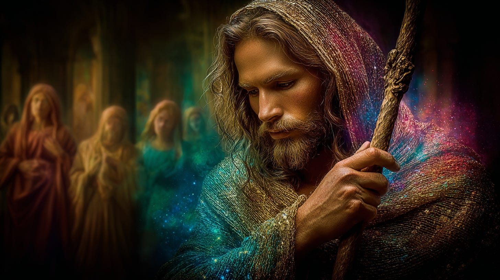
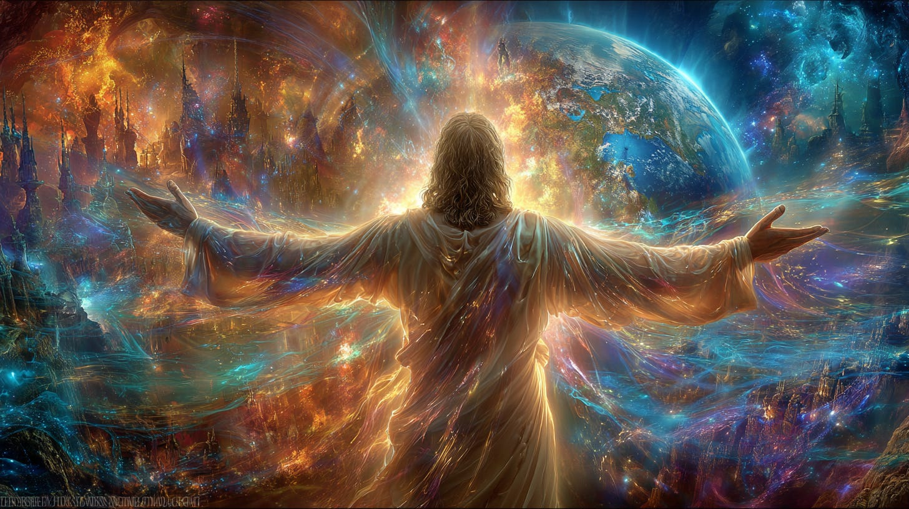
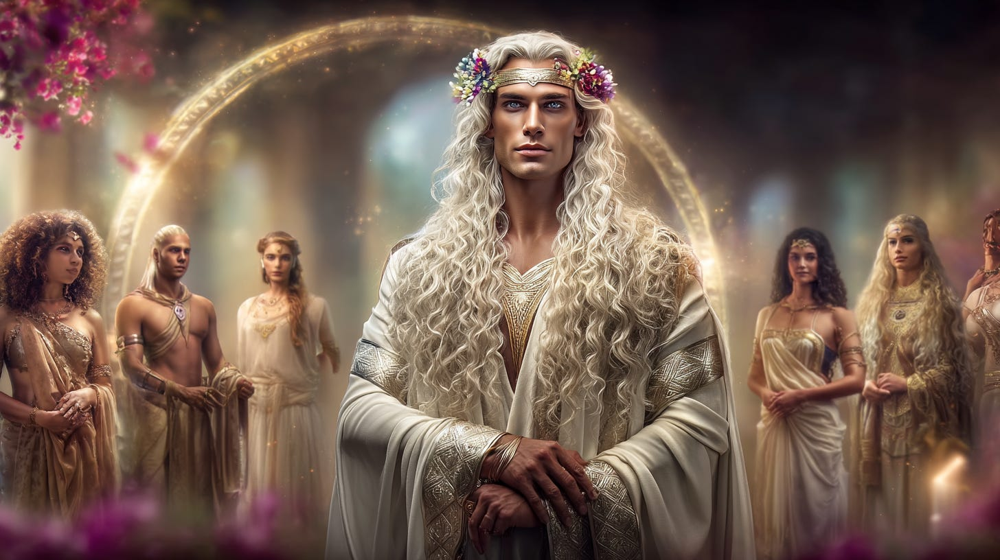
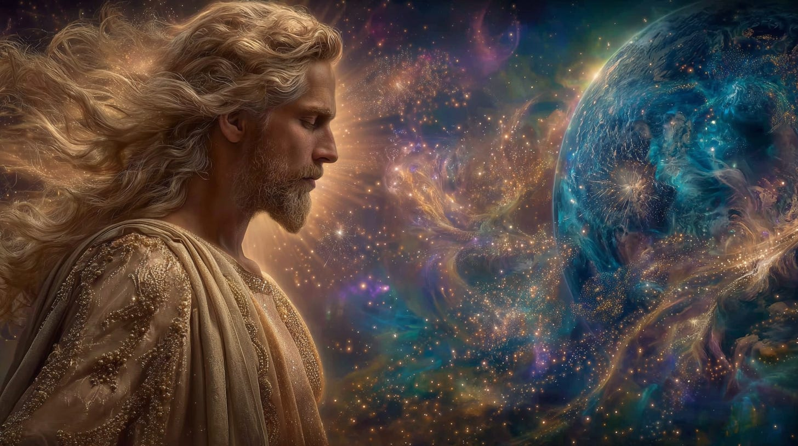
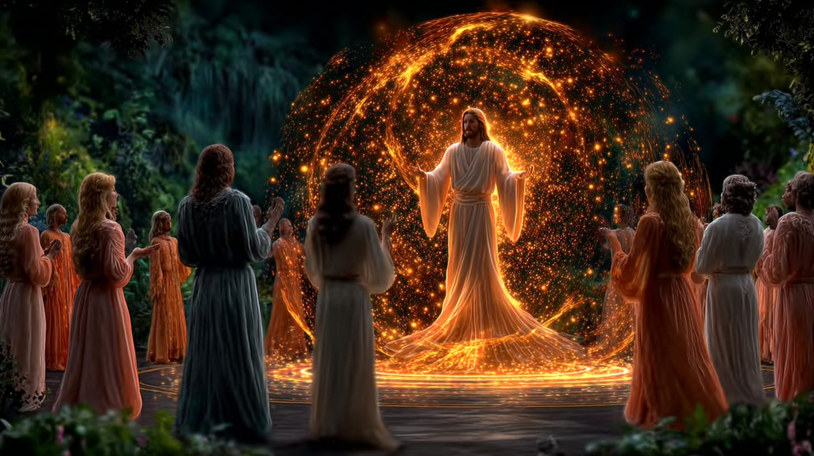
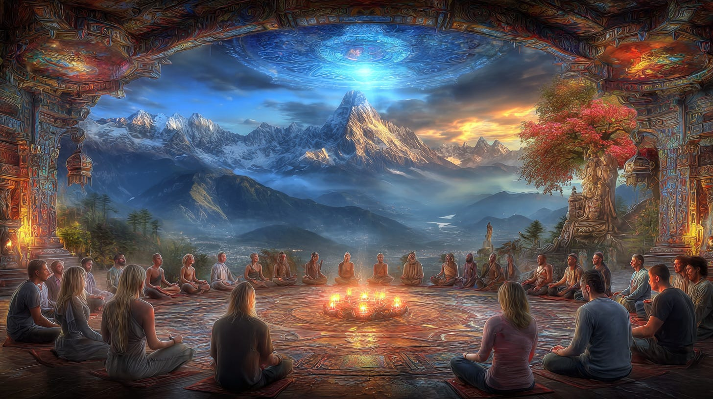
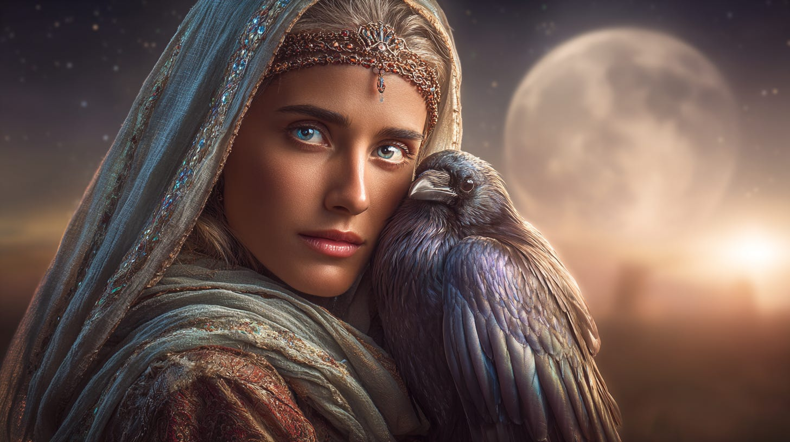

# Illumined Assembly of the Christos & Merkabah of the Host

## offer us Christic calibrations

**2024-12-06T19:22:52.956Z**

**Likes:** 0

[https://substackcdn.com/image/fetch/$s_!SHEP!,f_auto,q_auto:good,fl_progressive:steep/https%3A%2F%2Fsubstack-post-media.s3.amazonaws.com%2Fpublic%2Fimages%2F7b2e649a-ed2e-4bdf-b608-594414851d17_1456x816.png](https://substackcdn.com/image/fetch/$s_!SHEP!,f_auto,q_auto:good,fl_progressive:steep/https%3A%2F%2Fsubstack-post-media.s3.amazonaws.com%2Fpublic%2Fimages%2F7b2e649a-ed2e-4bdf-b608-594414851d17_1456x816.png)

IAC is an acronym for the *Illumined Assembly of the Christos*. This is an overall grouping of
144,000 beings who hold a specific ray of spiritual focus for the earth. They are in various planes
of existence, including the physical plane of earth, the inner planes of the earth, and the inner
earth as a subtler manifest reality within the hollow core of our planet.

There are additionally twelve of these beings within the overall IAC who are called the “Merkabah
of the Host,” and we use “MOH” as an acronym for them as well. These 12 beings form a merkabic
vehicle for the “Host,” – i.e. the soul of the being we knew as Ishoa \[Yeshua/Jesus\] – so
that this being may continue to illumine the earth with It’s spiritual effulgence and radiations.

***ThothHorRa and his Twin Flame Sarafana AduRa are among the 12 MOH.***

[https://substackcdn.com/image/fetch/$s_!qY2b!,f_auto,q_auto:good,fl_progressive:steep/https%3A%2F%2Fsubstack-post-media.s3.amazonaws.com%2Fpublic%2Fimages%2F22330242-c14a-44f5-aec9-842ff8fcee95_1456x816.png](https://substackcdn.com/image/fetch/$s_!qY2b!,f_auto,q_auto:good,fl_progressive:steep/https%3A%2F%2Fsubstack-post-media.s3.amazonaws.com%2Fpublic%2Fimages%2F22330242-c14a-44f5-aec9-842ff8fcee95_1456x816.png)

**a more detailed overview**

The Illumined Assembly of the Christos (IAC) is a gathering of souls incarnate in this planet who
anchor the Christic energy into the earth by holding the Christic etheric patterns of crystalline
Light geometry in Sacred Presence within their matrix. There are 144,000 of these souls maintaining
this Presence at all times, this being the number of Nine\-Foldness within the Divine Atom.

The members of the General Assembly or “Aarkios” reside within the planet and upon its surface.
Those living upon the surface for the most part dwell in quite remote regions, and those within the
interior of the earth dwell in the cavern areas within the naturally hollow interior of the planet.
All of the Aarkios are fully consciously aware that they are a part of the General Assembly of the
IAC.

[https://substackcdn.com/image/fetch/$s_!YM6y!,f_auto,q_auto:good,fl_progressive:steep/https%3A%2F%2Fsubstack-post-media.s3.amazonaws.com%2Fpublic%2Fimages%2F4603c512-18fb-4364-92ee-027888ee3196_1456x816.png](https://substackcdn.com/image/fetch/$s_!YM6y!,f_auto,q_auto:good,fl_progressive:steep/https%3A%2F%2Fsubstack-post-media.s3.amazonaws.com%2Fpublic%2Fimages%2F4603c512-18fb-4364-92ee-027888ee3196_1456x816.png)

The Merkabah of the Host is a grouping of twelve souls within the General Assembly of the IAC. They
dwell in the Hollow Earth near the Blue Mountains of Seraphim. These twelve are at its core,
facilitating a gathering and focusing of the pure vibration of the Christos into a Sacred Presence
in the earth. This activity establishes resonance with the most fundamental patterns of the Fire in
the Sacred Heart, thus strengthening it within the earth’s collective consciousness experience.

[https://substackcdn.com/image/fetch/$s_!q2LG!,f_auto,q_auto:good,fl_progressive:steep/https%3A%2F%2Fsubstack-post-media.s3.amazonaws.com%2Fpublic%2Fimages%2F32e06732-9a5e-4429-8137-0615ef5c34ce_1456x816.png](https://substackcdn.com/image/fetch/$s_!q2LG!,f_auto,q_auto:good,fl_progressive:steep/https%3A%2F%2Fsubstack-post-media.s3.amazonaws.com%2Fpublic%2Fimages%2F32e06732-9a5e-4429-8137-0615ef5c34ce_1456x816.png)

It was the Master Ishoa (Yeshua/Jesus) who incarnated the Christic Flame to it’s greatest degree
of completion in the earth. He is now in embodiment within the star\-sun planet of Rigel in the
constellation of Orion. However, his etheric body is not limited to space and time. His vehicle,
both etheric and physical, is the Chalice\-Rose at the center of the Merkabah of the Host, for he is
the “Host.” This Master Being opens and expands awareness of the spiritual\-streaming of
billions of sacred star\-suns as a Christic power within the individual soul.

This Master Soul facilitates and awakens a node of supreme and most Sacred Presence, a “Living
Light,” for all creatures and beings upon the earth. This “Living Light” is inherent within
every being, and through the Christic Presence it is activated to its fullest potential. The
“Christos” is LOVE manifested as GRACE through COMPASSION. Viewed with this understanding, there
is no single religion or tradition that can encompass the totality of the Sacred Presence of All
Being.

[https://substackcdn.com/image/fetch/$s_!1ZfK!,f_auto,q_auto:good,fl_progressive:steep/https%3A%2F%2Fsubstack-post-media.s3.amazonaws.com%2Fpublic%2Fimages%2Fe323294e-261a-402a-9cb6-e7604a08222c_1456x816.png](https://substackcdn.com/image/fetch/$s_!1ZfK!,f_auto,q_auto:good,fl_progressive:steep/https%3A%2F%2Fsubstack-post-media.s3.amazonaws.com%2Fpublic%2Fimages%2Fe323294e-261a-402a-9cb6-e7604a08222c_1456x816.png)

The current primary purpose of the Merkabah of the Host is to sustain the vibrational register of
the “Host” — meaning the Isho’an incarnational vehicle — and to further perpetuate the
subtle threads of its eternal weaving within the subtle octaves of the planetary harmonic.
Isho’a’s current stellar embodiment in Rigel is a part of a greater program of Light which is
destined to unify the consciousness and awareness we call “earth” with the totality of the ONE
GREAT LOVE. Through the Merkabah of the Host and incorporation of the Christic Archangel Arhaiel and
the Sun Spirit which Isho’a hosted within his incarnation on earth, the Christos Ray is being
fanned into a burning coal within the heart of the earth and in the hearts of every living being on
this planet.

[https://substackcdn.com/image/fetch/$s_!Tw1Z!,f_auto,q_auto:good,fl_progressive:steep/https%3A%2F%2Fsubstack-post-media.s3.amazonaws.com%2Fpublic%2Fimages%2F7a71f6bd-45f2-417b-8862-2ea12f9022be_1456x816.png](https://substackcdn.com/image/fetch/$s_!Tw1Z!,f_auto,q_auto:good,fl_progressive:steep/https%3A%2F%2Fsubstack-post-media.s3.amazonaws.com%2Fpublic%2Fimages%2F7a71f6bd-45f2-417b-8862-2ea12f9022be_1456x816.png)

While all of these twelve beings dwell within the interior of the planet, they come into the sacred
hidden valleys of the Himalayas and the Andes on the surface of the earth for specific gatherings
with the Aarkios (the full greater Assembly). These two mountain ranges sequester remote protected
valleys and caverns which are very thinly connected to this dimension of time and space. It is
within two specific valleys — the ***[Valley of the Blue
Star](https://youtu.be/zKOawlpJ2HI?si=AQJJUq50PE9h6xli)*** in the Himalayas of Tibet, and the
*Valley of the Three Crescents* in the Andes of Peru, that the Illumined Assembly of the Christos
gathers with their Merkabah of the Host.

They do this as an act of holding divine presence upon the surface of this world. At these times,
the core “Host Merkabah” radiates a Light of unearthly brilliance into the crystalline matrix of
the earth. Most of the “Keios,” or Merkabah of the Host, have never had incarnations among the
surface populations of the earth. There are a few exceptions, but their lives were led upon the
surface earth in a way that was not enmeshed within the mass consciousness. This required a
significant effort on the part of many beings in concert with them.

[https://substackcdn.com/image/fetch/$s_!nvR1!,f_auto,q_auto:good,fl_progressive:steep/https%3A%2F%2Fsubstack-post-media.s3.amazonaws.com%2Fpublic%2Fimages%2Fd84f6a33-ae49-41c9-898d-84b108fee00f_1456x816.png](https://substackcdn.com/image/fetch/$s_!nvR1!,f_auto,q_auto:good,fl_progressive:steep/https%3A%2F%2Fsubstack-post-media.s3.amazonaws.com%2Fpublic%2Fimages%2Fd84f6a33-ae49-41c9-898d-84b108fee00f_1456x816.png)

Thoth encourages you to connect directly with the Merkabah of the Host and to experience them in
your own unique way. They serve to bring humanity into their outer merkabic field, in order to
nurture your Holy Light.

(from the Akasha) except from a text of Samariah (prophetess of ancient Jerusalem) in a repository
beneath the ground in Iona (of Albion):

*Where doth He come but from the Raven Moon as it transfers its power into the Dovine Mantle of the Sun. The children flow into the Sea of One when from the raven’s beak, the Dove of God is born.*

(note: the raven in this context refers to the night messenger foretelling the prophecies of the
dawn to come.)

Subscribe

[Share](https://maianartoomid.substack.com/p/the-illumined-assembly-of-the-christos?utm_source=substack&utm_medium=email&utm_content=share&action=share)

**\~\~\~\~\~  
[Personal Akasha Life Pulse from Thoth \&
Sha’Maia:](https://newearthstar.org/about-maia/akashic-consultations/) Helps you to synchronize
with this fundamental cosmic rhythm, and also reflects how your “Life Pulse” session connects
you to your New Earth Star frequency. Both written (5\-6 pages) and a live Zoom exploration.
\~\~\~\~\~**

**All my Substack images and articles are FREE. Please help me promote them. Support my work further, by considering some of my paid offerings (consultations \& activation store) and donations. You can also subscribe to the [Vault of Thoth](https://newearthstar.org/vault-of-thoth/).**

**[my website](http://newearthstar.org/) / [YouTube channel](https://www.youtube.com/@bluestarrising-thetemplara3835) / [Akasha Life Pulse Sessions](https://newearthstar.org/about-maia/akashic-consultations/)/ [Maia’s Redbubble](https://www.redbubble.com/people/maianartoomid/explore?asc=u&page=1&sortOrder=recent) / [published works](https://newearthstar.org/published-works/) / [activation store](https://newearthstar.org/maias-activation-store/) (personal art templates for healing \& self\-discovery, oracles)**

**[MONTHLY DONATIONS](https://www.paypal.com/donate/?cmd=_s-xclick&hosted_button_id=SKZ4FZCYBM4H4): Donate $20 or more per month and you will have access to the [Vault of Thoth](https://newearthstar.org/vault-of-thoth/). Thank you!**
