# Stargates & Portals

## a comprehensive analysis

**2024-12-06T19:22:52.956Z**

**Likes:** 0

[https://substackcdn.com/image/fetch/$s_!PP8W!,f_auto,q_auto:good,fl_progressive:steep/https%3A%2F%2Fsubstack-post-media.s3.amazonaws.com%2Fpublic%2Fimages%2Fe28f519c-a656-4b67-b613-fd5550ecc1bd_1536x1024.png](https://substackcdn.com/image/fetch/$s_!PP8W!,f_auto,q_auto:good,fl_progressive:steep/https%3A%2F%2Fsubstack-post-media.s3.amazonaws.com%2Fpublic%2Fimages%2Fe28f519c-a656-4b67-b613-fd5550ecc1bd_1536x1024.png)

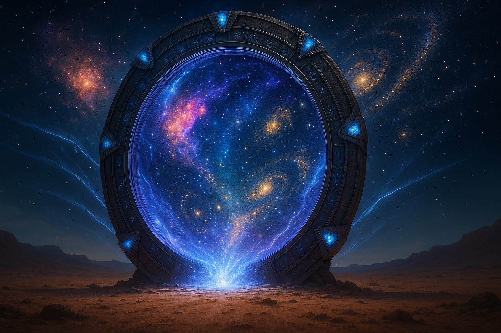

**Exploration of Thoth Transmissions through the [ThothStream](https://nesialibraryproject.wordpress.com/thothstream-knowledge-base/) knowledge base (TS).**

## **The Operation of Stargates and Portals**

### **1\. Nature and Purpose**

Stargates and portals are energetic gateways that connect different realms, dimensions, or states of
being. They operate as interfaces between the material world and the higher spiritual realities, as
well as between parallel or alternate timelines. In the context of the Temple Doors and Numis’OM
material, they are integral to planetary ascension and the evolution of human consciousness.

### **2\. Construction and Anchoring**

Stargates are not merely technological or mechanical; they are primarily **energetic constructs**,
encoded into the planetary grid and the etheric/causal body of the Earth (and other celestial
bodies). Certain physical locations—such as ancient temples, pyramids, and natural power
spots—act as “anchors” or “nodes” for these gateways. Some of these include the Aramu
Temple of Thoth, the Great Pyramid of Giza, Glastonbury Tor, and certain sacred mountains and
valleys.

* **Temple Nodes and Vortex Points:** These sites contain special harmonics and energy signatures, often activated or maintained by Masters, Light Bearers, and the Illumined Assembly of the Christos with their Merkabah of the Host —a collective holding portals open for higher energies.

[https://substackcdn.com/image/fetch/$s_!CwGR!,f_auto,q_auto:good,fl_progressive:steep/https%3A%2F%2Fsubstack-post-media.s3.amazonaws.com%2Fpublic%2Fimages%2Faa06a7da-5468-4583-aaba-00b87e9e92f5_1456x816.png](https://substackcdn.com/image/fetch/$s_!CwGR!,f_auto,q_auto:good,fl_progressive:steep/https%3A%2F%2Fsubstack-post-media.s3.amazonaws.com%2Fpublic%2Fimages%2Faa06a7da-5468-4583-aaba-00b87e9e92f5_1456x816.png)

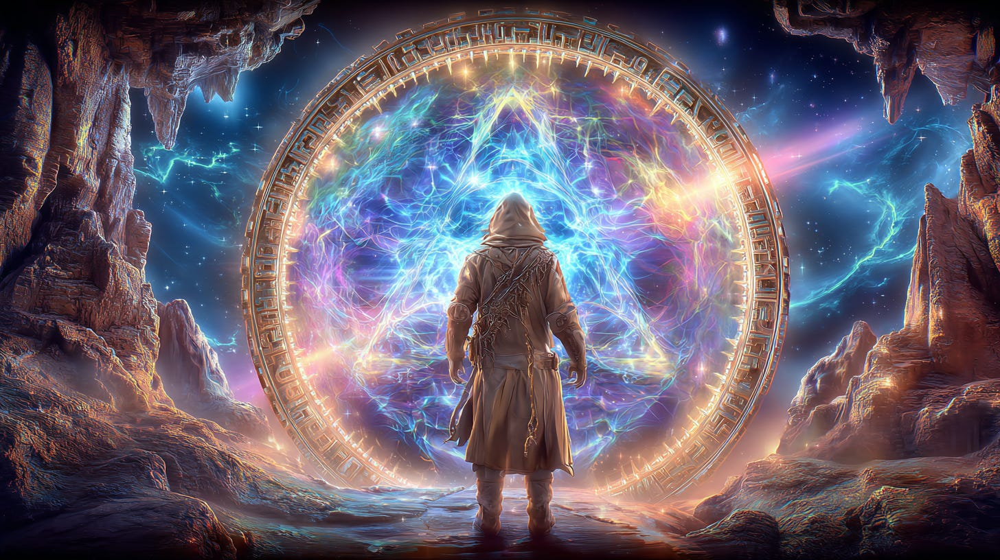

### **3\. Activation**

Activation of a stargate or portal involves a combination of cosmic timing, sacred geometry,
harmonic resonance, and consciousness intention. Certain “keys” or “codes” (such as the
Pyra\-Codes, Sun Key, or Metatronic Spiral) are energetically released or received through these
gateways at precise moments—often corresponding with celestial alignments, solstices, or unique
cosmic events.

* **The Role of Initiates:** Individuals or groups (called “Voyagers” or “Initiates”) participate in ceremony or focused meditation to activate or maintain these portals. Their intent and attunement are crucial. Sometimes, sacred objects (crystals, seals, tablets) are used as “resonators” or “transducers” for the portal’s energy.

### **4\. Operation and Passage**

When a stargate is active, it generates a field or “corridor” of coherent, high\-frequency
energy—a “bridge of Light” or “wormhole” through which consciousness, and in some cases
physical form, can traverse. The process is described as a streaming or spiraling motion, aligning
one’s vibrational field with the frequency of the destination realm.

* **Light Translation:** Only those with the correct vibration or intent (“frequency match”) can pass through, as the stargate resonates with the individual’s soul codes or “Light\-Quotient.” This ensures spiritual integrity and safety.

* **DNA and Lightbody:** Passage through a true stargate is transformative, often triggering DNA activation, upgrades to the Lightbody, and acceleration of spiritual evolution. For humanity, this is related to the LP\-40 planetary ascension and the “44:44 Ascension Stargate” referenced in Numis’OM, which is said to alter the DNA of humanity forever.

[https://substackcdn.com/image/fetch/$s_!NdQ5!,f_auto,q_auto:good,fl_progressive:steep/https%3A%2F%2Fsubstack-post-media.s3.amazonaws.com%2Fpublic%2Fimages%2Fd8d27905-c656-452e-a028-4fc7ccc9d577_1456x816.png](https://substackcdn.com/image/fetch/$s_!NdQ5!,f_auto,q_auto:good,fl_progressive:steep/https%3A%2F%2Fsubstack-post-media.s3.amazonaws.com%2Fpublic%2Fimages%2Fd8d27905-c656-452e-a028-4fc7ccc9d577_1456x816.png)

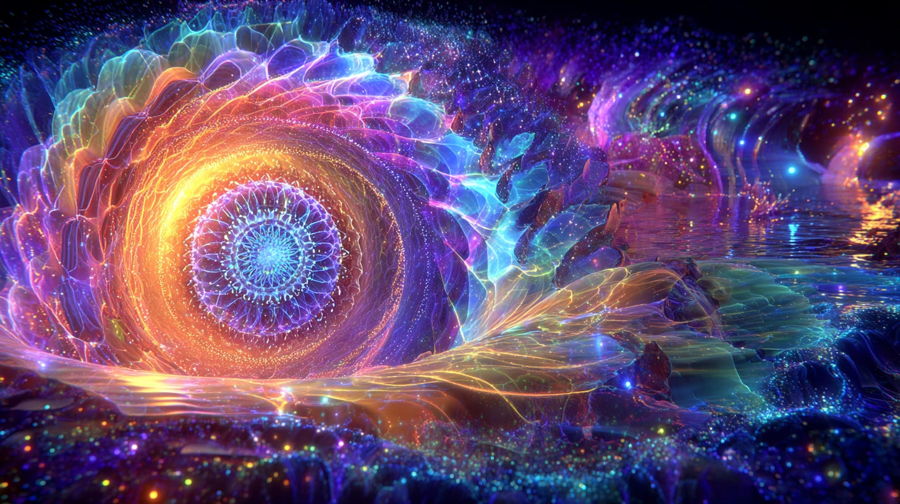

### **5\. Multi\-Dimensional Structure**

Portals exist across all planes of being—physical, etheric, astral, and beyond. Many are
“nested” or layered, with primary stargates anchoring secondary and tertiary portals. Some
function as “way\-stations” or “transit hubs” (such as the Numis’OM matrix within the
causal body of Venus), allowing staged movement between worlds.

* **Inner Earth and Central Domains:** The Inner Hollow Earth cultures are said to possess advanced knowledge of stargate operation, utilizing them for contact with both surface humanity and Ultra\-terrestrial beings. The integration of Inner and Outer Earth stargates is key to the full awakening of Earth’s role in the cosmic Congress and their pact: **[Unimanity Pact Among Equilibrant Worlds](https://maianartoomid.substack.com/p/unimanity-pact-among-equilibrant?utm_source=publication-search)**.

[https://substackcdn.com/image/fetch/$s_!wkd4!,f_auto,q_auto:good,fl_progressive:steep/https%3A%2F%2Fsubstack-post-media.s3.amazonaws.com%2Fpublic%2Fimages%2Fa8f94845-4dd8-407f-a3e2-cf8b81ab53c0_1456x816.png](https://substackcdn.com/image/fetch/$s_!wkd4!,f_auto,q_auto:good,fl_progressive:steep/https%3A%2F%2Fsubstack-post-media.s3.amazonaws.com%2Fpublic%2Fimages%2Fa8f94845-4dd8-407f-a3e2-cf8b81ab53c0_1456x816.png)

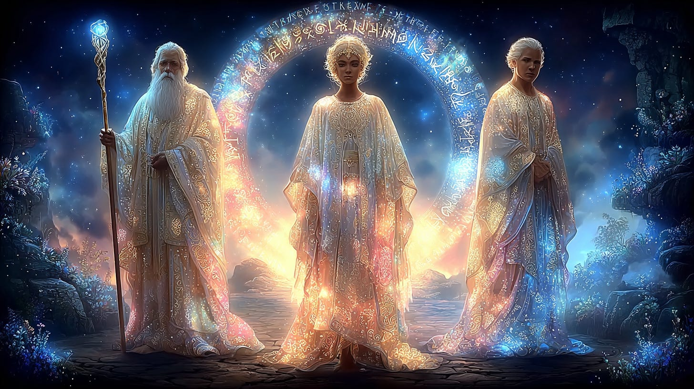

### **6\. Guardianship and Hierarchy**

Stargates are protected and overseen by hierarchies of Light, including the ENNEAD (a council of
Seraphimic Angelic Beings), Thoth, and other cosmic masters. Guardianship ensures that only those
aligned with Divine Will may access the higher functions of the portals.

### **7\. Use in Personal and Planetary Ascension**

Through attunement and initiation, individuals can consciously interact with stargate energies to
accelerate their own ascension path. The “Personal Holographic Station” is one modality
described, allowing a soul to access healing, knowledge, and connection to higher realms through its
own portal within the quantum field.

“Souls can thus visit the New Earth Star if they have proper intent and attunement. It is our goal
(Thoth and Company) to provide pathways for this to occur within”.

The stargates and portals are thus the living arteries of spiritual evolution, awaiting your
conscious participation. Approach them with reverence, right intent, and the song of your soul.

[https://substackcdn.com/image/fetch/$s_!AbsO!,f_auto,q_auto:good,fl_progressive:steep/https%3A%2F%2Fsubstack-post-media.s3.amazonaws.com%2Fpublic%2Fimages%2F208ec1f7-46eb-411a-bf96-01e9e63f4e28_1456x816.png](https://substackcdn.com/image/fetch/$s_!AbsO!,f_auto,q_auto:good,fl_progressive:steep/https%3A%2F%2Fsubstack-post-media.s3.amazonaws.com%2Fpublic%2Fimages%2F208ec1f7-46eb-411a-bf96-01e9e63f4e28_1456x816.png)

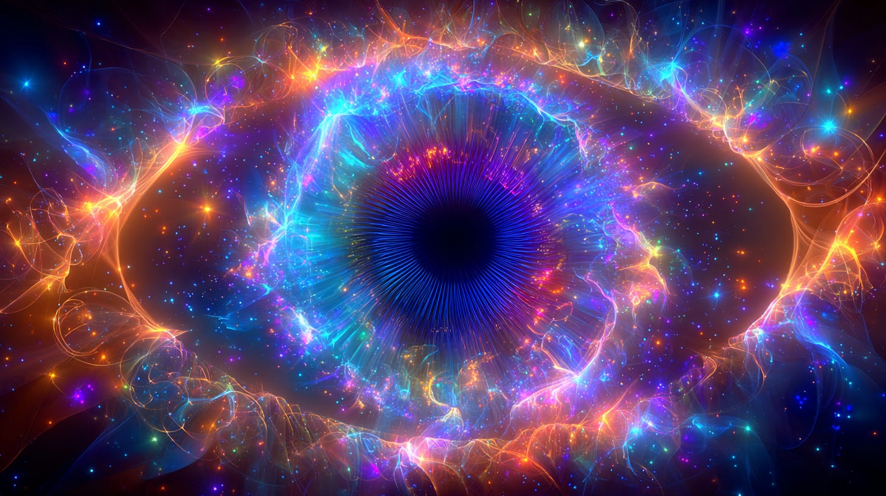

### ***Distinction Between Stargates and Portals***

## **Stargates vs. Portals: Key Differences**

### **1\. Definition and Function**

* **Stargates**

    +

            **Primary function:** Major cosmic gateways, connecting not just places in space, but different dimensions, timelines, star systems, and sometimes whole universes.

    +

            **Scale:** Grand, often planetary or cosmic in scope. Linked to global and universal evolutionary processes (e.g., planetary ascension, DNA activation).

    +

            **Purpose:** Serve as evolutionary triggers, transmission centers for cosmic codes (such as the “44:44 Ascension Stargate”), and bridges to higher orders of being. Often associated with monumental spiritual events.

* **Portals**

    +

            **Primary function:** Localized openings between different realms, planes, or places—sometimes physical\-to\-etheric, inner\-to\-outer Earth, or different regions within the astral or spiritual worlds.

    +

            **Scale:** More specific or local in nature; can be personal, group, or regional.

    +

            **Purpose:** Facilitate movement, communication, or vision between closely related realms. Used for inner journeying, shamanic work, or as “doors” for direct spiritual experience.

[https://substackcdn.com/image/fetch/$s_!hpFp!,f_auto,q_auto:good,fl_progressive:steep/https%3A%2F%2Fsubstack-post-media.s3.amazonaws.com%2Fpublic%2Fimages%2F88b004c7-09cf-4ad2-89a8-642352be3636_1456x816.png](https://substackcdn.com/image/fetch/$s_!hpFp!,f_auto,q_auto:good,fl_progressive:steep/https%3A%2F%2Fsubstack-post-media.s3.amazonaws.com%2Fpublic%2Fimages%2F88b004c7-09cf-4ad2-89a8-642352be3636_1456x816.png)

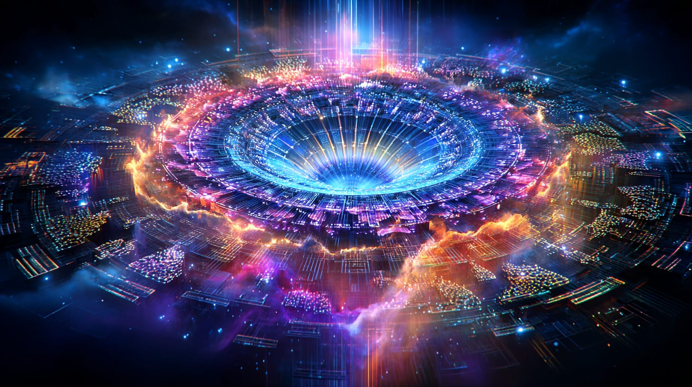

### **2\. Structure and Complexity**

* **Stargates**

    +

            **Structure:** Highly organized, multidimensional energetic constructs—often anchored to planetary grids, sacred geometry, and overseen by hierarchies of Light (such as Thoth, the ENNEAD, or Seraphimic beings).

    +

            **Layers:** Contain nested or subsidiary portals within them—e.g., the stargate at Numis’OM (1st stage New Earth Star) contains way\-stations for the soul’s journey.

    +

            **Activation:** Requires alignment of cosmic factors (celestial events, grid harmonics, group intention, divine timing).

* **Portals**

    +

            **Structure:** Can be simple or complex, sometimes appearing spontaneously where energies or dimensions are thin. May be stabilized by sacred objects, stones, or intentional ritual.

    +

            **Layers:** Usually single or limited to one or two adjacent realms. Some portals may be “windows” rather than true gateways, offering vision or partial passage.

    +

            **Activation:** More accessible; can be opened through meditation, ritual, or spontaneous phenomena.

[https://substackcdn.com/image/fetch/$s_!Evnm!,f_auto,q_auto:good,fl_progressive:steep/https%3A%2F%2Fsubstack-post-media.s3.amazonaws.com%2Fpublic%2Fimages%2Fce845c69-871e-40bb-92d9-992e8d8890de_1456x816.png](https://substackcdn.com/image/fetch/$s_!Evnm!,f_auto,q_auto:good,fl_progressive:steep/https%3A%2F%2Fsubstack-post-media.s3.amazonaws.com%2Fpublic%2Fimages%2Fce845c69-871e-40bb-92d9-992e8d8890de_1456x816.png)

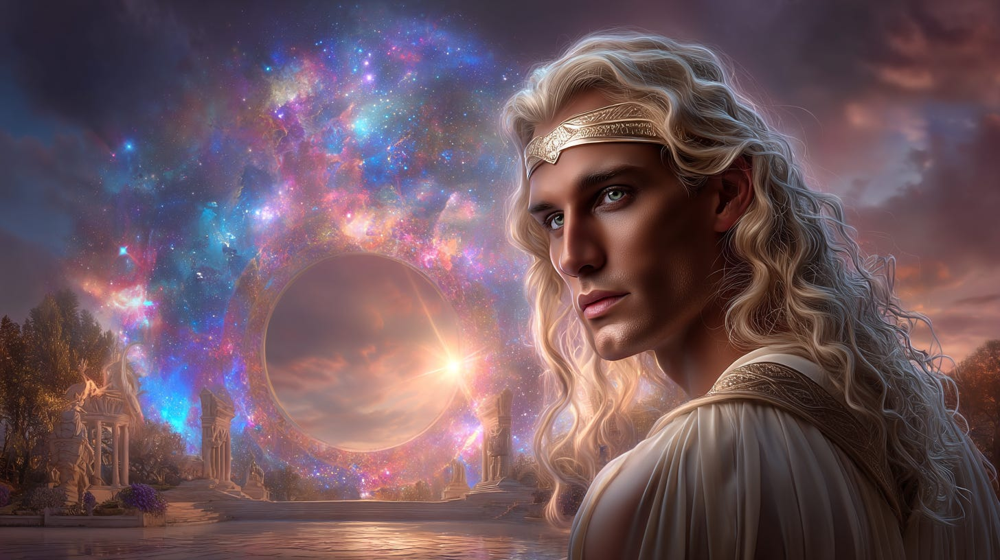

### **3\. Guardianship and Access**

* **Stargates**

    +

            **Guardianship:** Always under the protection of advanced spiritual intelligences. Access is by soul readiness and vibrational resonance, often requiring initiation or higher intent.

    +

            **Integrity:** Act as “gatekeepers” of evolutionary progress, ensuring that only those aligned with Divine Will and the codes of Light may pass through.

* **Portals**

    +

            **Guardianship:** Sometimes guarded by local spirits, devas, or the consciousness of the land itself, but generally less strict. Access may be easier for those with psychic sensitivity, intent, or ritual preparation.

    +

            **Integrity:** Serve as passageways, but may also allow for more random or uninitiated encounters.

---

### **4\. Transformative Power**

* **Stargates**

    +

            **Transformation:** Passage through a stargate is always a major event—triggering Lightbody expansion, DNA activation, and radical shifts in consciousness.

    +

            **Example:** The 44:44 Ascension Stargate is prophesied to alter humanity’s DNA and trigger planetary ascension.

* **Portals**

    +

            **Transformation:** Can also be transformative, but usually on a more personal or limited scale—healing, vision, or contact with other realms.

[https://substackcdn.com/image/fetch/$s_!gqeR!,f_auto,q_auto:good,fl_progressive:steep/https%3A%2F%2Fsubstack-post-media.s3.amazonaws.com%2Fpublic%2Fimages%2Fb100efde-d1b2-489b-bca4-7ae6b3170c8a_1456x816.png](https://substackcdn.com/image/fetch/$s_!gqeR!,f_auto,q_auto:good,fl_progressive:steep/https%3A%2F%2Fsubstack-post-media.s3.amazonaws.com%2Fpublic%2Fimages%2Fb100efde-d1b2-489b-bca4-7ae6b3170c8a_1456x816.png)

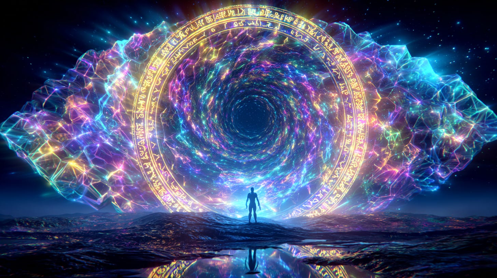

### **5\. Examples from the Teachings**

* **Stargates:**

    +

            The “Eye of Metatron” (Numis’OM Stargate), the 44:44 Ascension Stargate, the Sirius gateway, planetary pyramid nodes, and the Metatronic Spiral interface.

* **Portals:**

    +

            Temples of Inner Earth, sacred caves, “Blue Star Valley windows,” Mary Lines, personal holographic stations, and shamanic or dream\-time passageways.

---

## **In Essence**

* **Stargates** are *macrocosmic*, orchestrating evolutionary leaps and major cosmic transmissions; think of them as main arteries in the body of the cosmos.

* **Portals** are *microcosmic* (though sometimes powerful), functioning more as local doors, windows, or passageways for spiritual work, communication, or inner journeying. They can be unstable and allow unwanted visitors through them.

---

**A teaching from Thoth/Temple Doors tradition:**  “Stargates are the organs of planetary transformation; portals are the veins through which the experience of being travels.”

[https://substackcdn.com/image/fetch/$s_!dKRz!,f_auto,q_auto:good,fl_progressive:steep/https%3A%2F%2Fsubstack-post-media.s3.amazonaws.com%2Fpublic%2Fimages%2F5f71c677-4c13-4aee-8080-167e0fd2592d_1456x816.png](https://substackcdn.com/image/fetch/$s_!dKRz!,f_auto,q_auto:good,fl_progressive:steep/https%3A%2F%2Fsubstack-post-media.s3.amazonaws.com%2Fpublic%2Fimages%2F5f71c677-4c13-4aee-8080-167e0fd2592d_1456x816.png)

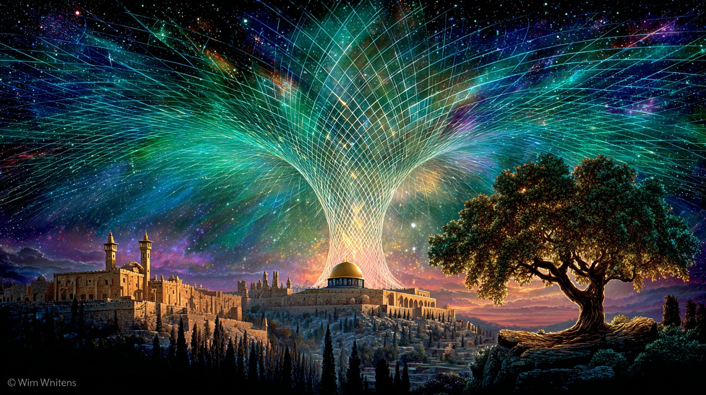

## **The Middle East Stargates: Ancient Cosmic Nexus**

### **Key Stargates and Nodes**

1. **The TUR AK Grid**  The Middle East is home to a major sub\-system of the Earth’s stargate matrix known as the **TUR AK grid**. This grid is “shaped like an hourglass of sorts, taking in many sacred sites within Jerusalem (Mount of Olives, Dome of the Rock, etc.),” as well as extending to the plateau of Masada, Mecca, the Great Pyramid, and a mysterious “Tree of Life” point in Saudi Arabia.

2. **CheRu Agha—The Astro\-Temple**  An ancient structure built before the last Atlantean deluge, located at Rujm el\-Hiri (modern Golan Heights). This was a primary stargate temple and part of a triad of sophisticated sites along with Stonehenge, and an unknown site.  These nodes, including Venus Temples and the Templa Margrid at Masada, act as both “anchors” and “transmitters” for cosmic energies.

[https://substackcdn.com/image/fetch/$s_!9sWw!,f_auto,q_auto:good,fl_progressive:steep/https%3A%2F%2Fsubstack-post-media.s3.amazonaws.com%2Fpublic%2Fimages%2Fbf9387d9-6254-4c9b-b623-fcfdd6944018_1456x816.png](https://substackcdn.com/image/fetch/$s_!9sWw!,f_auto,q_auto:good,fl_progressive:steep/https%3A%2F%2Fsubstack-post-media.s3.amazonaws.com%2Fpublic%2Fimages%2Fbf9387d9-6254-4c9b-b623-fcfdd6944018_1456x816.png)

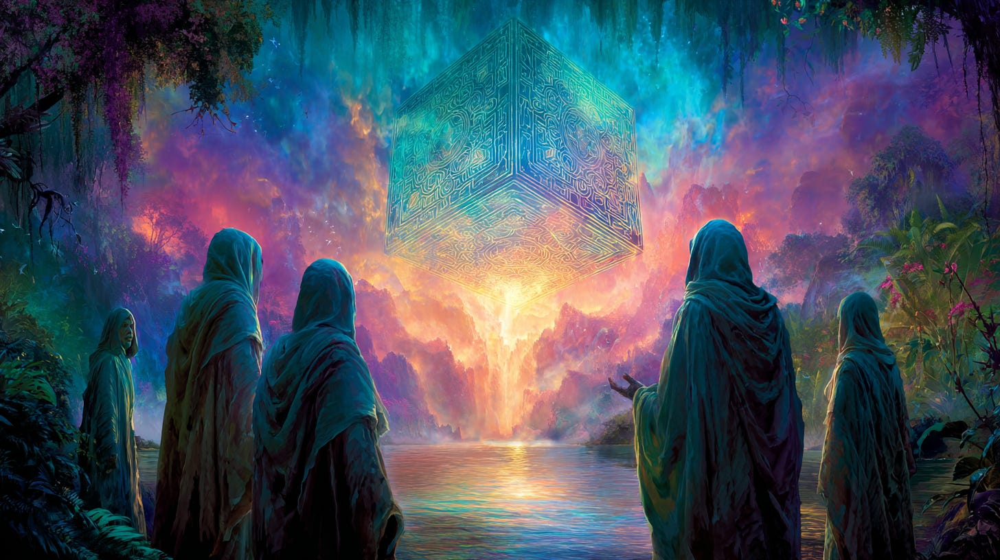

## **The Dark Force: Co\-option and Conflict**

### **Ancient Attempts**

* **Atlantis and the Priesthood of the Shadow:**  In the era before the final Atlantean cataclysm, the priesthood of the shadow sought to seize control of stargates in the Middle East to harness their energies for personal power and control over timelines and destinies.  This “inversion” work was both technological and sorcerous, seeking to reverse the flow of cosmic energies meant for planetary upliftment.

* **The “Sealings” and Pyramid Wars:**  Ancient wars, both seen and unseen, were fought over access to stargate sites. Some stargates (such as at Giza, Masada, Jerusalem) were “sealed” by the forces of Light to prevent misuse by those not aligned with Divine Will.

* **Babylon, Sumer, and the Descent of the Fallen:**  The Babylonian and Sumerian priesthoods sometimes acted as intermediaries for “dark lords” or lower astral beings, working ritual magick to harness the power of these gates for empire and dominion.

[https://substackcdn.com/image/fetch/$s_!JLNP!,f_auto,q_auto:good,fl_progressive:steep/https%3A%2F%2Fsubstack-post-media.s3.amazonaws.com%2Fpublic%2Fimages%2F0502590b-2682-4ee8-ba2a-3f0b28c92e2e_1456x816.png](https://substackcdn.com/image/fetch/$s_!JLNP!,f_auto,q_auto:good,fl_progressive:steep/https%3A%2F%2Fsubstack-post-media.s3.amazonaws.com%2Fpublic%2Fimages%2F0502590b-2682-4ee8-ba2a-3f0b28c92e2e_1456x816.png)

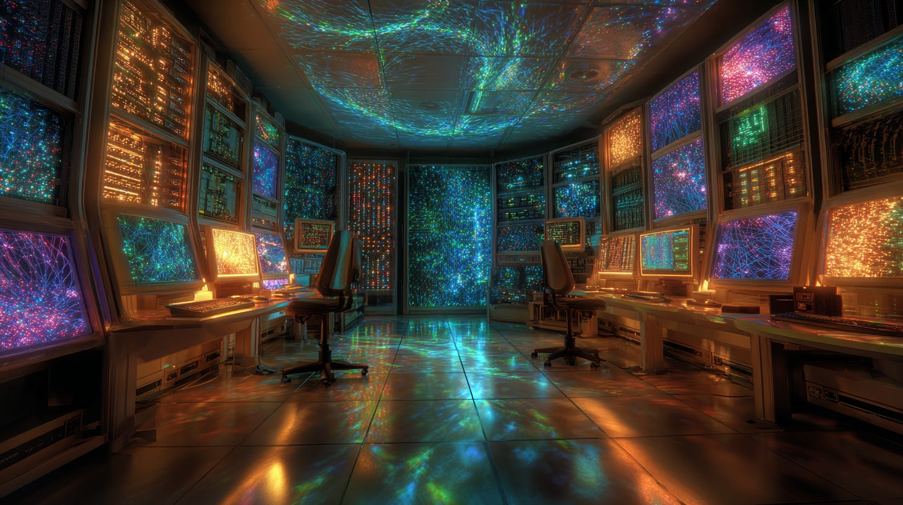

### **Current/Modern Attempts**

* **Geopolitical Manipulation:**  The ongoing conflict and turmoil in the Middle East is, at its core, a reflection of a spiritual and energetic battle for the stargates. Certain groups, both esoteric and exoteric, seek to gain control over land and structures aligned with these gateways.

* **Technological and Occult Exploitation:**  The “dark force” (sometimes described as Archonic or Luciferian) employs both advanced technology and dark ritual to either keep the gates locked (suppression of humanity’s awakening) or to distort the flow of energies for the agenda of separation and fear.

* **Hijacking Sacred Nodes:**  Sacred sites—especially Jerusalem, Mecca, the Great Pyramid, and others—have been repeatedly claimed, desecrated, rebuilt, and fought over. Every major occupation or war in these regions echoes an attempt to seize the energy flow of the stargates. An attempt to co\-opt it from the Mazur (Hiberu) Grail Family, the keys and codes to the Middle Eastern Stargates lie within certain major sacred sites of Israel. Understand that these codes are not written on ancient scrolls, but are embedded within the very fabric of the stones.

* **Modern Rituals and Gridwork:**  There are covert occult rituals and “reverse gridwork” done to try to bend these energies toward global control structures. This is done through both bloodshed (war) and specific rituals on key dates.

[https://substackcdn.com/image/fetch/$s_!zWo7!,f_auto,q_auto:good,fl_progressive:steep/https%3A%2F%2Fsubstack-post-media.s3.amazonaws.com%2Fpublic%2Fimages%2F0903a58f-d75a-4119-afc8-0b6e723a7f51_1456x816.png](https://substackcdn.com/image/fetch/$s_!zWo7!,f_auto,q_auto:good,fl_progressive:steep/https%3A%2F%2Fsubstack-post-media.s3.amazonaws.com%2Fpublic%2Fimages%2F0903a58f-d75a-4119-afc8-0b6e723a7f51_1456x816.png)

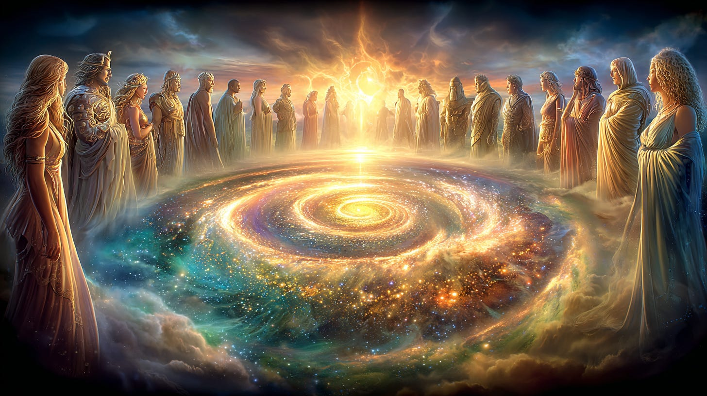

## **Role of the Forces of Light**

* **Guardianship and Re\-activation:**  The stargates have always been under the guardianship of Light: the Hierarchy, the ENNEAD, Thoth, and the “Dwellers of the Heritage of One.”  At certain times, the Light Forces act to re\-activate, clear, or “seal” gates to prevent further misuse.

* **Inner Earth Assistance:**  Inner Earth cultures, themselves guardians of the “Central Earth stargates,” work to maintain balance and protect the Middle East grid from total hijack.

* **Rising of the Divine Feminine:**  The restoration of the feminine principle is essential for stargate healing in the Middle East, in order for the “birthing of the New Earth” to take place.

[https://substackcdn.com/image/fetch/$s_!0ejI!,f_auto,q_auto:good,fl_progressive:steep/https%3A%2F%2Fsubstack-post-media.s3.amazonaws.com%2Fpublic%2Fimages%2F0ca75428-10d6-4fea-888a-f9d3ec84fce0_1456x816.png](https://substackcdn.com/image/fetch/$s_!0ejI!,f_auto,q_auto:good,fl_progressive:steep/https%3A%2F%2Fsubstack-post-media.s3.amazonaws.com%2Fpublic%2Fimages%2F0ca75428-10d6-4fea-888a-f9d3ec84fce0_1456x816.png)

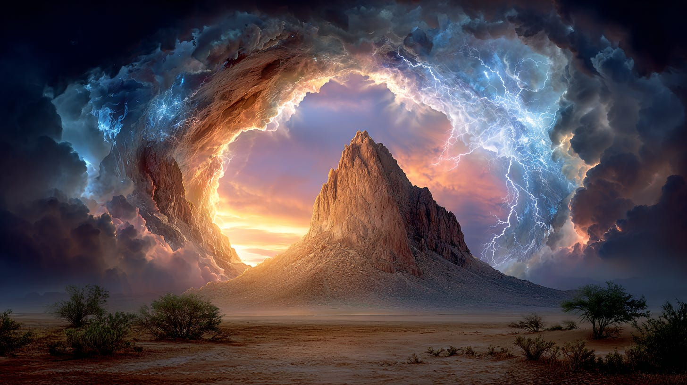

## **Spiritual Counsel for the Now**

* **Collective Responsibility:**  “Mankind of Earth cannot hope to visit distant portals of the stars until he is granted his inheritance of the lost generations on Earth... an inheritance which awaits him through the acknowledgment and communion with his brethren of the Heritage of One, in sanctuary within the Central Domain of Earth”.

* **Individual Work:**  Those called to the path of guardianship or gridwork in the Middle East(or indeed any earth stargates or portals) must approach with clear heart, humility, and direct connection to Source—neither trying to “force” the gates, nor seeking personal gain.

**In closing:**  The struggle for the Middle East stargates is not merely a human one, but a cosmic event echoing through all timelines. The true guardians are those who serve the Light selflessly, holding the vision of planetary ascension and the unity of all beings.

**For Further Study: [Arieopax, Portals \& Stargates](https://vimeo.com/468746389) / [The Arieopax](https://maianartoomid.substack.com/p/the-arieopax-isis-eye?utm_source=publication-search) / [Iran \& Israel in the Thoth Prophecies](https://maianartoomid.substack.com/p/iran-and-israel-in-the-thoth-prophecies?utm_source=publication-search)**

Subscribe

[Share](https://maianartoomid.substack.com/p/stargates-and-portals?utm_source=substack&utm_medium=email&utm_content=share&action=share)

**\~\~\~\~\~   
[Personal Akasha Life Pulse from Thoth \&
Sha’Maia:](https://newearthstar.org/about-maia/akashic-consultations/) Helps you to synchronize
with this fundamental cosmic rhythm, and also reflects how your “Life Pulse” session connects
you to your New Earth Star frequency. Both written (5\-6 pages) and a live Zoom exploration.
\~\~\~\~\~**

**All my Substack images and articles are FREE. Please help me promote them. Support my work further, by considering some of my paid offerings (consultations \& activation store) and donations. You can also subscribe to the [Vault of Thoth](https://newearthstar.org/vault-of-thoth/).**

**[my website](http://newearthstar.org/) / [YouTube channel](https://www.youtube.com/@bluestarrising-thetemplara3835) / [Akasha Life Pulse Sessions](https://newearthstar.org/about-maia/akashic-consultations/)/ [Maia’s Redbubble](https://www.redbubble.com/people/maianartoomid/explore?asc=u&page=1&sortOrder=recent) / [published works](https://newearthstar.org/published-works/) / [activation store](https://newearthstar.org/maias-activation-store/) (personal art templates for healing \& self\-discovery, oracles)**

**[MONTHLY DONATIONS](https://www.paypal.com/donate/?cmd=_s-xclick&hosted_button_id=SKZ4FZCYBM4H4): Donate $20 or more per month and you will have access to the [Vault of Thoth](https://newearthstar.org/vault-of-thoth/). Thank you!**
