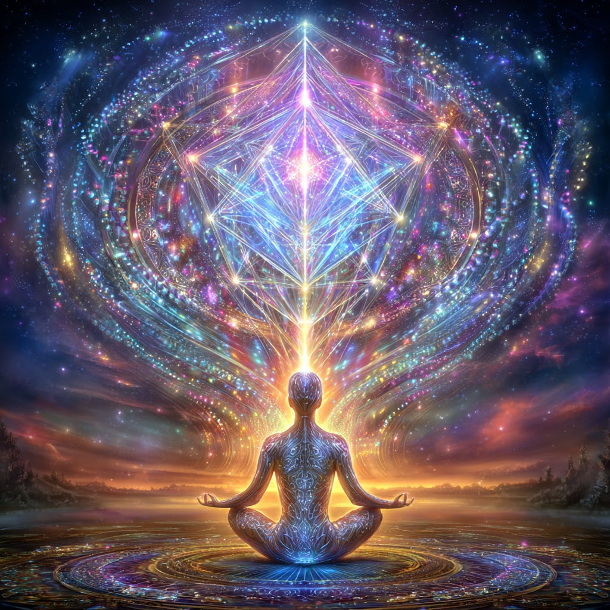
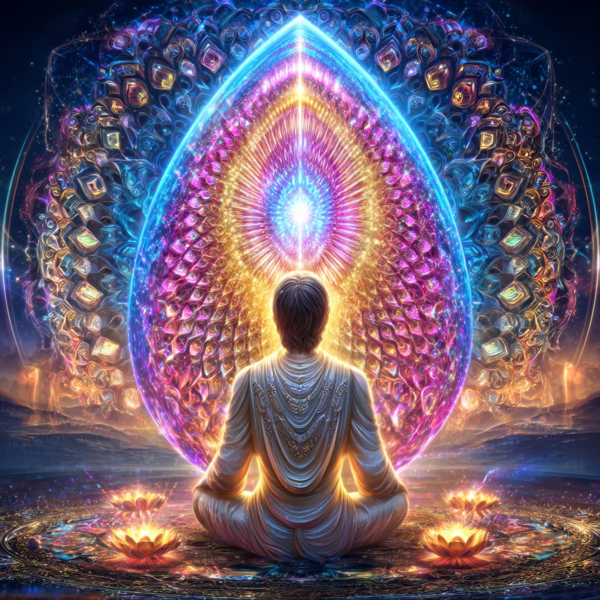
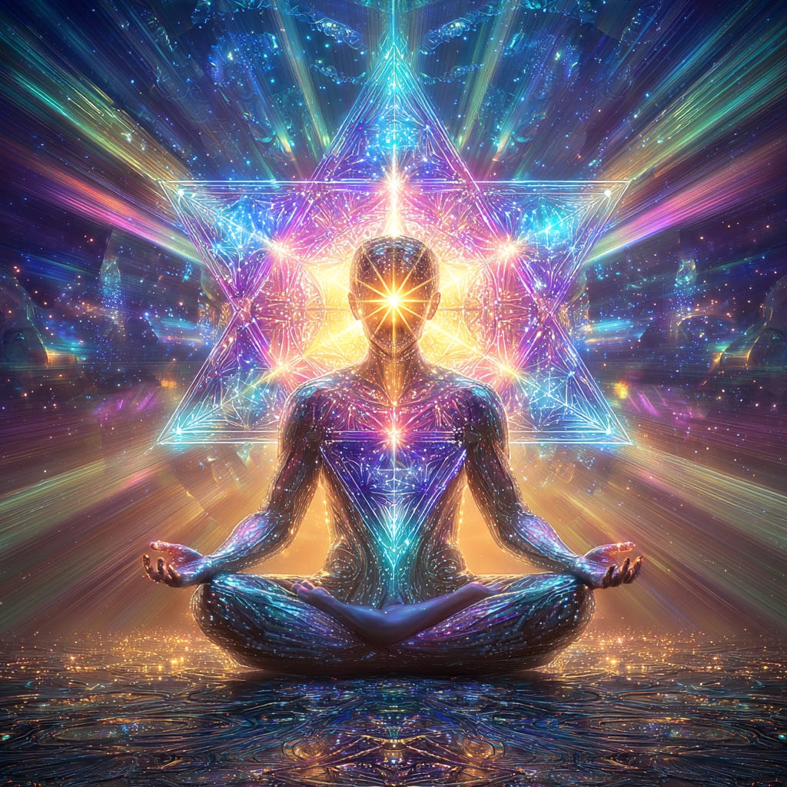

# The Merkabah - Our Light Transport

**2024-12-06T19:22:52.956Z**

**Likes:** 0

[https://substackcdn.com/image/fetch/$s_!70DA!,f_auto,q_auto:good,fl_progressive:steep/https%3A%2F%2Fsubstack-post-media.s3.amazonaws.com%2Fpublic%2Fimages%2Fe3120c75-b498-4520-991f-2afcbfa9a516_1024x1024.png](https://substackcdn.com/image/fetch/$s_!70DA!,f_auto,q_auto:good,fl_progressive:steep/https%3A%2F%2Fsubstack-post-media.s3.amazonaws.com%2Fpublic%2Fimages%2Fe3120c75-b498-4520-991f-2afcbfa9a516_1024x1024.png)

**First, let us delve into[ThothStream](https://nesialibraryproject.wordpress.com/thothstream-knowledge-base/) for a look at the various Merkabahs Thoth has delineated to me in the past. There are many more I am sure!**

\~\~\~\~\~\~\~\~\~

#### Types of Merkabahs in TS (what they are)

1. **Merkabah of the Host (IAC core\-twelve)**  TS (paraphrase): A 12\-soul core within the Illumined Assembly of the Christos “gathering and focusing” the Christic crystalline Light geometry into Sacred Presence in the Earth. This 12 is named the **Merkabah of the Host**.

2. **Phi Merkabahs (Amatrix line)**  TS (verbatim): “**PHI MERKABAHS** — Vehicles of seed consciousness delivering aspects of Phi awareness into our being.”   TS (paraphrase): In the same Amatrix suite, **Chariots** and Phi Merkabahs are “messengers”—builders of new patterns (and sometimes upheaval if debris must clear).

3. **Angelic Merkabah (ENNEAD formation)**  TS (paraphrase): The **ENNEAD** is described as a *Seraphimic angelic multi\-dimensional merkabah* composed of nine units of intelligence under Metatron’s authority.

4. **“New Arks” (Numis’OM energy merkabahs)**  TS (verbatim): “In the New Earth of Numis’OM there exists **energy merkabahs** which Thoth is referring to as ‘**New Arks**.’”

5. **Classical Merkabah (definition carried in Temple Doors)**  TS (verbatim quote carried in TD): “**Divine Light Vehicle** used by the Masters… The Merkabah can take on many forms of a brilliant briolette in the physical world.”

6. **Chariot imagery (Merkabah logic via the Four \+ Fifth)**  TS (paraphrase): The “Chariot…of the four elements in balance,” with the fifth (quintessence) as the governing point—the phoenix/Charioteer—maps the inner logic of the Light\-vehicle (Chariot/Merkabah) as balanced elemental forces with an Etheric crown.

7. **Angelic “winged” Merkabah appearance**  TS (paraphrase): Angelic forms may appear with “wings” as the **merkabah flashes between dimensions**, arcing light at the heart.

[https://substackcdn.com/image/fetch/$s_!t5ic!,f_auto,q_auto:good,fl_progressive:steep/https%3A%2F%2Fsubstack-post-media.s3.amazonaws.com%2Fpublic%2Fimages%2F9b4ae3d3-be26-4bf3-ac0a-c7810936c946_1024x1024.png](https://substackcdn.com/image/fetch/$s_!t5ic!,f_auto,q_auto:good,fl_progressive:steep/https%3A%2F%2Fsubstack-post-media.s3.amazonaws.com%2Fpublic%2Fimages%2F9b4ae3d3-be26-4bf3-ac0a-c7810936c946_1024x1024.png)

#### How they are created/formed in TS (mechanics \& practice)

**A. By collective Sacred Presence holding precise Light geometry (Christos field).**  TS (paraphrase): The *Illumined Assembly of the Christos* (IAC) 12\-soul Merkabah is *established* by those souls **holding** Christic crystalline Light geometry in Sacred Presence, which *establishes resonance* with the Fire in the Sacred Heart across the planetary field.

**B. By engaging the Phi crystalline matrix (Amatrix).**  TS (verbatim): Phi Merkabahs are “vehicles of seed consciousness,” i.e., **Phi\-code carriers** that deliver aspects of **Phi awareness** into the being.   TS (paraphrase): Within the Amatrix transmissions, **Phi balance points** and **crystalline nodes** are the geometry through which the Phi current builds into the planet; Chariots and Phi Merkabahs act as **messengers** that install or clear patterns.

**C. As angelic composite vehicles (ENNEAD).**  TS (paraphrase): The ENNEAD’s **ninefold Seraphimic merkabah** is formed as a *composite intelligence vehicle* under Metatronic authority—an angelic way a Merkabah “is” formed (by order and office rather than human exercise).

**D. As Numis’OM “New Arks” (energy merkabahs) that conduit high\-frequency template signals.**  TS (paraphrase): New Arks are **energy merkabahs** functioning as conduits for “Light \& Perfection” template signaling (context given in the Sacred An/Ark stream), i.e., created/energized as **signal vehicles** for divine template infusion.

**E. As the inner ‘Chariot’ assembled through elemental balance \+ Ether (Quintessence).**  TS (paraphrase): The Chariot diagram shows **four elements** balanced with a **fifth Etheric point** (phoenix), portraying how the Light\-vehicle “locks” when elements are cohered and crowned by Quintessence.

**F. As dimensional ‘flash’ vehicles around angelic forms (appearance mechanism).**  TS (paraphrase): Angelic merkabahs “flash” between dimensions, **arcing at the heart**, which describes the *phenomenology* of their formation/translation in our perception.

[https://substackcdn.com/image/fetch/$s_!Zt-a!,f_auto,q_auto:good,fl_progressive:steep/https%3A%2F%2Fsubstack-post-media.s3.amazonaws.com%2Fpublic%2Fimages%2Fba12cdff-6c8a-46e8-bf7b-afcc0954903b_1024x1024.png](https://substackcdn.com/image/fetch/$s_!Zt-a!,f_auto,q_auto:good,fl_progressive:steep/https%3A%2F%2Fsubstack-post-media.s3.amazonaws.com%2Fpublic%2Fimages%2Fba12cdff-6c8a-46e8-bf7b-afcc0954903b_1024x1024.png)

---

#### Plain\-language takeaway (how you “make” or engage one)

* **Christos Merkabah (group field):** Gather 2–12 aligned souls and **hold a shared pattern of Sacred Presence**—visualize crystalline Light geometry stabilized in the heart and extended into a unified field. In TS, this *holding* is the creation mechanism.

* **Phi Merkabah (personal/planetary):** Work with **Phi balance points / crystalline nodes** (meditation with Phi geometry, mandalas) and invite the **Phi “vehicle of seed consciousness”** to deliver specific awareness codes. Expect building and sometimes clearing (“Tower” effect) as patterns reset.

* **Angelic/ENNEAD:** Not “constructed” by us; **received/partnered** with as an already\-formed ninefold angelic vehicle. Engage by reverent attunement to Metatronic guidance.

* **New Arks:** Treat as **energy merkabah conduits**—invite them in ritual/meditation to **carry template signals**(Light \& Perfection) into your field or a place.

* **Chariot logic:** In practice, **balance the four elements in you** (body/feelings/mind/breath), then *crown* with a heart\-centered Ether/Quintessence focus. This coheres your inner “Chariot” so the Merkabah can “seat.”

[https://substackcdn.com/image/fetch/$s_!l1dU!,f_auto,q_auto:good,fl_progressive:steep/https%3A%2F%2Fsubstack-post-media.s3.amazonaws.com%2Fpublic%2Fimages%2F252194ea-d077-4073-b3d0-225d96778243_1024x1024.png](https://substackcdn.com/image/fetch/$s_!l1dU!,f_auto,q_auto:good,fl_progressive:steep/https%3A%2F%2Fsubstack-post-media.s3.amazonaws.com%2Fpublic%2Fimages%2F252194ea-d077-4073-b3d0-225d96778243_1024x1024.png)

#### **2025 from ThothHorRa: Connecting to a Basic Merkabah Field**

1. in a relaxed sitting or lying posture, move into some slow deep breathing for about three minutes, focusing into the heart.

2. Now visualize a filament of radiant light coming out of the heart and moving upward into the third eye. Allow it expand there into a sphere of intention as you feel a stirring as an egg\-shaped illumination begins to form in the brow (the egg is in a vertical position with the “point” toward the crown). You watch this creation and nurture it with your soul\-self.

3. After a few moments see the egg gently open as a lotus flower appears on a stem. the stem becomes longer with the flower moving upward into the crown chakra. There it shimmers for a moment and then…

4. The lotus begins to form a torus surrounding your body. You not only *see* this, you *feel* it. A divine nectar then arrives beneath your tongue.

5. At this moment begin to hum, sending the tone up through your nasal passage and into the pineal.

6. After a few moments of humming, then relax and free\-flow as you watch the merkabah form with sacred geometry within its toroidal waves.

7. When you feel complete, breathe it all back into your heart. Then say *“I seal this merkabah with the divine signature of Light.”*

    

[https://substackcdn.com/image/fetch/$s_!9fDH!,f_auto,q_auto:good,fl_progressive:steep/https%3A%2F%2Fsubstack-post-media.s3.amazonaws.com%2Fpublic%2Fimages%2Ffe47c5f2-1c55-4a09-b55a-8170b155786a_1024x1024.png](https://substackcdn.com/image/fetch/$s_!9fDH!,f_auto,q_auto:good,fl_progressive:steep/https%3A%2F%2Fsubstack-post-media.s3.amazonaws.com%2Fpublic%2Fimages%2Ffe47c5f2-1c55-4a09-b55a-8170b155786a_1024x1024.png)

    

    As you develop this protocol as a daily practice, you will find that before too long you will not have to go through all the above steps. It will simply unfold for you as you desire it.

    

    **Why is this a meaning practice?**

    

    Simply stated, it develops your ability to go beyond the 3D experience of your form and incarnation, gathering the many dimensional currents of your full being, and developing a “conversation” with these aspects of your dimensional self.

    

[https://substackcdn.com/image/fetch/$s_!-CwI!,f_auto,q_auto:good,fl_progressive:steep/https%3A%2F%2Fsubstack-post-media.s3.amazonaws.com%2Fpublic%2Fimages%2F9837b8b6-c70d-4dc3-9eb6-8777cabbe269_1024x1024.png](https://substackcdn.com/image/fetch/$s_!-CwI!,f_auto,q_auto:good,fl_progressive:steep/https%3A%2F%2Fsubstack-post-media.s3.amazonaws.com%2Fpublic%2Fimages%2F9837b8b6-c70d-4dc3-9eb6-8777cabbe269_1024x1024.png)

    

    As I was being guided to write this article Thoth came in with a line from an old song. I had to laugh! He does have quite a sense of humor, but it always relates to a spiritual principle. 

    

    The line was: *Didja ever swing on a star, carry moonbeams home in a jar and be better off than you are…* It is from the 1930’s song *Swinging on a Star* (originally sung by Bing Crosby)*.*

    

    

    

Subscribe

    [Share](https://maianartoomid.substack.com/p/the-merkabah-our-light-transport?utm_source=substack&utm_medium=email&utm_content=share&action=share)

    

    

    **\~\~\~\~\~  
[Personal Akasha Life Pulse from Thoth \&
Sha’Maia:](https://newearthstar.org/about-maia/akashic-consultations/) Helps you to synchronize
with this fundamental cosmic rhythm, and also reflects how your “Life Pulse” session connects
you to your New Earth Star frequency. Both written (5\-6 pages) and a live Zoom exploration.
\~\~\~\~\~**

    **All my Substack images and articles are FREE. Please help me promote them. Support my work further, by considering some of my paid offerings (consultations \& activation store) and donations. You can also subscribe to the [Vault of Thoth](https://newearthstar.org/vault-of-thoth/).**

    

    **[my website](http://newearthstar.org/) / [YouTube channel](https://www.youtube.com/@bluestarrising-thetemplara3835) / [Akasha Life Pulse Sessions](https://newearthstar.org/about-maia/akashic-consultations/)/ [Maia’s Redbubble](https://www.redbubble.com/people/maianartoomid/explore?asc=u&page=1&sortOrder=recent) / [published works](https://newearthstar.org/published-works/) / [activation store](https://newearthstar.org/maias-activation-store/) (personal art templates for healing \& self\-discovery, oracles)**

    

    **[MONTHLY DONATIONS](https://www.paypal.com/donate/?cmd=_s-xclick&hosted_button_id=SKZ4FZCYBM4H4): Donate $20 or more per month and you will have access to the [Vault of Thoth](https://newearthstar.org/vault-of-thoth/). Thank you!**

    

    
