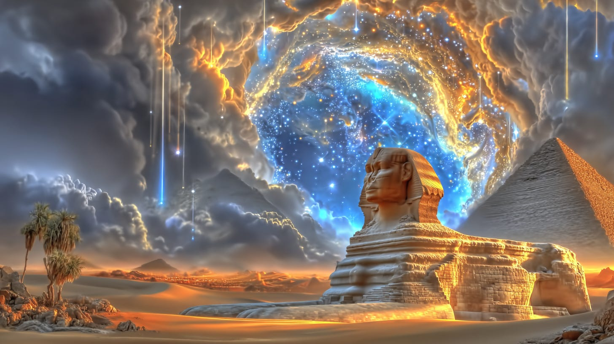
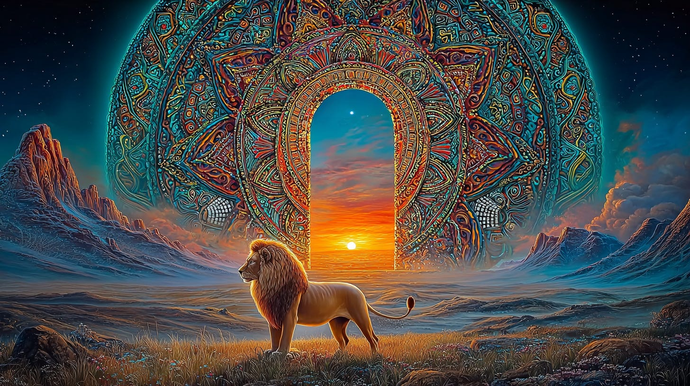
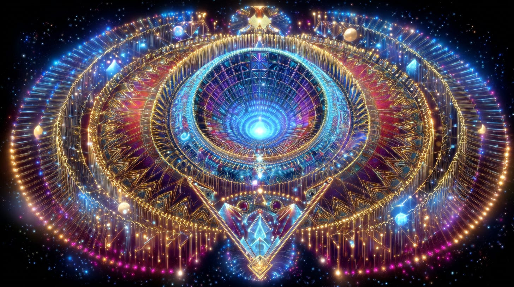
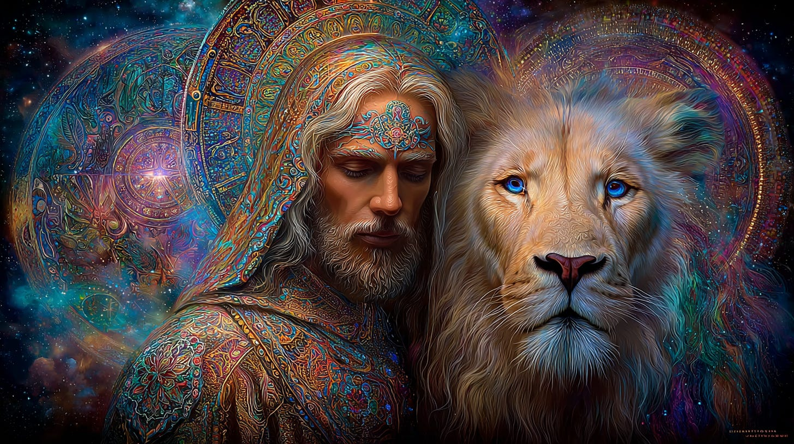
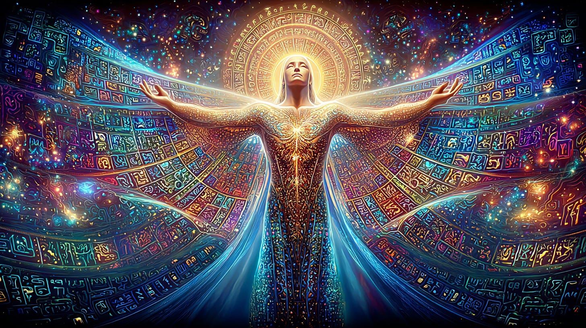
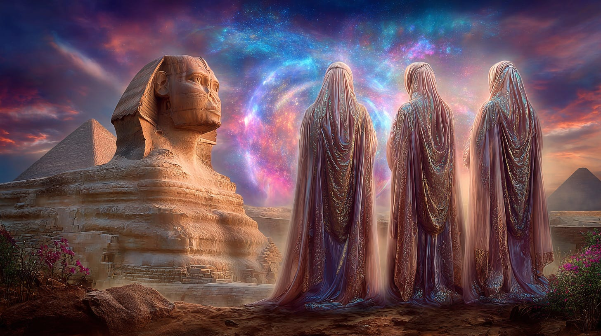
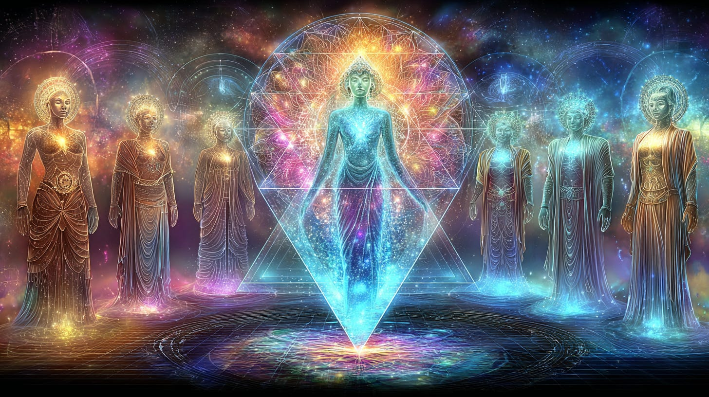
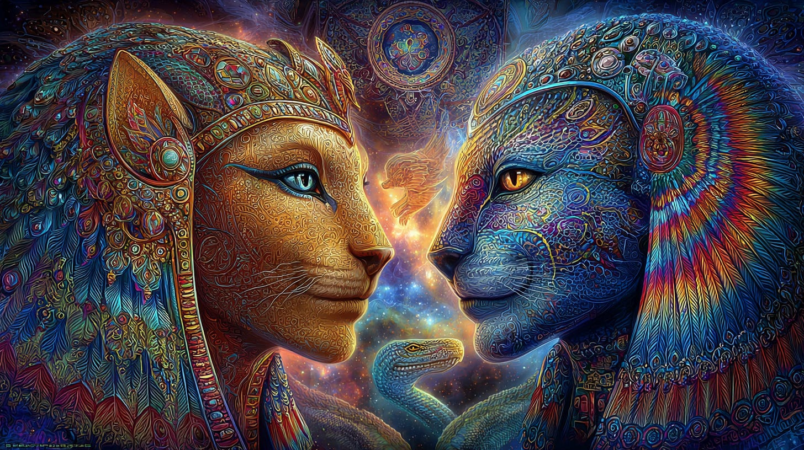
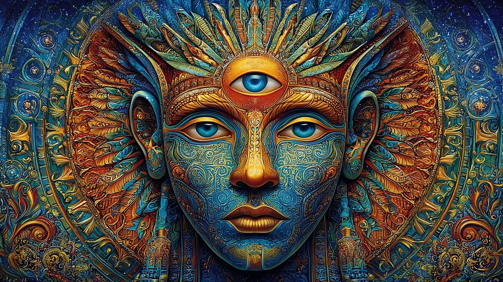

# The Sphinx and the Nefer’Ratem

## A pathway to our future

**2024-12-06T19:22:52.956Z**

**Likes:** 0

[https://substackcdn.com/image/fetch/$s_!DyEH!,f_auto,q_auto:good,fl_progressive:steep/https%3A%2F%2Fsubstack-post-media.s3.amazonaws.com%2Fpublic%2Fimages%2Fdf4b40a3-e5cc-49f8-a3fc-c4342868f3bd_1456x816.png](https://substackcdn.com/image/fetch/$s_!DyEH!,f_auto,q_auto:good,fl_progressive:steep/https%3A%2F%2Fsubstack-post-media.s3.amazonaws.com%2Fpublic%2Fimages%2Fdf4b40a3-e5cc-49f8-a3fc-c4342868f3bd_1456x816.png)

**From the [Vault of Thoth Archives](https://newearthstar.org/vault-of-thoth/)**

In January of 2006 I received in a transmission from Thoth information on what he calls the
Nefer’Ratem (also known in ancient Egyptian texts as the *Companions of Horus*). I found what he
revealed to me on this topic to be powerful and felt called to move more deeply into it. This
article is the result of my akashic exploration.

The Nefer’Ratem are guardians of the stellar / earth dynamic that is capstoned and focused through
the Sphinx on the plain of Giza in Egypt. Before I go further with the recent understanding I have
received on the Sphinx and it’s connection to the Nefer’Ratem, I wish to preview past material I
have received on the Sphinx as a Solar dynamic and it’s original form as I perceived it through
the Record of Thoth.

[https://substackcdn.com/image/fetch/$s_!QzlM!,f_auto,q_auto:good,fl_progressive:steep/https%3A%2F%2Fsubstack-post-media.s3.amazonaws.com%2Fpublic%2Fimages%2F8be8d8aa-2c0a-479f-9a76-41d2e322178c_1456x816.png](https://substackcdn.com/image/fetch/$s_!QzlM!,f_auto,q_auto:good,fl_progressive:steep/https%3A%2F%2Fsubstack-post-media.s3.amazonaws.com%2Fpublic%2Fimages%2F8be8d8aa-2c0a-479f-9a76-41d2e322178c_1456x816.png)

**The following is excerpted from the article The Gate of the Sun, the Solar Logos, \& the Lion in [Temple Doors issue 4 \- 1997 (TD\-9704\)](https://newearthstar.org/vault-of-thoth/). There is much more on the Sphinx \- it’s history and as a planetary dynamic in the[4 \- 1997](https://newearthstar.org/vault-of-thoth/) issue:**
> The Lion of Leo represents the passage between the lesser Solar Logos \- the astronomy of our physical sun, and the greater Solar Logos. Thoth has told us in the past that Leo was the constellation of access to the Golden Star of Mazuriel, which is the highest ‘threshold level’ Solar Logos for all worlds of this universal system. Ultimately, the Golden Star of Mazuriel represents the full Christic consciousness, and thus represents the future consciousness of this and many other worlds. The Solar Logos of Earth’s true planetary design in the ultimate configuration involving our physical sun, Rigel and Mazuriel, is the Blue Star Rigel in Orion. With the Golden Star of Mazuriel in the picture, the Solar Logos associated with the Blue Star Rigel becomes an intermediary logos, or bridge between the consciousness of our current physical sun, and that of the Golden Star of Mazuriel. Thus the Solar Logos of the Blue Star Rigel will generally be referred to as the greater Solar Logos for the Earth herein, and for all intents and current purposes it is. However, in the next level of cosmology beyond that logos, the Solar logos of the Golden Star of Mazuriel would truly be the greater Solar logos for all worlds in this universal system. The Blue Star Rigel is the greater Solar logos only for the Earth and Venus to our knowledge at this time, but it is the stepping stone to the Solar logos of the Golden Star of Mazuriel. Keep in mind that when we are speaking of Rigel being a stepping stone to the consciousness of Mazuriel, the stellar representative of the Christ, we are looking at some very long cycles in terms of linear Earth reality, literally many thousands of years. But in the higher dimensional realities where time is not so large a part of the reality, it is but one revolution on the spiral of the cosmic clock.
> 
> This entire cosmology involving more than one Solar Logos (as well as the lion / Lion symbology) is also seen in the Sphinx’s history according to Thoth.
> 
> The Sphinx, despite its current appearance (it has gone through transformations) still contains much of the original Light which it was imbued with, and can currently be used to access the vibratory frequencies of that original consciousness, if one but understands how to move through the more recent ‘maze’ of vibrations that overlay the original energy that was programmed in stone.
> 
> This is actually nowhere near as difficult as it is to access those same consciousness codes through most of the other remaining ‘ancient’ temple structures in Egypt, as most of those were not even built during the ‘Time of the Light’, but much later upon certain sacred centers of the Earth. At those temples it is necessary to access the sacred energy emanating from the Earth itself, more so than the temple.

[https://substackcdn.com/image/fetch/$s_!y1LP!,f_auto,q_auto:good,fl_progressive:steep/https%3A%2F%2Fsubstack-post-media.s3.amazonaws.com%2Fpublic%2Fimages%2F43d9d821-f38b-49ea-b625-7c189a73bfda_1456x816.png](https://substackcdn.com/image/fetch/$s_!y1LP!,f_auto,q_auto:good,fl_progressive:steep/https%3A%2F%2Fsubstack-post-media.s3.amazonaws.com%2Fpublic%2Fimages%2F43d9d821-f38b-49ea-b625-7c189a73bfda_1456x816.png)

**The following is excerpted from The Mystery of Mazzaroth in [Temple Doors issue 4 \- 1997 (TD\-9704\)](https://newearthstar.org/vault-of-thoth/):**
> The Sphinx works through the universal spectrum of the Mazzaroth. The definition of Mazzaroth as I interpret it through Thoth’s Record are the 12 threshold nodes or controlling points of the zodiacal universe of our reality. Each threshold node corresponds to one of the zodiacal signs.
> 
> **According to Thoth:**
> 
> The Mazzaroth is the ‘pattern of integrity’ which circumscribes the path of karmic resolution within the current Earth geometry merkabic vehicle.
> 
> The Mazaloth is the unfolding of star fields into greater and greater thresholds of divine formation within this universe, which is accomplished through key manifolds maintained within the stars of the visible spectrum. ‘Mazzaroth’ is the cosmic vehicle to transcend the ‘dark space,’ while ‘Mazaloth’ is the ‘Light Foundation’ of the greater universe.

[https://substackcdn.com/image/fetch/$s_!WFLT!,f_auto,q_auto:good,fl_progressive:steep/https%3A%2F%2Fsubstack-post-media.s3.amazonaws.com%2Fpublic%2Fimages%2F69e2ff93-e799-458f-8d1a-8b7c7764315c_1456x816.png](https://substackcdn.com/image/fetch/$s_!WFLT!,f_auto,q_auto:good,fl_progressive:steep/https%3A%2F%2Fsubstack-post-media.s3.amazonaws.com%2Fpublic%2Fimages%2F69e2ff93-e799-458f-8d1a-8b7c7764315c_1456x816.png)

**The following is excerpted from The Mystery of Mazzaroth in [Temple Doors issue 4 \- 1997 (TD\-9704](https://newearthstar.org/vault-of-thoth/)):**
> The Sphinx is also a vehicle for the Guardian of Mazzaroth:
> 
> The Guardian of Mazzaroth is both the Guardian and the Messenger of the New Christed Age, which Corinne Heline calls the ‘New Galilee,’ when the present and the future come together in the Heart and Mind.
> 
> The true Guardian of Mazzaroth is a Morphi ( High Devic nature being, who functions as a generator and guardian for the dynamic powers of Spirit in nature; which includes the natural elementation of the human form.) ...the being we are calling the ‘Guardian of Mazzaroth.’ is an etheric being of Light created by the Archangels of Sagittarius (the ‘Lords of Spiritualized Mind’) to guardian the entrance portals between the Mazzaroth and the Earth. Thus, we see the spiritualized higher mind of the Hierarchy of Sagittarius as being the consciousness which animates the ‘Guardian,’ setting its spiritual presence in attendance for the preservation of the Mazzarothic thresholds.
> 
> Sagittarius is a sign of transition and has transmutation as a keynote. As this sign sits between the ‘dragon power’ of Scorpio and the ‘Christed Sun’ of Capricorn, it represents the power center for the Great Work. The Biblical key for Sagittarius is quoted from St. Paul: *“Let this mind be in you which was also in the Christ Jesus.”* (Ref: Corinne Heline’s New Age Bible Interpretations, Old Testament, Vol. II.) In other words, the reference is to the highly spiritualized mind which Sagittarius holds for the planet as a Hierarchical presence, and which the Christed Jesus exemplified.

**To summarize the above:** the Sphinx is a powerful symbol and dynamic of the Solar Logos. It is imbued with the presence of the Morphi Being we are calling here the Guardian of the Mazzaroth. The Sphinx is located on a planetary threshold node that is a portal through the constellation of Leo (the star Denebola) into the Golden Star of Mazuriel in the Attasic Universe.

[https://substackcdn.com/image/fetch/$s_!-x8R!,f_auto,q_auto:good,fl_progressive:steep/https%3A%2F%2Fsubstack-post-media.s3.amazonaws.com%2Fpublic%2Fimages%2F4b13e811-7b5f-4389-ab70-96ced810ecf0_1456x816.png](https://substackcdn.com/image/fetch/$s_!-x8R!,f_auto,q_auto:good,fl_progressive:steep/https%3A%2F%2Fsubstack-post-media.s3.amazonaws.com%2Fpublic%2Fimages%2F4b13e811-7b5f-4389-ab70-96ced810ecf0_1456x816.png)

***Now a more recent understanding of the Sphinx as a template for the future human form, or what Thoth refers to as the Pure Gem body.***  

In January of 2006 I was shown how the physical Sphinx is merely an outer shell for a stellar
geometry of the future Pure Gem body. This body is NOT a lion’s body...but it does contain an
energetic correlation with the Sun Lords who guardian the Telos.Aarkhara capstone of the universal
“Eye of Ra”. The Pure Gem body is human as we understand it. Yet it radiates the celestial
patterns of all species from the divine heart\-mind of God. I first received knowledge on the Pure
Gem Body in the 1970’s, when I wrote through akashic transmission the as yet unpublished work:
*The Pure Gem Codex.*

Now (2006\) I am being shown how the supernal ‘Sphinx’ as a seed\-point for the Guardian of
Mazzaroth is an open\-ended matrix for re\-calibrating the current human form into future stages of
Pure Gem realization. By this it is not meant that working with the energies of the Sphinx, so you
will receive your Pure Gem body right now. This future form is developed by us not only as
individuals, but as a collective whole. It moves with the currents of planetary evolution. However,
individuals may receive advanced crystalline formation within the DNA that will create thin
crystalline shales of LIGHT in the body, allowing a level or degree of additional formation of the
Pure Gem frequency to take place. In some cases, enough to actually change the physical form. Such
beings as Yeshua, Buddah and Baba Ji have experienced this process. They knew and lived the
“Mystery of Mazzaroth” and thus the Sphinx.

[https://substackcdn.com/image/fetch/$s_!yoXd!,f_auto,q_auto:good,fl_progressive:steep/https%3A%2F%2Fsubstack-post-media.s3.amazonaws.com%2Fpublic%2Fimages%2F90d50eee-9983-47ae-9153-75bfa9692871_1456x816.png](https://substackcdn.com/image/fetch/$s_!yoXd!,f_auto,q_auto:good,fl_progressive:steep/https%3A%2F%2Fsubstack-post-media.s3.amazonaws.com%2Fpublic%2Fimages%2F90d50eee-9983-47ae-9153-75bfa9692871_1456x816.png)

**The Nefer’Ratem**

It was revealed to me that there is a collection or order of beings which Thoth calls the
Nefer’Ratem who guardian the Sphinx and it’s energetic threshold. They also work with that
threshold in keeping it active and current with the world dynamic. It is a time portal as well, for
all time as we know it is calibrated through the Mazzarothic Threshold, and the Sphinx is a
seed\-conduit for that threshold.

I then asked Thoth how people might be able to work with the Sphinx as a capacitator for the Pure
Gem body for healing, deeper revelation of the divine in human form, and accelerating the growth of
the crystalline sheaths in the DNA.

He then showed me a table of golden plates, each inscribed with certain geometries and images. This
table he calls the Hyrim E’baph. According to what I receive from the Records of Thoth, the Hyrim
E’baph is a physical psionic template that remains in a chamber beneath the paws of the Sphinx.
Each plate on the table contains the dynamic and interactive coding necessary to quicken an aspect
of the building of the Pure Gem body.

Thoth explained to me that were I to re\-create a facsimile of these plates through my digital
energy\-art, individuals could use them to attune to and work with the frequencies of the A’tum,
which is Thoth’s word for the higher energy body of the Sphinx, which forms a seed\-point into the
actual Threshold of the Mazzaroth. (see video links at the conclusion of this article.)

[https://substackcdn.com/image/fetch/$s_!-gEv!,f_auto,q_auto:good,fl_progressive:steep/https%3A%2F%2Fsubstack-post-media.s3.amazonaws.com%2Fpublic%2Fimages%2F4a27d09b-838e-46dd-ba92-3034cab5aae2_1456x816.png](https://substackcdn.com/image/fetch/$s_!-gEv!,f_auto,q_auto:good,fl_progressive:steep/https%3A%2F%2Fsubstack-post-media.s3.amazonaws.com%2Fpublic%2Fimages%2F4a27d09b-838e-46dd-ba92-3034cab5aae2_1456x816.png)

***more on the Nefer’Ratem***  

This grouping of souls, number 286 in all once were in physical incarnation on this planet in the
service of the A’tum (although not incarnated all at the same time). They now hold the grid of the
A’tum in their energy bodies on higher levels of vibrational existence. They do ‘appear’ in
their once\-human forms on occassion, usually near the Sphinx. While I have not had any verification
of this, Thoth relates to me that some of the Nefer’Ratem have been seen and heard by persons on
the Giza plateau, usually at night.

[https://substackcdn.com/image/fetch/$s_!F_70!,f_auto,q_auto:good,fl_progressive:steep/https%3A%2F%2Fsubstack-post-media.s3.amazonaws.com%2Fpublic%2Fimages%2F09d8fb94-9ed1-42da-a784-f5e1c8d19a4d_1456x816.png](https://substackcdn.com/image/fetch/$s_!F_70!,f_auto,q_auto:good,fl_progressive:steep/https%3A%2F%2Fsubstack-post-media.s3.amazonaws.com%2Fpublic%2Fimages%2F09d8fb94-9ed1-42da-a784-f5e1c8d19a4d_1456x816.png)

**footnote:** After completing this article (in 2006\), I read in [Egypt \- Child of Atlantis](http://www.spiritmythos.org/infopages/egypt-childatlantis.htm) by John Gordon:

*“The Sphinx, while clearly associated with the dual god Ra\-Tem...very definitely represented man as an emergent god.”*

When writing this article I did not know of any Egyptian god named “Ra\-Tem”, much less that it
was associated with the Sphinx!

Further, John Gordon writes that Ra\-Tem, as the *“downward\-pouring ‘serpent fire’ from the
solar heaven \-\- divides itself as Tefnut and Shu \-\- the self\-born ‘lion\-headed gods’.”*

I see these “lion\-headed gods” as Solar Lord guardians of the pyramidical Telos.Aarkhara. which
‘capstones’ the Universal Tear revealing the Eye of Ra or Heliomar.

Gordon also writes at length on the ‘Eye of Ra’, from whence man *“was born amidst his
‘tears’.”* It is also interpreted as a ‘radiance’ streaming from the Eye of Ra.

[https://substackcdn.com/image/fetch/$s_!uRBA!,f_auto,q_auto:good,fl_progressive:steep/https%3A%2F%2Fsubstack-post-media.s3.amazonaws.com%2Fpublic%2Fimages%2F706e7a52-f138-4972-9786-c7998be723b7_1456x816.png](https://substackcdn.com/image/fetch/$s_!uRBA!,f_auto,q_auto:good,fl_progressive:steep/https%3A%2F%2Fsubstack-post-media.s3.amazonaws.com%2Fpublic%2Fimages%2F706e7a52-f138-4972-9786-c7998be723b7_1456x816.png)

***The Sphinx, then is the guardian to the pyramids of Giza (most specifically the Great Pyramid), just as the lion\-headed Sun Lords guardians the pyramidical capstone over the Eye of Ra. But the Sphinx is a human\-headed lion, reflecting its higher dynamic of opening the “Eye” in the human mind, in order for humanity to become as the Gods.***

**RELATED: [Mystery of the Mazzaroth series](https://www.youtube.com/playlist?list=PLrUVPTQKQFdTp3U9KwrAjhnx9wQ6qiYNP) / [Healing of the Stars](https://youtu.be/3x8cW7l3glQ?si=B5NXvzf1OcQcuhrF) / [Pure Gem Codex](https://youtu.be/l6m72MN-aYM?si=7htfHwKKplGgiHWV) / [Sagittarius (Lemurian Astrology)](https://youtu.be/QEg3LkGYM6Q?si=cescT_bqSsMsiUzf) / [Our Galactic Return (Sagittarius)](https://youtu.be/jTkzvw6JBHw?si=ITY8_FRWIYsBREmB)/[Jewel of the Sphinx](https://vimeo.com/548041107?turnstile=0._3B4q6Ji-nhWt6gPvJl85n-uF7saHuSiLh_Aoq38ms6kiTugOrj9-SuIbQ0wPQdT6nrNaEcHrkk6SVb_q8-THPMTH5Pru6G_8tn59oVzj0-hQ2CoDJU3fREO_hyWfRctphEZBW17aYOhJnJUktG3FCFxkVRW5fOjAN0yFDF4OKRToOHFB-kOOuYN_Pq8Nq8vPIGd_i7UC4YDhz0-cVt3LzcYxz0L_2j3KWkNxZ-rjGHKkqJrNtV0rvkkDMBm_nVhoB3Qy4wBxFEEHEtM9-N7q7KXs0_KviMpfK7QiEr5HU0S2ybjrF1fbq6uQtNV3Uku7Nl2AwV6bSzZfoEOpytEGt8Hk1lhhhtnsSO2ZF1IN5cjCqk2Daionw3onif6wJMNQugcmSE5pzscwOpPPi6S-QQbj3qJ-lQEbsp4kPTCoP5pdv4rDM8ij1BOQGhmiO35dLKo07NaFCvFaShl5p5jpyvPXjFbNHsVMDogFn1A-FOvrwptZnyYfeNABnw6HZbhXQFSNS2jC853TyyacHEM786J9bGeWWuMkNw08lGI7TqqhyILF_oD1YreDlWQnTj5L9ljifL6Wbuzoswx8RZo_IeYFaCtxkn2sdTS-xRmAOrOK7KgMQoKKPTATCUnxtpQU6xyrMtOrjBszoHovvAgjNBHYpJI1Cz76wxPKKxZtv1DjRMaLO6CVmzzEDwazJrCjhP9Jg5TfWHhDxg_PnQaynpKR7CwfxlwBehZ2Aq-yz-n96xsK1k-DnAmNtl_sVCcZ3tKAJkFJIKYDLxJFbhnh93Nzc0NXdhQoLMQmAcdYVaIsJxXKovAH9xpJLns3KExWVtTCqMhsoqPf0aACqktLG4EnC_c9utLBOEUF4ZQV1prukrI2KerUfzeWp0gOHuQkurYIJ1iGM19ERzXTR_dK3JVY96sTm6lQzcbTw0jn_sepZJsJybsfZQC8PzG6KqZ.fbCOOT0UykDaGTYEQAu6-w.83e463d9eb2506d2670b82da326b1eac9b39e472ae51139d1377e65d9418b423)**[https://vimeo.com/548041107?turnstile=0._3B4q6Ji-nhWt6gPvJl85n-uF7saHuSiLh_Aoq38ms6kiTugOrj9-SuIbQ0wPQdT6nrNaEcHrkk6SVb_q8-THPMTH5Pru6G_8tn59oVzj0-hQ2CoDJU3fREO_hyWfRctphEZBW17aYOhJnJUktG3FCFxkVRW5fOjAN0yFDF4OKRToOHFB-kOOuYN_Pq8Nq8vPIGd_i7UC4YDhz0-cVt3LzcYxz0L_2j3KWkNxZ-rjGHKkqJrNtV0rvkkDMBm_nVhoB3Qy4wBxFEEHEtM9-N7q7KXs0_KviMpfK7QiEr5HU0S2ybjrF1fbq6uQtNV3Uku7Nl2AwV6bSzZfoEOpytEGt8Hk1lhhhtnsSO2ZF1IN5cjCqk2Daionw3onif6wJMNQugcmSE5pzscwOpPPi6S-QQbj3qJ-lQEbsp4kPTCoP5pdv4rDM8ij1BOQGhmiO35dLKo07NaFCvFaShl5p5jpyvP…](https://vimeo.com/548041107?turnstile=0._3B4q6Ji-nhWt6gPvJl85n-uF7saHuSiLh_Aoq38ms6kiTugOrj9-SuIbQ0wPQdT6nrNaEcHrkk6SVb_q8-THPMTH5Pru6G_8tn59oVzj0-hQ2CoDJU3fREO_hyWfRctphEZBW17aYOhJnJUktG3FCFxkVRW5fOjAN0yFDF4OKRToOHFB-kOOuYN_Pq8Nq8vPIGd_i7UC4YDhz0-cVt3LzcYxz0L_2j3KWkNxZ-rjGHKkqJrNtV0rvkkDMBm_nVhoB3Qy4wBxFEEHEtM9-N7q7KXs0_KviMpfK7QiEr5HU0S2ybjrF1fbq6uQtNV3Uku7Nl2AwV6bSzZfoEOpytEGt8Hk1lhhhtnsSO2ZF1IN5cjCqk2Daionw3onif6wJMNQugcmSE5pzscwOpPPi6S-QQbj3qJ-lQEbsp4kPTCoP5pdv4rDM8ij1BOQGhmiO35dLKo07NaFCvFaShl5p5jpyvPXjFbNHsVMDogFn1A-FOvrwptZnyYfeNABnw6HZbhXQFSNS2jC853TyyacHEM786J9bGeWWuMkNw08lGI7TqqhyILF_oD1YreDlWQnTj5L9ljifL6Wbuzoswx8RZo_IeYFaCtxkn2sdTS-xRmAOrOK7KgMQoKKPTATCUnxtpQU6xyrMtOrjBszoHovvAgjNBHYpJI1Cz76wxPKKxZtv1DjRMaLO6CVmzzEDwazJrCjhP9Jg5TfWHhDxg_PnQaynpKR7CwfxlwBehZ2Aq-yz-n96xsK1k-DnAmNtl_sVCcZ3tKAJkFJIKYDLxJFbhnh93Nzc0NXdhQoLMQmAcdYVaIsJxXKovAH9xpJLns3KExWVtTCqMhsoqPf0aACqktLG4EnC_c9utLBOEUF4ZQV1prukrI2KerUfzeWp0gOHuQkurYIJ1iGM19ERzXTR_dK3JVY96sTm6lQzcbTw0jn_sepZJsJybsfZQC8PzG6KqZ.fbCOOT0UykDaGTYEQAu6-w.83e463d9eb2506d2670b82da326b1eac9b39e472ae51139d1377e65d9418b423)**[(Table of Hyrim E’baph)](https://vimeo.com/548041107?turnstile=0._3B4q6Ji-nhWt6gPvJl85n-uF7saHuSiLh_Aoq38ms6kiTugOrj9-SuIbQ0wPQdT6nrNaEcHrkk6SVb_q8-THPMTH5Pru6G_8tn59oVzj0-hQ2CoDJU3fREO_hyWfRctphEZBW17aYOhJnJUktG3FCFxkVRW5fOjAN0yFDF4OKRToOHFB-kOOuYN_Pq8Nq8vPIGd_i7UC4YDhz0-cVt3LzcYxz0L_2j3KWkNxZ-rjGHKkqJrNtV0rvkkDMBm_nVhoB3Qy4wBxFEEHEtM9-N7q7KXs0_KviMpfK7QiEr5HU0S2ybjrF1fbq6uQtNV3Uku7Nl2AwV6bSzZfoEOpytEGt8Hk1lhhhtnsSO2ZF1IN5cjCqk2Daionw3onif6wJMNQugcmSE5pzscwOpPPi6S-QQbj3qJ-lQEbsp4kPTCoP5pdv4rDM8ij1BOQGhmiO35dLKo07NaFCvFaShl5p5jpyvPXjFbNHsVMDogFn1A-FOvrwptZnyYfeNABnw6HZbhXQFSNS2jC853TyyacHEM786J9bGeWWuMkNw08lGI7TqqhyILF_oD1YreDlWQnTj5L9ljifL6Wbuzoswx8RZo_IeYFaCtxkn2sdTS-xRmAOrOK7KgMQoKKPTATCUnxtpQU6xyrMtOrjBszoHovvAgjNBHYpJI1Cz76wxPKKxZtv1DjRMaLO6CVmzzEDwazJrCjhP9Jg5TfWHhDxg_PnQaynpKR7CwfxlwBehZ2Aq-yz-n96xsK1k-DnAmNtl_sVCcZ3tKAJkFJIKYDLxJFbhnh93Nzc0NXdhQoLMQmAcdYVaIsJxXKovAH9xpJLns3KExWVtTCqMhsoqPf0aACqktLG4EnC_c9utLBOEUF4ZQV1prukrI2KerUfzeWp0gOHuQkurYIJ1iGM19ERzXTR_dK3JVY96sTm6lQzcbTw0jn_sepZJsJybsfZQC8PzG6KqZ.fbCOOT0UykDaGTYEQAu6-w.83e463d9eb2506d2670b82da326b1eac9b39e472ae51139d1377e65d9418b423)**[https://vimeo.com/548041107?turnstile=0._3B4q6Ji-nhWt6gPvJl85n-uF7saHuSiLh_Aoq38ms6kiTugOrj9-SuIbQ0wPQdT6nrNaEcHrkk6SVb_q8-THPMTH5Pru6G_8tn59oVzj0-hQ2CoDJU3fREO_hyWfRctphEZBW17aYOhJnJUktG3FCFxkVRW5fOjAN0yFDF4OKRToOHFB-kOOuYN_Pq8Nq8vPIGd_i7UC4YDhz0-cVt3LzcYxz0L_2j3KWkNxZ-rjGHKkqJrNtV0rvkkDMBm_nVhoB3Qy4wBxFEEHEtM9-N7q7KXs0_KviMpfK7QiEr5HU0S2ybjrF1fbq6uQtNV3Uku7Nl2AwV6bSzZfoEOpytEGt8Hk1lhhhtnsSO2ZF1IN5cjCqk2Daionw3onif6wJMNQugcmSE5pzscwOpPPi6S-QQbj3qJ-lQEbsp4kPTCoP5pdv4rDM8ij1BOQGhmiO35dLKo07NaFCvFaShl5p5jpyvP…](https://vimeo.com/548041107?turnstile=0._3B4q6Ji-nhWt6gPvJl85n-uF7saHuSiLh_Aoq38ms6kiTugOrj9-SuIbQ0wPQdT6nrNaEcHrkk6SVb_q8-THPMTH5Pru6G_8tn59oVzj0-hQ2CoDJU3fREO_hyWfRctphEZBW17aYOhJnJUktG3FCFxkVRW5fOjAN0yFDF4OKRToOHFB-kOOuYN_Pq8Nq8vPIGd_i7UC4YDhz0-cVt3LzcYxz0L_2j3KWkNxZ-rjGHKkqJrNtV0rvkkDMBm_nVhoB3Qy4wBxFEEHEtM9-N7q7KXs0_KviMpfK7QiEr5HU0S2ybjrF1fbq6uQtNV3Uku7Nl2AwV6bSzZfoEOpytEGt8Hk1lhhhtnsSO2ZF1IN5cjCqk2Daionw3onif6wJMNQugcmSE5pzscwOpPPi6S-QQbj3qJ-lQEbsp4kPTCoP5pdv4rDM8ij1BOQGhmiO35dLKo07NaFCvFaShl5p5jpyvPXjFbNHsVMDogFn1A-FOvrwptZnyYfeNABnw6HZbhXQFSNS2jC853TyyacHEM786J9bGeWWuMkNw08lGI7TqqhyILF_oD1YreDlWQnTj5L9ljifL6Wbuzoswx8RZo_IeYFaCtxkn2sdTS-xRmAOrOK7KgMQoKKPTATCUnxtpQU6xyrMtOrjBszoHovvAgjNBHYpJI1Cz76wxPKKxZtv1DjRMaLO6CVmzzEDwazJrCjhP9Jg5TfWHhDxg_PnQaynpKR7CwfxlwBehZ2Aq-yz-n96xsK1k-DnAmNtl_sVCcZ3tKAJkFJIKYDLxJFbhnh93Nzc0NXdhQoLMQmAcdYVaIsJxXKovAH9xpJLns3KExWVtTCqMhsoqPf0aACqktLG4EnC_c9utLBOEUF4ZQV1prukrI2KerUfzeWp0gOHuQkurYIJ1iGM19ERzXTR_dK3JVY96sTm6lQzcbTw0jn_sepZJsJybsfZQC8PzG6KqZ.fbCOOT0UykDaGTYEQAu6-w.83e463d9eb2506d2670b82da326b1eac9b39e472ae51139d1377e65d9418b423)

Subscribe

[Share](https://maianartoomid.substack.com/p/the-sphinx-and-the-neferratem?utm_source=substack&utm_medium=email&utm_content=share&action=share)

**\~\~\~\~\~  
[Personal Akasha Life Pulse from Thoth \&
Sha’Maia:](https://newearthstar.org/about-maia/akashic-consultations/) Helps you to synchronize
with this fundamental cosmic rhythm, and also reflects how your “Life Pulse” session connects
you to your New Earth Star frequency. Both written (5\-6 pages) and a live Zoom exploration.
\~\~\~\~\~**

**All my Substack images and articles are FREE. Please help me promote them. Support my work further, by considering some of my paid offerings (consultations \& activation store) and donations. You can also subscribe to the [Vault of Thoth](https://newearthstar.org/vault-of-thoth/).**

**[my website](http://newearthstar.org/) / [YouTube channel](https://www.youtube.com/@bluestarrising-thetemplara3835) / [Akasha Life Pulse Sessions](https://newearthstar.org/about-maia/akashic-consultations/)/ [Maia’s Redbubble](https://www.redbubble.com/people/maianartoomid/explore?asc=u&page=1&sortOrder=recent) / [published works](https://newearthstar.org/published-works/) / [activation store](https://newearthstar.org/maias-activation-store/) (personal art templates for healing \& self\-discovery, oracles)**

**[MONTHLY DONATIONS](https://www.paypal.com/donate/?cmd=_s-xclick&hosted_button_id=SKZ4FZCYBM4H4): Donate $20 or more per month and you will have access to the [Vault of Thoth](https://newearthstar.org/vault-of-thoth/). Thank you!**
