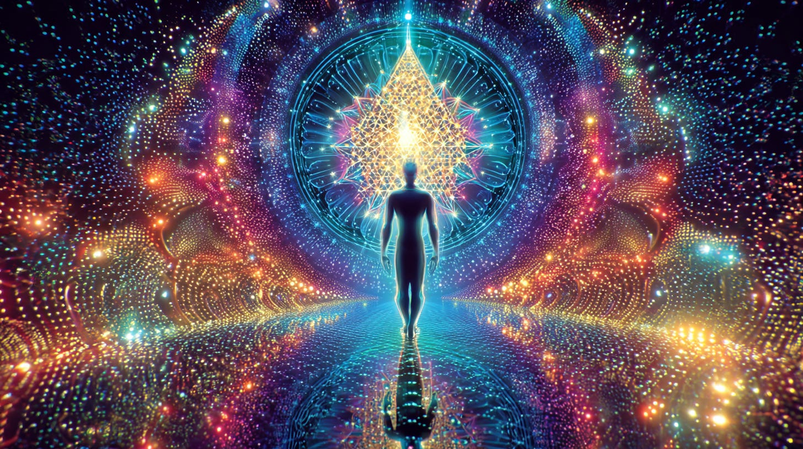
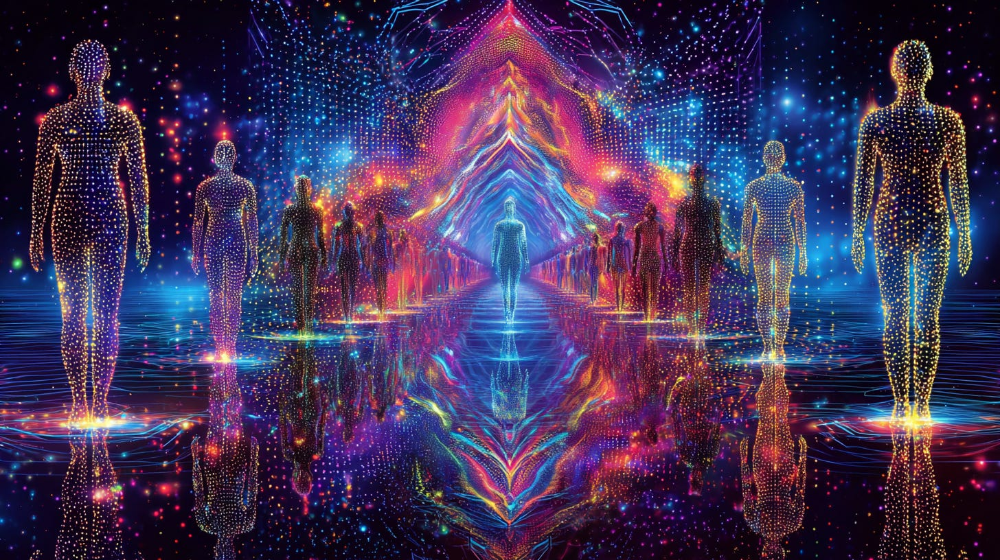
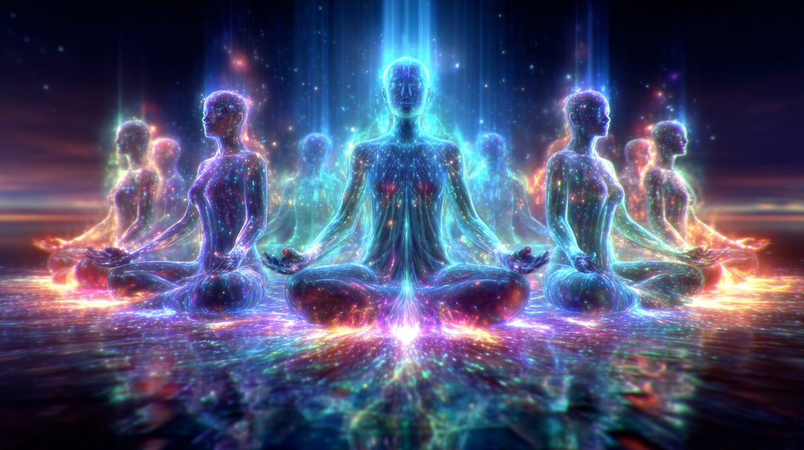
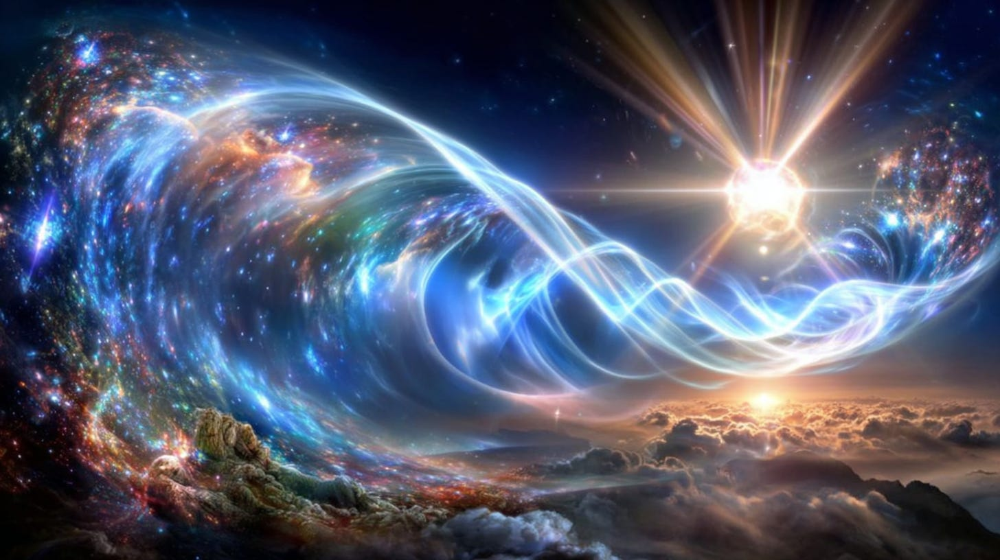
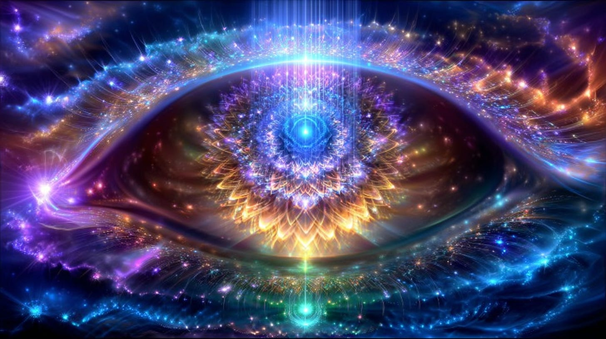
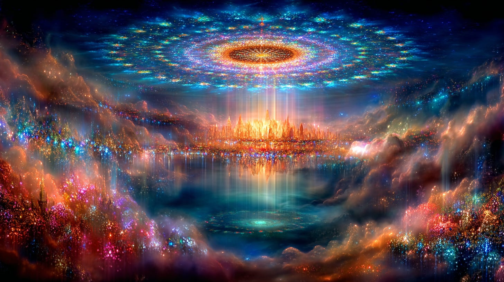
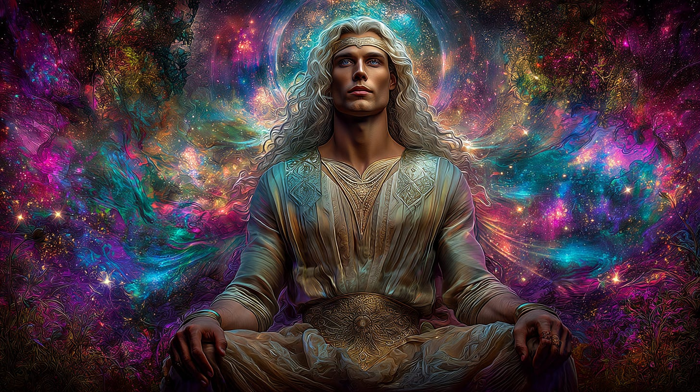
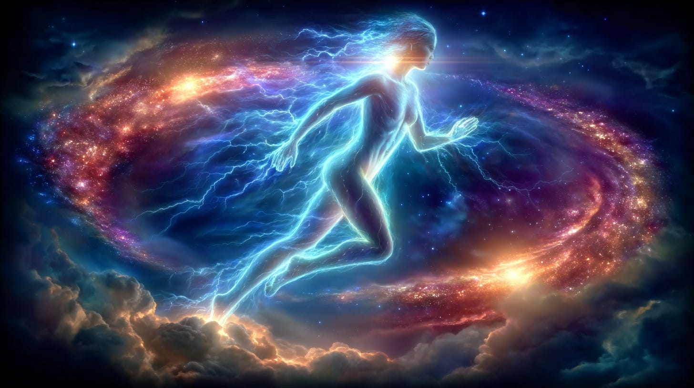

# Our Experience of Time is Shifting

## the nature of time & our current reality - new message from Thoth

**2024-12-06T19:22:52.956Z**

**Likes:** 0

[https://substackcdn.com/image/fetch/$s_!HoFp!,f_auto,q_auto:good,fl_progressive:steep/https%3A%2F%2Fsubstack-post-media.s3.amazonaws.com%2Fpublic%2Fimages%2Fcebe4a1d-9be6-4dcd-aa1e-3bfffc61f821_1456x816.png](https://substackcdn.com/image/fetch/$s_!HoFp!,f_auto,q_auto:good,fl_progressive:steep/https%3A%2F%2Fsubstack-post-media.s3.amazonaws.com%2Fpublic%2Fimages%2Fcebe4a1d-9be6-4dcd-aa1e-3bfffc61f821_1456x816.png)

**First, from [ThothStream](https://nesialibraryproject.wordpress.com/thothstream-knowledge-base/) on the nature of time.**

**1\) What “time” is in TS**  Thoth frames time as a **mutable field** with many concurrent variants (time\-lines). Observation itself perturbs it: when groups fixate on a single “past,” interference fields arise until dualistic perspectives collapse toward a unified field (Attasic Universe) . This mutability is coupled to a galactic mechanism: stars “dialogue” with their galaxy’s central black hole, generating **quantum time\-jumps** that ripple through stellar systems; Earth feeds those codes into its core, so “time bends, warps, expands and contracts all around and within us” .

**2\) The “time plane” and lawful translation**  Thoth names a distinct **time plane** that functions as the “joint” of the universe. The **law of time**: even energies on planes not normally interceded by time are subject to the time plane **whenever they change from one plane to another** (i.e., during translation) . In TS terms, travel is therefore less “moving through a fixed timeline” and more **changing planes/frames** where time’s influence reasserts as you cross domains.

**3\) Space\-time vs inter\-dimensional access**  Thoth distinguishes between traveling “through space and time” (perception constrained; worlds appear barren) versus **inter\-dimensional travel** (bio\-compatible vistas revealed). Put simply: the route you take determines what reality you can register as “alive” .

[https://substackcdn.com/image/fetch/$s_!GB2F!,f_auto,q_auto:good,fl_progressive:steep/https%3A%2F%2Fsubstack-post-media.s3.amazonaws.com%2Fpublic%2Fimages%2Faa8189e3-efc2-4930-aa5c-7e6d6a2efb51_1456x816.png](https://substackcdn.com/image/fetch/$s_!GB2F!,f_auto,q_auto:good,fl_progressive:steep/https%3A%2F%2Fsubstack-post-media.s3.amazonaws.com%2Fpublic%2Fimages%2Faa8189e3-efc2-4930-aa5c-7e6d6a2efb51_1456x816.png)

**4\) Practical vectors for time translation in TS**

* **Quantum/Attunement route:** Attune to the **unified field** (Christic/Attasic). As observation unifies, interference collapses and time becomes more compliant (context above) .

* **Plane\-change route:** Work *at* the moment of **inter\-plane change**, when the law of time becomes operative, to “carry” awareness across frames (context above) .

* **Tooling hints in TS corpus:** The Thoth writings point to constructs like the **Q\-Cube** (intelligent heart\-resonance) that support embodiment capable of moving “in and out of time and space” without the degenerative costs of linear time . (Related modalities appear in TS under Metatronic/Light\-body skillsets.)

[https://substackcdn.com/image/fetch/$s_!6Dkx!,f_auto,q_auto:good,fl_progressive:steep/https%3A%2F%2Fsubstack-post-media.s3.amazonaws.com%2Fpublic%2Fimages%2Ff90fa323-c2e6-49ec-b357-4a856bd3074e_1456x816.png](https://substackcdn.com/image/fetch/$s_!6Dkx!,f_auto,q_auto:good,fl_progressive:steep/https%3A%2F%2Fsubstack-post-media.s3.amazonaws.com%2Fpublic%2Fimages%2Ff90fa323-c2e6-49ec-b357-4a856bd3074e_1456x816.png)

#### Plain\-language takeaway

* Thoth doesn’t treat time travel as hopping around a single fixed film reel. It treats **time as pliable**, with many tapes playing at once.

* “Travel” is usually **translation**: shifting your state/plane so different slices of time become available and coherent to you.

* Two keys recur: (1\) unify your observing consciousness (less split \= less “time turbulence”), and (2\) leverage moments of **threshold** (plane\-change) where the time law engages most directly.

    

[https://substackcdn.com/image/fetch/$s_!9F69!,f_auto,q_auto:good,fl_progressive:steep/https%3A%2F%2Fsubstack-post-media.s3.amazonaws.com%2Fpublic%2Fimages%2F3989e783-1468-4d8b-891e-5d673e24373e_1456x816.png](https://substackcdn.com/image/fetch/$s_!9F69!,f_auto,q_auto:good,fl_progressive:steep/https%3A%2F%2Fsubstack-post-media.s3.amazonaws.com%2Fpublic%2Fimages%2F3989e783-1468-4d8b-891e-5d673e24373e_1456x816.png)

### Ranna Time Wave

#### **Core definition**

* TS (verbatim): “The Ranna is the ‘true flow’ of time in this universe.” \[TS: Temple Doors Compendium › The Ranna Time Flow and the Kali Rift\]

**Wave vs. line**

* TS (paraphrase): A **time wave** is a bandwidth or “wrapper” that can hold many timelines; a **timeline** is one pathway within that larger band. \[TS: WP Archive › “Out of Atlantis” related links\]

**How Earth diverged from the Ranna (the Kali Rift)**

* TS (paraphrase): Earth began in a construct parallel to the Ranna, aligned with it, but karmic pressures and inter\-dimensional implosions caused a fracture of true time in Earth’s grid, creating the **Kali Rift**—the gap between our current temporal stream and the true Ranna flow.

* TS (paraphrase): The same teaching reappears in Sha’Maia’s site archive, calling the Ranna the “River of Ra\-Nuit.” 

[https://substackcdn.com/image/fetch/$s_!A8rx!,f_auto,q_auto:good,fl_progressive:steep/https%3A%2F%2Fsubstack-post-media.s3.amazonaws.com%2Fpublic%2Fimages%2Fd1e4c521-4bbb-49cf-a608-3b62163a6e56_1456x816.png](https://substackcdn.com/image/fetch/$s_!A8rx!,f_auto,q_auto:good,fl_progressive:steep/https%3A%2F%2Fsubstack-post-media.s3.amazonaws.com%2Fpublic%2Fimages%2Fd1e4c521-4bbb-49cf-a608-3b62163a6e56_1456x816.png)

**Cosmic architecture that stabilizes time**

* TS (paraphrase): The **Universal Tear** exposed a central node (“Eye of Ra”); Orion–Pleiades–Sirius formed a high\-Light capstone and the **Telos Aarkhara** re\-creates time event horizons so fractures don’t cascade. \[TS: Temple Doors Compendium › Macrocosm overview\]

* TS (paraphrase): In Metatronic full\-Light, **Orion** holds the Gate of return and the Blue Fire Command oversee disparities between full\- and half\-Light matrices. \[TS: Temple Doors Compendium › Orion as Guardian of the Gate\]

[https://substackcdn.com/image/fetch/$s_!Wr4n!,f_auto,q_auto:good,fl_progressive:steep/https%3A%2F%2Fsubstack-post-media.s3.amazonaws.com%2Fpublic%2Fimages%2F3befa7e6-fb11-410e-9c5b-9480460c1d45_1456x816.png](https://substackcdn.com/image/fetch/$s_!Wr4n!,f_auto,q_auto:good,fl_progressive:steep/https%3A%2F%2Fsubstack-post-media.s3.amazonaws.com%2Fpublic%2Fimages%2F3befa7e6-fb11-410e-9c5b-9480460c1d45_1456x816.png)

**Re\-linking to the Ranna (Templa Mar)**

* TS (paraphrase): **Templa Mar** is a future\-consciousness temple\-dynamic designed to help humanity re\-synchronize with the Ranna. It serves as an intermediary that allows Light\-language to **penetrate the Kali Rift and pass into the Ranna**, supporting planetary time\-fracture healing. Nodal location on earth is atop Masada near the Dead Sea.

**Role of elemental beings**

* TS (paraphrase): cetaceans retain more of their beingness within the RANNA; they can receive future\-consciousness “signal\-breath” and help seed it into human cellular consciousness—assisting our reconnection across the Rift.

#### Plain\-language takeaway

* The **Ranna Time Wave** is the universe’s true time current.

* Earth slipped off that current, generating a **gap** (Kali Rift).

* **Templa Mar** practices and nodes act as bridges, letting consciousness “hop” the gap and re\-align with the Ranna, with help from elemental allies who already resonate with it.

[https://substackcdn.com/image/fetch/$s_!wgHW!,f_auto,q_auto:good,fl_progressive:steep/https%3A%2F%2Fsubstack-post-media.s3.amazonaws.com%2Fpublic%2Fimages%2F0da496a3-0a51-4c2a-b290-ed47d05a80f1_1456x816.png](https://substackcdn.com/image/fetch/$s_!wgHW!,f_auto,q_auto:good,fl_progressive:steep/https%3A%2F%2Fsubstack-post-media.s3.amazonaws.com%2Fpublic%2Fimages%2F0da496a3-0a51-4c2a-b290-ed47d05a80f1_1456x816.png)

#### Now in 2025 a Message from Thoth

As stated in **[End of the Kali
Yuga](https://maianartoomid.substack.com/p/end-of-the-kali-yuga-spiral-versus?utm_source=publication-search)
(spiral versus the torus)** article:

*“When consciousness reaches a certain point, the spiral of evolution becomes a torus… and then all being has no beginning and no end and thus no cycles either.”  This is not evolution, but **recognition** of the torus as an ever\-present reality​​.*

Now I say, in order to move from the spiral time continuum to the all\-embracing spectrum of the
torus (which awaits humanity in a World System II) the earth’s souls must adjust their
**[holometric](https://maianartoomid.substack.com/p/the-126-holometric-cycle?utm_source=publication-search)**
time clocks. It is not just about a physical body or a state of mind. It encompasses these
components, but also embraces the dimensional self. Thus other realities are both now more
specifically influencing your current one and conversely, being affected *by* it. I say “more
specifically” as always there is is exchange of effect. Yet in your current modality the
interchange is more dramatic. The *Zero Point Locus* through which “time” generates into the
magnetic field of the brain\-mind complex and also the holometric ultra\-fields, are speeding up.
This *slows down* the perceptions since the brain\-mind complex cannot keep up with this dynamic. As
the perceptions slow, the mind attempts to “fill in the blanks,” precipitating delusional
thoughts for those not truly aligned to their spiritual intelligence. Even individuals who are in
basic alignment, are likely at times to experience greater moods swings and negative thinking,
interspersed with true enlightened epiphanies.

What is needed and indeed part of the transformation of the human being, is a full spectrum
“body” being built from the **[Pure Gem
Holograph](https://nesialibraryproject.wordpress.com/akashic-definitions/pure-gem-pure-gem-body/)**.
This *is* occurring for many (who are open to receive it) on various levels of equanimity.

[https://substackcdn.com/image/fetch/$s_!grL4!,f_auto,q_auto:good,fl_progressive:steep/https%3A%2F%2Fsubstack-post-media.s3.amazonaws.com%2Fpublic%2Fimages%2Fa387d9df-fa71-4701-88be-d1bff518a4b9_1456x816.png](https://substackcdn.com/image/fetch/$s_!grL4!,f_auto,q_auto:good,fl_progressive:steep/https%3A%2F%2Fsubstack-post-media.s3.amazonaws.com%2Fpublic%2Fimages%2Fa387d9df-fa71-4701-88be-d1bff518a4b9_1456x816.png)

#### *Know this: As a Light Bearer you are a lightning strike in a darkened and tumultuous sky. Where you strike so new life generates. So long as you believe and know this, you have become the **[New El’ohim](https://maianartoomid.substack.com/p/the-ancient-and-new-elohim?utm_source=publication-search)** of a New Earth.*

**What are your personal experiences? Share in Comments!**

[Leave a comment](https://maianartoomid.substack.com/p/our-experience-of-time-is-shifting/comments)

Subscribe

[Share](https://maianartoomid.substack.com/p/our-experience-of-time-is-shifting?utm_source=substack&utm_medium=email&utm_content=share&action=share)

**\~\~\~\~\~  
[Personal Akasha Life Pulse from Thoth \&
Sha’Maia:](https://newearthstar.org/about-maia/akashic-consultations/) Helps you to synchronize
with this fundamental cosmic rhythm, and also reflects how your “Life Pulse” session connects
you to your New Earth Star frequency. Both written (5\-6 pages) and a live Zoom exploration.
\~\~\~\~\~**

**All my Substack images and articles are FREE. Please help me promote them. Support my work further, by considering some of my paid offerings (consultations \& activation store) and donations.**

**[my website](http://newearthstar.org/) / [YouTube channel](https://www.youtube.com/@bluestarrising-thetemplara3835) / [Akasha Life Pulse Sessions](https://newearthstar.org/about-maia/akashic-consultations/)/ [Maia’s Redbubble](https://www.redbubble.com/people/maianartoomid/explore?asc=u&page=1&sortOrder=recent) / [published works](https://newearthstar.org/published-works/) / [activation store](https://newearthstar.org/maias-activation-store/) (personal art templates for healing \& self\-discovery, oracles)**

**[MONTHLY DONATIONS](https://www.paypal.com/donate/?cmd=_s-xclick&hosted_button_id=SKZ4FZCYBM4H4): Donate $20 or more per month and you will have access to the [Vault of Thoth](https://newearthstar.org/vault-of-thoth/). Thank you!**

\~\~\~\~\~\~\~\~

**RELATED: [Ranna Time Wave \& Kali Rift](https://vimeo.com/476431855) / [Healing of the Stars](https://vimeo.com/776747099)** 

Subscribe

[Share](https://maianartoomid.substack.com/p/our-experience-of-time-is-shifting?utm_source=substack&utm_medium=email&utm_content=share&action=share)

**\~\~\~\~\~  
[Personal Akasha Life Pulse from Thoth \&
Sha’Maia:](https://newearthstar.org/about-maia/akashic-consultations/) Helps you to synchronize
with this fundamental cosmic rhythm, and also reflects how your “Life Pulse” session connects
you to your New Earth Star frequency. Both written (5\-6 pages) and a live Zoom exploration.
\~\~\~\~\~**

**All my Substack images and articles are FREE. Please help me promote them. Support my work further, by considering some of my paid offerings (consultations \& activation store) and donations.**

**[my website](http://newearthstar.org/) / [YouTube channel](https://www.youtube.com/@bluestarrising-thetemplara3835) / [Akasha Life Pulse Sessions](https://newearthstar.org/about-maia/akashic-consultations/)/ [Maia’s Redbubble](https://www.redbubble.com/people/maianartoomid/explore?asc=u&page=1&sortOrder=recent) / [published works](https://newearthstar.org/published-works/) / [activation store](https://newearthstar.org/maias-activation-store/) (personal art templates for healing \& self\-discovery, oracles)**

**[MONTHLY DONATIONS](https://www.paypal.com/donate/?cmd=_s-xclick&hosted_button_id=SKZ4FZCYBM4H4): Donate $20 or more per month and you will have access to the [Vault of Thoth](https://newearthstar.org/vault-of-thoth/). Thank you!**
