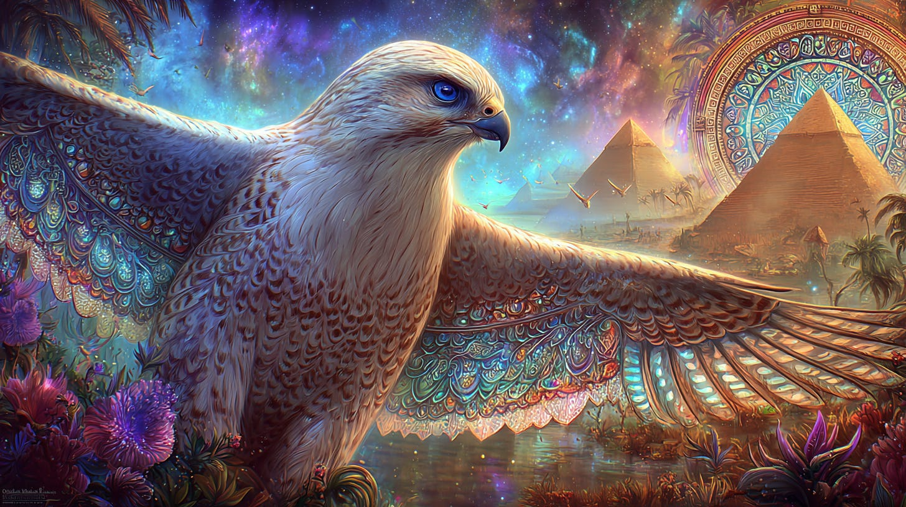
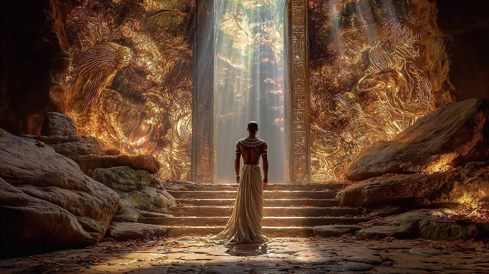
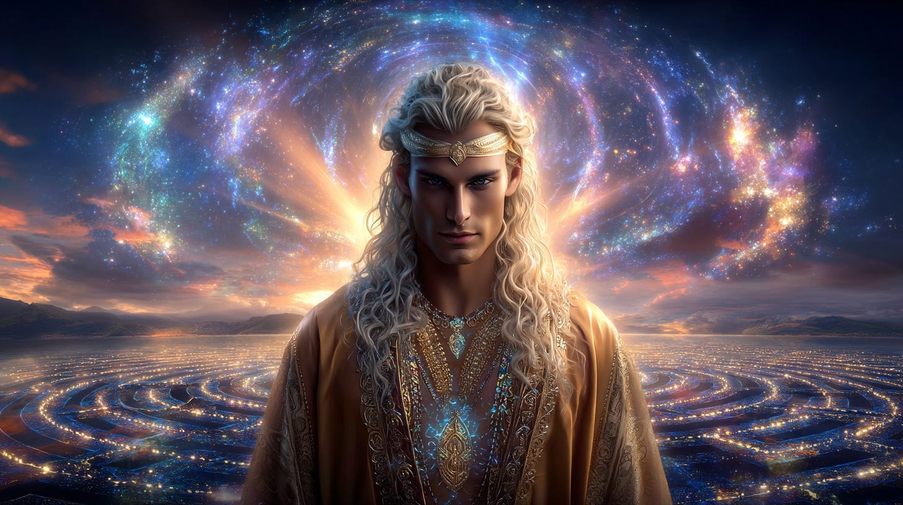
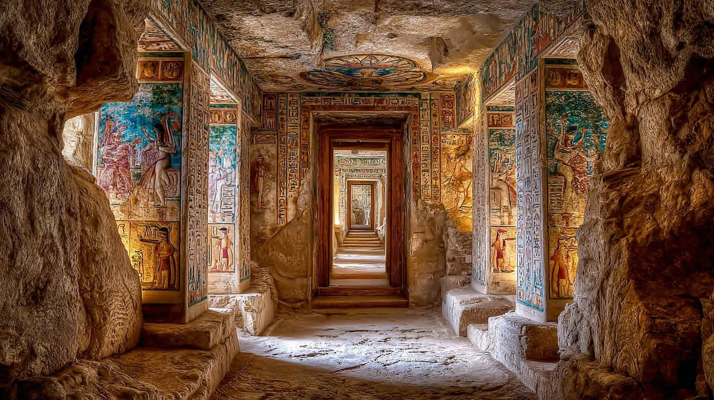
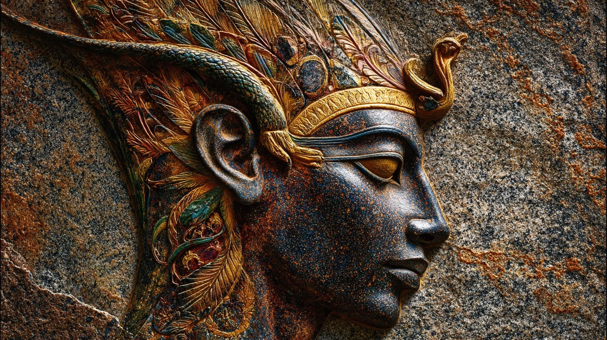
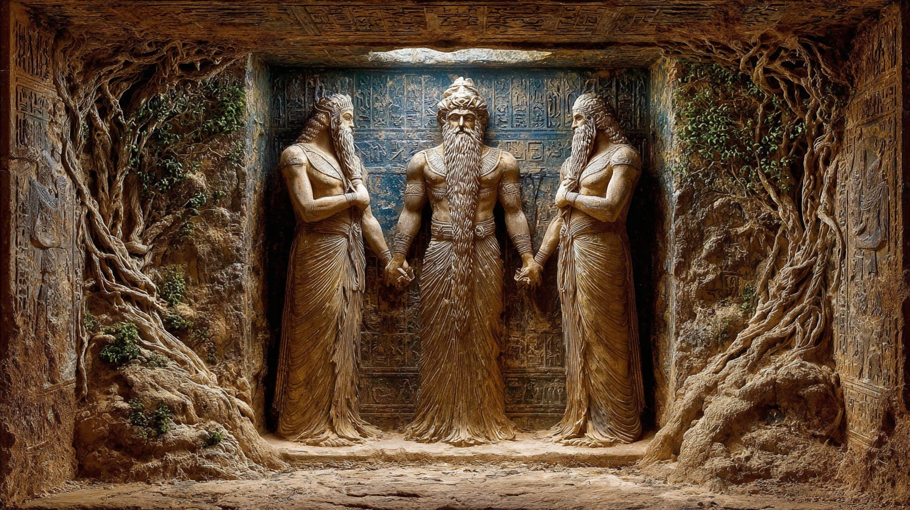
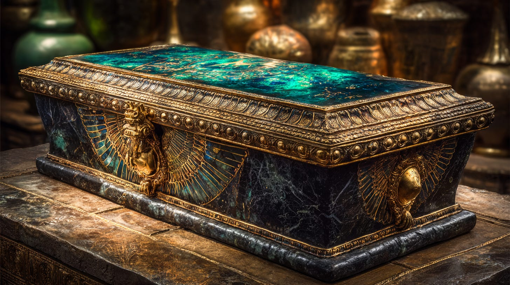
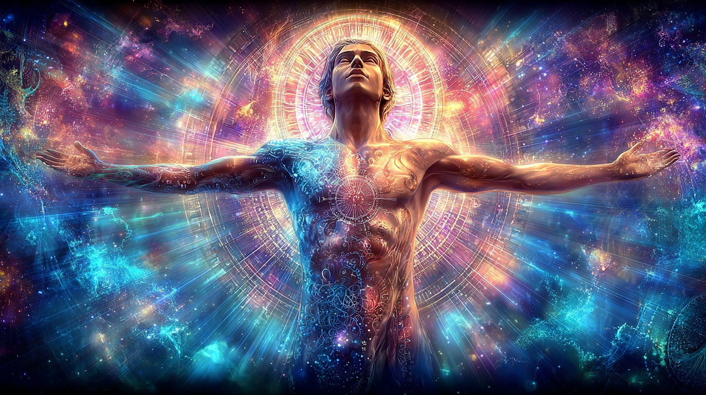
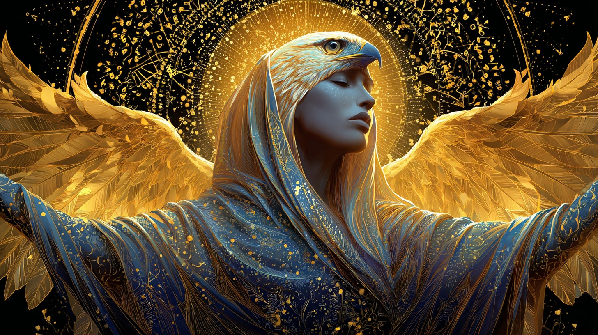

# Loosing the Hawk

## inside the Vault of Osiris

**2024-12-06T19:22:52.956Z**

**Likes:** 0

[https://substackcdn.com/image/fetch/$s_!Jxgf!,f_auto,q_auto:good,fl_progressive:steep/https%3A%2F%2Fsubstack-post-media.s3.amazonaws.com%2Fpublic%2Fimages%2Fdd6ab8b9-30be-491b-8b2c-1f7732f791b5_1456x816.png](https://substackcdn.com/image/fetch/$s_!Jxgf!,f_auto,q_auto:good,fl_progressive:steep/https%3A%2F%2Fsubstack-post-media.s3.amazonaws.com%2Fpublic%2Fimages%2Fdd6ab8b9-30be-491b-8b2c-1f7732f791b5_1456x816.png)

**From Thoth Transmissions in the 1990’s**

In **[The Orion
Mystery](https://www.amazon.com/Orion-Mystery-Unlocking-Secrets-Pyramids/dp/0517884542/ref=sr_1_1?crid=3U6D3S3YM4R7V&dib=eyJ2IjoiMSJ9.9XaJCCHG88zPkZzNYID1MlwI43JhRRAbj1dCfsZfoNc7P0lj81KdmTj7vaXXN9ILSG5zlBVhxa2IOsvBIXNEH64Ks5O_P1AYdD4auq-bp1a_gjgdc-JAGT2hX5cGP0yzYKQBjoz48jpRfKNLw7dInNdDilL_c6kDCtRf_envf5rKXJGXX3Hqg7P5SiHrrSGa8XxLAXwQY9k3t1KUZxw_-BKmaXgcm9Ikh8Iv2DbiD2c.ADUe9-pDlOTkhQLR85uy-e4eaLGJ4BMd6FhG7JTEc24&dib_tag=se&keywords=Orion+Mystery&qid=1762192081&s=books&sprefix=orion+mystery%2Cstripbooks%2C236&sr=1-1),**
by Robert Bauval and Adrian Gilbert, they tell an ancient Egyptian story concerning King Kufu, of
the Fourth Dynasty. This King very much wishes to find out the “number of the secret chambers of
Thoth,” and thus summons an old priest whom he supposes may tell him. The priest tells Kufu that
he does not know the number, but does know where there is a chest which contains this information.
It is housed he states, in a building called ‘the inventory\* at Heliopolis. The priest continues,
saying that he cannot get it, and neither can the King; “that only three as yet unborn Kings in
the womb of a priestess of Heliopolis will have that privilege.”

It is assumed by the authors of The Orion Mystery (and perhaps others), that Kufu needed this
information to build his tomb, which was the Great Pyramid. Since we know that the Great Pyramid was
built long before Kufu, I inquired of Thoth what was the true reason Kufu wished this information,
and just what are the “secret chambers of Thoth,” where are they located, and what is their
number? He replied:

[https://substackcdn.com/image/fetch/$s_!OgMT!,f_auto,q_auto:good,fl_progressive:steep/https%3A%2F%2Fsubstack-post-media.s3.amazonaws.com%2Fpublic%2Fimages%2F4f1f1de6-dbd8-4819-ad2b-15618c47198a_1456x816.png](https://substackcdn.com/image/fetch/$s_!OgMT!,f_auto,q_auto:good,fl_progressive:steep/https%3A%2F%2Fsubstack-post-media.s3.amazonaws.com%2Fpublic%2Fimages%2F4f1f1de6-dbd8-4819-ad2b-15618c47198a_1456x816.png)

**Thoth:** Kufu planned to re\-construct the badly damaged Temple of the Lion and claim it as his own Horizon, *which he succeeded in doing to a certain extent, through initiation into the spiritual process*. It was never intended as his tomb, but a place for ascension into Heaven.

\[It should be noted that the sarcophagus within the King’s Chamber had similar dynamics to the
one in the Vault of Osiris, yet it lacked the full Light program of the latter. Kufu managed to use
the sarcophagus in the King’s Chamber for certain aspects of his spiritual journey. He never
located the Vault of Osiris.

The damage to the Great Pyramid, while extensive in the outer chambers, did not penetrate into the
inner reaches, which were hidden from all but the initiated, and there were few such initiated in
the age of Kufu. Those that were ongoing priests and priestess of this sacred Temple conducted their
sacred work arcanely, for the King was no longer an initiate, as he had been in ages past (other
than Kufu). The new rulers were for the most part vainglorious men, who sought to emulate a Golden
Race whom they knew not, they were lesser Kings living in the shadow of their own mortality. They
did not possess the knowledge of *akbet\-tyi\-techet*, meaning *loosing the hawk*, allowing the body
to become a vehicle of illumination that it may ascend with the soul.

[https://substackcdn.com/image/fetch/$s_!M42T!,f_auto,q_auto:good,fl_progressive:steep/https%3A%2F%2Fsubstack-post-media.s3.amazonaws.com%2Fpublic%2Fimages%2F4f6355fd-2ffa-46b4-ad96-5dcffe3dbfc1_1456x816.png](https://substackcdn.com/image/fetch/$s_!M42T!,f_auto,q_auto:good,fl_progressive:steep/https%3A%2F%2Fsubstack-post-media.s3.amazonaws.com%2Fpublic%2Fimages%2F4f6355fd-2ffa-46b4-ad96-5dcffe3dbfc1_1456x816.png)

The Great Pyramid had been partially destroyed by the corruption of the Amun priesthood, a story
upon which we will not linger in this transmission, other than to say that this was when the
alchemical glass capstone on the Pyramid was shattered, but not before the templates which operated
the capstone were taken into the Earth. These templates, along with other sacred tools and
knowledge, are within the Secret Chambers of Thoth. These chambers are not the Hall of Records or
the inner Repository. The Chambers of Thoth are *a labyrinth which creates a symmetry with heavens.*
The passages themselves are knowledge unveiled that only the most wise may penetrate.

[https://substackcdn.com/image/fetch/$s_!3a2s!,f_auto,q_auto:good,fl_progressive:steep/https%3A%2F%2Fsubstack-post-media.s3.amazonaws.com%2Fpublic%2Fimages%2Fa7b7192f-4f08-41b2-b180-2afe3eb98d50_1456x816.png](https://substackcdn.com/image/fetch/$s_!3a2s!,f_auto,q_auto:good,fl_progressive:steep/https%3A%2F%2Fsubstack-post-media.s3.amazonaws.com%2Fpublic%2Fimages%2Fa7b7192f-4f08-41b2-b180-2afe3eb98d50_1456x816.png)

Kufu desired access to these chambers in order to secure the templates of the old capstone, so that
he may create it anew. He also wished to possess the original blueprints of the construction of the
Temple, but more so his intent was on ‘knowing their number\*, for then he would possess the
hidden gematria, the sacred mathematics of the Temple that cannot be deduced by measuring the
revealed parts of the structure alone. For this reason we do not set forth to you these numbers.

[https://substackcdn.com/image/fetch/$s_!_OLS!,f_auto,q_auto:good,fl_progressive:steep/https%3A%2F%2Fsubstack-post-media.s3.amazonaws.com%2Fpublic%2Fimages%2Ff5bf65ac-6a52-49b9-9c9f-f19281f90c29_1456x816.png](https://substackcdn.com/image/fetch/$s_!_OLS!,f_auto,q_auto:good,fl_progressive:steep/https%3A%2F%2Fsubstack-post-media.s3.amazonaws.com%2Fpublic%2Fimages%2Ff5bf65ac-6a52-49b9-9c9f-f19281f90c29_1456x816.png)

It is not yet the time for the gematria of the Temple’s Holy of Holies to be given unto the world.
The Chambers of Thoth lead to the Vault of Osiris. An initiate must traverse the labyrinth before he
or she may enter the Vault.

The Vault of Osiris is a device which allows the initiate to enter his / her soul into the star
transfigurations and *loose the hawk* on a flight of immortality beyond the veil of our half\-Light
world. The false latter day Kings of Egypt sought this knowledge and the sacred Vault in vain. Yet
it awaits initiates of a future age, perhaps very close upon our horizon.

[https://substackcdn.com/image/fetch/$s_!w5AG!,f_auto,q_auto:good,fl_progressive:steep/https%3A%2F%2Fsubstack-post-media.s3.amazonaws.com%2Fpublic%2Fimages%2Fe86227fe-a837-41b3-ac8f-0549b0860c9f_1456x816.png](https://substackcdn.com/image/fetch/$s_!w5AG!,f_auto,q_auto:good,fl_progressive:steep/https%3A%2F%2Fsubstack-post-media.s3.amazonaws.com%2Fpublic%2Fimages%2Fe86227fe-a837-41b3-ac8f-0549b0860c9f_1456x816.png)

**Three Kings**

The three kings represent three guardian beings of the Temple of the Risen One. They incarnate in
various time frames throughout the ages, but always as the Three. They were the ‘three Chiefs\* of
the Mazur, but this was long before Kufu. These Three do not always become Kings or Chiefs, although
they are often referred to by those who know them as persons of inherent royalty.

[https://substackcdn.com/image/fetch/$s_!KTYN!,f_auto,q_auto:good,fl_progressive:steep/https%3A%2F%2Fsubstack-post-media.s3.amazonaws.com%2Fpublic%2Fimages%2F430f819f-aee5-4b12-997a-f32b6b4b76d9_1456x816.png](https://substackcdn.com/image/fetch/$s_!KTYN!,f_auto,q_auto:good,fl_progressive:steep/https%3A%2F%2Fsubstack-post-media.s3.amazonaws.com%2Fpublic%2Fimages%2F430f819f-aee5-4b12-997a-f32b6b4b76d9_1456x816.png)

**A Suggested Meditation For Working With the Vault of Osiris**

Visualize a chamber underneath the Great Pyramid / Temple of the Risen One. Within is a large
tomblike vault (sarcophagus) made of a polished black stone. This stone was brought up from deep in
the Earth by Tubal\-Cain. The lid of the vault is (a version of) the Emerald Table of Thoth, which
is a polished and engraved piece of the Alpha Centauri meteor known as the Lapis Exlis.

[https://substackcdn.com/image/fetch/$s_!ROnF!,f_auto,q_auto:good,fl_progressive:steep/https%3A%2F%2Fsubstack-post-media.s3.amazonaws.com%2Fpublic%2Fimages%2F67acb1b0-c5f2-47f8-9549-5d672d1e56fc_1456x816.png](https://substackcdn.com/image/fetch/$s_!ROnF!,f_auto,q_auto:good,fl_progressive:steep/https%3A%2F%2Fsubstack-post-media.s3.amazonaws.com%2Fpublic%2Fimages%2F67acb1b0-c5f2-47f8-9549-5d672d1e56fc_1456x816.png)

Place yourself inside the vault with the lid closed. There is no need to be concerned, for there are
air vents opening along the floor of the vault. You will see stars, and other beautiful things. Know
that this vault is aligned perfectly to the shafts in the pyramid above which lead to the heavenly
Vault of Osiris / Orion. Allow your mind and body to relax and focus on the clear passage of
ascendence into the starry field of Orion above you.

[https://substackcdn.com/image/fetch/$s_!7zRV!,f_auto,q_auto:good,fl_progressive:steep/https%3A%2F%2Fsubstack-post-media.s3.amazonaws.com%2Fpublic%2Fimages%2F3082dc7d-28eb-4a7f-b5dc-ed317db5b330_1456x816.png](https://substackcdn.com/image/fetch/$s_!7zRV!,f_auto,q_auto:good,fl_progressive:steep/https%3A%2F%2Fsubstack-post-media.s3.amazonaws.com%2Fpublic%2Fimages%2F3082dc7d-28eb-4a7f-b5dc-ed317db5b330_1456x816.png)

Feel yourself floating up through the Emerald Table of Thoth, being imprinted with its divine signs
and symbols of transmutation. You are moving up the shafts in the temple above, and as you do this,
so you become a single beam of light moving through the body of a great being, the Risen One. Once
into the sky, you soar into the sacred Vault of Osiris in the constellation of Orion.

[https://substackcdn.com/image/fetch/$s_!MHrX!,f_auto,q_auto:good,fl_progressive:steep/https%3A%2F%2Fsubstack-post-media.s3.amazonaws.com%2Fpublic%2Fimages%2Faba95de9-bf58-4071-b98f-4d7da4291f29_1456x816.png](https://substackcdn.com/image/fetch/$s_!MHrX!,f_auto,q_auto:good,fl_progressive:steep/https%3A%2F%2Fsubstack-post-media.s3.amazonaws.com%2Fpublic%2Fimages%2Faba95de9-bf58-4071-b98f-4d7da4291f29_1456x816.png)

You become a star penetrating the black void of the Vault. Once within, you stir the cosmos with
your Light, and bring forth a quickening inside the vast space. From this awakening, a burning seed
is engendered in the ethers. It grows bright with promise and shines down upon the Earth as a
brilliant new star in the sky, pouring grace and renewal into all reaches of the planet.

Subscribe

[Share](https://maianartoomid.substack.com/p/loosing-the-hawk?utm_source=substack&utm_medium=email&utm_content=share&action=share)

**\~\~\~\~\~  
[Personal Akasha Life Pulse from Thoth \&
Sha’Maia:](https://newearthstar.org/about-maia/akashic-consultations/) Helps you to synchronize
with this fundamental cosmic rhythm, and also reflects how your “Life Pulse” session connects
you to your New Earth Star frequency. Both written (5\-6 pages) and a live Zoom exploration.
\~\~\~\~\~**

**All my Substack images and articles are FREE. Please help me promote them. Support my work further, by considering some of my paid offerings (consultations \& activation store) and donations.**

**[my website](http://newearthstar.org/) / [YouTube channel](https://www.youtube.com/@bluestarrising-thetemplara3835) / [Akasha Life Pulse Sessions](https://newearthstar.org/about-maia/akashic-consultations/)/ [Maia’s Redbubble](https://www.redbubble.com/people/maianartoomid/explore?asc=u&page=1&sortOrder=recent) / [published works](https://newearthstar.org/published-works/) / [activation store](https://newearthstar.org/maias-activation-store/) (personal art templates for healing \& self\-discovery, oracles)**

**[MONTHLY DONATIONS](https://www.paypal.com/donate/?cmd=_s-xclick&hosted_button_id=SKZ4FZCYBM4H4): Donate $20 or more per month and you will have access to the [Vault of Thoth](https://newearthstar.org/vault-of-thoth/). Thank you!**
