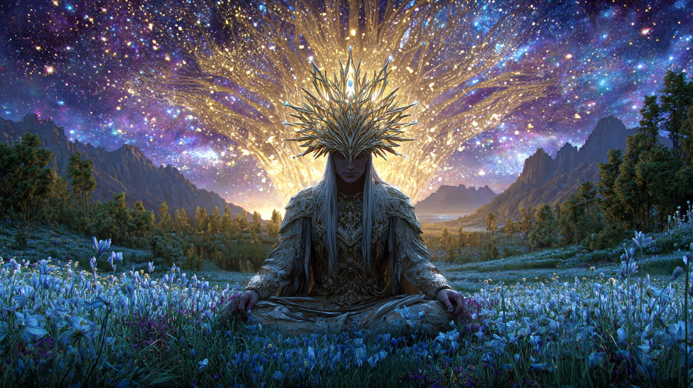
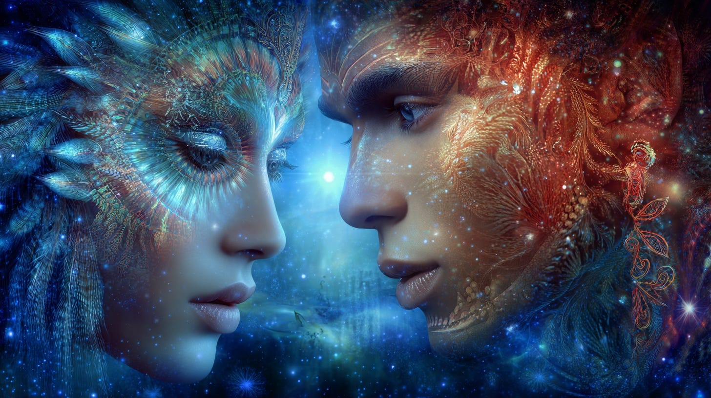
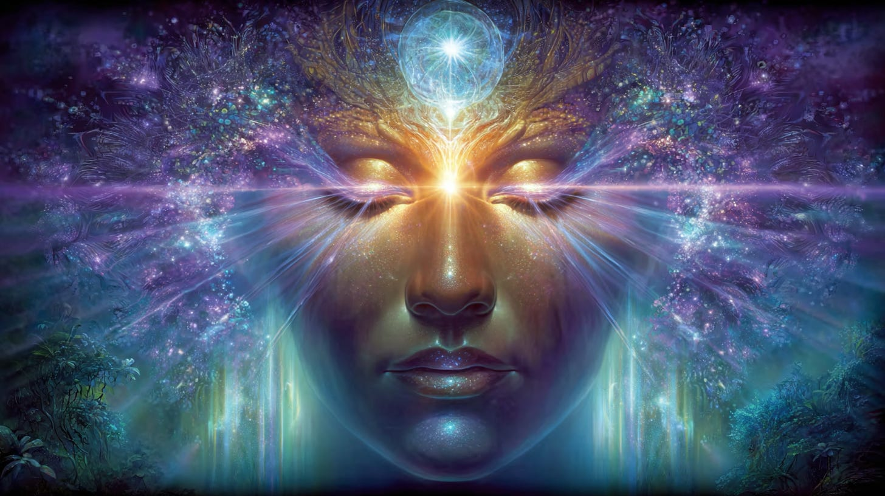
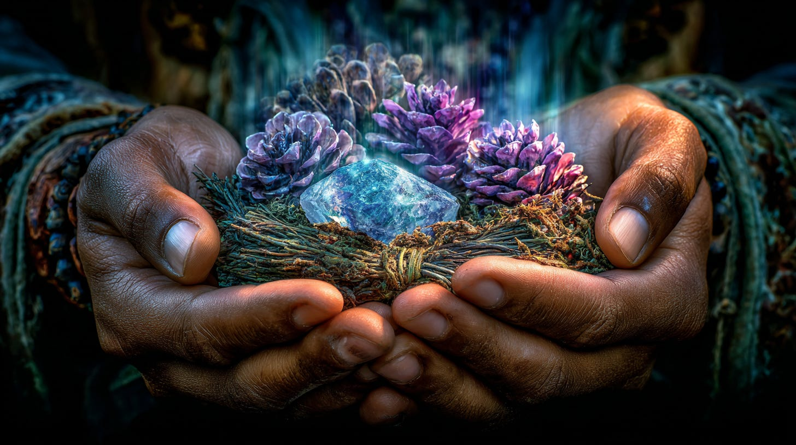
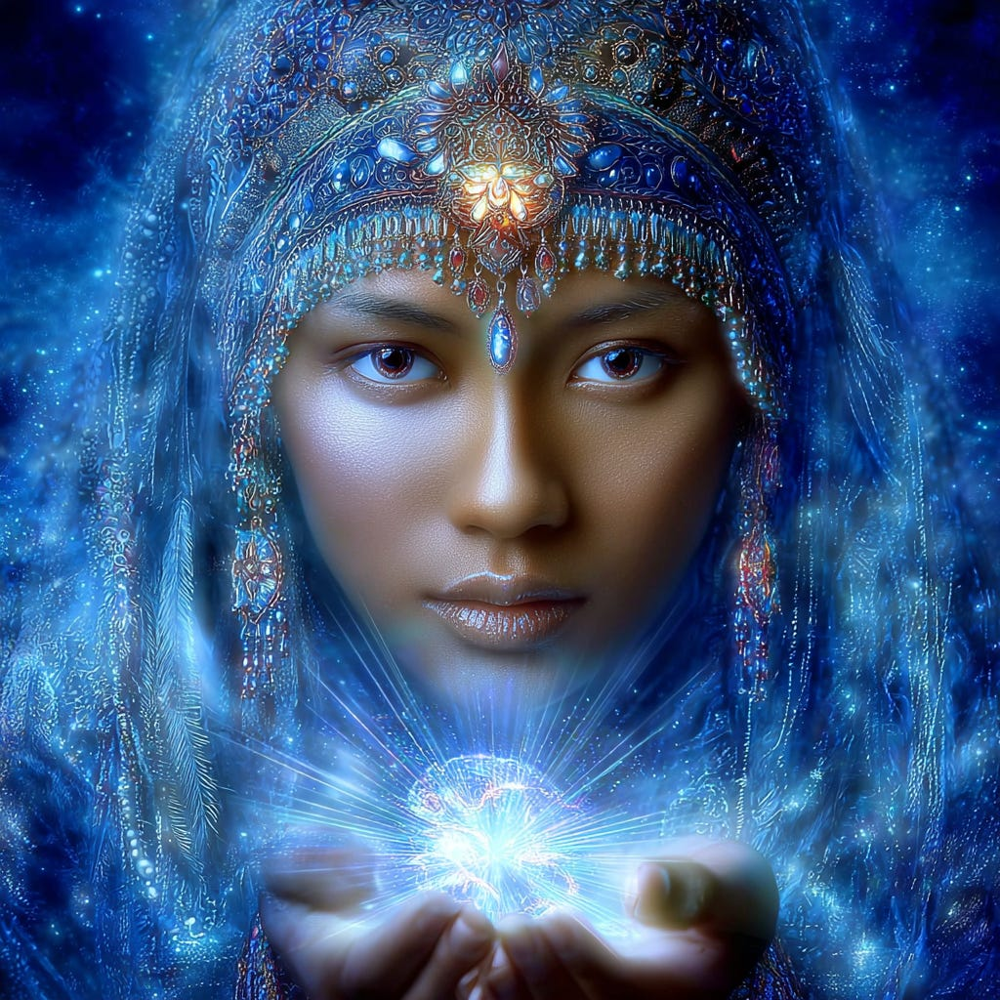
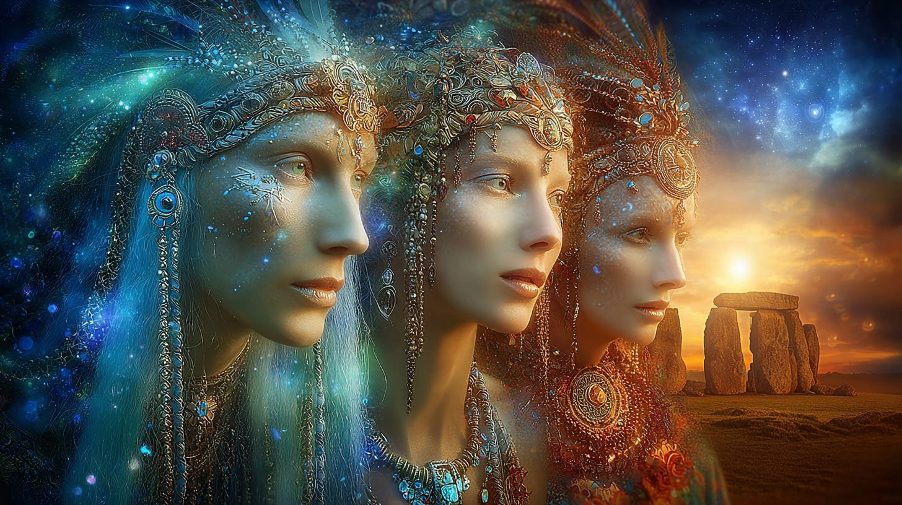
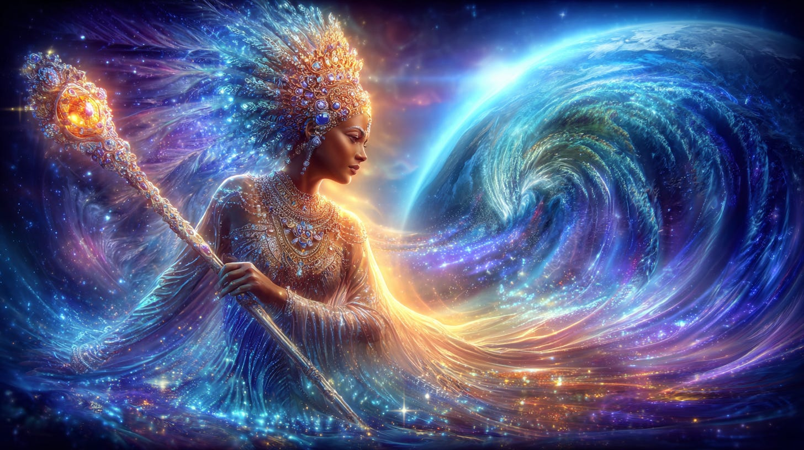

# The Ancestral Light Within

## Guardians of Our Return

**2024-12-06T19:22:52.956Z**

**Likes:** 0

[https://substackcdn.com/image/fetch/$s_!eW4F!,f_auto,q_auto:good,fl_progressive:steep/https%3A%2F%2Fsubstack-post-media.s3.amazonaws.com%2Fpublic%2Fimages%2F394b4935-f431-4599-99fd-9d5cfc1b6173_1456x816.png](https://substackcdn.com/image/fetch/$s_!eW4F!,f_auto,q_auto:good,fl_progressive:steep/https%3A%2F%2Fsubstack-post-media.s3.amazonaws.com%2Fpublic%2Fimages%2F394b4935-f431-4599-99fd-9d5cfc1b6173_1456x816.png)

**my article circa 2010**

The “Ancestral Light” is the spiritual intelligence which has accumulated in your cells and DNA.
While it is built upon preceding generations who have contributed to your gene pool, it is also
inter\-dimensional in nature, flowing into your crystalline DNA structure from other dimensions
which your soul is experiencing, including “past/present/future” incarnations of the soul.

[https://substackcdn.com/image/fetch/$s_!8XMc!,f_auto,q_auto:good,fl_progressive:steep/https%3A%2F%2Fsubstack-post-media.s3.amazonaws.com%2Fpublic%2Fimages%2Ff70422e7-f09a-4687-a8f4-313fa562b2e8_1456x816.png](https://substackcdn.com/image/fetch/$s_!8XMc!,f_auto,q_auto:good,fl_progressive:steep/https%3A%2F%2Fsubstack-post-media.s3.amazonaws.com%2Fpublic%2Fimages%2Ff70422e7-f09a-4687-a8f4-313fa562b2e8_1456x816.png)

To incarnate is to take within those aspects of your soul self that are existing in many different
magnetic zones which you identify as “time,” as well as those that you do not qualify, as they
are beyond your recognition and therefore reasoning. These all transmit to you an ancestral light or
spirit awareness and universal intelligence. For the most part, humanity experiences consciously
only a small part of this awareness, as there is so much “noise” going on in our minds.

[https://substackcdn.com/image/fetch/$s_!IhA_!,f_auto,q_auto:good,fl_progressive:steep/https%3A%2F%2Fsubstack-post-media.s3.amazonaws.com%2Fpublic%2Fimages%2F029618e7-2140-40d3-8436-2774fe90e86b_1456x816.png](https://substackcdn.com/image/fetch/$s_!IhA_!,f_auto,q_auto:good,fl_progressive:steep/https%3A%2F%2Fsubstack-post-media.s3.amazonaws.com%2Fpublic%2Fimages%2F029618e7-2140-40d3-8436-2774fe90e86b_1456x816.png)

To awaken ancestral light is to fill the cup of PRESENCE. It is being present with yourself in the
moment of experiencing nature: your natural being and the nature of the earth as an extension of
that being. The PRESENCE filters out all un\-useful programs of our past, the inclinations of which
have been handed on to us from our “ancestors,” which are not just our familial family tree, but
the holistic Tree of Light extending out into all the energy relationships formed by our soul and
streaming from that Tree into our DNA.

[https://substackcdn.com/image/fetch/$s_!Jqn_!,f_auto,q_auto:good,fl_progressive:steep/https%3A%2F%2Fsubstack-post-media.s3.amazonaws.com%2Fpublic%2Fimages%2F2b65f8d7-88f3-4fea-9e9e-9cdb6db32ff6_1456x816.png](https://substackcdn.com/image/fetch/$s_!Jqn_!,f_auto,q_auto:good,fl_progressive:steep/https%3A%2F%2Fsubstack-post-media.s3.amazonaws.com%2Fpublic%2Fimages%2F2b65f8d7-88f3-4fea-9e9e-9cdb6db32ff6_1456x816.png)

Bound into the sacred bundle of our souls are many gifts which are precious to us. These are tokens
that represent the enduring JOY of our spiritual life. Sometimes we confuse the tokens for the true
expression; but if these tokens are seen for what they are—simply reminders of deeper streams in
the soul–then they become useful, as sparkles of sunlight upon the water highlighting our
existence. They enchant and move us to look below the surface.

[https://substackcdn.com/image/fetch/$s_!d1Zi!,f_auto,q_auto:good,fl_progressive:steep/https%3A%2F%2Fsubstack-post-media.s3.amazonaws.com%2Fpublic%2Fimages%2F62ab8f80-6566-470f-9834-66f2ec11152f_1024x1024.png](https://substackcdn.com/image/fetch/$s_!d1Zi!,f_auto,q_auto:good,fl_progressive:steep/https%3A%2F%2Fsubstack-post-media.s3.amazonaws.com%2Fpublic%2Fimages%2F62ab8f80-6566-470f-9834-66f2ec11152f_1024x1024.png)

One cannot invoke recognition of the Ancestral Light through any set course of instruction or
discipline. It is rather, a spontaneous reflex which is quickened through experiencing subtle
triggers in life that touch the soul from ancient and future memories of completion. The circle
closes and the light goes on. Then another circle opens up...

[https://substackcdn.com/image/fetch/$s_!-VI0!,f_auto,q_auto:good,fl_progressive:steep/https%3A%2F%2Fsubstack-post-media.s3.amazonaws.com%2Fpublic%2Fimages%2F042f6a59-3936-4ba8-af05-89f69640527a_1456x816.png](https://substackcdn.com/image/fetch/$s_!-VI0!,f_auto,q_auto:good,fl_progressive:steep/https%3A%2F%2Fsubstack-post-media.s3.amazonaws.com%2Fpublic%2Fimages%2F042f6a59-3936-4ba8-af05-89f69640527a_1456x816.png)

We are inviting the Ancestors, the Guardians of Spirit and Earth to join with us and those who
gather with us, in feasting on the Light we share with them as spirits of the earth. In this sense,
there is no “your” ancestor and “my” ancestor, for we all come from the same wellspring. The
Ancestral Light within each of us responds to the divine recepticales within the guardians of the
ancient places of spirit on the land.

If you feel resonance with these concepts, please go forth in seeking and experiencing the
spontaneous bursts of Ancestral Light within the heart as we move with intention and joy into
creating the New Earth Hologram.

**2025:** It is now more important that ever to connect to the treasures the Ancestral Light offers us, and come together to share in love and celebration our Heritage of One.

**In the 1980’s Thoth spoke to me of the Heritage of Light.**

In a victory declaration given by Thoth, he acknowledges the People of the Hollow Earth’s deep
connection to ancestral light:

[https://substackcdn.com/image/fetch/$s_!LWzv!,f_auto,q_auto:good,fl_progressive:steep/https%3A%2F%2Fsubstack-post-media.s3.amazonaws.com%2Fpublic%2Fimages%2F690d848f-3f67-4a76-bac7-551586839235_1456x816.png](https://substackcdn.com/image/fetch/$s_!LWzv!,f_auto,q_auto:good,fl_progressive:steep/https%3A%2F%2Fsubstack-post-media.s3.amazonaws.com%2Fpublic%2Fimages%2F690d848f-3f67-4a76-bac7-551586839235_1456x816.png)

#### ***I am the generation of my heritage, revealed in the Sons and Daughters of Light. I am the quest of mine own homing, the birth of mine own fathers; forever unto the coming and the going forth**.*

This declaration binds the wings of the self to the **Star of the Homeward Light.**

Subscribe

[Share](https://maianartoomid.substack.com/p/the-ancestral-light-within?utm_source=substack&utm_medium=email&utm_content=share&action=share)

**\~\~\~\~\~  
[Personal Akasha Life Pulse from Thoth \&
Sha’Maia:](https://newearthstar.org/about-maia/akashic-consultations/) Helps you to synchronize
with this fundamental cosmic rhythm, and also reflects how your “Life Pulse” session connects
you to your New Earth Star frequency. Both written (5\-6 pages) and a live Zoom exploration.
\~\~\~\~\~**

**All my Substack images and articles are FREE. Please help me promote them. Support my work further, by considering some of my paid offerings (consultations \& activation store) and donations.**

**[my website](http://newearthstar.org/) / [YouTube channel](https://www.youtube.com/@bluestarrising-thetemplara3835) / [Akasha Life Pulse Sessions](https://newearthstar.org/about-maia/akashic-consultations/)/ [Maia’s Redbubble](https://www.redbubble.com/people/maianartoomid/explore?asc=u&page=1&sortOrder=recent) / [published works](https://newearthstar.org/published-works/) / [activation store](https://newearthstar.org/maias-activation-store/) (personal art templates for healing \& self\-discovery, oracles)**

**[MONTHLY DONATIONS](https://www.paypal.com/donate/?cmd=_s-xclick&hosted_button_id=SKZ4FZCYBM4H4): Donate $20 or more per month and you will have access to the [Vault of Thoth](https://newearthstar.org/vault-of-thoth/). Thank you!**
