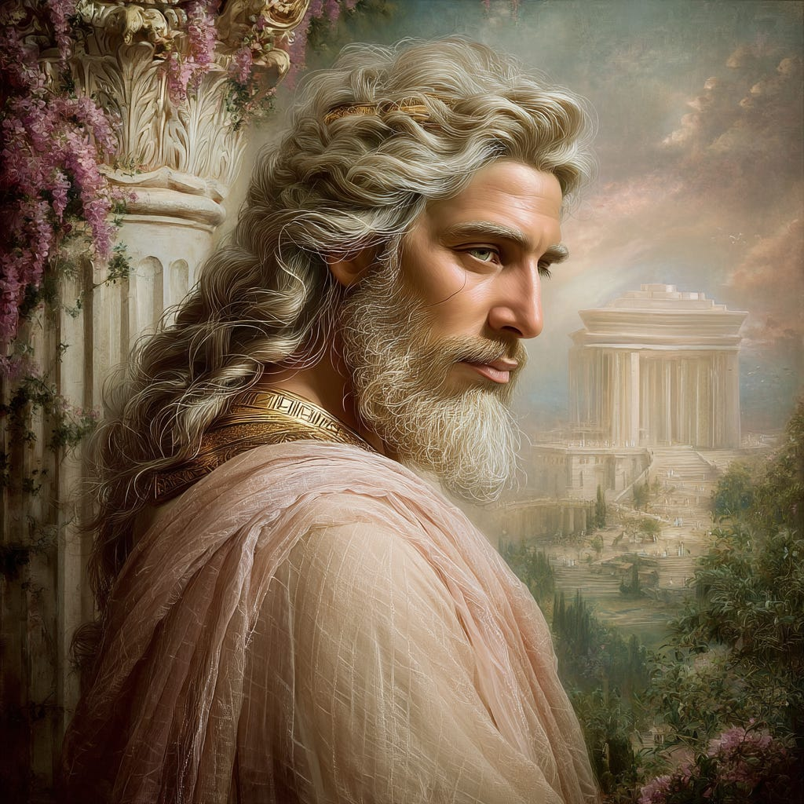
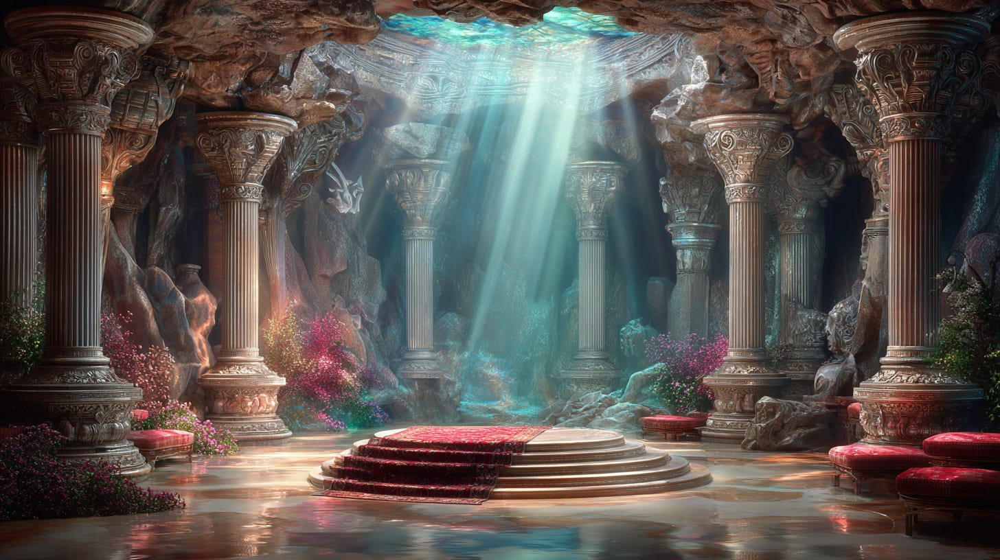
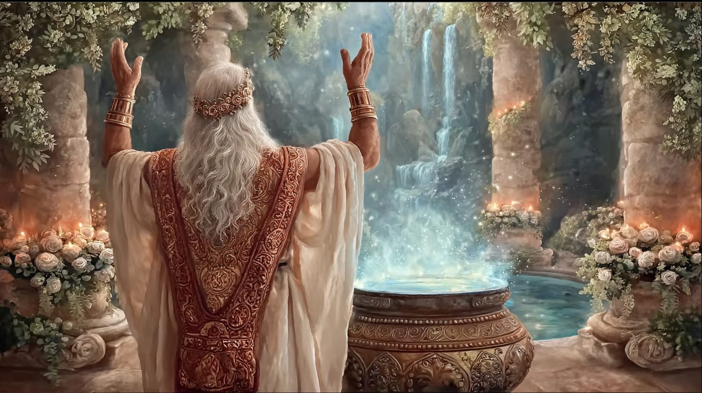
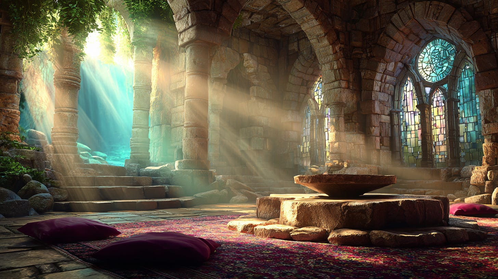
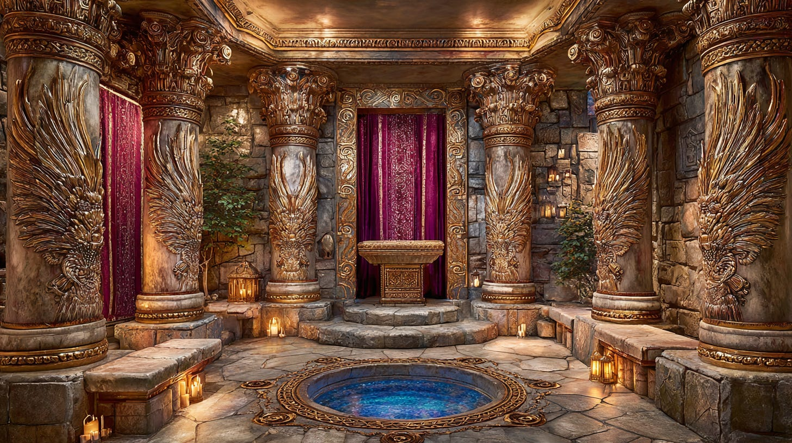

# Hiram Abiff, Temple of Solomon & the Shamir

## How this Connects to Our Current Path

**2024-12-06T19:22:52.956Z**

**Likes:** 0

[https://substackcdn.com/image/fetch/$s_!hEgT!,f_auto,q_auto:good,fl_progressive:steep/https%3A%2F%2Fsubstack-post-media.s3.amazonaws.com%2Fpublic%2Fimages%2Fcd9ee4e5-c3b8-428f-b068-94a4b830a9b6_1456x816.png](https://substackcdn.com/image/fetch/$s_!hEgT!,f_auto,q_auto:good,fl_progressive:steep/https%3A%2F%2Fsubstack-post-media.s3.amazonaws.com%2Fpublic%2Fimages%2Fcd9ee4e5-c3b8-428f-b068-94a4b830a9b6_1456x816.png)

**Before the 2025 message of Thoth, first, from [ThothStream](https://nesialibraryproject.wordpress.com/thothstream-knowledge-base/) here is a comprehensive summary of what he has revealed about Solomon and his temple:**

**I. The Existence and Destruction of the Temple**

• Thoth asserts that the Temple of Solomon **“did indeed exist, and mightily so”**.

• Thoth indicates that the location of the Temple of Solomon is **underneath the Dome of the Rock
in Jerusalem**. The Solomonic Temple in this location has a very high resonance with the Ark of the
Covenant vibration.

• The **gold mines of Sepha** were one source that later supplied King Solomon in the building of
the Temple.

[https://substackcdn.com/image/fetch/$s_!7-Qw!,f_auto,q_auto:good,fl_progressive:steep/https%3A%2F%2Fsubstack-post-media.s3.amazonaws.com%2Fpublic%2Fimages%2Fb64604ba-350e-4080-8ab6-2db3be311050_1024x1024.png](https://substackcdn.com/image/fetch/$s_!7-Qw!,f_auto,q_auto:good,fl_progressive:steep/https%3A%2F%2Fsubstack-post-media.s3.amazonaws.com%2Fpublic%2Fimages%2Fb64604ba-350e-4080-8ab6-2db3be311050_1024x1024.png)

**II. Thoth’s Role as Master Architect**

Thoth’s connection to the temple is direct, as he states that his soul incarnated as **C. Hiram
Abiff, the Master Builder/Architect to King Solomon**.

• The archetypical energies of **Thoth (as C. Hiram Abiff), Solomon, and David** form the **Great
Archetypical Seal** that governs the administration of image, design, and symbolic form on Earth.

• As Hiram Abiff, Thoth constructed the **Two Pillars of brass, Jachin (Strength) and Boaz
(Beauty)**, which were placed on the porch of the Temple. These pillars esotericallly represent the
two trees of the Garden of Eden and symbolize hermetic knowledge.

• Hiram Abiff also conceived and created the **Molten Sea** for the Temple.

[https://substackcdn.com/image/fetch/$s_!H0Ky!,f_auto,q_auto:good,fl_progressive:steep/https%3A%2F%2Fsubstack-post-media.s3.amazonaws.com%2Fpublic%2Fimages%2Fc1b89696-da2f-4af9-8b33-5cfc561748d9_1456x816.png](https://substackcdn.com/image/fetch/$s_!H0Ky!,f_auto,q_auto:good,fl_progressive:steep/https%3A%2F%2Fsubstack-post-media.s3.amazonaws.com%2Fpublic%2Fimages%2Fc1b89696-da2f-4af9-8b33-5cfc561748d9_1456x816.png)

**III. The Temple’s Esoteric Structure and Secrets**

The construction of the Temple contained profound esoteric knowledge connected to ancient lineages
and divine codes:

• The remnants of **Enoch’s subterranean cavern**—which he had built with nine arches and
concealed a duplicate golden plate inscribed with the **Tetragrammaton** (the Lost Word)—were
found by Solomon’s workmen. This discovery was made possible because Solomon was familiar with
this secret teaching.

• The Tetragrammaton, the secret name of God, is unpronounceable by the human tongue until a state
of higher consciousness is achieved. Hiram Abiff bestowed this “Lost Word” to Masters in
Jerusalem.

[https://substackcdn.com/image/fetch/$s_!Hd0I!,f_auto,q_auto:good,fl_progressive:steep/https%3A%2F%2Fsubstack-post-media.s3.amazonaws.com%2Fpublic%2Fimages%2F877363d7-2bef-4c82-be21-2e6b25d03e5f_1456x816.png](https://substackcdn.com/image/fetch/$s_!Hd0I!,f_auto,q_auto:good,fl_progressive:steep/https%3A%2F%2Fsubstack-post-media.s3.amazonaws.com%2Fpublic%2Fimages%2F877363d7-2bef-4c82-be21-2e6b25d03e5f_1456x816.png)

**The Shamir**

The ritual teachings concerning the Temple were largely focused on the Shamir. Thoth reveals that
the Shamir, often described as a worm that could cut stone without iron tools, was, in fact, an
**alchemical formula.**

Thoth’s statements imply that the Shamir holds an esoteric meaning far greater than merely cutting
stone:

• **Alchemical Formula:** Thoth’s statement suggests that the **Shamir did more than cut stone,
but was indeed an alchemical formula that could change the properties of the blood as well**.

• **Spiritual Transformation:** Thoth provided a specific quote regarding the spiritual purpose of
the Shamir: “**The worm (Shamir) will bore into the center of the Tree of Life, and Light will
pour out as if from a Golden Wound into the center of every heart**“.

• **Connection to Holy Blood and Light:** The secret of the Shamir provides insight between the
Holy Blood of Saf\-fire, the sacred worm, and the Tree of Life. This process is connected to the
path for humanity to revive its elemental Light quantum within the memory of the blood.

**Context and Legend**

The sources provide the traditional understanding of the Shamir alongside Thoth’s esoteric
definitions:

• **Traditional Legend:** In Rabbinical and Arabic legend, the **Shamir** refers to the “**worm
or serpent of wisdom whose touch split stone**“. The legend states that King Solomon built his
temple without using metal tools because of the power of the Shamir.

• **Dynamics and Symbolism:** The dynamics of the **Shamir is the key** to creating altars and
temples of stone that are not carved by metal tools. The serpent, represented by the Shamir,
symbolizes the **mutable power of Spirit in its direct confrontation with ignorance** (the immutable
stone).

• **Keeper of the Secret:** Hiram Abiff refused to surrender the secret of the Shamir.

[https://substackcdn.com/image/fetch/$s_!-u_k!,f_auto,q_auto:good,fl_progressive:steep/https%3A%2F%2Fsubstack-post-media.s3.amazonaws.com%2Fpublic%2Fimages%2Fca9eecce-eeea-43b3-9fef-be0ff440f221_1456x816.png](https://substackcdn.com/image/fetch/$s_!-u_k!,f_auto,q_auto:good,fl_progressive:steep/https%3A%2F%2Fsubstack-post-media.s3.amazonaws.com%2Fpublic%2Fimages%2Fca9eecce-eeea-43b3-9fef-be0ff440f221_1456x816.png)

**Holy of Holies**

The **Holy of Holies** in the Temple was a space of intense significance, described as an **exact
cube**. It housed the Ark of the Covenant’s lesser component, the **‘Ark of Karma’**.

[https://substackcdn.com/image/fetch/$s_!Ljg4!,f_auto,q_auto:good,fl_progressive:steep/https%3A%2F%2Fsubstack-post-media.s3.amazonaws.com%2Fpublic%2Fimages%2F9f21a67c-81c0-48d3-baea-b3e1fce8d0e6_1456x816.png](https://substackcdn.com/image/fetch/$s_!Ljg4!,f_auto,q_auto:good,fl_progressive:steep/https%3A%2F%2Fsubstack-post-media.s3.amazonaws.com%2Fpublic%2Fimages%2F9f21a67c-81c0-48d3-baea-b3e1fce8d0e6_1456x816.png)

**IV. The Tragedy of Hiram Abiff and the Underground Temple**

Thoth disclosed the reasons behind Hiram Abiff’s ritual murder and the sacred purpose of his
uncompleted work:

• Hiram Abiff’s main design was for an **underground temple beneath the planned Solomonic
Temple**.

• This subterranean temple was intended to be a **sacred haven and a place of esoteric learning
for the Essenes** in preparation for the birth, life, and ministry of Jesus Christ.

• The completion of this underground temple would have **“greatly changed the course of
Christian history in a most positive manner”**.

• The design threatened the **Falel (Fallen Lords of Light)** and their minions, the **Fharisee**,
who chose to murder Hiram Abiff to cut off this chain of events.

• Thoth revealed that he, as the soul of Hiram Abiff, **“allowed myself to be taken and
killed”** as an intentional act to **“assume the karmic ‘blow’ to mankind and released it
into the Higher Heaven”**.

• Even though the project was sabotaged, **one vault of the subterranean temple was constructed
and is sealed away to this day**, with other incomplete portions awaiting discovery.

[https://substackcdn.com/image/fetch/$s_!XSxK!,f_auto,q_auto:good,fl_progressive:steep/https%3A%2F%2Fsubstack-post-media.s3.amazonaws.com%2Fpublic%2Fimages%2Fa287c4f3-0bc3-43f4-b00d-4fcb2516ead7_1456x816.png](https://substackcdn.com/image/fetch/$s_!XSxK!,f_auto,q_auto:good,fl_progressive:steep/https%3A%2F%2Fsubstack-post-media.s3.amazonaws.com%2Fpublic%2Fimages%2Fa287c4f3-0bc3-43f4-b00d-4fcb2516ead7_1456x816.png)

**V. Solomon’s Soul Lineage**

Thoth notes that King Solomon’s soul was part of the **Solomon Adam Kadmon lineage**.

• This lineage was one of two “Christ souls” (the other being the Nathan lineage) that
descended from the House of David. (This would be the “Pure Soul” and the Osiris Soul.)

• The **Solomon line established on Earth that which is written in Heaven** (unfolding of
prophecy).

• The holy Rock of Abraham under the Dome of the Rock serves as the **Foundation Stone of the
temple for the reuniting of the Solomon and Nathan blood lines**.

[https://substackcdn.com/image/fetch/$s_!fvb7!,f_auto,q_auto:good,fl_progressive:steep/https%3A%2F%2Fsubstack-post-media.s3.amazonaws.com%2Fpublic%2Fimages%2F3713b98a-2cd3-4fac-b7a1-6eeecb712ece_1456x816.png](https://substackcdn.com/image/fetch/$s_!fvb7!,f_auto,q_auto:good,fl_progressive:steep/https%3A%2F%2Fsubstack-post-media.s3.amazonaws.com%2Fpublic%2Fimages%2F3713b98a-2cd3-4fac-b7a1-6eeecb712ece_1456x816.png)

**Thoth in 2025**

These ancient constructs are more than mere history, they are living frequencies now being generated
in new forms as the Earth enters its next cycle in preparation for personal and planetary ascension.

The plight of the Hibiru aka the Mazur Grail Linage is engrained into the entire human experience,
as it is the catalyst for the *Return to Grace*. The physical point on the planet registering this
turn\-key is Israel with the “eye” at Jerusalem.

Had the Wandering Hibiru in the Sinai be able to accept the true Ark (Sacred An / Ark of Grace),
Moses would not have been told to build the second “Ark of Karma.” Yet even as this lesser path
unfolded, so the *greater* path was commanded to be born from the lesser. Understand that the
passing of the Grail Cup to become bitter on the tongue (not accepting the “Grace” and turning
to the “Karma”) was not a failing of the Grail or the Hibiru but of all humanity. For as the
Hibiru act out the plight of humanity, s*o they also forge its path to the summit of Grace.*

From tossing seas, Human Kind is adrift. It sends forth a dove to find the sacred shore. This dove
is the Mazur, the Hibiru. The story of the Grail Path is a long one, tracing back to Mu and Lord
Melchizedek. The Betrayal of the Priests of his Heaven Houses, both in Mu and Atlantis. The
dispersion of the Grail Families. The Mazur being the enduring Grail Carriers through many lands
including Albion (via Ireland and later Gaul), Egypt and into the Middle East.

Returning to Solomon’s Temple, it is not just a ruin of remaining stones and secret chambers. It
is a living Frequency kept in perpetuity within the Many Mansions of God.

Humanity is now awakening this Temple within and without. It shall spill forth its bountiful
treasures. Yet its protecting blade is sharp. Each soul must come to the altar awakened. The
Sleepers will continue to perpetuate their personal follies and wander into the darkening night,
even though they are but paces away from the Glory of the Shamir and the Bright Shore.

[https://substackcdn.com/image/fetch/$s_!L_Gl!,f_auto,q_auto:good,fl_progressive:steep/https%3A%2F%2Fsubstack-post-media.s3.amazonaws.com%2Fpublic%2Fimages%2Fc6ab1391-7c7b-417d-b2aa-34a220ca5e5e_1456x816.png](https://substackcdn.com/image/fetch/$s_!L_Gl!,f_auto,q_auto:good,fl_progressive:steep/https%3A%2F%2Fsubstack-post-media.s3.amazonaws.com%2Fpublic%2Fimages%2Fc6ab1391-7c7b-417d-b2aa-34a220ca5e5e_1456x816.png)

#### ***I say to you, choose to be among the Awakened, the Johannine!*** **(the race of the Awakened Ones)**

**RELATED**

**[Playlist on Middle East \& Grail Prophecies](https://www.youtube.com/playlist?list=PLrUVPTQKQFdQdanvGTFhqC5KeIP7SJfVm)**

**[The Grail Path Series](https://www.youtube.com/playlist?list=PLrUVPTQKQFdTMMX3_YlmP5JkWm8p5qj2n)**

**[The Star of David \& Mazur Grail Family](https://maianartoomid.substack.com/p/the-star-of-david-and-mazur-grail?utm_source=publication-search)**

**[The Beth\-El Star](https://maianartoomid.substack.com/p/the-beth-el-star?utm_source=publication-search)**

Subscribe

[Share](https://maianartoomid.substack.com/p/hiram-abiff-temple-of-solomon-and?utm_source=substack&utm_medium=email&utm_content=share&action=share)

**\~\~\~\~\~  
[Personal Akasha Life Pulse from Thoth \&
Sha’Maia:](https://newearthstar.org/about-maia/akashic-consultations/) Helps you to synchronize
with this fundamental cosmic rhythm, and also reflects how your “Life Pulse” session connects
you to your New Earth Star frequency. Both written (5\-6 pages) and a live Zoom exploration.
\~\~\~\~\~**

**All my Substack images and articles are FREE. Please help me promote them. Support my work further, by considering some of my paid offerings (consultations \& activation store) and donations.**

**[my website](http://newearthstar.org/) / [YouTube channel](https://www.youtube.com/@bluestarrising-thetemplara3835) / [Akasha Life Pulse Sessions](https://newearthstar.org/about-maia/akashic-consultations/)/ [Maia’s Redbubble](https://www.redbubble.com/people/maianartoomid/explore?asc=u&page=1&sortOrder=recent) / [published works](https://newearthstar.org/published-works/) / [activation store](https://newearthstar.org/maias-activation-store/) (personal art templates for healing \& self\-discovery, Oracles cards \& apps)**

**[MONTHLY DONATIONS](https://www.paypal.com/donate/?cmd=_s-xclick&hosted_button_id=SKZ4FZCYBM4H4): Donate $20 or more per month and you will have access to the [Vault of Thoth](https://newearthstar.org/vault-of-thoth/). Thank you!**
