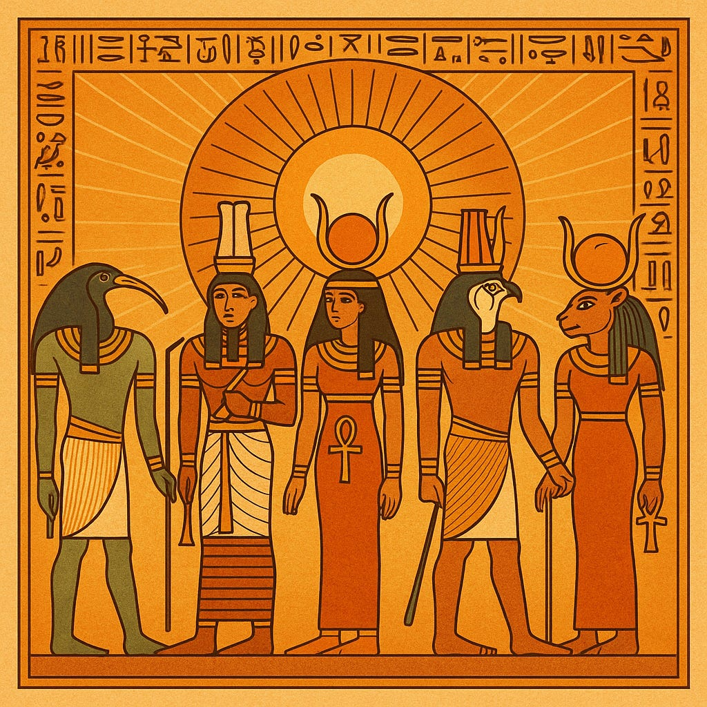
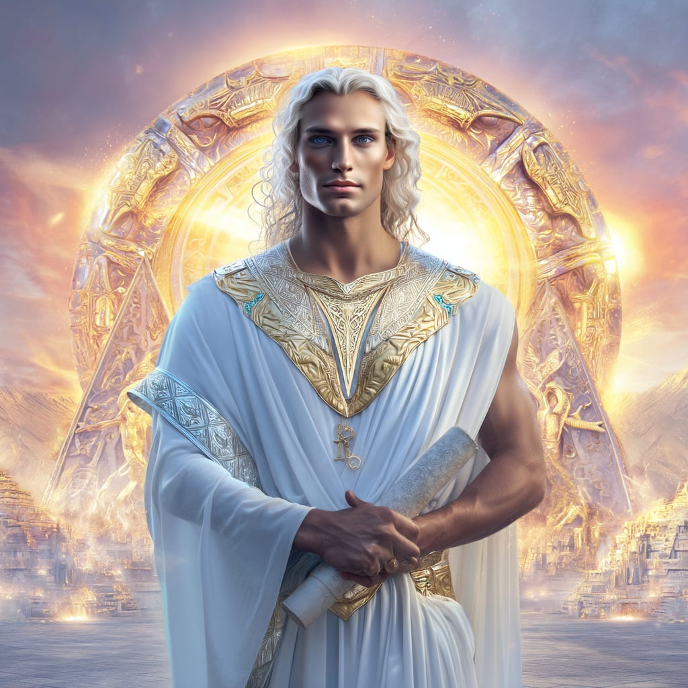
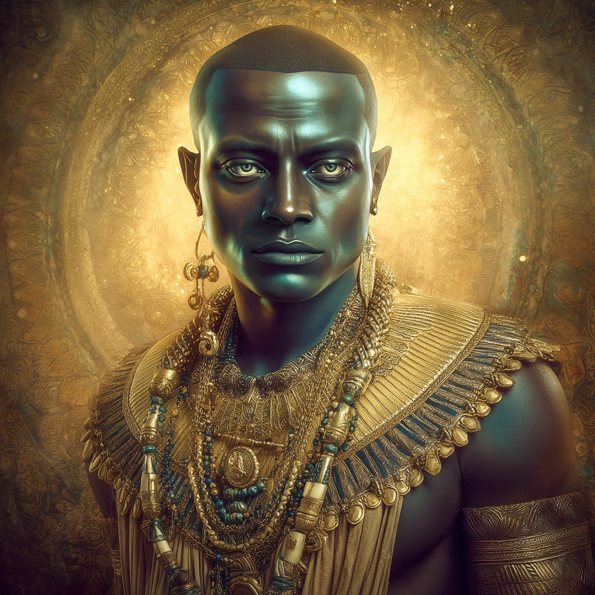
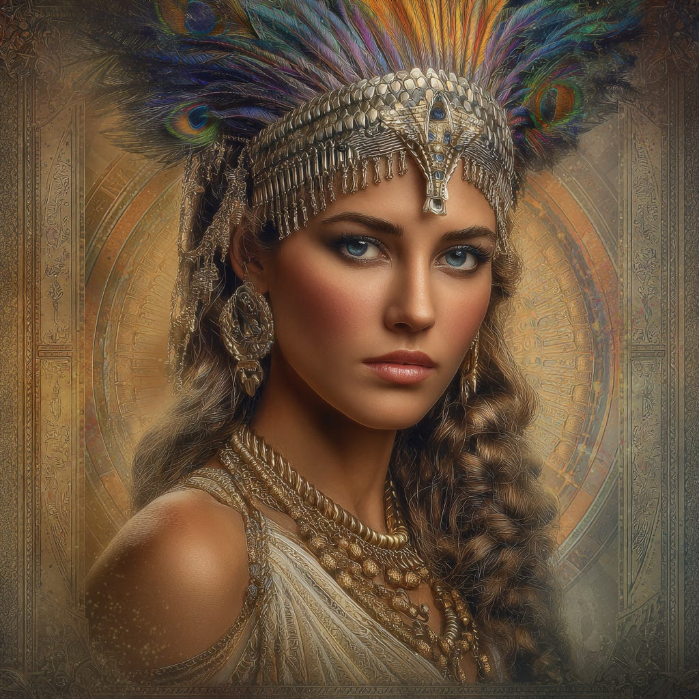
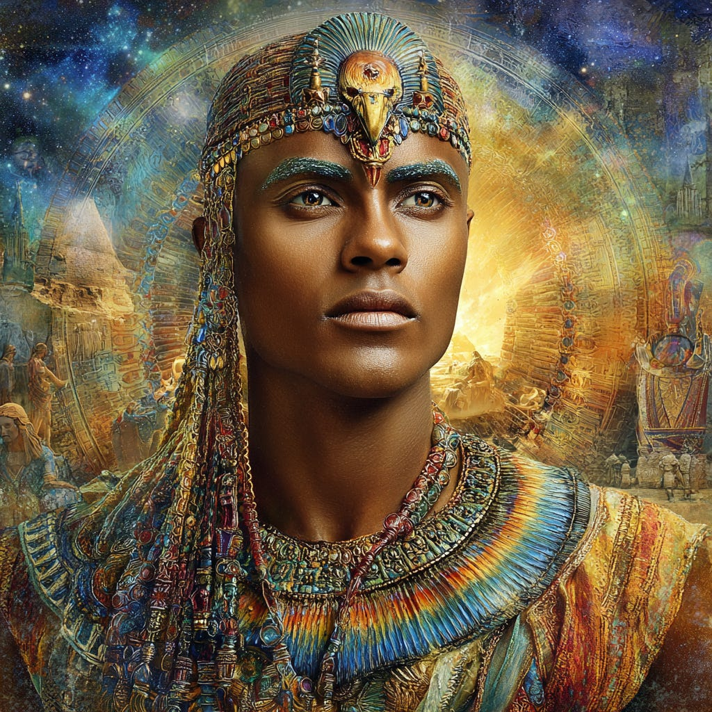
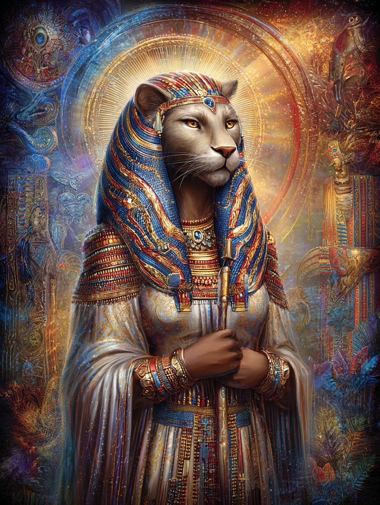
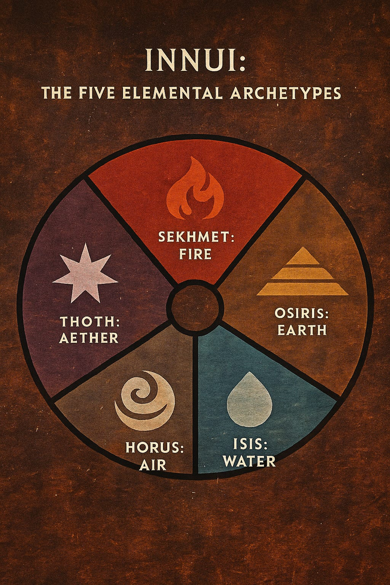

# Thoth, Osiris, Isis, Horus & Sekhmet

## Basic Roles in Consciousness Architecture of Earth & New Earth

**2024-12-06T19:22:52.956Z**

**Likes:** 0

[https://substackcdn.com/image/fetch/$s_!mDvX!,f_auto,q_auto:good,fl_progressive:steep/https%3A%2F%2Fsubstack-post-media.s3.amazonaws.com%2Fpublic%2Fimages%2Fc97a96cc-d8b5-4a4c-9717-31c06a5260f2_1024x1024.png](https://substackcdn.com/image/fetch/$s_!mDvX!,f_auto,q_auto:good,fl_progressive:steep/https%3A%2F%2Fsubstack-post-media.s3.amazonaws.com%2Fpublic%2Fimages%2Fc97a96cc-d8b5-4a4c-9717-31c06a5260f2_1024x1024.png)

**Exploration of Thoth Transmissions through the [ThothStream](https://nesialibraryproject.wordpress.com/thothstream-knowledge-base/) knowledge base (TS).**

\~\~\~\~\~\~\~\~

**Question: As outlined in ThothStream, please give me the basic roles of the following figures in the Planetary Ascension and Consciousness Architecture of Earth and New Earth: Thoth, Osiris, Isis, Horus and Sekhmet.**

[https://substackcdn.com/image/fetch/$s_!yFW9!,f_auto,q_auto:good,fl_progressive:steep/https%3A%2F%2Fsubstack-post-media.s3.amazonaws.com%2Fpublic%2Fimages%2Ff7b0a618-eaaa-4396-8187-3ea837064553_1024x1024.png](https://substackcdn.com/image/fetch/$s_!yFW9!,f_auto,q_auto:good,fl_progressive:steep/https%3A%2F%2Fsubstack-post-media.s3.amazonaws.com%2Fpublic%2Fimages%2Ff7b0a618-eaaa-4396-8187-3ea837064553_1024x1024.png)

**Thoth Raismes of Aphra (Tehuti, ThothHorRa, ThothMusZurud)**

Thoth is a central figure, serving simultaneously as an ancient architect, a cosmic scribe, and a
current guide in the ascension process.

• **Master Architect and Builder:** Thoth (originally TothMusZurud from Rigel, Orion) brought the
**Enochian Table** to Earth—a universal hologram containing the cosmic blueprint for all sacred
structures, including the Great Pyramid, which he calls the **Temple of the Risen One**. As
TothMusZurud he oversaw its original construction (c. 10,400 B.C.) and as Thoth Raismes of Aphra the
later renovations.

• **The Grand Communicator and Scribe:** His titles mean “one who gives breath to” or the
“Grand Communicator”. He holds the office of **Scribe of the Gods** and **Guardian of the
Akashic Records**. His mission was threefold: to bring the Enochian Table, supervise constructions,
and retrieve lost knowledge (like the *Emerald Tablets*) to enlighten humanity.

• **Architect of Ascension Grids:** He is the master architect of the **Templa Mar** and the
**Kyoptos/Anubis** dynamic (part of the Pyramidis Radius Matrix), which serve as an extension of his
spiritual blueprint for guiding souls into inner dimensions of time\-space.

• **New Earth Guide:** Thoth, in his New Earth embodiment known as **ThothHorRa**, directs the
**Aramu Temple of Thoth**. This is an etheric temple located in the **Numis’OM portal** (the
transitional plane for the New Earth Star), serving as a “Station of Light” to **accelerate
individual ascension processes** toward the ultimate planetary event, **Light\-Principle Forty
(LP\-40\)**.

• **Christic Office:** Thoth is one of the original nine souls of the Adam Kadmon template for
Earth and works specifically within the **Office of the Christ** for the redemption of Light in
matter.

• **ThothMusZurud is a separate incarnation from Thoth Raismes/ThothHorRa.** Thoth Raismes took
his body into the Hollow Earth and became ThothHorRa. His frequency changed in this process but for
the most part, not his outer appearance. Tehuti is another ancient name for “Thoth.”

• Some other key incarnation of the Thoth soul are: St. John of the Cross, John of Revelations,
Ashoka and Christian Rosenkreuz. **[see video on Thoth’s
incarnations](https://www.youtube.com/watch?v=tlrSwD6HOR4&t=490s)**

[https://substackcdn.com/image/fetch/$s_!KW_A!,f_auto,q_auto:good,fl_progressive:steep/https%3A%2F%2Fsubstack-post-media.s3.amazonaws.com%2Fpublic%2Fimages%2Fab835fdb-683c-4f7c-a885-2264a0492117_1024x1024.png](https://substackcdn.com/image/fetch/$s_!KW_A!,f_auto,q_auto:good,fl_progressive:steep/https%3A%2F%2Fsubstack-post-media.s3.amazonaws.com%2Fpublic%2Fimages%2Fab835fdb-683c-4f7c-a885-2264a0492117_1024x1024.png)

**Osiris**

Osiris is understood as both an ensouled being and a profound archetype, representing the Divine
Father Principle and the very blueprint for ascended humanity.

• **Adam Kadmon Template:** The essence of Osiris is the **Body of Osiris**, which is a human pure
state **Adam Kadmon template**. This body contains the master program for bonding the greater star
fields to the lesser through the **Threshold of Orion** and is crucial for upgrading human DNA with
codes shut down by the Annunaki.

• **The First Logos:** He is archetypally seen as a symbol of the **First Logos** or the **Higher
Self**. He represents Divinity descending into lower realms to absorb the karma of the World Soul.

• **Ascension Trigger (Osiris Arising):** The quickening of the **Vault of Osiris** within the
Great Pyramid is the actual final trigger for the moment of planetary ascension (LP\-40\). This will
involve the **Soul of Osiris** performing the **Osiris Fire Star Kachina Dance**, ascending through
the **Violet Flame** into the Higher Heaven of the 8th Octave.

• **Role as Christic Escort:** The soul of Osiris was an **escort soul** to I’shoa (Jesus). It
entered the incarnation to guide the Pure Soul through the physical realm, departed at the Baptism,
and returned during the crucifixion to hold the Light Chemistry of the Adam Kadmon human blueprint
in the Earth.

*Osiris\-Rem\-Nebket*

Osiris\-Rem\-Nebket is an **abouet**—an energy\-vessel created by Osiris with the Khefum\-Ra
priesthood (pre\-Deluge) to initiate the **Sun\-Born** across ages. He is portrayed as a “Black
Lord” (blue\-black skin, sapphire eyes) bearing a diamond\-shaped chest crystal called the
**kether\-ath** (“binding stone”), which serves as master control of the **Osiris grid** linking
Earth and Orion, enabling the LP\-40 solar\-threshold passage. In function, Osiris’ projection
bonds greater star fields to lesser through the **Threshold of Orion**, generating the vesica—the
Eye of His Sun of Suns (Horus)—from which outer worlds and inner soul\-realms template onto the
Adam Kadmon memory in humanity.

**Osiris videos: [Osiris \- The Christed Soul \& Archetype](https://youtu.be/kBPqRdOsFOk?si=BtNcuQAhzA3pp2Vh) / [The Osiris Staffs \- Osiris\-Rem\-Nebket \& the Solar Crosses](https://youtu.be/_EBMnC44-X0?si=F7ptTlJ6H24d4bn_)**

[https://substackcdn.com/image/fetch/$s_!2VFX!,f_auto,q_auto:good,fl_progressive:steep/https%3A%2F%2Fsubstack-post-media.s3.amazonaws.com%2Fpublic%2Fimages%2F80f55ae2-b0dc-4d76-aeeb-8b5da5cc4625_1024x1024.png](https://substackcdn.com/image/fetch/$s_!2VFX!,f_auto,q_auto:good,fl_progressive:steep/https%3A%2F%2Fsubstack-post-media.s3.amazonaws.com%2Fpublic%2Fimages%2F80f55ae2-b0dc-4d76-aeeb-8b5da5cc4625_1024x1024.png)

**Isis**

Isis, also an ensouled being and archetype, embodies the Divine Mother Principle and the force
necessary for resurrection and unification.

• **Divine Mother and Protector:** She represents the **Divine Mother Principle** in both
reflective and generative modes. She is the **Guardian to the Christ**, essential for the Christ
Consciousness to enter and remain in the world. She is the feminine wellspring of spiritual maturity
and eternal solace, providing nurturing and protection.

• **Agent of Resurrection and Restoration:** In the myth of Osiris’ dismemberment by Set, Isis
searches for and reconstitutes the 14 parts of his body (recreating the 14th part needed for divine
regeneration), symbolizing her role in **reconciling chaos** and facilitating the **resurrection of
the Adam Kadmon template**. This myth serves as an analogy for the resurrection of the Earth itself
through the merging of its scattered reality parts.

• **Cosmic Geometric Focus:** She is associated with the **Isis Eye (Aeriopax)**, a sacred
geometric **time gate** paramount to Earth’s ascension. The Isis Eye is overlaid upon the Earthen
reality to provide cohesion for consciousness fields, allowing this world to stabilize and lock onto
the Homeward Light through the **44:44 Stargate**. The Numis’OM is developed within the **“Isis
womb of creation”**.

**A single flame gathered strength from the women who circled around it.. Their spirit breathed as one into the crucible, and the flame leapt forth from the life\-giving elixir of souls. These priestesses of Isis came not to praise a Goddess, but to sanctify the hallowed presence of LIFE within themselves, and in all that shared their world. This was ISIS to them...the Giver of Life.**

***“Come forward to me,”*** **she sang,** ***“compose your song into my heart and live it in your soul.”***

**[Isis Eye: Arieopax](https://maianartoomid.substack.com/p/the-arieopax-isis-eye?utm_source=publication-search)**

[https://substackcdn.com/image/fetch/$s_!lsY_!,f_auto,q_auto:good,fl_progressive:steep/https%3A%2F%2Fsubstack-post-media.s3.amazonaws.com%2Fpublic%2Fimages%2F2e007cbe-8b19-482d-b635-e4b8ad352431_1024x1024.png](https://substackcdn.com/image/fetch/$s_!lsY_!,f_auto,q_auto:good,fl_progressive:steep/https%3A%2F%2Fsubstack-post-media.s3.amazonaws.com%2Fpublic%2Fimages%2F2e007cbe-8b19-482d-b635-e4b8ad352431_1024x1024.png)

**Horus**

**I. Archetypal Identity and the Divine Logos**

Horus functions as a crucial archetype representing the **Christic Solar Lord** within the ancient
Egyptian pantheon.

• **Solar Lord and Christic Archetype:** Horus is referred to as the **Son of Suns** and a Solar
Lord, just as the Christ is. The *Path of Horus* is identified as the **way of the Christos, the
solar lord of the universe, the cosmic Christ**.

• **The Risen One:** Horus is seen as the **soul of Osiris, born again to New Life**. The
designation ‘Hor’ (Horus) in ThothHorRa’s name represents the **Divine Logos delivered into
form**, an archetypal version of the Christ Incarnate.

• **Spiritual Warrior:** The archetype of Horus is the **bearer of the ‘force for good’ –
the ultimate Spiritual Warrior**. The mythic way of Horus is the **direct path**, involving the
spiritual warrior subduing the internal enemy through self\-effort, contrasting with the path of
Osiris (reincarnation).

**II. Consciousness Architecture (The Eye of Horus)**

The concept of the Eye of Horus is fundamental to creation dynamics and the generation of new
reality forms:

• **Generating New Earth Forms:** The **Eye of Horus dynamic** is the means through which the
forms within the stage of the New Earth Star are being generated in Numis’OM. Numis’OM serves as
the first membrane or staging ground for the New Earth Star (World System II).

• **Creative Focus and Imprinting:** Horus is the **Eye of creative focus**. It functions as a
**spherical imprinting device**, rolling across star fields to imprint the divine logos, word, or
breath of activation upon every particle.

• **Adam Kadmon Template:** Thoth perceives the **Eye of Horus** as creating, in its First
Principle, the **multi\-dimensional energy fields of the Being**. From these fields are then created
the forms of the **Adam Kadmon** in the subtle and corporeal energy bodies.

• **Source of Light Language:** Through the Hori (Hor or Hurr Eye), the vision or focus of worlds
in motion is expanded and contracted, and consequently, the **Language of Light** and its signs,
symbols, and sacred utterances are developed.

**III. Role in Planetary Ascension**

Horus’s role is critical in guiding souls toward the Metatronic full\-Light spectrum:

• **Gateway to Multi\-Dimensional Being:** The **Eye of Horus is a gateway to one’s
multi\-dimensional being**. By engaging with it, one can consciously connect to and integrate these
dimensional parts of the soul\-self by creating a *merkabah* or Light transport vehicle, thereby
receiving a direct signal of their oneness.

• **Christic Initiation and Stellar Coordinates:** Initiatory journeys, such as the **‘Path of
Horus \~ Return to the Stars’**, offer the initiate the opportunity to access an **ancient stellar
consciousness coordinate (stargate)**. This pathway leads the soul out of the constraints of matter
and into the **full\-Light of Christic consciousness**.

• **Eye of Perfection:** The ascension of the Risen One (Osiris/Fire Star Kachina) into the Higher
Heaven of the 8th Octave reveals the **Eye of Horus, the Sun of Suns**. It is **through His Eye of
Perfection and Light** that the 144,000 shall pass into the Realm of Splendour.

• **Divine Alignment:** Horus represents the Son principle within the Holy Family Archetypes
(Osiris\-Father, Isis\-Mother, Horus\-Son). The alignment with the Horian initiation dynamic is
achieved through specific Earth nodes along the **Horian Way**.

**[Eye of Horus video](https://youtu.be/qs9-STKYDKw?si=UCsuN9o8F-3vxsGD)**

[https://substackcdn.com/image/fetch/$s_!Junc!,f_auto,q_auto:good,fl_progressive:steep/https%3A%2F%2Fsubstack-post-media.s3.amazonaws.com%2Fpublic%2Fimages%2Fc862012a-167b-4dd3-bebf-f31db248eda4_928x1232.png](https://substackcdn.com/image/fetch/$s_!Junc!,f_auto,q_auto:good,fl_progressive:steep/https%3A%2F%2Fsubstack-post-media.s3.amazonaws.com%2Fpublic%2Fimages%2Fc862012a-167b-4dd3-bebf-f31db248eda4_928x1232.png)

**Sekhmet (Tosmulektai)**

Sekhmet is a universal archetype, distinct from the ensouled beings, who wields primordial creative
and transformative fire.

• **Universal Fire and the Void:** She is the **harbinger of the Universal Fire** and the
**universal creative Mother principle**—the void—who arrives from the most ancient reaches of
the Cosmos to reclaim “lost children” (souls separated from Her domain).

• **The Dweller on the Threshold:** Sekhmet was assigned the role of the **‘Dweller on the
Threshold,’** serving as an archetypal sentinel at the boundary of higher consciousness. Her
fierce reputation arose from initiates assigning their own “demonic natures” (lesser selves) to
her when confronted with their impurity upon attempting to cross the threshold.

• **Opener of the Third Eye:** She is the **‘Bringer of Fire,’** transmitting primordial power
to ignite the third eye with the “first flame” of eternal sight.

• **Ascension Pathway:** Her energy is critical for the passage into the **Pure Gem Body** for New
Earth Star consciousness. The grid formed by her temples (moving from five to eight total temples)
reflects the move from the 3rd Dimension’s octave of cohesion (five) to the **New Earth Star’s
octave of cohesion (eight)**. She represents the Fire element within the sacred archetypes of the
Innui.

**Sekhmet videos: [Sekhmet \- The Blood Rose](https://youtu.be/T4tafaVIZ50?si=ldj0I4MM1WaIzHEJ) /** **[Path of the Blood Rose \| Song of Sekhmet](https://youtu.be/jLQDbtPt_gc?si=SXVyKrgD1thcH-ZK)**

[https://substackcdn.com/image/fetch/$s_!iZ1B!,f_auto,q_auto:good,fl_progressive:steep/https%3A%2F%2Fsubstack-post-media.s3.amazonaws.com%2Fpublic%2Fimages%2F8b262ce3-50d8-4e8b-b77c-e6e2f5f5252a_1024x1536.png](https://substackcdn.com/image/fetch/$s_!iZ1B!,f_auto,q_auto:good,fl_progressive:steep/https%3A%2F%2Fsubstack-post-media.s3.amazonaws.com%2Fpublic%2Fimages%2F8b262ce3-50d8-4e8b-b77c-e6e2f5f5252a_1024x1536.png)

The term **Innui** is an ancient name, used in what was called “The Book of Reflection,” to
describe beings who are able to **express or take shape in the elements out of Spirit**.

The Innui, under different names during the Atlantean period, represented five specific archetypal
entities who were responsible for bringing the initiation of the **sacred elements** to Earth.

The five elemental archetypes identified as the Innui are:

1\. **Sekhmet:** Representing **Fire**.

2\. **Osiris:** Representing **Earth**.

3\. **Isis:** Representing **Water**.

4\. **Horus:** Representing **Air**.

5\. **Tehuti (Thoth):** Representing **Aether**.

This definition frames the Innui as the **“Five Forms of Expression within the City of
Resurrection”**. These five figures are known as the **“5 Jewels in the Crown of Egypt”**.

**See Also: [Adam Kadmon](https://maianartoomid.substack.com/p/the-adam-kadmon-template-for-humanity?utm_source=publication-search)** **/ [Path of the Bennu](https://vimeo.com/657951126?fl=ls&fe=ec)** 

Subscribe

[Share](https://maianartoomid.substack.com/p/thoth-osiris-isis-and-sekhmet?utm_source=substack&utm_medium=email&utm_content=share&action=share)

**\~\~\~\~\~  
[Personal Akasha Life Pulse from Thoth \&
Sha’Maia:](https://newearthstar.org/about-maia/akashic-consultations/) Helps you to synchronize
with this fundamental cosmic rhythm, and also reflects how your “Life Pulse” session connects
you to your New Earth Star frequency. Both written (5\-6 pages) and a live Zoom exploration.
\~\~\~\~\~**

**All my Substack images and articles are FREE. Please help me promote them. Support my work further, by considering some of my paid offerings (consultations \& activation store) and donations.**

**[my website](http://newearthstar.org/) / [YouTube channel](https://www.youtube.com/@bluestarrising-thetemplara3835) / [Akasha Life Pulse Sessions](https://newearthstar.org/about-maia/akashic-consultations/)/ [Maia’s Redbubble](https://www.redbubble.com/people/maianartoomid/explore?asc=u&page=1&sortOrder=recent) / [published works](https://newearthstar.org/published-works/) / [activation store](https://newearthstar.org/maias-activation-store/)(personal art templates for healing \& self\-discovery)**

**[MONTHLY DONATIONS](https://www.paypal.com/donate/?cmd=_s-xclick&hosted_button_id=SKZ4FZCYBM4H4): Donate $20 or more per month and you will have access to the [Vault of Thoth](https://newearthstar.org/vault-of-thoth/). Thank you!**
