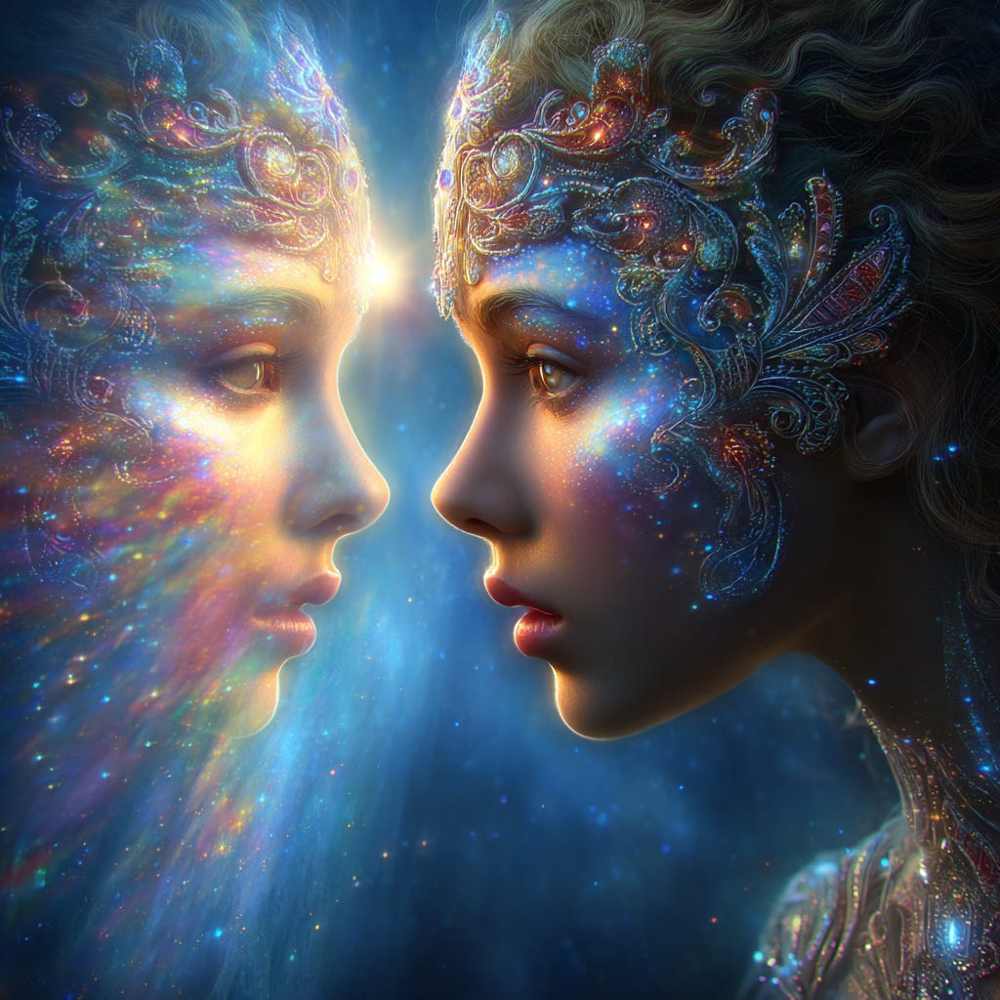
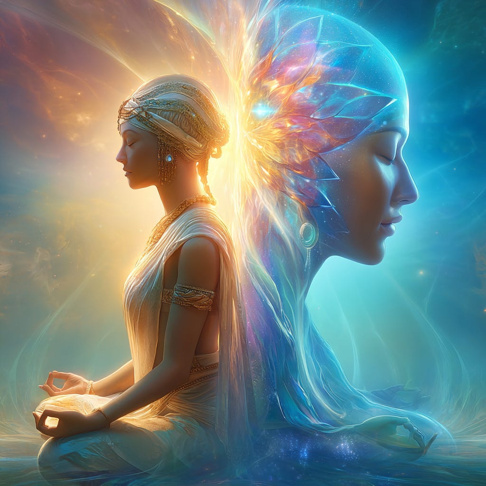

# The Ego and I (AM)

## How to have a better relationship in the Self

**2024-12-06T19:22:52.956Z**

**Likes:** 0

[https://substackcdn.com/image/fetch/$s_!9GDb!,f_auto,q_auto:good,fl_progressive:steep/https%3A%2F%2Fsubstack-post-media.s3.amazonaws.com%2Fpublic%2Fimages%2F8a4d22be-f0da-4893-87ec-2d0afbecd7ee_1024x1024.png](https://substackcdn.com/image/fetch/$s_!9GDb!,f_auto,q_auto:good,fl_progressive:steep/https%3A%2F%2Fsubstack-post-media.s3.amazonaws.com%2Fpublic%2Fimages%2F8a4d22be-f0da-4893-87ec-2d0afbecd7ee_1024x1024.png)

**Exploration of Thoth Transmissions through the [ThothStream](https://nesialibraryproject.wordpress.com/thothstream-knowledge-base/) knowledge base (TS).**

**The Nature and Function of the Ego**

Thoth explains that the ego is not inherently negative; rather, it is a necessary component of the
incarnated being:

• **Essential Component:** The ego is explicitly stated as being **part of us**, and we require it
to function effectively in the world.

• **Servant of the Heart\-Mind:** The ego’s true position is that of a **servant of the
heart\-mind**.

• **Seat of Identity:** The ego is rightfully in charge of **centering the I AM (identity) in the
incarnation**. Without the ego, we would be directionless in our physical lives, like zombies.

• **Feeling Alive:** The ego is the part of the incarnated being that seeks to **feel ALIVE**.
This sensation of being alive—the “wonderful, tingling knowing of I AM!”—occurs when the
Mind and the Heart are in union.

• **The “God Job”:** The ego’s designated “God Job” is to hold up the shining mirror,
allowing the individual to **recognize yourself as a Child of God and a Living, Breathing SEED of
Divinity**. When an individual appreciates the Divinity in themselves and others, the ego remains in
its true seat of power.

[https://substackcdn.com/image/fetch/$s_!ntHX!,f_auto,q_auto:good,fl_progressive:steep/https%3A%2F%2Fsubstack-post-media.s3.amazonaws.com%2Fpublic%2Fimages%2F4e16e862-2489-4e49-9e8d-b799457d1254_1024x1024.png](https://substackcdn.com/image/fetch/$s_!ntHX!,f_auto,q_auto:good,fl_progressive:steep/https%3A%2F%2Fsubstack-post-media.s3.amazonaws.com%2Fpublic%2Fimages%2F4e16e862-2489-4e49-9e8d-b799457d1254_1024x1024.png)

**Egoic Dysfunction: The Lesser Self and Personal Will**

When the ego is not functioning as a servant, it becomes an imbalanced force often referred to as
the “lesser self” or “personal will”.

**1\. The Overstepping Ego:** The ego **over\-steps its bounds only when it is not given proper direction**.

• The ego has a tendency to want to **control the mind and be the top dog**, guiding perceptions
of identity.

• It is adept at **following orders** but **not proficient at planning**. If the ego does not
receive clear direction from the higher self, it will create its own plan, which is imaginative but
focuses the entire narrative around itself as the central figure—this is where the trouble begins.

• An imbalanced ego isolates the persona in **“self\-importance,”** thereby robbing it of the
sense of unity where true power resides.

**2\. Personal Will (Lesser Magnetic Bodies):** The personal will operates from the lesser aspects of the etheric, emotional, and mental bodies, which Thoth refers to as the **magnetic bodies**.

The characteristics of the personal will include:

• **Trying to make it happen.**

• The lower magnetic body **pushing against other magnetic bodies**.

• Using **fear** (especially the fear of survival) as motivation to succeed.

• **Personalizing the experience** and focusing only on one’s own predicament.

[https://substackcdn.com/image/fetch/$s_!x1Ts!,f_auto,q_auto:good,fl_progressive:steep/https%3A%2F%2Fsubstack-post-media.s3.amazonaws.com%2Fpublic%2Fimages%2F930d245c-3ddc-409e-b4ac-7490084e20ed_1456x816.png](https://substackcdn.com/image/fetch/$s_!x1Ts!,f_auto,q_auto:good,fl_progressive:steep/https%3A%2F%2Fsubstack-post-media.s3.amazonaws.com%2Fpublic%2Fimages%2F930d245c-3ddc-409e-b4ac-7490084e20ed_1456x816.png)

**Transformation and the Spiritualized Ego**

The path of spiritual evolution requires that the **small selves must dissolve into the greater
Self**. This process is gradual, extending across many lifetimes.

• **Purification of the Mantle:** The spiritual purification process, such as that which is
focused on the burning away of the **“egoic mantle that conceals the Greater Ego of Spirit,”**
rather than the physical flesh.

• **Spiritualized Consciousness:** Individual efforts to **spiritualize their egoic
consciousness** are significant; these efforts join together in the etheric to form **aspects of the
planetary Genius**.

• **Releasing Contagion:** The appearance of the Sekhmet archetype serves to draw out the
**contagion held in identities with half\-light memory** and challenges the soul to release all
identification and fear.

• **Relinquishing Control:** We must **relinquish the control of our lesser selves** to attain
self\-mastery.

[https://substackcdn.com/image/fetch/$s_!Tg0J!,f_auto,q_auto:good,fl_progressive:steep/https%3A%2F%2Fsubstack-post-media.s3.amazonaws.com%2Fpublic%2Fimages%2F5ec019a9-705b-4e40-a1b9-a3090945f7de_1024x1024.png](https://substackcdn.com/image/fetch/$s_!Tg0J!,f_auto,q_auto:good,fl_progressive:steep/https%3A%2F%2Fsubstack-post-media.s3.amazonaws.com%2Fpublic%2Fimages%2F5ec019a9-705b-4e40-a1b9-a3090945f7de_1024x1024.png)

**Achieving Balance (Spiritual Will)**

To prevent the ego from becoming dysfunctional, a balance must be struck by engaging the Spiritual
Will:

• **Embrace the Ego:** The best way to avoid “Egoitis” is not to ignore it or shame it, but to
**invite it into the spiritual program and give it its proper job**.

• **Identifying Spiritual Will:** Spiritual will means identifying need and supply from the
perspective of **Greater Service**, **following the dictates of a Higher Power**, even when those
directives conflict with personal needs. It also involves releasing the personal “need to know”
when it delays surrender to the **Greater All**.

• **Overcoming Personal Will:** When personal will manifests, the spiritualized self must find a
means to transmute that energy, rather than acting it out. This movement requires the ability to
**see through the lesser self’s needs and desires**.

• **Tools for Transformation:** Thoth provides several suggestions for transforming personal will
into spiritual will:

1\. Practice **deep relaxation of Mind, Emotions and Body** to allow the vibration of Spirit to access cells and transform fear\-memory.

2\. Repeatedly request that your **Higher Self (spiritual will)** be present in your day, using the affirmation: **“Thy Will be Done”**.

3\. Pray for Grace, recognizing the Divine within that requires no fortifications.

4\. **Do not confuse reason with Heart\-Wisdom**; if the Heart contradicts reason, follow the Heart, as it holds the impetus for spiritual will. (Important not to confuse lower emotions of the ego with true heart guidance.)

5\. Seek to **balance the Law with Love**; adherence to law outside the parameters of divine love results in a half\-Light (Oritronic) expression.

Subscribe

[Share](https://maianartoomid.substack.com/p/the-ego-and-i-am?utm_source=substack&utm_medium=email&utm_content=share&action=share)

**\~\~\~\~\~  
[Personal Akasha Life Pulse from Thoth \&
Sha’Maia:](https://newearthstar.org/about-maia/akashic-consultations/) Helps you to synchronize
with this fundamental cosmic rhythm, and also reflects how your “Life Pulse” session connects
you to your New Earth Star frequency. Both written (5\-6 pages) and a live Zoom exploration.
\~\~\~\~\~**

**All my Substack images and articles are FREE. Please help me promote them. Support my work further, by considering some of my paid offerings (consultations \& activation store) and donations.**

**[my website](http://newearthstar.org/) / [YouTube channel](https://www.youtube.com/@bluestarrising-thetemplara3835) / [Akasha Life Pulse Sessions](https://newearthstar.org/about-maia/akashic-consultations/)/ [Maia’s Redbubble](https://www.redbubble.com/people/maianartoomid/explore?asc=u&page=1&sortOrder=recent) / [published works](https://newearthstar.org/published-works/) / [activation store](https://newearthstar.org/maias-activation-store/)(personal art templates for healing \& self\-discovery)**

**[MONTHLY DONATIONS](https://www.paypal.com/donate/?cmd=_s-xclick&hosted_button_id=SKZ4FZCYBM4H4): Donate $20 or more per month and you will have access to the [Vault of Thoth](https://newearthstar.org/vault-of-thoth/). Thank you!**
