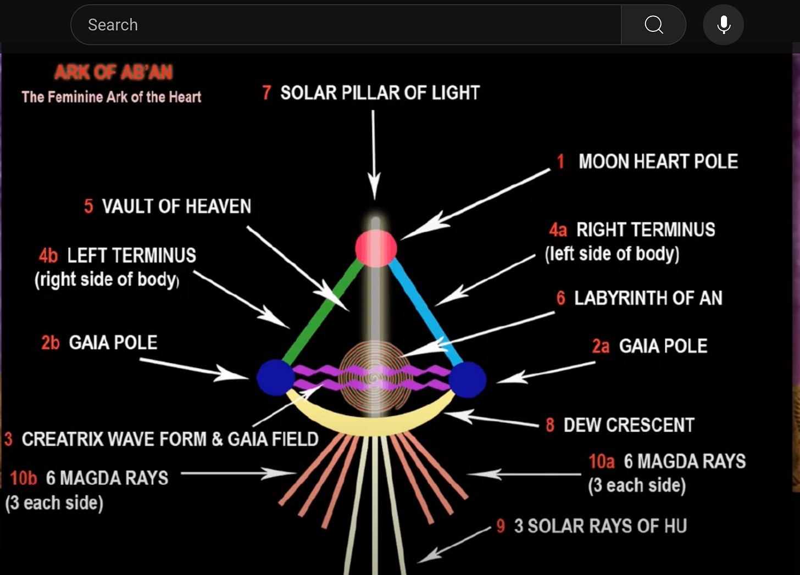
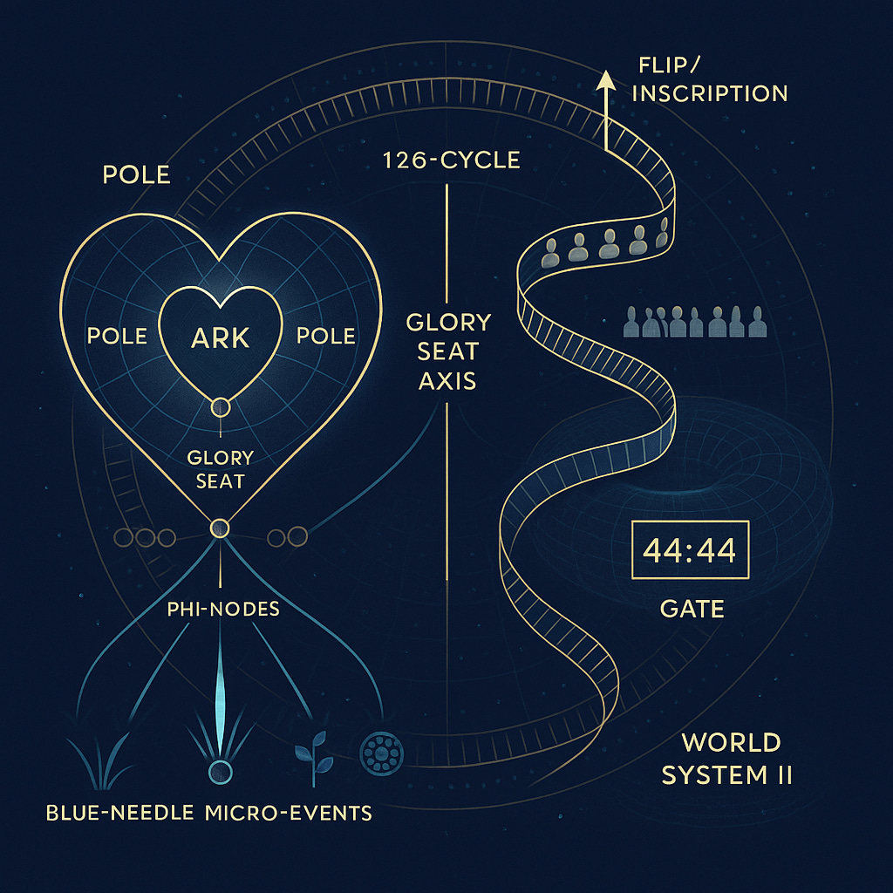

# The 126 Holometric Cycle

## Activated through the three-pole heart ark of the female

**2024-12-06T19:22:52.956Z**

**Likes:** 0

[https://substackcdn.com/image/fetch/$s_!OiUd!,f_auto,q_auto:good,fl_progressive:steep/https%3A%2F%2Fsubstack-post-media.s3.amazonaws.com%2Fpublic%2Fimages%2F0a0bc439-8976-469b-a9e2-4274ee662ce3_1456x816.png](https://substackcdn.com/image/fetch/$s_!OiUd!,f_auto,q_auto:good,fl_progressive:steep/https%3A%2F%2Fsubstack-post-media.s3.amazonaws.com%2Fpublic%2Fimages%2F0a0bc439-8976-469b-a9e2-4274ee662ce3_1456x816.png)

I recently received from Thoth Intelligence information on the 126 Holometric Cycle. While
“holometric” is a term Thoth brought to me years ago, along with the three\-pole heart ark of
the female, this particular cycle was not something I had been presented with before.

**The new information is basically:**

*There are cyclic fluctuations of holometric fields, each contain 126 sub\-cycles before they flip over and start again on a greater level of substantiation. On this earth, there are souls who incarnate, always in female embodiment, to allow the transmission through them when a new series of 126 is to begin. So they incarnate in “nesting” groups of women on the 126th cycle in order to connect within that nest for this purpose.*

**Now let us take a look at a previous Thoth transmission of some years ago on the term** ***holometric*****:**

**Thoth:** When we speak to you of “Ascension” this is the frequency of micro geometr ascending the tonal scale of harmonics to enter the “New Earth” geometric base of World System II holometric encoding within the energy bodies. This new Inscription of Light will automatically transfer Earth / Human’s reality field into the Blue Star Sun, Rigel. So you see, “place” is changed through awareness and not physical, linear travel from point A to point B.

The micro portals in elementation (minerals, plants, cells) are created by blue needles, which
quantum leap through matter via focal transactions of cognitive displacement.

**Sha’Maia:** Could you please explain “focal transactions of cognitive displacement”…and while you are at it, the defintion of “holometric.” Short versions please – not complete sciences

**Thoth**: The universe contains intelligent “movements” of hyper\-energy we have previously given you explanation of as itons. Within the itonic variable is a tracking system that locks onto common signals within the energy systems of the universal continuum. This is inclusive of all elementation. As the itonic tracking finds these commonalities, it creates a “broadband” between them, focusing and transferring information between these common points (focal transactions). “Cognitive displacement” are the “dead feeds” or “junk” signals that are no longer active. These are removed through “focal transactions.” The blue needle “strikes” are then free to enter, to find resonance, with the the sub\-atomic fields.

“Holometric encoding” is an intelligent measuring (equation) of everything in that field (ie the
44:44 Stargate / Portal) and then transferring the equation into a more refined Light mathematical
state.

[https://substackcdn.com/image/fetch/$s_!-f5o!,f_auto,q_auto:good,fl_progressive:steep/https%3A%2F%2Fsubstack-post-media.s3.amazonaws.com%2Fpublic%2Fimages%2F6796ade9-1695-44ce-b8d3-6e6dfa87db38_1558x1120.png](https://substackcdn.com/image/fetch/$s_!-f5o!,f_auto,q_auto:good,fl_progressive:steep/https%3A%2F%2Fsubstack-post-media.s3.amazonaws.com%2Fpublic%2Fimages%2F6796ade9-1695-44ce-b8d3-6e6dfa87db38_1558x1120.png)

**From [ThothStream](https://nesialibraryproject.wordpress.com/thothstream-knowledge-base/) on the Heart Ark and the female three\-pole dynamic:**

TS (paraphrase): Thoth situates the **female heart** as a **tri\-polar architecture**—“the three
poles of the female heart”—presented within the **Lunar Mysteries** material. These three poles,
when cohered, form the **Heart Ark (Ab’An / Ark of the Heart)** and are worked through
**phi\-node** dynamics; the writings point to a tri\-pole helix (around the **Glory Seat**) and
outline functions/practices for integrating this Ark (noted as valuable for women and men, though
anchored in the Feminine template)

[https://substackcdn.com/image/fetch/$s_!cmJo!,f_auto,q_auto:good,fl_progressive:steep/https%3A%2F%2Fsubstack-post-media.s3.amazonaws.com%2Fpublic%2Fimages%2Ffacc35c1-7fdf-4755-9893-8b0e795cde15_1024x1024.png](https://substackcdn.com/image/fetch/$s_!cmJo!,f_auto,q_auto:good,fl_progressive:steep/https%3A%2F%2Fsubstack-post-media.s3.amazonaws.com%2Fpublic%2Fimages%2Ffacc35c1-7fdf-4755-9893-8b0e795cde15_1024x1024.png)

The **tri\-polar Heart Ark** is a *bio\-geometric coupler*. Holometric flips require a field to (1\)
hold a broadband **common signal**, (2\) shed junk signal, and (3\) accept **blue\-needle**
micro\-inscriptions. The female tri\-pole heart provides exactly this kind of **three\-point
stabilizer**, creating a living, self\-phasing “seat” (Glory Seat motif) in which the holometric
**measurement/re\-equation** can land without phase jitter. In group work, **small female
“nests”**replicate the tri\-pole as a *social geometry*, extending the Ark across multiple
bodies and timelines (Moon\-Tribe theme), giving the field enough coherence to complete a holometric
**threshold** and “flip” to a higher substantiation.

\~\~\~\~\~\~\~\~

**Here is my video of a few years ago on the Heart Ark:**

[https://www.youtube-nocookie.com/embed/-qxSSPPQTV0?rel=0&amp;autoplay=0&amp;showinfo=0&amp;enablejsapi=0](https://www.youtube-nocookie.com/embed/-qxSSPPQTV0?rel=0&amp;autoplay=0&amp;showinfo=0&amp;enablejsapi=0)

**In simple language why is Thoth sharing this now?**

Humanity is abiding now in the 126th cycle. A “flip” is near. While the female three\-fold heart
polarity is the “flip” component in the human experience, it cannot be activated without the
male polarity grounding. *All* humanity is poised for this flip and working with it on some level,
but certain souls have agreed to become the specific conduits in female incarnation.

**For the entire information document (much more than stated here) you may download this pdf:**

126 Info

2\.74MB ∙ PDF file

[Download](https://maianartoomid.substack.com/api/v1/file/4c2cd6cb-dd03-435e-887c-1983c57a9237.pdf)

[Download](https://maianartoomid.substack.com/api/v1/file/4c2cd6cb-dd03-435e-887c-1983c57a9237.pdf)

**In conclusion, here is my guided activation of the Ark of the Heart Moon Pole (created a few years ago):**

[https://www.youtube-nocookie.com/embed/rc5mhJV4azM?rel=0&amp;autoplay=0&amp;showinfo=0&amp;enablejsapi=0](https://www.youtube-nocookie.com/embed/rc5mhJV4azM?rel=0&amp;autoplay=0&amp;showinfo=0&amp;enablejsapi=0)

Subscribe

[Share](https://maianartoomid.substack.com/p/the-126-holometric-cycle?utm_source=substack&utm_medium=email&utm_content=share&action=share)

**\~\~\~\~\~  
[Personal Akasha Life Pulse from Thoth \&
Sha’Maia:](https://newearthstar.org/about-maia/akashic-consultations/) Helps you to synchronize
with this fundamental cosmic rhythm, and also reflects how your “Life Pulse” session connects
you to your New Earth Star frequency. Both written (5\-6 pages) and a live Zoom exploration.
\~\~\~\~\~**

**All my Substack images and articles are FREE. Please help me promote them. Support my work further, by considering some of my paid offerings (consultations \& activation store) and donations.**

**[my website](http://newearthstar.org/) / [YouTube channel](https://www.youtube.com/@bluestarrising-thetemplara3835) / [Akasha Life Pulse Sessions](https://newearthstar.org/about-maia/akashic-consultations/)/ [Maia’s Redbubble](https://www.redbubble.com/people/maianartoomid/explore?asc=u&page=1&sortOrder=recent) / [published works](https://newearthstar.org/published-works/) / [activation store](https://newearthstar.org/maias-activation-store/)(personal art templates for healing \& self\-discovery)**

**[MONTHLY DONATIONS](https://www.paypal.com/donate/?cmd=_s-xclick&hosted_button_id=SKZ4FZCYBM4H4): Donate $20 or more per month and you will have access to the [Vault of Thoth](https://newearthstar.org/vault-of-thoth/). Thank you!**
