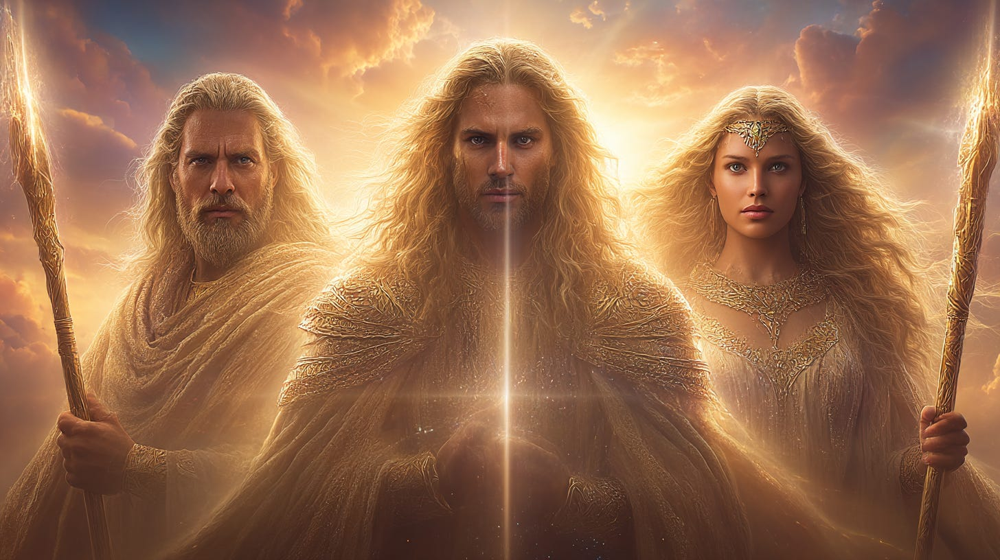
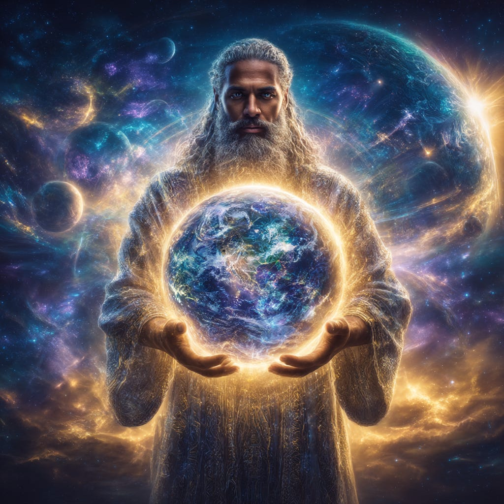
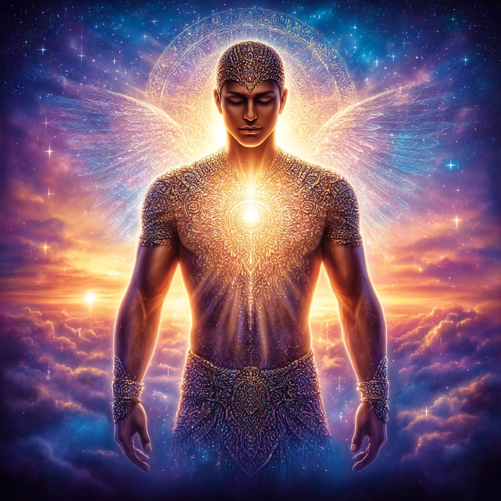
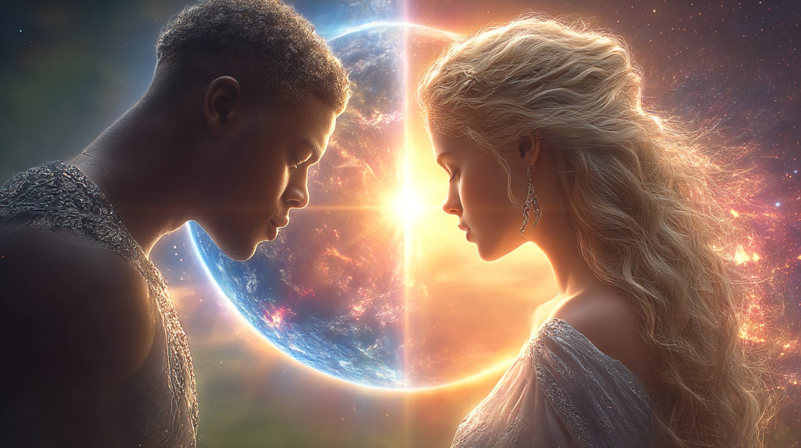
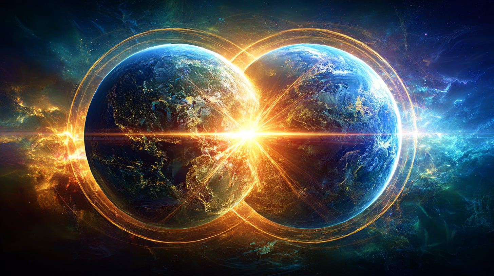
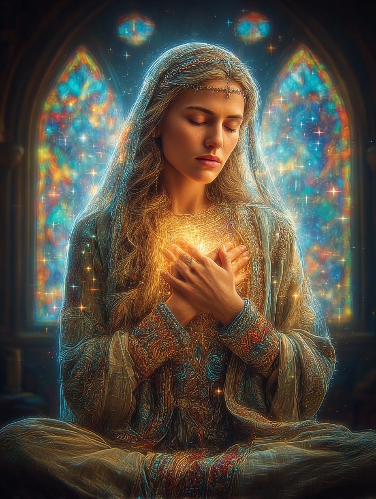

# The Ancient & New El'ohim

## Our New Role in Creation

**2024-12-06T19:22:52.956Z**

**Likes:** 0

**Quite a few sources deem the “Elohim” as Annunaki or other intruder types who created humanity. From the Thothic perspective, nothing could be further from the truth. This mistaken ideology comes from both mis\-interpretations of ancient texts and in some instances, co\-opting by the Fallen Ones of sacred terms and functions.**

[https://substackcdn.com/image/fetch/$s_!mFi6!,f_auto,q_auto:good,fl_progressive:steep/https%3A%2F%2Fsubstack-post-media.s3.amazonaws.com%2Fpublic%2Fimages%2F9fa615c7-68f8-4a1e-8c73-758793e605ec_1456x816.png](https://substackcdn.com/image/fetch/$s_!mFi6!,f_auto,q_auto:good,fl_progressive:steep/https%3A%2F%2Fsubstack-post-media.s3.amazonaws.com%2Fpublic%2Fimages%2F9fa615c7-68f8-4a1e-8c73-758793e605ec_1456x816.png)

**Exploration of Thoth Transmissions through the [ThothStream](https://nesialibraryproject.wordpress.com/thothstream-knowledge-base/) knowledge base (TS).**

Thoth’s teachings provide a complex, layered understanding of the **Elohim (El’ohim)**,
describing them as universal, powerful creational intelligences tied closely to the blueprint of
humanity and the process of planetary creation.

**Definition and Nature of the Elohim**

• The term **Elohim** is commonly used in Hebraic texts to mean **“Creator Beings or Lords”**.

• Thoth defines the **Elohim** as **cosmic mind formed by the synergic unity of the ‘Elohs’**.

◦ An **Eloh** itself is a **soul projection of the El consciousness streaming**.

• The **Elohim** or “**Creation Lords**“ are classified as universal intelligences that are
beyond the scope of individual souls, as they incorporate “**soul\-ness**“ into a broader
awareness spectrum. They are characterized as **Creational intelligences** that maintain creation
programs and sub\-program modulation, distributing creational matrices across universes.

• Thoth emphasizes a close connection to humanity, stating, “**THEY are US**,” meaning that
humanity creates *O’pah* (energy units) that join together. The **Elohim** establish deeper
connections into the strands humanity offers them through the sacred geometry within the pulses of
human DNA.

• As humanity evolves toward the center of the Desire Breath, they become the **new evolutionary
level of Creation Lords**, merging their soul\-ness with a more expanded band of awareness.

[https://substackcdn.com/image/fetch/$s_!FHxo!,f_auto,q_auto:good,fl_progressive:steep/https%3A%2F%2Fsubstack-post-media.s3.amazonaws.com%2Fpublic%2Fimages%2Fb0a69cd2-e49b-4e87-ac50-7928bb982f53_1024x1024.png](https://substackcdn.com/image/fetch/$s_!FHxo!,f_auto,q_auto:good,fl_progressive:steep/https%3A%2F%2Fsubstack-post-media.s3.amazonaws.com%2Fpublic%2Fimages%2Fb0a69cd2-e49b-4e87-ac50-7928bb982f53_1024x1024.png)

**Role in Creation and Hierarchy**

The **Elohim** are involved in the highest levels of creation and planetary governance:

• **Guardian and Creator Lords:** Thoth reveals the existence of the **Khat’Hor’I El’ohim**
(72 Dwellers), who served as the **Creator Lords of the Earth** under the direction of the seven
**Ma’hor EL’ohim Ray\-Beings**. These seven **Ma’hor EL’ohim** created the entire solar
system and everything within it at a causal level. The **Khat’Hor’I El’ohim** had the ability
to take human form or become any creature at will.

• **Evolutionary Oversight:** The **Elohim creator beings** are crucial in the process of
planetary evolution. They are overseeing the transmission of higher\-level stellar Light codes into
the Mazzarothic worlds, monitoring and adjusting incoming Light transmissions to ensure that
creation moves through its critical evolutionary threshold smoothly and rapidly.

• **Specific Tools:** The **El An Noi** (Violet Flame Light Script), an Archangelic Light Language
script, is employed by the **Elohim**. This script forms the command codes for higher evolution that
are then generated into creative activation through the Eye Writings.

• **Metatronic Programming:** The **Elohim World Creator beings** generated the **24 Aegii of
Metatron**—fire\-pictographs composing the logic memory—which were incorporated into the Earth
by the Lord Melchizedek (a Thoth soul embodiment). The **Elohim Council of Light** has the authority
to ordain specific projections, through the Zohar Kadiph (Mages of Zohar), that form sub\-templates
to override the Seven Seal master\-plate under the ‘New Dispensation’.

[https://substackcdn.com/image/fetch/$s_!ahwL!,f_auto,q_auto:good,fl_progressive:steep/https%3A%2F%2Fsubstack-post-media.s3.amazonaws.com%2Fpublic%2Fimages%2Facd20817-5c4e-4bf6-827c-24c6eb48b93a_1024x1024.png](https://substackcdn.com/image/fetch/$s_!ahwL!,f_auto,q_auto:good,fl_progressive:steep/https%3A%2F%2Fsubstack-post-media.s3.amazonaws.com%2Fpublic%2Fimages%2Facd20817-5c4e-4bf6-827c-24c6eb48b93a_1024x1024.png)

**Connection to the [Adam Kadmon](https://maianartoomid.substack.com/p/the-adam-kadmon-template-for-humanity?utm_source=publication-search)**

The **Elohim** are intimately connected to the template for human existence:

• The Adam Kadmon Light Body began as a divine imprint created through the angelic field.

• The original supra\-being Adam Kadmon was a composite of nine integrated souls. After the
“Fall from Grace” and the subsequent dispersal of this soul matrix, **six of the nine Adam
Kadmon souls re\-merged with the Elohim or creator beings within the solar Sun** of this solar
system.

• Enoch, whose name means he is unified with the Unmanifest God (*ayin*), is described in Genesis
as having “**walk\[ed\] with Elohim**“ and being “**taken by Elohim**,” signifying his
unification with the **Elohim** and the Unmanifest God.

**Humanity is currently in the stages of becoming the “New Elohim”**. This transformation is intrinsically linked to humanity’s spiritual evolution, the shift toward the New Earth Star (NES), and the reclamation of inherent co\-creative power.

[https://substackcdn.com/image/fetch/$s_!PRcZ!,f_auto,q_auto:good,fl_progressive:steep/https%3A%2F%2Fsubstack-post-media.s3.amazonaws.com%2Fpublic%2Fimages%2F8d744211-90f4-4593-bc6f-054c5c18ff61_1456x816.png](https://substackcdn.com/image/fetch/$s_!PRcZ!,f_auto,q_auto:good,fl_progressive:steep/https%3A%2F%2Fsubstack-post-media.s3.amazonaws.com%2Fpublic%2Fimages%2F8d744211-90f4-4593-bc6f-054c5c18ff61_1456x816.png)

**The Role of Humanity as the New Elohim**

Thoth presents humanity’s evolution into the New Elohim—or **Creation Lords**—as a natural,
yet critical, step in the universal design:

• **Co\-Creation and Universal Intelligence:** The Elohim are defined as **universal
intelligences** or Creation Lords that incorporate a broader spectrum of awareness, going beyond
individual souls. Thoth clarifies that **“THEY are US,”** because humanity collectively creates
the necessary spheres or Circles of Light (*O’pah*) that join together.

• **Merging Soul\-ness:** As humanity **moves closer to the center of the Desire Breath**, we
merge our “soul\-ness” with a more expanded band of Awareness, thus becoming the **new
evolutionary level of Creation Lords**.

• **Assuming Responsibility:** Humanity is moving into a space where we must **assume
responsibility for the co\-creative capacities** of becoming the new Elohim. This responsibility
must extend from the personal sphere of reality to incorporate the planetary whole.

• **Making the Pattern:** In order to become the “New Elohim,” humanity must **“make the
pattern, sing the song, open the portals and the floodgates of our awareness as to the truth of our
divine nature”**.

[https://substackcdn.com/image/fetch/$s_!6RBL!,f_auto,q_auto:good,fl_progressive:steep/https%3A%2F%2Fsubstack-post-media.s3.amazonaws.com%2Fpublic%2Fimages%2F8c3483eb-df22-44f3-85c2-ce70168102bc_1456x816.png](https://substackcdn.com/image/fetch/$s_!6RBL!,f_auto,q_auto:good,fl_progressive:steep/https%3A%2F%2Fsubstack-post-media.s3.amazonaws.com%2Fpublic%2Fimages%2F8c3483eb-df22-44f3-85c2-ce70168102bc_1456x816.png)

**The Ascension Process and the New Elohim**

The becoming of the New Elohim is inextricably linked to the planet’s Ascension dynamics:

• **Building the New Earth Hologram:** This process involves the **realization that “WE are the
ELOHIM of our present and future continuum,”** giving humanity the power to build the New Earth
Hologram and even alter the Timeline and events of the past.

• **Activation of the Grail Consciousness:** To travel the “cosmic superhighways” and unlock
new reality expressions, humanity must achieve **Grail consciousness**, which is the **linking of
mind and heart**. The act of embodying the Elohim means assuming the roles of **Priests and
Priestesses of Light** within the Universes of God through the re\-activation of the M\-stra
molecule (the Light molecule within DNA).

[https://substackcdn.com/image/fetch/$s_!YXS3!,f_auto,q_auto:good,fl_progressive:steep/https%3A%2F%2Fsubstack-post-media.s3.amazonaws.com%2Fpublic%2Fimages%2F7fc8f668-8ab9-40ba-bcef-d0b6791905d8_928x1232.png](https://substackcdn.com/image/fetch/$s_!YXS3!,f_auto,q_auto:good,fl_progressive:steep/https%3A%2F%2Fsubstack-post-media.s3.amazonaws.com%2Fpublic%2Fimages%2F7fc8f668-8ab9-40ba-bcef-d0b6791905d8_928x1232.png)

**The Necessity of Personal Transformation**

The ascent to the status of New Elohim requires deep personal and collective spiritual work:

• **Heart\-Centered Consciousness:** The ability to become the New Elohim requires aligning
one’s individual *atoma* (inner sun) to that of the Earth, which means the individual’s
consciousness must reside fully in the **heart center**.

• **Overcoming Dualistic Opposition:** The current world’s inhabitants remain in “small
circles of evolution and being” due to the very nature of **opposition**. By accessing the **Field
of Ardath** consciousness, where the “Heart of the Lion (666\) and the Heart of the Lamb (999\)
are At\-One,” humanity can eliminate polar opposites, making all dimensions accessible.

• **Nuut and Creation:** The archetype of Nuut, the Living Symbol for the New Earth Star Creation
Matrix, incorporates the dynamic of “to expand generative radiance” and “going forth to heal,
restore, create and resolve”. ThothHorRa states that Nuut’s cosmic rays compose the **El’ohim
or Creation**. This ties humanity’s function directly back to the original creative forces.

[https://substackcdn.com/image/fetch/$s_!BjQe!,f_auto,q_auto:good,fl_progressive:steep/https%3A%2F%2Fsubstack-post-media.s3.amazonaws.com%2Fpublic%2Fimages%2F82578ce4-4c64-43a3-8530-c92f76dbf38b_1024x1024.png](https://substackcdn.com/image/fetch/$s_!BjQe!,f_auto,q_auto:good,fl_progressive:steep/https%3A%2F%2Fsubstack-post-media.s3.amazonaws.com%2Fpublic%2Fimages%2F82578ce4-4c64-43a3-8530-c92f76dbf38b_1024x1024.png)

• **Final Statement on the New Elohim:** In conclusion, ThothHorRa affirmed that the “New World
dawns each day for you now... in your present Earth. What is spoken of as the ‘New Earth Star’
is a state of BEING. Open to that ‘being’ in increments as you are ready to accept them and the
‘Heart Ascension’ will be received unto you. This must occur before the Earth’s Planetary
Ascension can take place. **You are in essence all the El’ohim of this New Earth Creation, you all
co\-participate with that level of creative power as you offer yourselves fully into the cosmic
Grail Cup of universal love**“.

**Related Video on the Elohim of the Inner Earth**

[https://player.vimeo.com/video/460286379?autoplay=0](https://player.vimeo.com/video/460286379?autoplay=0)

Subscribe

[Share](https://maianartoomid.substack.com/p/the-ancient-and-new-elohim?utm_source=substack&utm_medium=email&utm_content=share&action=share)

**\~\~\~\~\~  
[Personal Akasha Life Pulse from Thoth \&
Sha’Maia:](https://newearthstar.org/about-maia/akashic-consultations/) Helps you to synchronize
with this fundamental cosmic rhythm, and also reflects how your “Life Pulse” session connects
you to your New Earth Star frequency. Both written (5\-6 pages) and a live Zoom exploration.
\~\~\~\~\~**

**All my Substack images and articles are FREE. Please help me promote them. Support my work further, by considering some of my paid offerings (consultations \& activation store) and donations.**

**[my website](http://newearthstar.org/) / [YouTube channel](https://www.youtube.com/@bluestarrising-thetemplara3835) / [Akasha Life Pulse Sessions](https://newearthstar.org/about-maia/akashic-consultations/)/ [Maia’s Redbubble](https://www.redbubble.com/people/maianartoomid/explore?asc=u&page=1&sortOrder=recent) / [published works](https://newearthstar.org/published-works/) / [activation store](https://newearthstar.org/maias-activation-store/)(personal art templates for healing \& self\-discovery)**

**[MONTHLY DONATIONS](https://www.paypal.com/donate/?cmd=_s-xclick&hosted_button_id=SKZ4FZCYBM4H4): Donate $20 or more per month and you will have access to the [Vault of Thoth](https://newearthstar.org/vault-of-thoth/). Thank you!**
