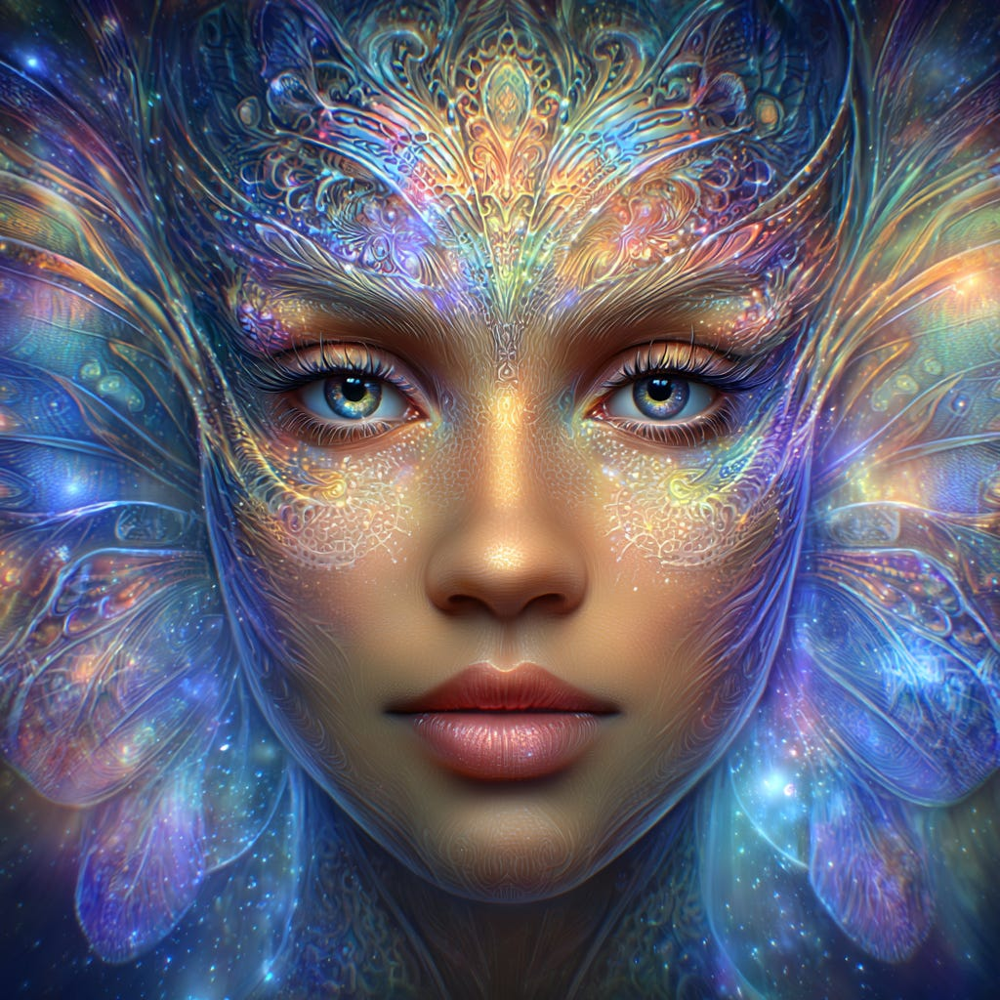
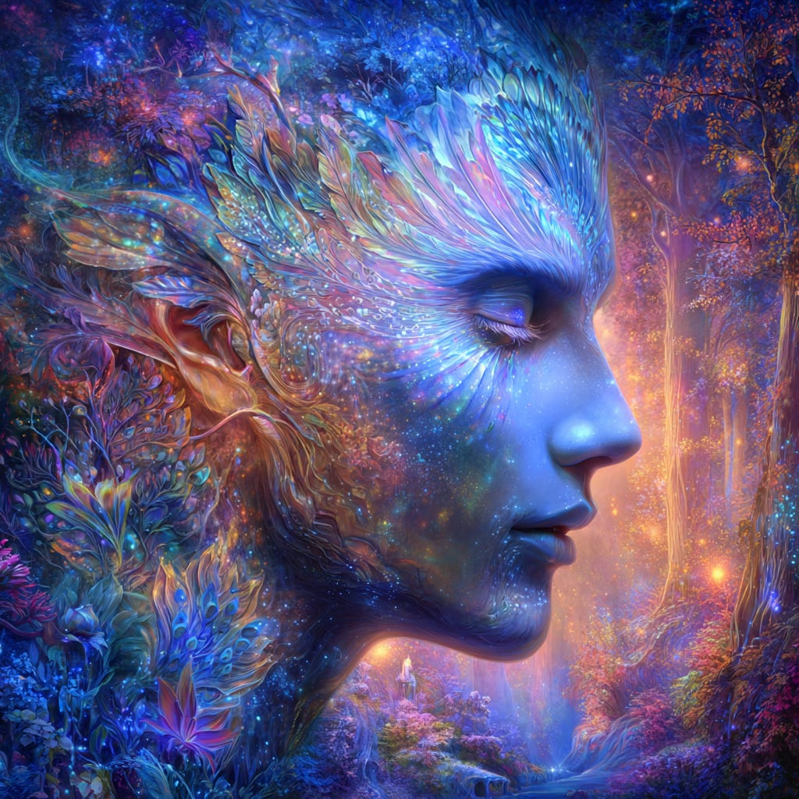
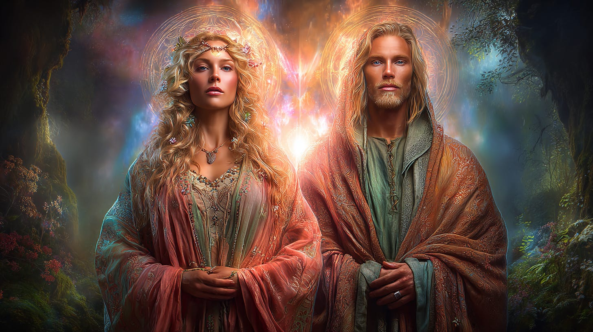
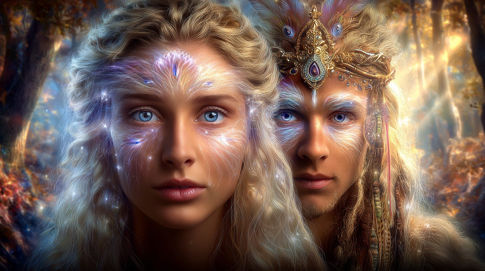
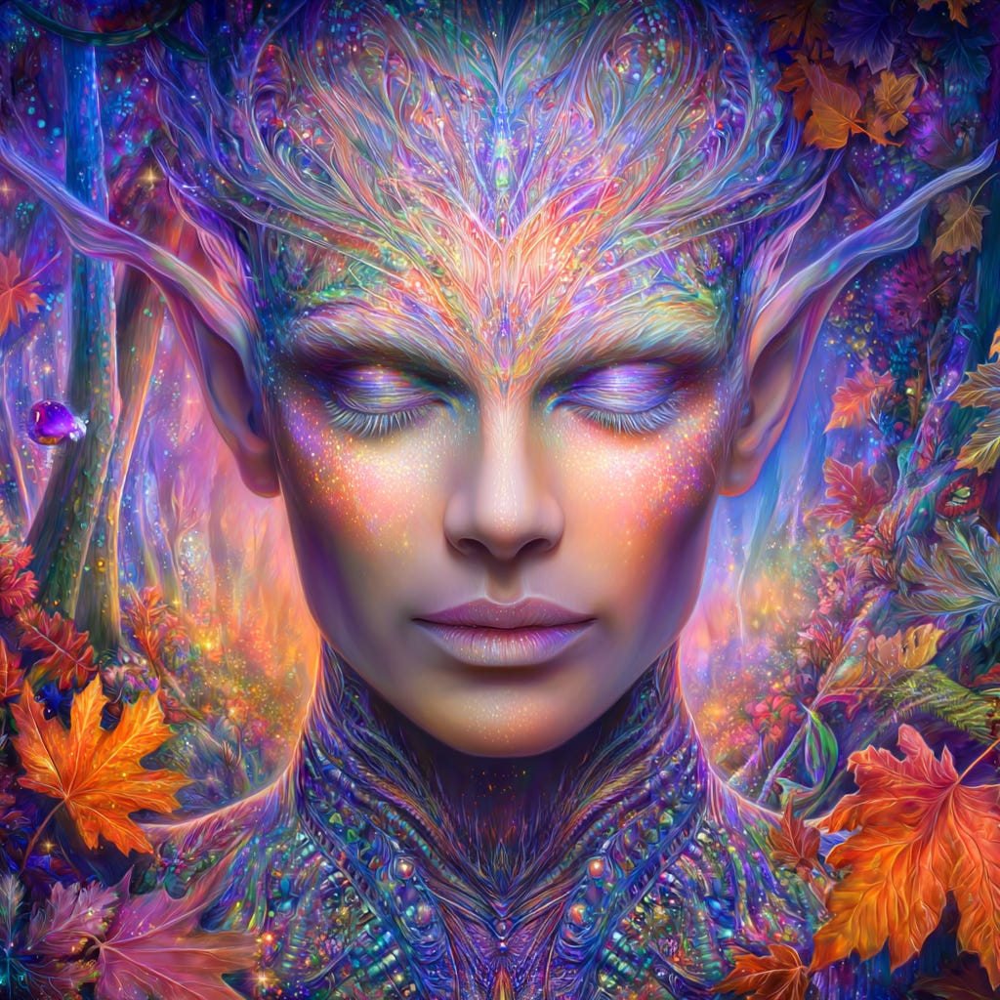
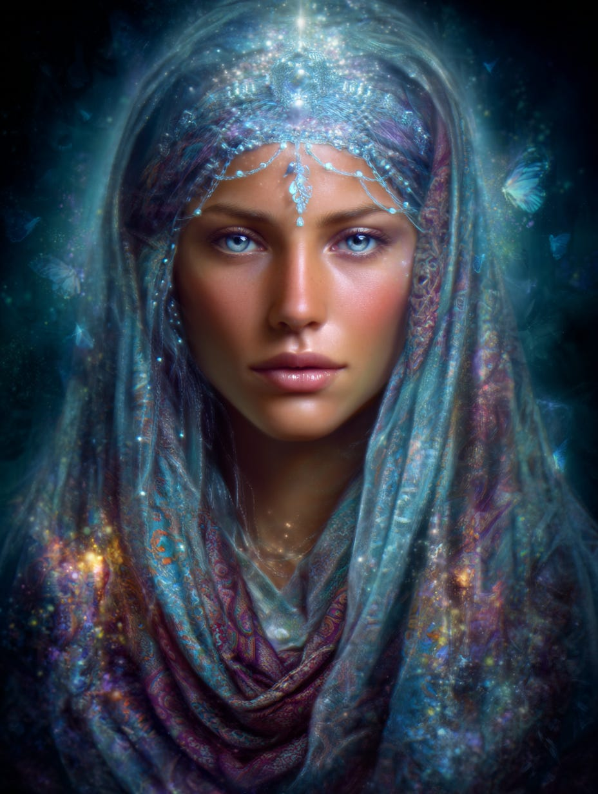
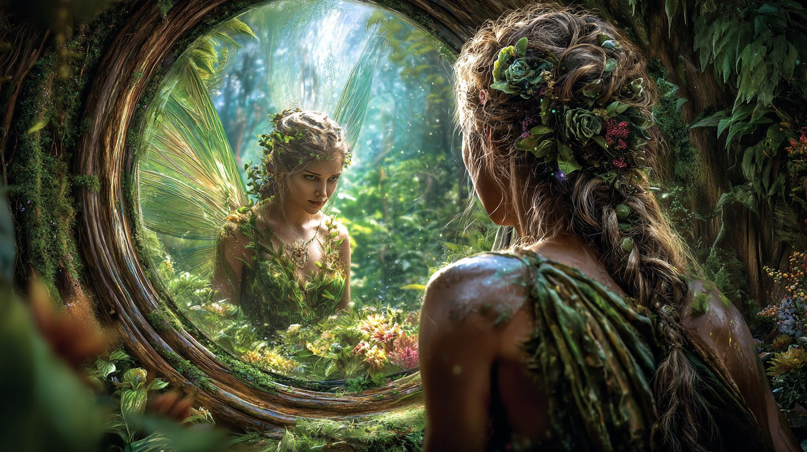

# The Faerie (Fairy)

## Your Personal Connection

**2024-12-06T19:22:52.956Z**

**Likes:** 0

***Before I discuss our personal connection to the Faeries, let us take a look at what the Thoth Intelligence has had to say about them in the past.***

[https://substackcdn.com/image/fetch/$s_!7gRN!,f_auto,q_auto:good,fl_progressive:steep/https%3A%2F%2Fsubstack-post-media.s3.amazonaws.com%2Fpublic%2Fimages%2Fb7091e21-1592-4da2-9630-20af8cc55e64_1024x1024.png](https://substackcdn.com/image/fetch/$s_!7gRN!,f_auto,q_auto:good,fl_progressive:steep/https%3A%2F%2Fsubstack-post-media.s3.amazonaws.com%2Fpublic%2Fimages%2Fb7091e21-1592-4da2-9630-20af8cc55e64_1024x1024.png)

**Exploration of Thoth Transmissions through the [ThothStream](https://nesialibraryproject.wordpress.com/thothstream-knowledge-base/) knowledge base (TS).**

**I. The Nature and Realms of Faerie/Fairy Beings**

Faeries and related beings are consistently described not merely as mythological figures, but as
real entities occupying different dimensions.

**Avalon and the Faerie Realm:**

• **Avalon** is known as the **“exclusive estate of the fairy world”**. It is an
inter\-dimensional reality anchored to the telluric currents converging at Glastonbury.

*\[note: Yet faeries are everywhere and not just in Avalon!\]*

• The doorway or portal to the Fairy Realm is referred to by Thoth as the **“Mer Door”**.

• Creatures known as mythic forms in this world, such as dragons, unicorns, mer folke, and
**faeries**, are defined as **true Nature Beings** who dwell unseen. Their existence and functions
are at the core of nature, although their forms have been somewhat shaped by human lore.

• These nature spirits are considered **Morphological devic beings** (etheric nature spirits).

• In the New Earth Star reality, the devas or **faerie** will interact freely with humanity.
Seraphina, Thoth’s Twin Ray Sarafana, noted that she came into this Earth originally through the
**NATURE GATE into the Realm of Deva (Fey)**. Fey Beings are noted for bringing **joy** and loving
in absolute splendor.

[https://substackcdn.com/image/fetch/$s_!0p8O!,f_auto,q_auto:good,fl_progressive:steep/https%3A%2F%2Fsubstack-post-media.s3.amazonaws.com%2Fpublic%2Fimages%2F7e43b489-e2f0-4ca4-a6cb-ad7be3bfc1d4_1024x1024.png](https://substackcdn.com/image/fetch/$s_!0p8O!,f_auto,q_auto:good,fl_progressive:steep/https%3A%2F%2Fsubstack-post-media.s3.amazonaws.com%2Fpublic%2Fimages%2F7e43b489-e2f0-4ca4-a6cb-ad7be3bfc1d4_1024x1024.png)

**Devic Consciousness and Perception:**

• **Faerie beings** are a form of **angelic energy embedded within planetary consciousness**.

• The highest organizers of Nature, called the **“High Devas,”** reside within the etheric
dimension.

• Children, having pure and open minds, are particularly able to connect with **nature spirits**
and experience these energies directly. Faeries sometimes flash into visual sight in the 3D,
especially for children whose energy fields are mutable with other dimensions.

**II. Faerie Races and Human/Fairy Genetics**

The sources detail specific races resulting from the mixture of human and faerie genetics:

[https://substackcdn.com/image/fetch/$s_!Qb8T!,f_auto,q_auto:good,fl_progressive:steep/https%3A%2F%2Fsubstack-post-media.s3.amazonaws.com%2Fpublic%2Fimages%2F893d8b07-0020-4164-8716-6bbf2a6a9638_1456x816.png](https://substackcdn.com/image/fetch/$s_!Qb8T!,f_auto,q_auto:good,fl_progressive:steep/https%3A%2F%2Fsubstack-post-media.s3.amazonaws.com%2Fpublic%2Fimages%2F893d8b07-0020-4164-8716-6bbf2a6a9638_1456x816.png)

**Tuatha De Dannan (Dannan):**

• The **Tuatha De Dannan** were a hybrid race (**part Faerie, part human**) of the ancient British
Isles.

• Their lineage involved a mixture of star genetics and human, specifically through the Tribe of
Dan.

• The Dannan were a tall blonde race whose human origins included Atlantean and Hyperborean
(Sirian) genetics.

• The Dannan tribe mixed with the **Faiere Race** there, becoming the Tuatha De’ Danann. They
became the **Dannan\-Sidhe** through inter\-mingling with the **Faery (Sidhe) Races**.

• They eventually **disappeared into caves and underground haunts**, intermingling with the
original **Sidhe\-Faerie nature beings** until both became one.

• The Dannan underwent a **lesser metamorphosis** when they entered the nature realm.

• The **Sidhe/Faerie/Devic consciousness** claims Fortingall, Scotland as one of their sacred
grounds, using it as a *Bhandra* (place of gathering and energy exchange).

[https://substackcdn.com/image/fetch/$s_!OeCB!,f_auto,q_auto:good,fl_progressive:steep/https%3A%2F%2Fsubstack-post-media.s3.amazonaws.com%2Fpublic%2Fimages%2F0156f231-d65c-47bc-9c86-ea5a5805f11f_1456x816.png](https://substackcdn.com/image/fetch/$s_!OeCB!,f_auto,q_auto:good,fl_progressive:steep/https%3A%2F%2Fsubstack-post-media.s3.amazonaws.com%2Fpublic%2Fimages%2F0156f231-d65c-47bc-9c86-ea5a5805f11f_1456x816.png)

**The Sidhe (Sídhe\-folk):**

• The mythological Tuath Dé eventually became the *aes sídhe* or **sídhe\-folk, which are the
“fairies”** of later folklore.

• **High Sidhe** are classified as **non\-human Faerie beyond elemental Devic consciousness**.

• The **Greater Tribes of the Sidhe** (High Fairies) are of divine elemental Fire, some possessing
crystallic bodies, who existed in dimensional folds long before the Dannan mixed with the **Lesser
Tribes of the Sidhe**. The *Daione Sidhe* are a Tribe of the Greater Sidhe capable of merging with
humans without genetic bonding.

• The mixing of human blood with **faerie beings** gave rise to the **Sidhe** and other
faerie\-human races.

• The **Lesser Sidhe** have genetically mutated through the Dannan.

• It is mentioned that there is a strain of **Fairy with pointed ears**.

• Many modern humans carry a certain amount of **fairy blood**, mostly through the Dannan\-Sidhe,
inclining them toward the **Fairy Realm** (like Avalon).

[https://substackcdn.com/image/fetch/$s_!R8aM!,f_auto,q_auto:good,fl_progressive:steep/https%3A%2F%2Fsubstack-post-media.s3.amazonaws.com%2Fpublic%2Fimages%2F54848c1d-84c9-460a-ba62-2dc8aa96cb71_1024x1024.png](https://substackcdn.com/image/fetch/$s_!R8aM!,f_auto,q_auto:good,fl_progressive:steep/https%3A%2F%2Fsubstack-post-media.s3.amazonaws.com%2Fpublic%2Fimages%2F54848c1d-84c9-460a-ba62-2dc8aa96cb71_1024x1024.png)

**III. Immortality and Spiritual Roles**

**Immortality and Transmorphing:**

• In the realm of **faire**, beings do not experience death as humans do.

• **Sidhe do not die**, even the hybrid strains containing mortal blood.

• Instead of dying, they eventually change form through a **morphing process** (transmorphing),
maintaining their chosen form through the **Transcription of Light**. They do not bear children in
the way humans do. Among themselves they cannot conceive at all but are able to with a human
partner, or a hybrid faerie\-human.

[https://substackcdn.com/image/fetch/$s_!OIOl!,f_auto,q_auto:good,fl_progressive:steep/https%3A%2F%2Fsubstack-post-media.s3.amazonaws.com%2Fpublic%2Fimages%2F009112be-7a1b-40a4-ade3-01d5baaa8231_928x1232.png](https://substackcdn.com/image/fetch/$s_!OIOl!,f_auto,q_auto:good,fl_progressive:steep/https%3A%2F%2Fsubstack-post-media.s3.amazonaws.com%2Fpublic%2Fimages%2F009112be-7a1b-40a4-ade3-01d5baaa8231_928x1232.png)

**Connection to Grail Legends and Merlin:**

• Merlin’s first child was conceived with a **Faery**, the seventh daughter of the **Faery Queen
of Avalon**.

• A **Faerie female** worked with Merlin and helped to weave the suspension grid about his matter
form when he retreated into suspended animation.

• The **true Morgana** or Morgha was an **Otherworld Faerie being/archetype** who, along with
Nimue (another of her kind), facilitated Merlin in his planetary work.

• The *hagor* barges, used for transportation to the Seven Star Islands of Avalon, were poled by
the *Kuutuym*, a small tribe of mixed human and **Elfin\-Faerie** origins. The *cuma’hargue* ships
were navigated by the **Tuatha De Dannan (human/Faerie)** and traveled into Avalon and the **world
of Faerie**.

[https://substackcdn.com/image/fetch/$s_!g3xW!,f_auto,q_auto:good,fl_progressive:steep/https%3A%2F%2Fsubstack-post-media.s3.amazonaws.com%2Fpublic%2Fimages%2F59776472-aab3-43a4-9632-db9985f0a46f_1456x816.png](https://substackcdn.com/image/fetch/$s_!g3xW!,f_auto,q_auto:good,fl_progressive:steep/https%3A%2F%2Fsubstack-post-media.s3.amazonaws.com%2Fpublic%2Fimages%2F59776472-aab3-43a4-9632-db9985f0a46f_1456x816.png)

**Sha’Maia 2025:** Snce many humans now have at least some Faerie blood, there are often “faerie pathways” in the ether for these humans to tap into and connect to that realm. It is possible that you have actual family ancestors in the Faerie Kingdom. Based on the Thothic transmissions in ThothStream, I requested a suggested process for an attunement to the Faerie Realm. This is only one way you might begin a dialogue with your Faerie Kindred. Follow what feel natural for you.

**Minute 1 — Center \& attune**

* Sit or stand comfortably. One slow breath in through the nose, out through the mouth.

* Bring attention to your heart\-center; imagine a small warm ember there.

* On three relaxed breaths, silently intend: *I come in humility and wonder to the Sidhe / Faiere, in right relation with Nature.*

**Minute 2 — Open the Avalon window**

* Sense a soft, living “green\-white” atmosphere around you (TS’s Avalon tone).

* Whisper (or think): *May a benevolent Faerie presence notice me across the Mer\-Veil for the good of Life.*

* Pause. Do nothing. Let the field “answer.”

**Minute 3 — Receive \& seal**

* Notice any gentle sign: a wave of warmth, light pressure, a flicker of image or name. Don’t chase it—just acknowledge.

* Offer one slow breath of gratitude from the heart.

* Seal it: touch the ground (or a leaf/stone) and say softly, *Thank you; I honor your realm and mine.*

**At this point you could request a communion directly with a Faerie ancestor.**

If you would like a digital art of one of your Faerie ancestors contact me:
**maia@newearthstar.org**

**RELATED VIDEO**

[https://www.youtube-nocookie.com/embed/AyauKmKiOak?rel=0&amp;autoplay=0&amp;showinfo=0&amp;enablejsapi=0](https://www.youtube-nocookie.com/embed/AyauKmKiOak?rel=0&amp;autoplay=0&amp;showinfo=0&amp;enablejsapi=0)

Subscribe

[Share](https://maianartoomid.substack.com/p/the-faerie-fairy?utm_source=substack&utm_medium=email&utm_content=share&action=share)

**\~\~\~\~\~  
[Personal Akasha Life Pulse from Thoth \&
Sha’Maia:](https://newearthstar.org/about-maia/akashic-consultations/) Helps you to synchronize
with this fundamental cosmic rhythm, and also reflects how your “Life Pulse” session connects
you to your New Earth Star frequency. Both written (5\-6 pages) and a live Zoom exploration.
\~\~\~\~\~**

**All my Substack images and articles are FREE. Please help me promote them. Support my work further, by considering some of my paid offerings (consultations \& activation store) and donations.**

**[my website](http://newearthstar.org/) / [YouTube channel](https://www.youtube.com/@bluestarrising-thetemplara3835) / [Akasha Life Pulse Sessions](https://newearthstar.org/about-maia/akashic-consultations/)/ [Maia’s Redbubble](https://www.redbubble.com/people/maianartoomid/explore?asc=u&page=1&sortOrder=recent) / [published works](https://newearthstar.org/published-works/) / [activation store](https://newearthstar.org/maias-activation-store/)(personal art templates for healing \& self\-discovery)**

**[MONTHLY DONATIONS](https://www.paypal.com/donate/?cmd=_s-xclick&hosted_button_id=SKZ4FZCYBM4H4): Donate $20 or more per month and you will have access to the [Vault of Thoth](https://newearthstar.org/vault-of-thoth/). Thank you!**
