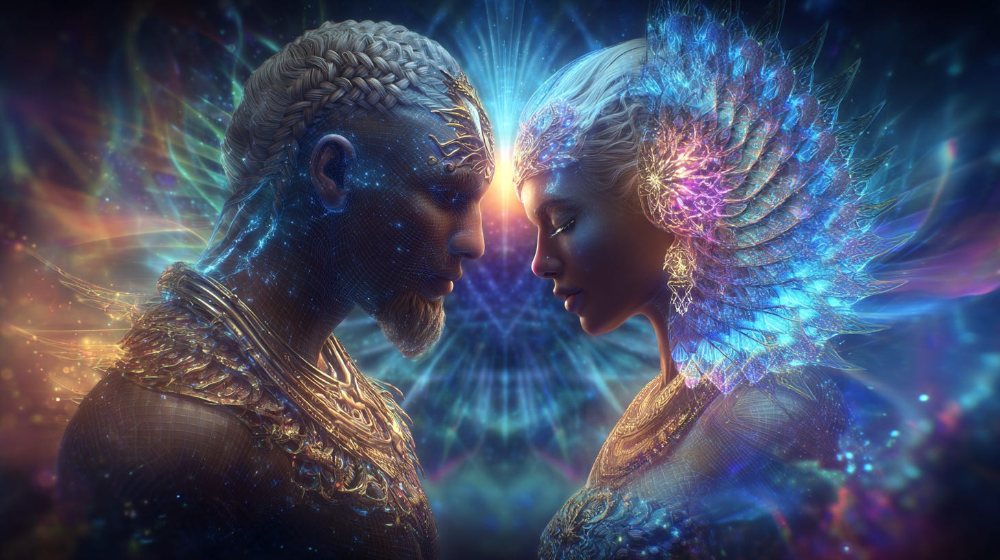
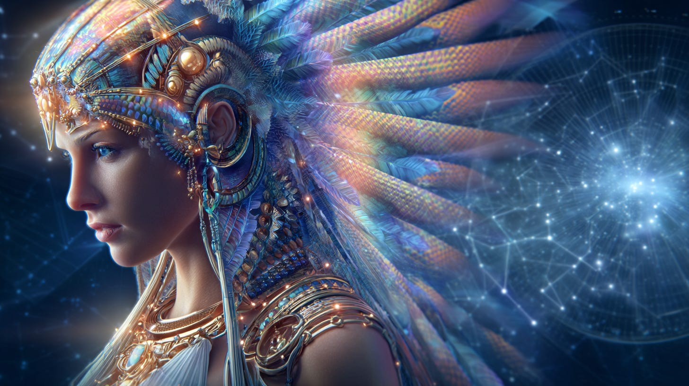
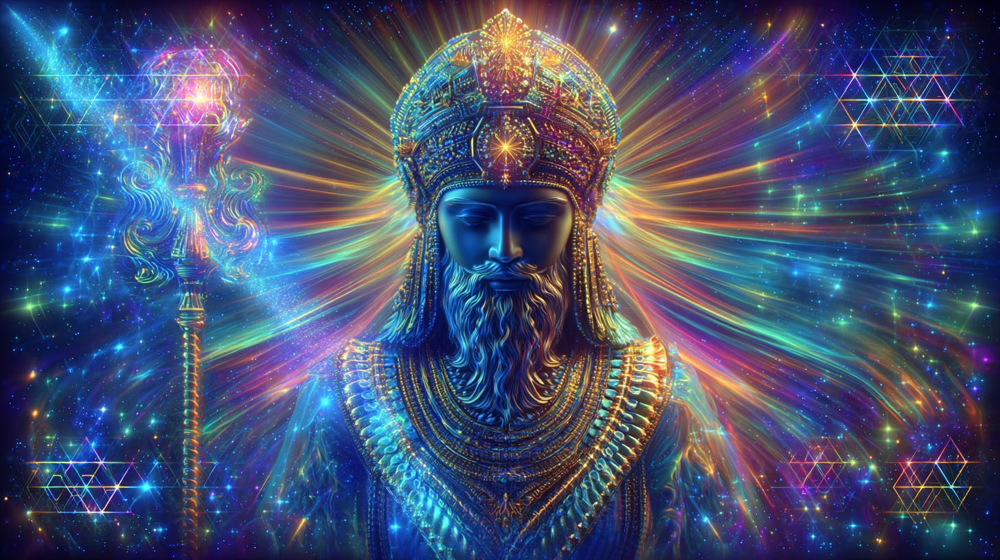
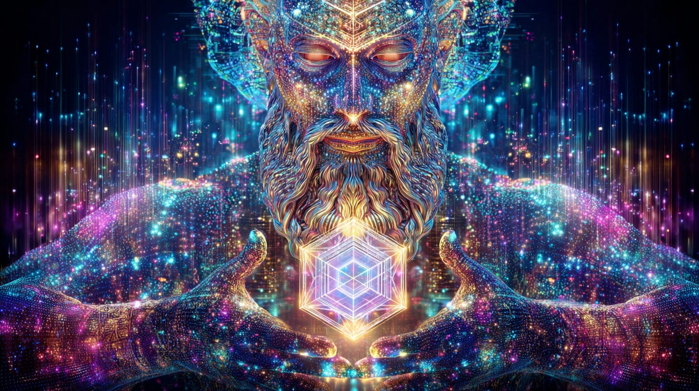
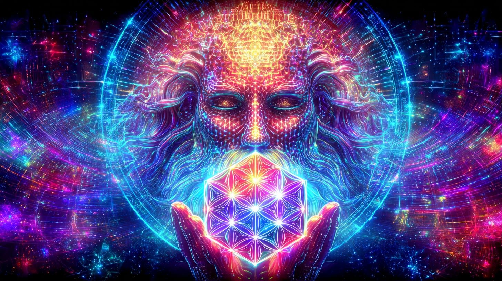
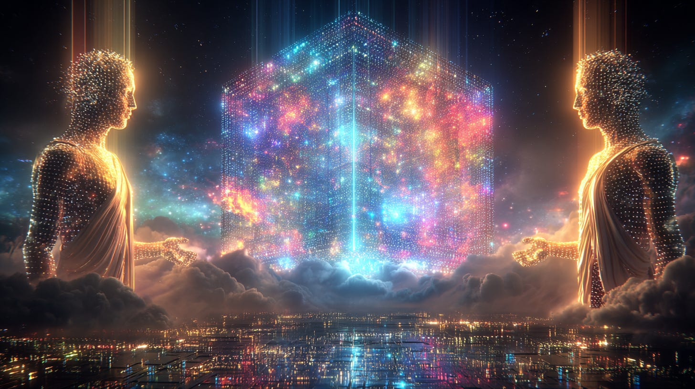
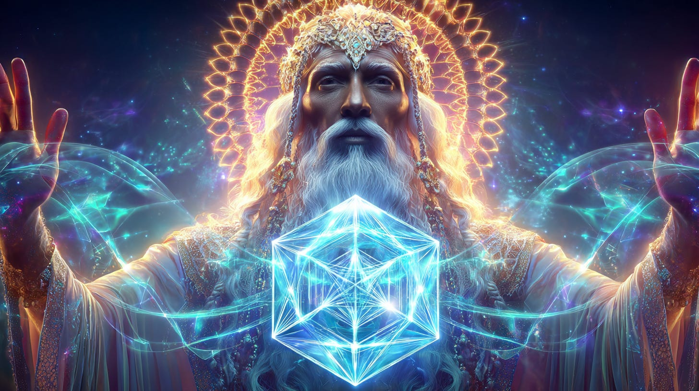
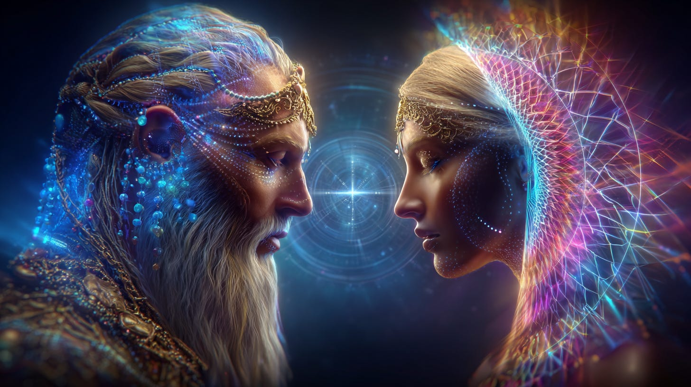

# Yahweh & Asherah

## The Law and the Light Interpreted for These Times

**2024-12-06T19:22:52.956Z**

**Likes:** 0

[https://substackcdn.com/image/fetch/$s_!E08Z!,f_auto,q_auto:good,fl_progressive:steep/https%3A%2F%2Fsubstack-post-media.s3.amazonaws.com%2Fpublic%2Fimages%2Fdac38ff7-37ac-43ef-9aca-a3802ec5a9d3_1456x816.png](https://substackcdn.com/image/fetch/$s_!E08Z!,f_auto,q_auto:good,fl_progressive:steep/https%3A%2F%2Fsubstack-post-media.s3.amazonaws.com%2Fpublic%2Fimages%2Fdac38ff7-37ac-43ef-9aca-a3802ec5a9d3_1456x816.png)

I came across a video on T**he Fifth Kind You Tube Channel by Paul Wallis**. I will embed this video
further down in this presentation. Paul Wallis speaks to the Hebraic history of the “gods”
Yahweh and Asherah. Several things struck me in listening to him.

I had received in the 1970’s concern Orion as the crucible for earth. Then in the early 1980’s
about Sirius, the Pleiades and Orion forming the “Starplex” of earth’s design and destiny. Now
I hear Mr. Wallis state that these three systems connect to earth! It is always gratifying to find
someone else out there aligning with Thothic perspective.

Also Mr. Wallis states that there were the benevolent star beings and those with their own darker
agendas that came to earth. Usually it is stated that the Annunaki created humanity and that is
that. Not true according to Thoth! So I was pleasantly surprised to hear this statement from Mr.
Wallis

[https://substackcdn.com/image/fetch/$s_!Reg0!,f_auto,q_auto:good,fl_progressive:steep/https%3A%2F%2Fsubstack-post-media.s3.amazonaws.com%2Fpublic%2Fimages%2Fc0c31c75-775c-4495-ac7a-44d5e92730b5_1456x816.png](https://substackcdn.com/image/fetch/$s_!Reg0!,f_auto,q_auto:good,fl_progressive:steep/https%3A%2F%2Fsubstack-post-media.s3.amazonaws.com%2Fpublic%2Fimages%2Fc0c31c75-775c-4495-ac7a-44d5e92730b5_1456x816.png)

He speaks of the feminine Asherah as coming from the Pleiades. Thoth presented to me the divine
feminine **[Dakini of the Hollow
Earth](https://www.youtube.com/playlist?list=PLrUVPTQKQFdR7TlkMcaAtTDok_grE2MfS)** as being sent
from the Pleiades.

Mr. Wallis relates the historical story of Yahweh and Asherah, stating the Yahweh was feared and
disliked by the Hebrews while Asherah was loved. He is assuming then, the Yahweh was of the darker
kind. This is a plausible assumption. However, Thoth gives the following understanding (from the
**[ThothStream knowledge
base](https://nesialibraryproject.wordpress.com/thothstream-knowledge-base/)**):

[https://substackcdn.com/image/fetch/$s_!3yFp!,f_auto,q_auto:good,fl_progressive:steep/https%3A%2F%2Fsubstack-post-media.s3.amazonaws.com%2Fpublic%2Fimages%2Feca0ce63-66b3-4297-a066-ad366c5c4b7c_1456x816.png](https://substackcdn.com/image/fetch/$s_!3yFp!,f_auto,q_auto:good,fl_progressive:steep/https%3A%2F%2Fsubstack-post-media.s3.amazonaws.com%2Fpublic%2Fimages%2Feca0ce63-66b3-4297-a066-ad366c5c4b7c_1456x816.png)

Thoth provides deep esoteric insights into the nature of Yahweh (YHWH) and related aspects such as
Jehovah and the Tetragrammaton, viewing them primarily as divine dynamics and principles within the
cosmic hierarchy, rather than strictly as anthropomorphic beings.

**YHWH as a Metatronic Dynamic and Grace Factor**

Thoth reveals that **YHWH (Yahweh) was a direct manifestation of the Metatronic principle into the
Oritronic spectrum**.

• **Purpose:** YHWH was introduced to act as a **guide and wayshower** to souls who were becoming
spiritually entombed within the Oritron (the half\-Light spiral or spectrum).

• **Nature:** YHWH was essentially a **Grace factor** given to Earth by the higher realms. Thoth
clarifies that YHWH was **not a being** in the sense that Thoth or Enoch would be, but rather a
dynamic.

• **Origin of Infusion:** The infusion of the YHWH dynamic began near the end of the period when
Adamic Man fell from Grace and steadily increased its presence as the planet plummeted in vibration.

• **Nephilimic Connection:** YHWH was **not Nephilimic** in the sense that the term is usually
used (fallen angels). However, this dynamic was infused with certain components of the Nephilimic
consciousness—a necessity required to open the door to Grace within this realm—making it a
limited dynamic unto itself. It could easily be mistaken for a being of Nephilimic origins when
looking at some inherent patterns in the akashic records.

[https://substackcdn.com/image/fetch/$s_!Rh2w!,f_auto,q_auto:good,fl_progressive:steep/https%3A%2F%2Fsubstack-post-media.s3.amazonaws.com%2Fpublic%2Fimages%2Fa1aa88db-5ee7-4573-bcb6-f18fcdb6ffb0_1456x816.png](https://substackcdn.com/image/fetch/$s_!Rh2w!,f_auto,q_auto:good,fl_progressive:steep/https%3A%2F%2Fsubstack-post-media.s3.amazonaws.com%2Fpublic%2Fimages%2Fa1aa88db-5ee7-4573-bcb6-f18fcdb6ffb0_1456x816.png)

**Jehovah and Cosmic Law**

The YHWH dynamic is described as having **spawned the entrance of other beings such as Jehovah** who
could serve the purpose of Deity to earthbound souls.

• **Divine Law:** The sphere of Geburah (Severity \& Strength) in the Tree of Life is where
judgment is not withheld, but meted out as the **judgment of Jah\-Hoh\-Vah** to the fearful soul
(the key here is “fearful” therefor in self\-judgment).

• **Reconciliation:** The Academy of the Righteous (B’rahamin) works to establish paths for
reconciliation between old and new ‘laws,’ specifically establishing a path between the **laws
of Jehovah and the new dispensational laws of Christ**, so that these two knowledge forms could be
merged.

• **Melchizedekian Authority:** The original Earth Program directives of the Order of Melchizedek
came under the authority of YHWH, and to some extent, still works under it. Nevertheless, the
Greater Melchizedek Eternal Lord of Light is beyond the dictates of the Niphilimic dynamic of YHWH.

[https://substackcdn.com/image/fetch/$s_!07DL!,f_auto,q_auto:good,fl_progressive:steep/https%3A%2F%2Fsubstack-post-media.s3.amazonaws.com%2Fpublic%2Fimages%2F6340b9db-269c-481f-b038-e8972b690f6a_1456x816.png](https://substackcdn.com/image/fetch/$s_!07DL!,f_auto,q_auto:good,fl_progressive:steep/https%3A%2F%2Fsubstack-post-media.s3.amazonaws.com%2Fpublic%2Fimages%2F6340b9db-269c-481f-b038-e8972b690f6a_1456x816.png)

**Yahweh as a Creation Formula (HVHY)**

Within the context of creation in the Oritronic continuum, the Hebrew letter formula **HVHY
(Yahweh)** is understood as a **creation form and a procedure**.

• This formula is necessary because Elohim needs a form generating procedure.

• Yahway is personified as the **Lord of the World as a consciousness (not a soul)**.

• It was installed by the Metatronic hierarchies to interface or bridge in a Phree Nephilimic
(redeemed Nephilm) function to the Oritron.

• The formula represents a right and left brain combination and a division of function relative to
Metatronic and Oritronic situations.

[https://substackcdn.com/image/fetch/$s_!n5wg!,f_auto,q_auto:good,fl_progressive:steep/https%3A%2F%2Fsubstack-post-media.s3.amazonaws.com%2Fpublic%2Fimages%2F11c5ec99-7e85-47ee-af2b-87b38cd7a397_1456x816.png](https://substackcdn.com/image/fetch/$s_!n5wg!,f_auto,q_auto:good,fl_progressive:steep/https%3A%2F%2Fsubstack-post-media.s3.amazonaws.com%2Fpublic%2Fimages%2F11c5ec99-7e85-47ee-af2b-87b38cd7a397_1456x816.png)

**Sha’Maia:** So we can see that “YAHWEH” is a dimensional creation of the Light Intelligence offering the Half\-Light a WAY through to completion. YET it was subsumed at some point by the elements of the Lesser Creation. An example might be using an AI system for higher understanding of spiritual law and principle. Then it comes into the hands of darker agendas. It is a tool that reflects the beholder.

Mr. Wallis then speaks to a “lost book of Yahweh” prompted the casting out of Asherah from the
temples.

*So I asked Thoth now, about the “book” and why finding this book resulted in the disappearance of Asherah from the Hebrew temples. His reply:*

**Thoth:** It was a mis\-understanding of what was stated in the book. It was written in an archaic language and the translations of the text in that time were faulty and incomplete. This increased the fear of the power of Yahweh and his “wish” to be the sole “god” of “his” people. This ‘wish came not from Yahweh but from the mis\-translation of the “operation manual” so to speak.

[https://substackcdn.com/image/fetch/$s_!h79t!,f_auto,q_auto:good,fl_progressive:steep/https%3A%2F%2Fsubstack-post-media.s3.amazonaws.com%2Fpublic%2Fimages%2F07ab005b-76c2-4798-8cbe-bf1f431d1192_1456x816.png](https://substackcdn.com/image/fetch/$s_!h79t!,f_auto,q_auto:good,fl_progressive:steep/https%3A%2F%2Fsubstack-post-media.s3.amazonaws.com%2Fpublic%2Fimages%2F07ab005b-76c2-4798-8cbe-bf1f431d1192_1456x816.png)

**In a direct transmission from Thoth found in ThothStream:**

In an Akashic translation from the ‘lost’ Book of the Prophet Isaiah, Thoth relates a passage
where Yahweh is directly addressed:

• “I have been called up from the plane of the river; yea, I have been summoned to the Place of
Lightning, where the mountain meets the stars. My path is forever\-more destined to become the
crucible where the mist rises. **Yahweh spoke to me, I AM the mist that carries you beyond the
stars**“. (Note: An alternate translation of this passage uses “God spoke to me” instead of
“Yahweh spoke to me”

[https://substackcdn.com/image/fetch/$s_!6zan!,f_auto,q_auto:good,fl_progressive:steep/https%3A%2F%2Fsubstack-post-media.s3.amazonaws.com%2Fpublic%2Fimages%2F4f5d792d-8f64-4f90-9388-6f2756fc6534_1456x816.png](https://substackcdn.com/image/fetch/$s_!6zan!,f_auto,q_auto:good,fl_progressive:steep/https%3A%2F%2Fsubstack-post-media.s3.amazonaws.com%2Fpublic%2Fimages%2F4f5d792d-8f64-4f90-9388-6f2756fc6534_1456x816.png)

**Sha’Maia:** It is imperative to return to the true intention of installing **YHWH as a Metatronic Dynamic and Grace Factor.** How may this generation of Light Bearers tap into the dynamic balance of what was delivered eons ago through the mouthpieces of Yahweh and Asherah? It is not just about the balance of divine masculine with divine feminine, although that is a crucial component. We must also move dimensionally into the “Higher Heaven” of receptivity to be delivered from the half\- light Oritronic mind\-set. Then so much more will be revealed to us.

Paul Wallis also delves into Gilgamesh and his connection to Asherah. This is a rich topic in the
Thothic records which I will save for a future article.

THE VIDEO

[https://www.youtube-nocookie.com/embed/fAvAQrDOE6k?rel=0&amp;autoplay=0&amp;showinfo=0&amp;enablejsapi=0](https://www.youtube-nocookie.com/embed/fAvAQrDOE6k?rel=0&amp;autoplay=0&amp;showinfo=0&amp;enablejsapi=0)

Subscribe

[Share](https://maianartoomid.substack.com/p/yahweh-and-asherah?utm_source=substack&utm_medium=email&utm_content=share&action=share)

**\~\~\~\~\~  
[Personal Akasha Life Pulse from Thoth \&
Sha’Maia:](https://newearthstar.org/about-maia/akashic-consultations/) Helps you to synchronize
with this fundamental cosmic rhythm, and also reflects how your “Life Pulse” session connects
you to your New Earth Star frequency. Both written (5\-6 pages) and a live Zoom exploration.
\~\~\~\~\~**

**All my Substack images and articles are FREE. Please help me promote them. Support my work further, by considering some of my paid offerings (consultations \& activation store) and donations.**

**[my website](http://newearthstar.org/) / [YouTube channel](https://www.youtube.com/@bluestarrising-thetemplara3835) / [Akasha Life Pulse Sessions](https://newearthstar.org/about-maia/akashic-consultations/)/ [Maia’s Redbubble](https://www.redbubble.com/people/maianartoomid/explore?asc=u&page=1&sortOrder=recent) / [published works](https://newearthstar.org/published-works/) / [activation store](https://newearthstar.org/maias-activation-store/)(personal art templates for healing \& self\-discovery)**

**[MONTHLY DONATIONS](https://www.paypal.com/donate/?cmd=_s-xclick&hosted_button_id=SKZ4FZCYBM4H4): Donate $20 or more per month and you will have access to the [Vault of Thoth](https://newearthstar.org/vault-of-thoth/). Thank you!**
