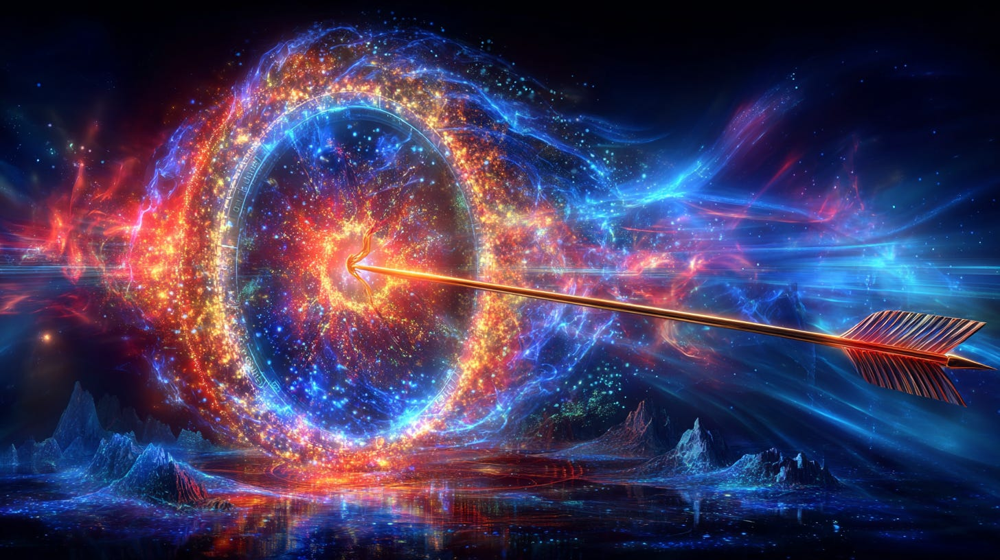

# 3I/Atlas & Sagittarius

## a Thothic Perspective

**2024-12-06T19:22:52.956Z**

**Likes:** 0

[https://substackcdn.com/image/fetch/$s_!pNM_!,f_auto,q_auto:good,fl_progressive:steep/https%3A%2F%2Fsubstack-post-media.s3.amazonaws.com%2Fpublic%2Fimages%2F0a54a632-a6a1-439d-b1b1-4c46487a2ae9_1456x816.png](https://substackcdn.com/image/fetch/$s_!pNM_!,f_auto,q_auto:good,fl_progressive:steep/https%3A%2F%2Fsubstack-post-media.s3.amazonaws.com%2Fpublic%2Fimages%2F0a54a632-a6a1-439d-b1b1-4c46487a2ae9_1456x816.png)

3I/Atlas comes from the universal plane of Sagittarius. In the message from Thoth given recently which is in the article 3I/ **[Atlas \& the True Nature of Comet](https://maianartoomid.substack.com/p/3iatlas-and-the-true-nature-of-comets)**[s](https://maianartoomid.substack.com/p/3iatlas-and-the-true-nature-of-comets), he states:

*This object has not been sent from far away, traveling eons through time and space. It has come through a Stargate. It is a merkabah intended to adjust the frequencies within our sun and also the central sun atomas of several of our solar systems planets. It comes from the **[Trapezium of Orion](https://nesialibraryproject.wordpress.com/trapezium-of-orion/)** (again, not directly but through a Stargate). Yet it must follow a specific trajectory in space/time in order to effectively perform its programmed purpose.* **([read full message](http://xhttps://maianartoomid.substack.com/p/3iatlas-and-the-true-nature-of-comets)**).

More clearly stated, while this object is coming out of the Sagittarius plane, it originates
ultimately from the Trapezium of Orion.

[https://substackcdn.com/image/fetch/$s_!KcW_!,f_auto,q_auto:good,fl_progressive:steep/https%3A%2F%2Fsubstack-post-media.s3.amazonaws.com%2Fpublic%2Fimages%2F3b24e122-b259-4e68-9a51-ce17e34a0444_1456x816.png](https://substackcdn.com/image/fetch/$s_!KcW_!,f_auto,q_auto:good,fl_progressive:steep/https%3A%2F%2Fsubstack-post-media.s3.amazonaws.com%2Fpublic%2Fimages%2F3b24e122-b259-4e68-9a51-ce17e34a0444_1456x816.png)

**The two videos below I made a few years ago from transmissions of many years previous. They give detailed information on the dimensional program of Light Sagittarius upholds in the holographic universe. As a prelude from the [ThothStream knowledge base](https://nesialibraryproject.wordpress.com/thothstream-knowledge-base/)**:

Thoth frames Sagittarius as the portal of the inviolate Spirit within an incarnate soul—the chief
“insertion point” through which higher inspiration descends. In the Lemurian/Atlantean lens, its
gate keeps the stream of divine prompting steady and pure.

In sky\-mythic timing, Thoth notes the 13\-sign doorway that “flashes” between Ophiuchus (placed
between Scorpio and Sagittarius) and Delphinus at the Dark Rift of the Milky Way—context that
highlights Sagittarius’ proximity to thresholds where transmissions pivot dimensions. He further
comments on our system’s nexus with the Sagittarius Dwarf galaxy and the Milky Way, reading that
junction as part of the larger orchestration by which Earth engages higher harmonics—another
backdrop to why this sector of sky bears initiatory charge.

Reasoning outline:

* Sagittarius \= Spirit\-gate for divine inspiration (TS zodiacal teaching).

* Its Grail/tribal correlation \= way\-opener pattern (Philip/Gad).

* Nearby “flash\-point” dynamics (Ophiuchus/Dark Rift) deepen its threshold symbolism.

Working Sagittarius consciously means tending the inner channel where inspiration enters—then
carrying it forward as service and right action.

[https://substackcdn.com/image/fetch/$s_!Aodl!,f_auto,q_auto:good,fl_progressive:steep/https%3A%2F%2Fsubstack-post-media.s3.amazonaws.com%2Fpublic%2Fimages%2F7fd66430-0043-4641-9f74-1fc6fa304cb3_1456x816.png](https://substackcdn.com/image/fetch/$s_!Aodl!,f_auto,q_auto:good,fl_progressive:steep/https%3A%2F%2Fsubstack-post-media.s3.amazonaws.com%2Fpublic%2Fimages%2F7fd66430-0043-4641-9f74-1fc6fa304cb3_1456x816.png)

The “Galactic Center” in Sagittarius is a PRESENCE—an ordering current (the galaxy’s
“Cross”) streaming from the black\-hole hub that can now reach Earth more directly. This shift
lets the Yushuda/Christic phases penetrate deeper into the planetary atoma, opening a new path for
matter’s transcendence and a rebirth into the New Earth Hologram.

He marks a demarcation whereby the Milky Way’s pull becomes dominant (2012\), flipping the
ridge’s polarity and birthing new stargates and grids—hence widespread disorientation alongside
rapid systems\-change.

***Practically, the Sagittarius stargate aligns to Galactic Centre and carries codes to re\-align our galaxy with the Central Hub—why work in this sector is initiatory and corrective.***

THE VIDEOS

[https://www.youtube-nocookie.com/embed/jTkzvw6JBHw?rel=0&amp;autoplay=0&amp;showinfo=0&amp;enablejsapi=0](https://www.youtube-nocookie.com/embed/jTkzvw6JBHw?rel=0&amp;autoplay=0&amp;showinfo=0&amp;enablejsapi=0)

[https://www.youtube-nocookie.com/embed/QEg3LkGYM6Q?rel=0&amp;autoplay=0&amp;showinfo=0&amp;enablejsapi=0](https://www.youtube-nocookie.com/embed/QEg3LkGYM6Q?rel=0&amp;autoplay=0&amp;showinfo=0&amp;enablejsapi=0)

Subscribe

[Share](https://maianartoomid.substack.com/p/3iatlas-and-sagittarius?utm_source=substack&utm_medium=email&utm_content=share&action=share)

**\~\~\~\~\~**

**[Personal Akasha Life Pulse from Thoth \& Sha’Maia:](https://newearthstar.org/about-maia/akashic-consultations/) Helps you to synchronize with this fundamental cosmic rhythm, and also reflects how your “Life Pulse” session connects you to your New Earth Star frequency. Both written (5\-6 pages) and a live Zoom exploration.**

**\~\~\~\~\~**

**All my Substack images and articles are FREE. Please help me promote them. Support my work further, by considering some of my paid offerings (consultations \& activation store) and donations.**

**[my website](http://newearthstar.org/) / [YouTube channel](https://www.youtube.com/@bluestarrising-thetemplara3835) / [Akasha Life Pulse Sessions](https://newearthstar.org/about-maia/akashic-consultations/)/ [Maia’s Redbubble](https://www.redbubble.com/people/maianartoomid/explore?asc=u&page=1&sortOrder=recent) / [published works](https://newearthstar.org/published-works/) / [activation store](https://newearthstar.org/maias-activation-store/)(personal art templates for healing \& self\-discovery)**

**[MONTHLY DONATIONS](https://www.paypal.com/donate/?cmd=_s-xclick&hosted_button_id=SKZ4FZCYBM4H4): Donate $20 or more per month and you will have access to the [Vault of Thoth](https://newearthstar.org/vault-of-thoth/). Thank you!**
