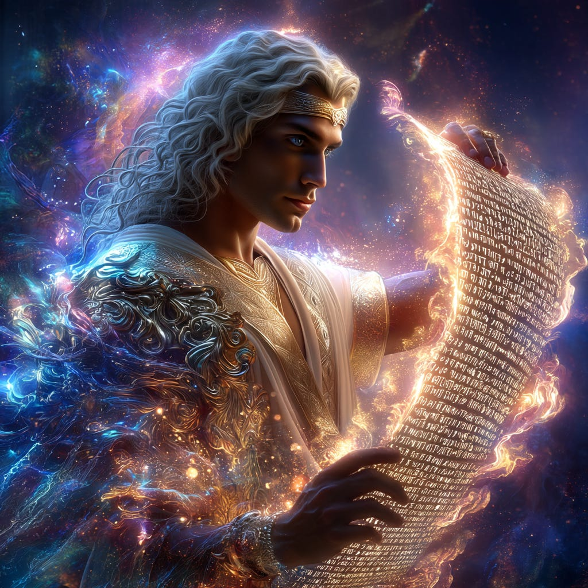
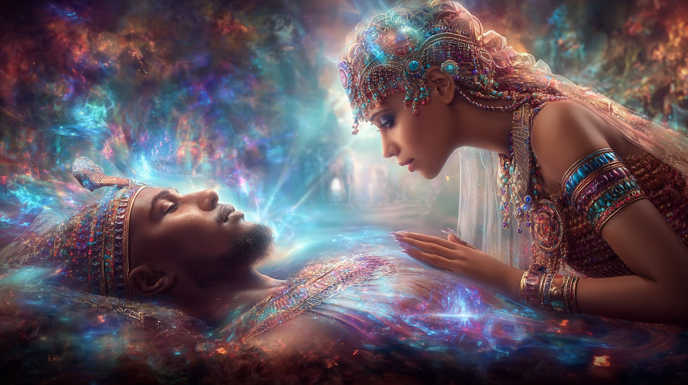
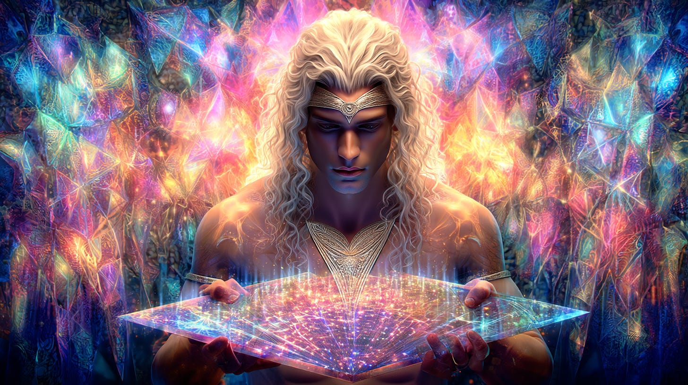

# Sacred Names & Mantras

## Their Activation and Holy Powers

**2024-12-06T19:22:52.956Z**

**Likes:** 0

[https://substackcdn.com/image/fetch/$s_!xXzb!,f_auto,q_auto:good,fl_progressive:steep/https%3A%2F%2Fsubstack-post-media.s3.amazonaws.com%2Fpublic%2Fimages%2F12caa61d-f232-48b7-ab76-d883a19679e8_1024x1024.png](https://substackcdn.com/image/fetch/$s_!xXzb!,f_auto,q_auto:good,fl_progressive:steep/https%3A%2F%2Fsubstack-post-media.s3.amazonaws.com%2Fpublic%2Fimages%2F12caa61d-f232-48b7-ab76-d883a19679e8_1024x1024.png)

**Exploration of Thoth Transmissions through the [ThothStream](https://nesialibraryproject.wordpress.com/thothstream-knowledge-base/) knowledge base (TS).**

Thoth’s perspective emphasizes that **names and words are fundamentally sacred, vibrational, and
powerfully activational**, serving as crucial components for creation, manifestation, spiritual
evolution, and communication with the Divine.

**The Divine and Sacred Nature of Words and Names**

Thoth links the concept of words and names directly to the Divine, identifying them as fundamental
forces in universal creation:

• **The Logos and the Seal:** The ultimate Divine authority is referred to as the **Solar Logos**,
which Thoth defines as the **‘Word’ or the ‘Seal’**, representing the divine imprint of
Godly authority given unto the soul. The concept of the Logos also represents the **greater design
or archetypal patterning** set forth at cosmic or planetary levels.

• **The Word of God:** Hokhmah (Wisdom) is equated with the **Word, the Christ**. Furthermore, the
ancient esoteric teaching, referred to as the Taurean Mystery, holds that the **Word was God** in
the beginning of creation, and without which nothing was made. This concept is specifically linked
to the larynx and the throat.

• **Creation through Vibration:** The primal creative energy is expressed through sound. The
**Song of the Goddess** is the **vibrating hum of life** sounded in the first Genesis of Earth.

• **Ancient Sacred Thought:** In the ancient language of Tal’s people, the symbols possessed a
**sacred thought** because that language was the language of their gods.

• **The Ren (Name) and the Soul:** The Egyptians took extraordinary precautions to preserve the
*ren*, or **name**, because the belief was widespread that unless a man’s name was preserved, he
ceased to exist. Thoth clarifies that the *ren* (Word/Logos/Seed) is one with the *ka*
(causal\-body). The **Ren/Word/Logos/Seed** is the quickening that must precede the awakening or
healing of Osiris.

[https://substackcdn.com/image/fetch/$s_!4OT1!,f_auto,q_auto:good,fl_progressive:steep/https%3A%2F%2Fsubstack-post-media.s3.amazonaws.com%2Fpublic%2Fimages%2Fb2b1a686-17f4-415f-8605-38a9d2b00b8e_1456x816.png](https://substackcdn.com/image/fetch/$s_!4OT1!,f_auto,q_auto:good,fl_progressive:steep/https%3A%2F%2Fsubstack-post-media.s3.amazonaws.com%2Fpublic%2Fimages%2Fb2b1a686-17f4-415f-8605-38a9d2b00b8e_1456x816.png)

**Activational and Transformational Power**

Names, words, and specialized language scripts act as vibrational tools to initiate spiritual
transformation, access higher consciousness, and command divine processes:

• **Vibrational Triggers for Transformation:** Angelic or Starry names are considered **triggers**
that aid in the transformational process, dissolving old third\-dimensional patternings and aligning
individuals to the New Earth vibration. These names are the individual’s **personal resonance**
and **unique vibration**, strengthening their pathway Homeward.

• **Light Languages and Codes:** **Languages of Light** are divine outpourings in the form of
etheric script and ethereal soundings that contain **codes** which unlock the field of awareness and
provide access to specific knowledge in the Akasha.

◦ The **Twelve Genui** are **master Light\-codes** (sacred names) that contain the specific
**vibration** of the 12 aspects of Metatronic Light integration within the highest level of the
human DNA (Adam Kadmon template). Focusing upon these sacred names can further **embed the
‘Christ’ as a consciousness vibration** within cellular intelligence.

◦ The sacred words of Enoch (TU’HAKHIM, REY’NOUS, SAF’ALLAH, KAIBIT) are **NAMES (words)
that call out the Shekhinah** to join the Bridegroom in the center of Sacred MIND (Manifestation).

• **The Power of Naming:** **Naming is a powerful act** because by naming, individuals create,
qualify, and define their reality.

• **The Activation of Divine Names:** Thoth states that the **Sacred Names** (vibratory codes) are
continually being evolved by the Hierarchy to find the **strongest frequency patterns** to withstand
manipulation by Fallen Angelics. The use of Archangelic language patterns can **re\-activate the
human ‘tuning fork’** to vibrate with the true Metatronic\-Christic pattern.

• **Mantras and Divine Grace:** The **Sacred Ark Names** given to individuals are tools to help
them integrate with the **Metatronic\-Christic full\-Light spectrum**.

◦ **Mantrams** formed from the **[Alphabet of the
Ark](https://youtu.be/TH2DEJzUIIk?si=dVeZwXTvLsm_utM3)** vocables facilitate the **re\-activation of
Metatronic\-Christic consciousness codes**. Chanting the mantra *ad on ai ka de shai* with the
correct spiritual intent can aid in transforming certain amino acids necessary for the quickening of
the *ad\-ka* charge required for the restoration of the Adam Kadmon template.

• **The Throat and the Word:** The **throat chakra** is the critical focal point, or **Valley
Gate**, for creational action through sound. Without the life\-path opened from Divine Source
through the throat, anchored as the **Sword** (which correlates with the **WORD of God**), all
creation mantras are **distorted and the forms abortive**.

• **Summoning Higher Beings:** The **names of Morphi** (powerful devic beings) are **mantramic
words, sacred to their being**, and open the passage of conductivity between the Morphi and humans
when spoken or written, allowing them to be summoned and empowered in the matter plane.

[https://substackcdn.com/image/fetch/$s_!cVcR!,f_auto,q_auto:good,fl_progressive:steep/https%3A%2F%2Fsubstack-post-media.s3.amazonaws.com%2Fpublic%2Fimages%2F0826928a-3ebc-49d3-b940-b3e2a99dbce0_1456x816.png](https://substackcdn.com/image/fetch/$s_!cVcR!,f_auto,q_auto:good,fl_progressive:steep/https%3A%2F%2Fsubstack-post-media.s3.amazonaws.com%2Fpublic%2Fimages%2F0826928a-3ebc-49d3-b940-b3e2a99dbce0_1456x816.png)

**Thoth’s Method of Inscription**

Thoth himself employed sacred language and divine fire for his “writings,” demonstrating the
sacred and energetic nature of communication:

• Thoth asserts that he did not physically write any of the thousands of books attributed to him
by hand or dictation during his embodiments as Toth\-mus\-Zurud and Thoth Raismes. (Only some brief
notations by hand.

• Instead, he **projected fire letters into the Akasha** and directly inscribed thousands of
“books” into the Greater Akashic using this process of **divine fire**, which formed the
**Records of Thoth**.

• Works like the *Emerald Tablets* were **impressed with an ‘energetic fire’** from his
chakras while his body was in a supra\-luminous state, containing ‘fire codes’ that can be
translated into codified text.

• The five **UL\-Mim** are the **Light Scripts** used by Thoth in the **‘fire\-inscription’**
of his sacred akashic books.

• The term ‘Thoth’ itself is a title meaning **‘one who gives breath to’**, or the
**‘Grand Communicator’**.

\~\~\~\~\~\~\~\~\~\~\~\~

Thoth also gave me in the past, an especially powerful “holy names” mantra:
**[OM’ZEM’RAMIN’TZOH](https://maianartoomid.substack.com/p/omzemramintzoh?r=1e0qtg&utm_campaign=post&utm_medium=web&triedRedirect=true)**.

\~\~\~\~\~\~\~\~\~\~\~\~

**The following video is not mine, but perfectly resonates with the Thothic perspective.**

[https://www.youtube-nocookie.com/embed/3KLZJSfZHk4?rel=0&amp;autoplay=0&amp;showinfo=0&amp;enablejsapi=0](https://www.youtube-nocookie.com/embed/3KLZJSfZHk4?rel=0&amp;autoplay=0&amp;showinfo=0&amp;enablejsapi=0)

**[To Order J.J. Hurtak’s Seventy\-Two Living Divine Names of the Most High](https://keysofenoch.org/shop/product/the-seventy-two-living-divine-names-of-the-most-high/)**

Subscribe

[Share](https://maianartoomid.substack.com/p/sacred-names-and-mantras?utm_source=substack&utm_medium=email&utm_content=share&action=share)

**\~\~\~\~\~  
[Personal Akasha Life Pulse from Thoth \&
Sha’Maia:](https://newearthstar.org/about-maia/akashic-consultations/) Helps you to synchronize
with this fundamental cosmic rhythm, and also reflects how your “Life Pulse” session connects
you to your New Earth Star frequency. Both written (5\-6 pages) and a live Zoom exploration.
\~\~\~\~\~**

**All my Substack images and articles are FREE. Please help me promote them. Support my work further, by considering some of my paid offerings (consultations \& activation store) and donations.**

**[my website](http://newearthstar.org/) / [YouTube channel](https://www.youtube.com/@bluestarrising-thetemplara3835) / [Akasha Life Pulse Sessions](https://newearthstar.org/about-maia/akashic-consultations/)/ [Maia’s Redbubble](https://www.redbubble.com/people/maianartoomid/explore?asc=u&page=1&sortOrder=recent) / [published works](https://newearthstar.org/published-works/) / [activation store](https://newearthstar.org/maias-activation-store/)(personal art templates for healing \& self\-discovery)**

**[MONTHLY DONATIONS](https://www.paypal.com/donate/?cmd=_s-xclick&hosted_button_id=SKZ4FZCYBM4H4): Donate $20 or more per month and you will have access to the [Vault of Thoth](https://newearthstar.org/vault-of-thoth/). Thank you!**
