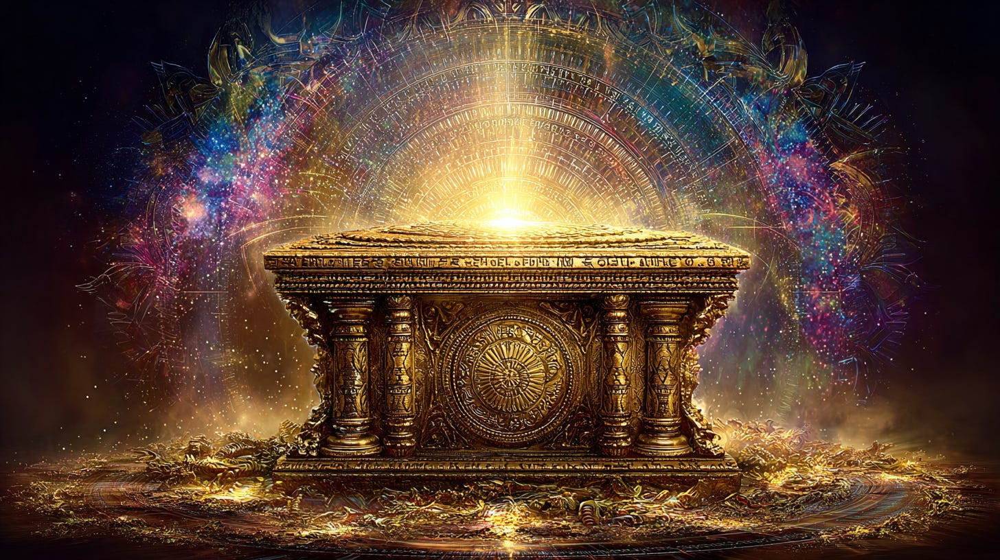
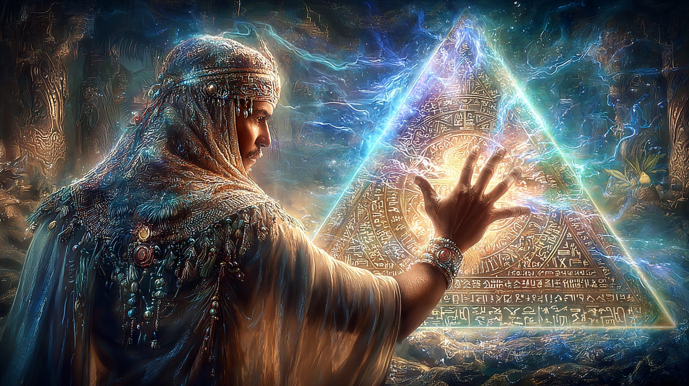

# Sound, Vibration & Spiritual Sonic Keys

## A Thothic Perspective

**2024-12-06T19:22:52.956Z**

**Likes:** 0

[https://substackcdn.com/image/fetch/$s_!JBT9!,f_auto,q_auto:good,fl_progressive:steep/https%3A%2F%2Fsubstack-post-media.s3.amazonaws.com%2Fpublic%2Fimages%2Ffeee51da-a6ef-4e12-92c2-8cfa043f2f03_1456x816.png](https://substackcdn.com/image/fetch/$s_!JBT9!,f_auto,q_auto:good,fl_progressive:steep/https%3A%2F%2Fsubstack-post-media.s3.amazonaws.com%2Fpublic%2Fimages%2Ffeee51da-a6ef-4e12-92c2-8cfa043f2f03_1456x816.png)

**Exploration of Thoth Transmissions through the [ThothStream](https://nesialibraryproject.wordpress.com/thothstream-knowledge-base/) knowledge base (TS).**

***Thoth speaks extensively about the relationship between sound, vibration, and consciousness, describing several concepts that function as “sound\-keys” or key vibrational patterns necessary for spiritual evolution and creation.***

**The Role of Sound and Vibration**

Thoth emphasizes that the universe and all its manifestations are created and sustained by the music
of the spheres. The manifestation of divine glory includes the rapture of harmonious sound, also
known as the Music of the spheres.

• **Higher Sounds and Harmony:** Higher sounds are composed of all tones coming together in one
chord so harmoniously that there is no discernible single sound, and these are received directly by
the soul. Color is the twin sense of sound, where the perception of color is the visualization of
higher sound.

• **The Holy Tone:** Deep within, the ancient Holy Tone is sustained and nurtured by a Greater
Self. When this Tone is brought forth and wedded to the Tone of “The Family,” the seals shall
then fall away from the Sacred Places. The Holy Tone (Harrum) is also described as the holy tone of
the atoma (central sun) of the Earth, which is changing its tone and frequency and acting as a call
of our Divine Center to gather and form the New Hologram.

• **Creation through Sound:** The creative imagination (the feminine principle of the Logos) is
the focusing center of the rhythmic emanations of the four creative Hierarchies. The utterance of
the Living Prayer (the thought spoken) renders harmony from chaos, tuning the world in divine pitch,
echoing the hum of eternal song.

• **Sacred Chanting:** The ancient Aloii (first language) version of Shambhala,
“Shum\-bahal\-la,” includes the word bahal, meaning to sanctify with the “sound of the
heart” or a “chant\-song from the heart,” which was used to signify a “canopy of sound”
created as a sacred geometry through perpetual chanting in ancient temples.

[https://substackcdn.com/image/fetch/$s_!9ysD!,f_auto,q_auto:good,fl_progressive:steep/https%3A%2F%2Fsubstack-post-media.s3.amazonaws.com%2Fpublic%2Fimages%2F5e21e51d-4a80-4411-9039-aaf560848265_1456x816.png](https://substackcdn.com/image/fetch/$s_!9ysD!,f_auto,q_auto:good,fl_progressive:steep/https%3A%2F%2Fsubstack-post-media.s3.amazonaws.com%2Fpublic%2Fimages%2F5e21e51d-4a80-4411-9039-aaf560848265_1456x816.png)

**Specific Sound\-Key Systems**

*Thoth identifies several specific languages and vibrational keys that operate through sound or frequency:*

1\. **Light Languages and Vocables:** Light Languages are defined as divine outpourings, sometimes in the form of etherial soundings, that contain codes to unlock awareness and access specific knowledge in the Akasha.

2\. **The Alphabet of the Ark:** This is a specific Archangelic frequency pattern that aligns corporeal realms with the full\-Light (Metatronic\-Christic) spiral. It is composed of sacred golden plate inscriptions—symbols called vocables—that line the Ark of Grace, with each bearing an angelic charge or energy program.

◦ The Alphabet of the Ark serves as an intermediary transducer, acting like a middle tuning fork,
using harmonic resonance to synchronize the lesser creation with the higher vibratory frequency
patterns of God’s Name.

◦ Chanting the mantrams formed from the Alphabet of the Ark vocables was utilized to re\-activate
the Metatronic\-Christic consciousness codes within the sacred vaults of Egypt. Additionally, Sacred
Ark Names, comprised of specific vocables from this alphabet, are provided to seekers as tools to
integrate more completely with the Metatronic\-Christic full\-Light spectrum.

[https://substackcdn.com/image/fetch/$s_!xfro!,f_auto,q_auto:good,fl_progressive:steep/https%3A%2F%2Fsubstack-post-media.s3.amazonaws.com%2Fpublic%2Fimages%2Ffbf877a6-e004-48ef-9be2-ece418ea45ad_1456x816.png](https://substackcdn.com/image/fetch/$s_!xfro!,f_auto,q_auto:good,fl_progressive:steep/https%3A%2F%2Fsubstack-post-media.s3.amazonaws.com%2Fpublic%2Fimages%2Ffbf877a6-e004-48ef-9be2-ece418ea45ad_1456x816.png)

3\. **The Lost Word/Tetragrammaton:** The Tetragrammaton of Enoch is referred to as the “Lost Word,” sound or vibration. Thoth states that the Midnight Sun Stone meteor contains the encoding of the Tetragrammaton that will release a “sound” which will open the centers of the brain in order for humanity to “speak the Word”.

4\. **Adonai Kodesh (Kodosh) Mantra:** The mantra *ad on ai ka de shai* is the resonant alchemical formula (integrative template) of the Adam Kadmon. This mantra is intended to awaken the ad\-ka (the stimulus for the proto\-synaptic charge in the human element) by centering the sound in the heart and the third eye.

5\. **O’pah:** The O’pah is described as the Sound in its first forming out of the mouth of the Elohim (Creation Lords), which calls new creations into existence. The O’pah symbols act as keynote triggers in the head and heart brains to quicken deeper responses in the DNA crystals, facilitating the “Desire Breath”. The O’pah and the 12 IvI crystalline geometries are the KEY Resonators for all Life.

[https://substackcdn.com/image/fetch/$s_!DXla!,f_auto,q_auto:good,fl_progressive:steep/https%3A%2F%2Fsubstack-post-media.s3.amazonaws.com%2Fpublic%2Fimages%2F8bb66d2a-5036-4580-a974-db9ae3052959_1024x1024.png](https://substackcdn.com/image/fetch/$s_!DXla!,f_auto,q_auto:good,fl_progressive:steep/https%3A%2F%2Fsubstack-post-media.s3.amazonaws.com%2Fpublic%2Fimages%2F8bb66d2a-5036-4580-a974-db9ae3052959_1024x1024.png)

6\. **Protective Sonic Waves (r\-H 99 Frequency):** Thoth introduced the 99 Core Sonic (99\-CS), which is a pulse at a very low frequency designed to disrupt certain harmful frequencies in the body and dissolve foreign substances by breaking apart their atomic frequency. This is combined with the r\-H Marker (reverse H), which is a protective sonic wave that reverses the sonic spin of violated H Markers to organize sonic fields.

7\. **Natural Earth Frequency:** Thoth states that the frequency at the core of the brain in all living creatures that inhabit the Earth registers naturally at 432 Hz; thus, all are a living SOUND. Disturbing this natural frequency causes humans to become “zombies” walking in a morass of signals.

\~\~\~\~\~\~\~\~\~

**Suggested Videos: [Alphabet of the Ark](https://youtu.be/TH2DEJzUIIk?si=GuQTyE_qwX7SSDoj) /[The O’Pah Desire Breath](https://youtu.be/eKFB8FnpRgY?si=JZzlpm5qotdOqT0A) / [Kodosh Chant](https://youtu.be/ddI96e2u48U?si=EGFe0MXVZJPw3lMR)** 

Subscribe

[Share](https://maianartoomid.substack.com/p/sound-vibration-and-spiritual-sonic?utm_source=substack&utm_medium=email&utm_content=share&action=share)

**\~\~\~\~\~  
[Personal Akasha Life Pulse from Thoth \&
Sha’Maia:](https://newearthstar.org/about-maia/akashic-consultations/) Helps you to synchronize
with this fundamental cosmic rhythm, and also reflects how your “Life Pulse” session connects
you to your New Earth Star frequency. Both written (5\-6 pages) and a live Zoom exploration.
\~\~\~\~\~**

**All my Substack images and articles are FREE. Please help me promote them. Support my work further, by considering some of my paid offerings (consultations \& activation store) and donations.**

**[my website](http://newearthstar.org/) / [YouTube channel](https://www.youtube.com/@bluestarrising-thetemplara3835) / [Akasha Life Pulse Sessions](https://newearthstar.org/about-maia/akashic-consultations/)/ [Maia’s Redbubble](https://www.redbubble.com/people/maianartoomid/explore?asc=u&page=1&sortOrder=recent) / [published works](https://newearthstar.org/published-works/) / [activation store](https://newearthstar.org/maias-activation-store/)(personal art templates for healing \& self\-discovery)**

**[MONTHLY DONATIONS](https://www.paypal.com/donate/?cmd=_s-xclick&hosted_button_id=SKZ4FZCYBM4H4): Donate $20 or more per month and you will have access to the [Vault of Thoth](https://newearthstar.org/vault-of-thoth/). Thank you!**
