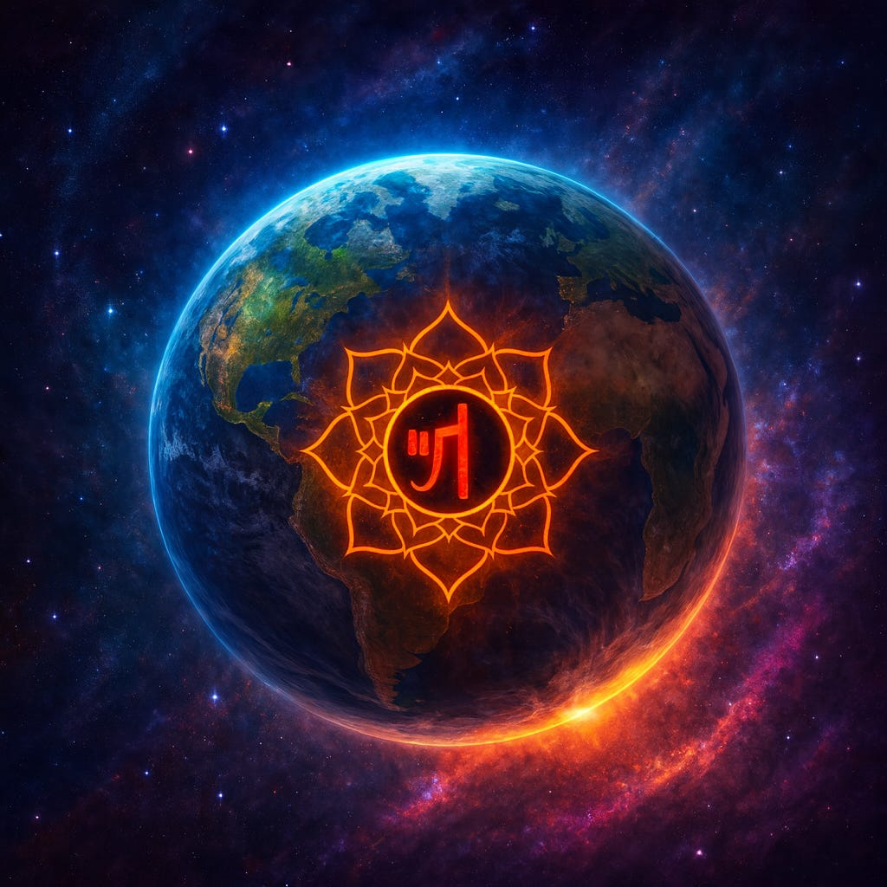
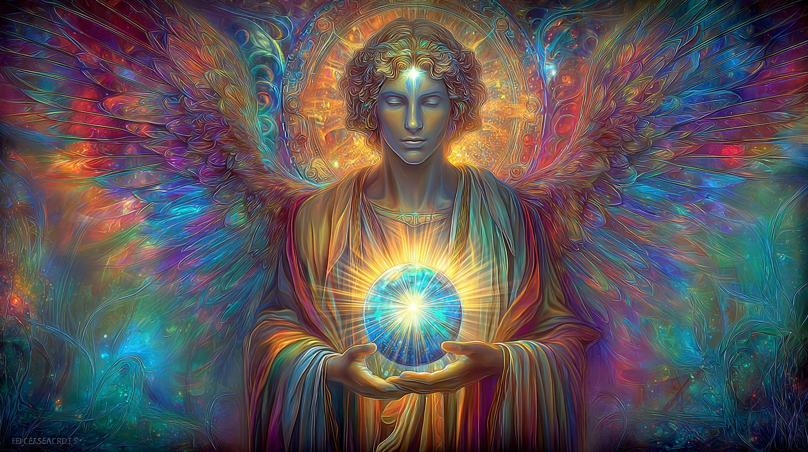
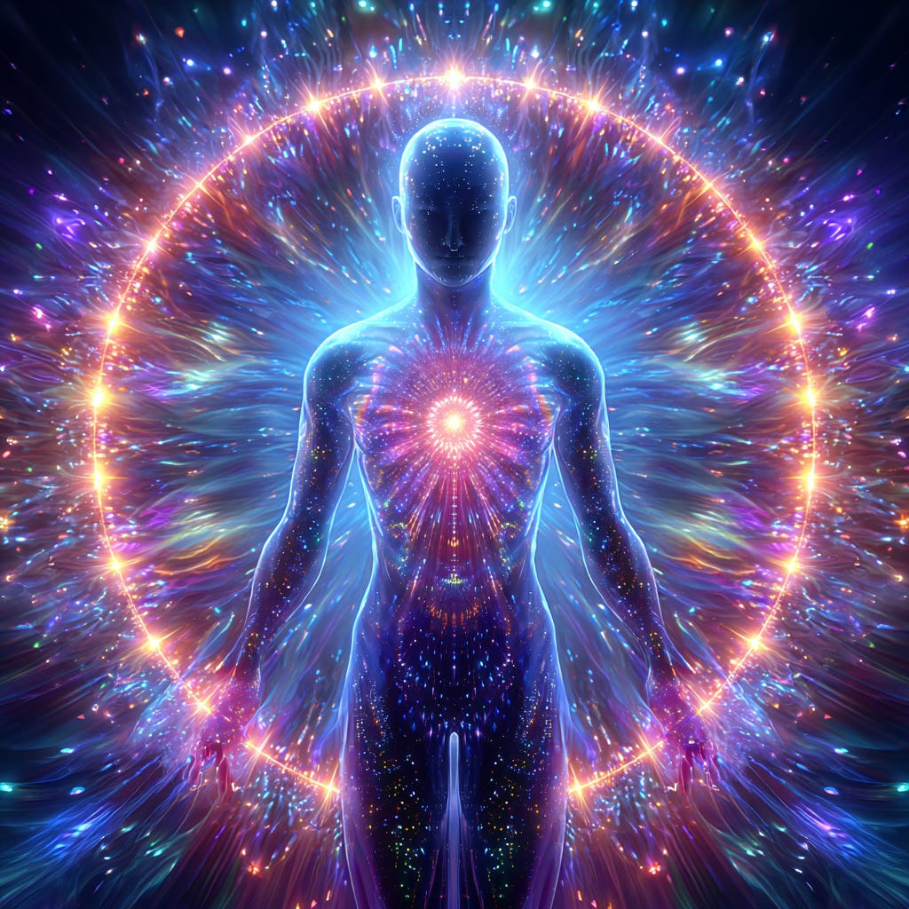
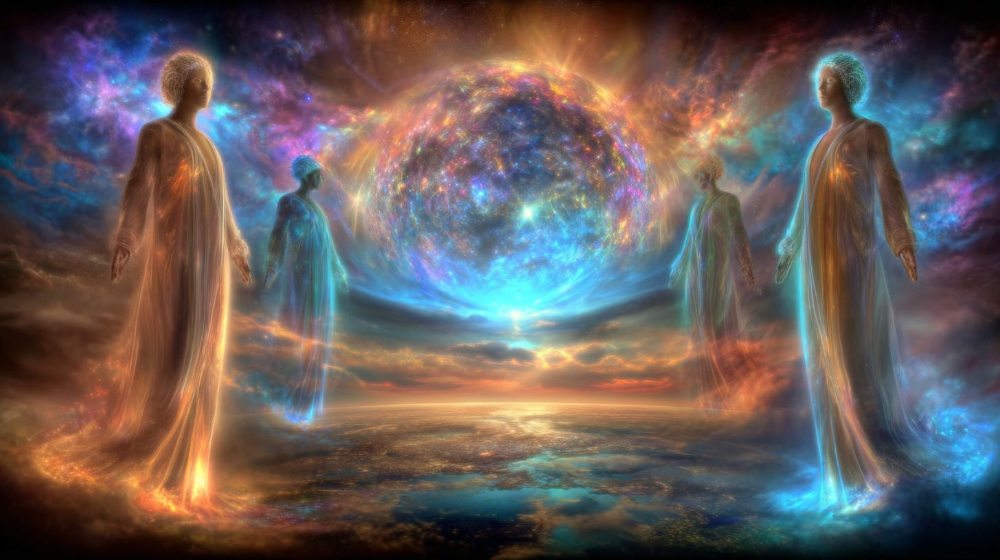
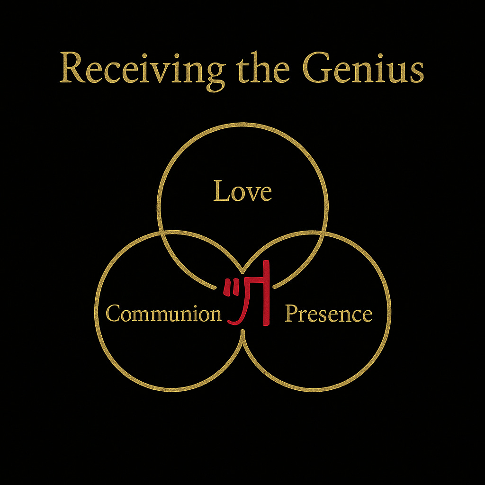
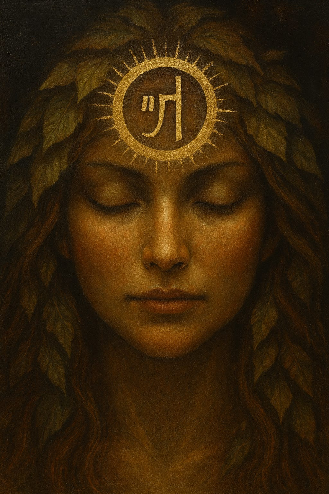
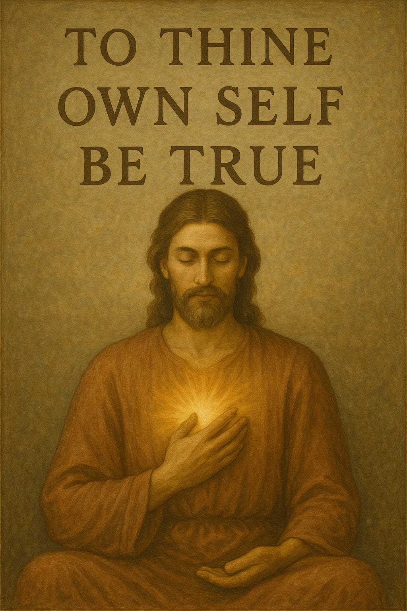
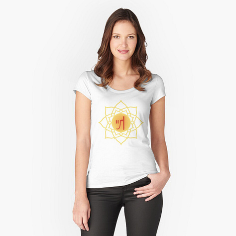
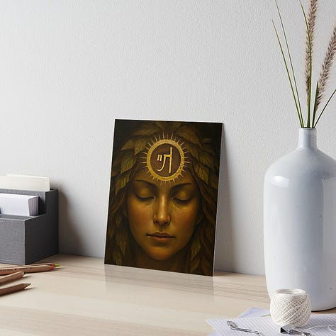

# Planetary Genius & the Human Element

## Receiving our Personal "Genius" Activation

**2024-12-06T19:22:52.956Z**

**Likes:** 0

[https://substackcdn.com/image/fetch/$s_!vjDW!,f_auto,q_auto:good,fl_progressive:steep/https%3A%2F%2Fsubstack-post-media.s3.amazonaws.com%2Fpublic%2Fimages%2F8356c276-b4a3-4e47-b020-804c218a920d_1024x1024.png](https://substackcdn.com/image/fetch/$s_!vjDW!,f_auto,q_auto:good,fl_progressive:steep/https%3A%2F%2Fsubstack-post-media.s3.amazonaws.com%2Fpublic%2Fimages%2F8356c276-b4a3-4e47-b020-804c218a920d_1024x1024.png)

**We begin with the basic understanding of planetary and personal GENIUS. From the [ThothStream Knowledge Base](https://nesialibraryproject.wordpress.com/thothstream-knowledge-base/). The Planetary Genius is the single most important dynamic of our connection to GAIA as a living crucible for our incarnated souls. It is also the most bonding receptacle of our transfer into the NEW EARTH STAR World System II.**

\~\~\~\~\~\~\~\~\~

**Definition and Nature of the Planetary Genius**

***The Planetary Genius is defined by Thoth as:***

1\. **The completed thought\-form** containing the **identity of consciousness** for the Earth’s World Domain from its Alpha (beginning) through Omega (end).

2\. It is **untainted, free of all illusion**, and yet is **not omnipotent** because it defines and identifies, which gives it a distinct polarity.

3\. Its primary polarity is to **qualify and preserve the Eschaton of the Earth**. The Eschaton refers to “the last things,” the truth that remains, and an illuminative, fiery, spiritual consummation of the earth and its beings.

The Planetary Genius is understood to be the **pure essence of elementalized spiritual
consciousness** within the planetary sphere. It is characterized as having the omniscience necessary
to handle any possible combination of variables within a dualistic reality, being a product of
super\-consciousness within the realm of matter.

Metaphorically, Thoth describes “Genius” in general as the **“cream risen to the top”** when
depicting “thought” as milk in a pail (the limitations of mind), representing the purest portion
of knowing within intelligence. The Planetary Genius is the **One Tree** from which all individual
or personal Geniuses form the individual limbs.

[https://substackcdn.com/image/fetch/$s_!mHHz!,f_auto,q_auto:good,fl_progressive:steep/https%3A%2F%2Fsubstack-post-media.s3.amazonaws.com%2Fpublic%2Fimages%2F3f7be5e6-3cc1-4a21-afab-f64b3ec459b9_1456x816.png](https://substackcdn.com/image/fetch/$s_!mHHz!,f_auto,q_auto:good,fl_progressive:steep/https%3A%2F%2Fsubstack-post-media.s3.amazonaws.com%2Fpublic%2Fimages%2F3f7be5e6-3cc1-4a21-afab-f64b3ec459b9_1456x816.png)

**Location and Withdrawal**

The Planetary Genius resides within the planet’s core, specifically nested within the **central
sun atoma** of the Earth.

According to the sources, when **Metatron invoked the Seven Seals** upon mankind, he **withdrew the
radiant field of Planetary Genius** back into the central sun of the Earth where it is currently
indwelling. This action was taken so that the “God\-Born who had become infants of the Day”
would not be allowed to misuse the power contained within the Genius to leave the fallen reality
behind.

The power to overcome the fallen reality lies within the Planetary Genius, and humanity must
**reclaim their God Selves** before the Genius can be returned to them.

[https://substackcdn.com/image/fetch/$s_!wMZK!,f_auto,q_auto:good,fl_progressive:steep/https%3A%2F%2Fsubstack-post-media.s3.amazonaws.com%2Fpublic%2Fimages%2F99802259-171d-4d5a-901c-fe14f2b0ccab_1024x1024.png](https://substackcdn.com/image/fetch/$s_!wMZK!,f_auto,q_auto:good,fl_progressive:steep/https%3A%2F%2Fsubstack-post-media.s3.amazonaws.com%2Fpublic%2Fimages%2F99802259-171d-4d5a-901c-fe14f2b0ccab_1024x1024.png)

**Re\-accessing and Retrieval**

The process of re\-accessing and retrieving the Planetary Genius is tied to planetary ascension and
individual spiritual evolution:

• **Individual Alignment:** To open oneself to the Genius experience, one must align their
individual *atoma* (inner sun) to that of the Earth, and then align their “entire cellular
being” with their own *atoma*. This leads to the Planetary Genius manifesting through
**‘cellular integration of heart centered consciousness’**.

• **Heart Center:** The Genius resides in all seven levels of consciousness, and its full return
requires the **unification of these seven levels** through the **full opening of the heart center**.

• **TZO Field Connection:** The TZO Field interfaces with the Earth’s Genesis Field Light
Mathematic, which is registered within the Planetary Genius at the center of the planet.

• **Genius Consciousness Cells:** Individual efforts to “spiritualize their egos” contribute
to the creation of **Genius consciousness cells**, which gather to form a **“Genius”**—a
guardian spirit of a high order. This Genius then offers its being to an incarnated **“Tribal
Lord”** who is ready to receive the consciousness. The Zarathustrian Book of Lords states that an
incarnated soul who has received their Genius is the single most important vehicle in the completion
of **Victory over Evil**, enabling them to utterly **destroy the Beast**.

[https://substackcdn.com/image/fetch/$s_!sGg8!,f_auto,q_auto:good,fl_progressive:steep/https%3A%2F%2Fsubstack-post-media.s3.amazonaws.com%2Fpublic%2Fimages%2F92002f1f-61b3-43af-aef7-d3ef278fd278_1456x816.png](https://substackcdn.com/image/fetch/$s_!sGg8!,f_auto,q_auto:good,fl_progressive:steep/https%3A%2F%2Fsubstack-post-media.s3.amazonaws.com%2Fpublic%2Fimages%2F92002f1f-61b3-43af-aef7-d3ef278fd278_1456x816.png)

**Transference to the New Earth Star**

The Planetary Genius is scheduled to be retrieved from the center of the Earth at the time of
**LP\-40 (Light Principle Forty)**, which is considered the Ascension time.

The transference process involves:

1\. **Gaiavatha Release:** A wave of **golden light, called the ‘Gaiavatha’**, will updwell from the Earth’s atoma, entering all matter resonant with the 44:44 octave of ascension. This light contains all the Light codes of the Earth, which will be carried as a full **holographic insertion into the New Earth Star (NES)**.

2\. **Retrieval Team:** Specific soul groups on Earth, known as human **‘biophysicals’**, will pass through the core of the Earth to attract the Planetary Genius from the Earth’s central sun atoma.

3\. **Transporter Vehicle:** The biophysicals will lift the Planetary Genius out and carry it in a **Merkabah ‘Light train’** to the surface and through the stargate.

4\. **Placement:** The Genius will then be received by a grouping of souls already on the “other side” (within the NES reality) and placed at the center of its **New Earth Temple**.

5\. **Final Transformation:** In this final stage of Eschaton, the Planetary Genius becomes the **‘Prima Matra’** (first matter) of the Old Earth’s merging with the New Earth, creating the **Pure Gem Being** that will radiate from the center of the New Earth Star.

[https://substackcdn.com/image/fetch/$s_!RBoY!,f_auto,q_auto:good,fl_progressive:steep/https%3A%2F%2Fsubstack-post-media.s3.amazonaws.com%2Fpublic%2Fimages%2F8007b8bd-a7c4-4779-95e9-db89b06dd027_1024x1024.png](https://substackcdn.com/image/fetch/$s_!RBoY!,f_auto,q_auto:good,fl_progressive:steep/https%3A%2F%2Fsubstack-post-media.s3.amazonaws.com%2Fpublic%2Fimages%2F8007b8bd-a7c4-4779-95e9-db89b06dd027_1024x1024.png)

**Sha’Maia 2025**

So now I ask of ThothHorRa (his Inner Earth embodiment), how may individual surface humans activate
their Planetary Genius?

**THR:** Full activation of the “Genius” will be accomplished by only a very few individuals in true spiritual leadership before LP\-40 (Ascension flashpoint). They will be the Light Towers, in guiding humanity. They will not be “gurus” but Helpmates who are known for their actions and deeds.

However, individual humans \- Light Bearers who stand for the Greater Good, will and indeed are,
polishing the lamps to shine upon the true Covenant of Divine Kinship. In doing this, so they supply
the mortar for the building of the New Earth Temples. The “Genuis” then stirs within them and
they will experience the radiance of this future reality for their souls.

**Sha’Maia:** To break this down into clearer language, WE can and are experiencing the “polishing of the lamp” of our own divinity as a shared reality. This “stirs” our Genuis to respond as the genie inside the lamp, that we may experience the radiance of it. Although this is not the fully awakened Genius, it will nonetheless quicken our being to deeply comprehend that future receipt which awaits us.

In the tale, the genie (jin) bestows “three wishes” on the recipient. Only three. In the
scenario presented by Thoth metaphorically equating the “Genius” with the genie, the three
wishes can be seen as a trinity of choices brought into divine synergy:

[https://substackcdn.com/image/fetch/$s_!YGCO!,f_auto,q_auto:good,fl_progressive:steep/https%3A%2F%2Fsubstack-post-media.s3.amazonaws.com%2Fpublic%2Fimages%2F6122fd67-446e-49dd-87ad-1d9bbd70cc92_1024x1024.png](https://substackcdn.com/image/fetch/$s_!YGCO!,f_auto,q_auto:good,fl_progressive:steep/https%3A%2F%2Fsubstack-post-media.s3.amazonaws.com%2Fpublic%2Fimages%2F6122fd67-446e-49dd-87ad-1d9bbd70cc92_1024x1024.png)

When we combine Communion with the Inner (be sill and know that I Am) with holding the Presence of
our Interior Being as a Light for the World, so we vibrate with the purity of LOVE. Even if we are
not holding this frequency every moment of every day and night, we keep showing up and lighting the
lantern again and again. Darkness only appears to prevail when the soul forfeits its endurance for
the anguish of defeat.

**The empowering symbol of the Planetary Genius (Gaia Signature) given to humanity is illuminated upon the brow of GAIA:**

[https://substackcdn.com/image/fetch/$s_!mSL8!,f_auto,q_auto:good,fl_progressive:steep/https%3A%2F%2Fsubstack-post-media.s3.amazonaws.com%2Fpublic%2Fimages%2Fc299ce52-73ba-438b-98fa-b4cd52c60688_1024x1536.png](https://substackcdn.com/image/fetch/$s_!mSL8!,f_auto,q_auto:good,fl_progressive:steep/https%3A%2F%2Fsubstack-post-media.s3.amazonaws.com%2Fpublic%2Fimages%2Fc299ce52-73ba-438b-98fa-b4cd52c60688_1024x1536.png)

*For the amazing story of how this “Gaia Signature” was delivered to me in the 1970’s watch the video in the playlist below on the “Planetary Genius.” It is a powerful activation Light Glyph.*

**ThothHorRa requested I conclude with:**

[https://substackcdn.com/image/fetch/$s_!INM5!,f_auto,q_auto:good,fl_progressive:steep/https%3A%2F%2Fsubstack-post-media.s3.amazonaws.com%2Fpublic%2Fimages%2Fe6f940bf-14b5-4a81-8595-88f438de06d5_1024x1536.png](https://substackcdn.com/image/fetch/$s_!INM5!,f_auto,q_auto:good,fl_progressive:steep/https%3A%2F%2Fsubstack-post-media.s3.amazonaws.com%2Fpublic%2Fimages%2Fe6f940bf-14b5-4a81-8595-88f438de06d5_1024x1536.png)

**[Video Playlist](https://vimeo.com/showcase/11895366) / [Related Substack Article](https://maianartoomid.substack.com/p/the-hollow-earth-and-its-interface)**

\~\~\~\~\~\~\~\~\~\~

#### This Activation Image on My Redbubble:

**EachVersion is Available on Various Items**

*Gaia Signature in Redbubble*

**[Gaia Signature on Gold](https://www.redbubble.com/shop/ap/174388215) /[Gaia Signature with Lotus](https://www.redbubble.com/shop/ap/174388024) / [Gaia Signature Goddes](https://www.redbubble.com/shop/ap/174387724)**[s](https://www.redbubble.com/shop/ap/174387724)

Subscribe

[Share](https://maianartoomid.substack.com/p/planetary-genius-and-the-human-element?utm_source=substack&utm_medium=email&utm_content=share&action=share)

**\~\~\~\~\~  
[Personal Akasha Life Pulse from Thoth \&
Sha’Maia:](https://newearthstar.org/about-maia/akashic-consultations/) Helps you to synchronize
with this fundamental cosmic rhythm, and also reflects how your “Life Pulse” session connects
you to your New Earth Star frequency. Both written (5\-6 pages) and a live Zoom exploration.
\~\~\~\~\~**

**All my Substack images and articles are FREE. Please help me promote them. Support my work further, by considering some of my paid offerings (consultations \& activation store) and donations.**

**[my website](http://newearthstar.org/) / [YouTube channel](https://www.youtube.com/@bluestarrising-thetemplara3835) / [Akasha Life Pulse Sessions](https://newearthstar.org/about-maia/akashic-consultations/)/ [Maia’s Redbubble](https://www.redbubble.com/people/maianartoomid/explore?asc=u&page=1&sortOrder=recent) / [published works](https://newearthstar.org/published-works/) / [activation store](https://newearthstar.org/maias-activation-store/)(personal art templates for healing \& self\-discovery)**

**[MONTHLY DONATIONS](https://www.paypal.com/donate/?cmd=_s-xclick&hosted_button_id=SKZ4FZCYBM4H4): Donate $20 or more per month and you will have access to the [Vault of Thoth](https://newearthstar.org/vault-of-thoth/). Thank you!**
