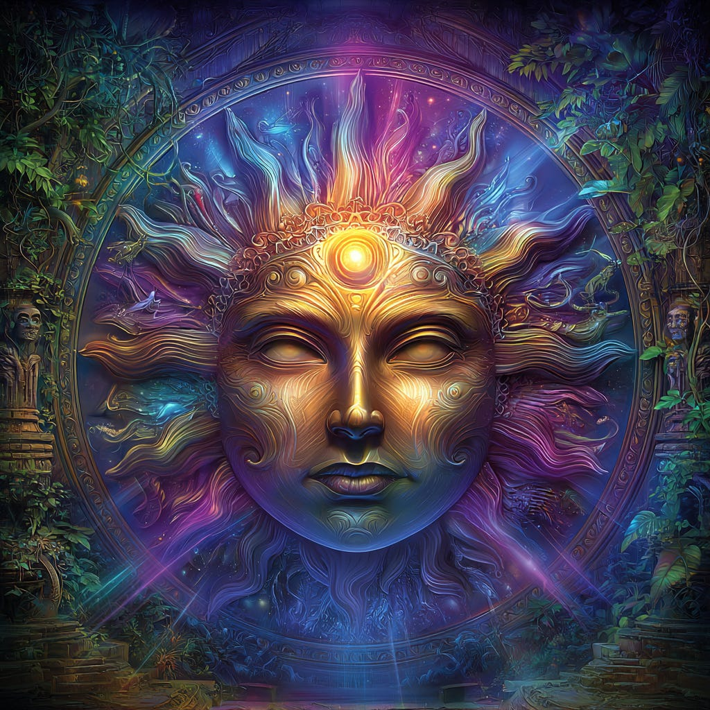
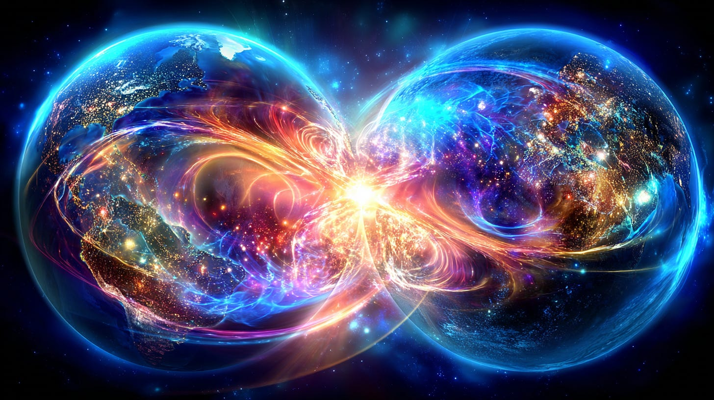
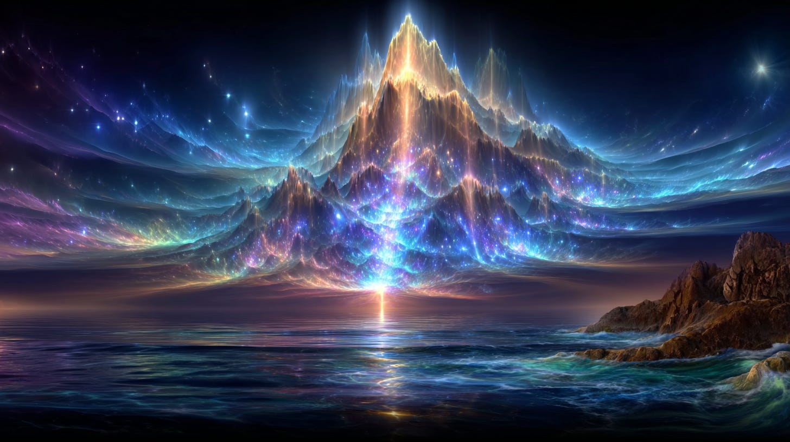
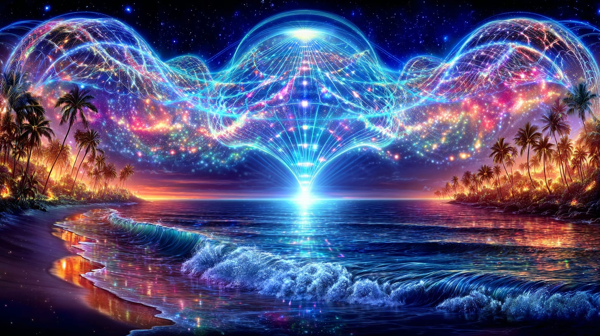

# The Hollow Earth & its Interface with our Dimension

## Preparing for the New Wave toward Ascension

**2024-12-06T19:22:52.956Z**

**Likes:** 0

[https://substackcdn.com/image/fetch/$s_!qnzY!,f_auto,q_auto:good,fl_progressive:steep/https%3A%2F%2Fsubstack-post-media.s3.amazonaws.com%2Fpublic%2Fimages%2Ffd3276de-3f96-466d-b993-f67aaff052e6_1024x1024.png](https://substackcdn.com/image/fetch/$s_!qnzY!,f_auto,q_auto:good,fl_progressive:steep/https%3A%2F%2Fsubstack-post-media.s3.amazonaws.com%2Fpublic%2Fimages%2Ffd3276de-3f96-466d-b993-f67aaff052e6_1024x1024.png)

This article contains from the **[Thoth Stream Knowledge
Base](https://nesialibraryproject.wordpress.com/thothstream-knowledge-base/)** basic information on
the inner hollow earth in regard to its central sun atoma, its placement in inter\-dimensional shift
from a molten core and the implications of how we now are interacting with the electro\-magnetic
changes being affected both in the central hollow and on the surface earth between these two very
closely synergized dimensions of planet earth. First, the basic dynamics from my previous works
dating back as far as the 1980s on this topic. I do have videos which cover these key aspects, but
wished to condense it here for a better overview before I address what I am receiving at this time
from Thoth Intelligence concerning these dynamics. I will include a playlist link to these videos at
the conclusion.

\~\~\~\~\~\~\~\~\~\~

[https://substackcdn.com/image/fetch/$s_!ySIf!,f_auto,q_auto:good,fl_progressive:steep/https%3A%2F%2Fsubstack-post-media.s3.amazonaws.com%2Fpublic%2Fimages%2F2a2cf320-decd-47d3-9709-1c0ae953c6d9_1456x816.png](https://substackcdn.com/image/fetch/$s_!ySIf!,f_auto,q_auto:good,fl_progressive:steep/https%3A%2F%2Fsubstack-post-media.s3.amazonaws.com%2Fpublic%2Fimages%2F2a2cf320-decd-47d3-9709-1c0ae953c6d9_1456x816.png)

#### **Basic Inner Hollow Earth Science**

The workings of the inner hollow Earth involve a sophisticated interplay of atomic physics,
magnetism, consciousness, and multiple dimensions, centered around its inner sun and regulatory
system.

**The Central Sun Atoma**

The Atoma, or Central Sun, is a brilliant mass of atomic particles situated at the very center of
the Earth’s sphere, functioning analogously to the heart of the planet.

**Structure and Atomic Reaction**

1\. Compression and Incomplete Reaction: The Atoma is much smaller than the solar sun (called the “Atana”) and exists within a dense matter\-sphere. This dense placement causes compression, meaning the process of hydrogen changing into helium—which occurs in the solar sun—is followed at a much slower and less violent pace within the Atoma.

2\. Black Hole Suspension: The Atoma’s strong magnetic field prevents a complete chain reaction. It is constantly folding inward, mimicking the first stages of black hole formation (”inward falling”). However, the yin and yang balance of the Earth’s magnetic field prevents this completion, carrying it back to its beginning cycle. The Atoma is therefore suspended between the extremes of violent chain reaction and inward volution into a black hole vortex.

3\. Energy Emission and Atmosphere: The Atoma contracts and expands in a pulsing action, sending energy waves through the central cavity and out into the planet’s arteries (caverns and tunnels).

4\. Helia and Light Cycle: The Atoma is surrounded by space, but this space is an atmosphere, not a vacuum, and becomes denser as the Atoma is approached. Within a few miles of the corona, this atmosphere is a heavy hydrogen vapor called Helia, which bursts into illumination. Variations in the density of the Helia, caused by the Earth’s rotation, create the different intensities of light experienced in the Inner Earth (day and twilight cycles).

[https://substackcdn.com/image/fetch/$s_!9rXM!,f_auto,q_auto:good,fl_progressive:steep/https%3A%2F%2Fsubstack-post-media.s3.amazonaws.com%2Fpublic%2Fimages%2Fd75b605f-07d5-4684-85a5-a71f0989e086_1024x1024.png](https://substackcdn.com/image/fetch/$s_!9rXM!,f_auto,q_auto:good,fl_progressive:steep/https%3A%2F%2Fsubstack-post-media.s3.amazonaws.com%2Fpublic%2Fimages%2Fd75b605f-07d5-4684-85a5-a71f0989e086_1024x1024.png)

**The Regula Apsa**

The regula apsa is identified as the heart center of the Atoma.

Function as a Transformation Center

1\. Polarity Chambers: The regula apsa contains four polarity chambers composed of “hyper\-atoms” with an inverted nucleus. These four chambers are positively and negatively polarized, mirroring the four chambers (right and left auricles/ventricles) of the human heart. The human heart chakra is intimately linked to the regula apsa of the Earth Atoma.

2\. Rega Passage: Solar light beams and light from distant stars enter the regula apsa through the *Rega Passage*, a funnel of highly etherically bonded particles. This passage is accessed via the natural polar openings of the Earth (Northern and Southern Doors).

3\. Transmutation: The Northern Door (North Pole) passage leads to the positively polarized chambers, and the Southern Door (South Pole) leads to the negatively polarized chambers. Within the regula apsa, an intricate exchange of current, or “purifying of blood,” occurs, transforming the energy’s x\-grams (cognitive directive code packages).

4\. The Anii: This transmutation process happens within the Anii (meaning Holy Seed or Seed Flame), the innermost holy of holies of the Atoma. The Anii is described as a “bursting of transformation” or a “nova of completeness” where solar light beams are transmuted from gross to subtle. This “refined gold” energy is circulated through the planet via the resonant cavity effect of the central hollow, nourishing nature. This procession of the Rega Passage occurs specifically at the equinoxes and solstices of the year.

[https://substackcdn.com/image/fetch/$s_!-m16!,f_auto,q_auto:good,fl_progressive:steep/https%3A%2F%2Fsubstack-post-media.s3.amazonaws.com%2Fpublic%2Fimages%2F899924a6-afc9-4385-89df-34f7b74ffaf3_1456x816.png](https://substackcdn.com/image/fetch/$s_!-m16!,f_auto,q_auto:good,fl_progressive:steep/https%3A%2F%2Fsubstack-post-media.s3.amazonaws.com%2Fpublic%2Fimages%2F899924a6-afc9-4385-89df-34f7b74ffaf3_1456x816.png)

**Inter\-dimensional Creation of the Hollow Earth**

The existence of the hollow Earth is a physical reality, yet it also resides within a different
dimension.

**Dimensional Separation and Shift**

1\. Multi\-Dimensional Nature: The Earth, like all celestial bodies, is multi\-dimensional. The Earth is a point of access for many universal planes (dimensions).

2\. Magnetosphere and Spin: The dimensionally unique state of the hollow Earth is linked to the magnetosphere’s dimensional “spin”.

3\. Out\-of\-Body Experience: The molten core and the Atoma Light Core are functionally the same but operate in two distinct ultra\-magnetic zones. The hollow inner world is created because the extreme pressures on the molten core cause the Earth to have an “out of body experience”. This is true for all viable ensouled planetary worlds.

4\. Reference Point Shift: During this process, the Earth turns or shifts its reference point inside out, forming, near the absolute or center black hole, another dimension of its spatial continuum. This shift results in the concave, hollow world within the Earth.

5\. Differentiated Realms: These separate dimensions occupy the same physical space but possess sequential “programs” of energy that are not harmonic with one another. The molecular structure of Inner\-Terrestrial beings (Hollow Earth) is attuned to a greater oscillatory rate than surface biosystems, allowing them to exist in this subtler, more advanced spiritual/physical state.

6\. Energy Exchange: The Inner Earth ecosphere (the inner resonant cavity) charges the surface crystalex grid of the planet, which then exchanges frequencies with the outer resonant cavity (between the surface and ionosphere). This whole process creates a holistic medium of attunement for all life on the planet.

[https://substackcdn.com/image/fetch/$s_!3rSa!,f_auto,q_auto:good,fl_progressive:steep/https%3A%2F%2Fsubstack-post-media.s3.amazonaws.com%2Fpublic%2Fimages%2Fa17e7e0c-43b3-4748-aefe-94c4c1b2a134_1456x816.png](https://substackcdn.com/image/fetch/$s_!3rSa!,f_auto,q_auto:good,fl_progressive:steep/https%3A%2F%2Fsubstack-post-media.s3.amazonaws.com%2Fpublic%2Fimages%2Fa17e7e0c-43b3-4748-aefe-94c4c1b2a134_1456x816.png)

**The Saf\-fire Pillar**

This is a key esoteric and energetic construct, deeply associated with crystalline structures,
light, and the Earth’s interior, often interchangeably referenced as the Saf\-fire Mount or a
component of a larger system of light pillars.

Here is basic information regarding the Saf\-fire Pillar, its nature, location, and function:

**Nomenclature and Nature**

• The Saf\-Fire is intrinsically linked to the “sapphire blood of angels within the Daughters of
Men,” which arises from the transformation caused by the Light Molecule’s infusion into the
blood via the
**[M\-STRA](https://nesialibraryproject.wordpress.com/akashic-definitions/m-stra-molecule/)**
dynamic.

• The Saf\-Fire is described as a Ray of the highest order and a quality that Thoth calls the
“fire that does not burn”.

• It manifests in terrestrial spheres of varying densities.

• The Saf\-Fire Mount, or Sapphire/Saf\-Fire, is also regarded as a Living Stone or Crystal of
Light.

**Location and Structure (The Saf\-fire Mount)**

The Saf\-fire Mount is a vast, subterranean structure within the Inner Earth, which is the
planet’s hollow dimension.

• Sacred Center: The Saf\-fire Mount is the receiving station for the solar wind of the Earth
Atoma (the central sun) as it moves through the vibra\-plane via the surface earth chakras. It is
the Sacred Center of all earthen matter.

• Heart Analogy: The Mount is analogous to the aorta of the heart (Atoma).

• Channel for Sacred Lands: All the sacred lands of the Earth, particularly the high plateaus and
mountains, are channeled through the subterranean Mountain of the SAF\-FIRE. It is within this
mountain that all Earth’s nature forces are united with Spirit.

• Specific Location (Travex): The actual location where the Saf\-Fire densifies to attach itself
to the inner planet is the “center field” or “travex” of the inner planetary terrain. The
travex is the geo\-cosmic center of the interior terra firma (distinct from the planet’s center,
which is the Atoma). The Mount is the cosmic surveyors’ golden mark of the travex.

• Composition: The Saf\-fire Mount is formed by polar concentrations of the inner crystal veil and
a density of ice crystals. Its least solid element is composed of water vapor and ice crystals. The
lower region of the Mount becomes increasingly solid as the ice crystal lattices bind into closer
geometries, creating a glacial heap attached to the Earth.

• Magnetic Function: This assemblage of ice crystals is focused through a strong magnetic spiral,
with the central sun using the crystal Mount like a conductive coil. This magnetic focus keeps
temperatures low only within a narrow radius of the mountain.

• Light Refraction: In the upper reaches of the inner sky, the Saf\-Fire is seen as refracted
light—haloes, arching, and cascading in the heaven, displaying a glory of color and light as it
interacts with the changing Earth Tides.

**Function as a Rayship and Transport Vehicle**

The Saf\-Fire acts as a vehicle of transportation for higher forms of consciousness and spiritual
integration:

• Rayship / Merkabah: The Saf\-Fire is a transporting vehicle or merkabah for Master
Intelligences, allowing them to transfer their Pure Gem forms from one dimensional wave\-form state
to another.

• Individual Activation: Intent and focus can attune an individual to the SAF\-FIRE RAYSHIP,
enhancing their connection to the creation of the PURE GEM BODY in the electro\-magnetic reality of
Earth.

• Connection to Ascension: The Saf\-fire Mount is present in the New Earth Star of Numis’OM. The
concept of the Sapphire/Saf\-Fire is closely related to the Sapphire Throne. Thoth connected the
true Sapphire Throne to the “Foundation Stone” (Eben Shettiyah) and a transportation modality
for Master Beings.

• Source of Sapphire Blood: The transformation arising from the M\-STRA molecule infusing into the
blood creates the ‘SAF\-FIRE’, the sapphire blood of angels. The inheritance of the Sapphire
Blood provides the elixir of Living Lights (the Angelic realm), enabling humanity to partake in a
communion that transfigures the body into the Light Body of Kingly making.

[https://substackcdn.com/image/fetch/$s_!m9om!,f_auto,q_auto:good,fl_progressive:steep/https%3A%2F%2Fsubstack-post-media.s3.amazonaws.com%2Fpublic%2Fimages%2F9c8f0d2d-f016-4dd5-88d9-dfd682e1c6b6_1456x816.png](https://substackcdn.com/image/fetch/$s_!m9om!,f_auto,q_auto:good,fl_progressive:steep/https%3A%2F%2Fsubstack-post-media.s3.amazonaws.com%2Fpublic%2Fimages%2F9c8f0d2d-f016-4dd5-88d9-dfd682e1c6b6_1456x816.png)

**The Roil Point of Earth**

The term “Roil Point” refers to a specific geographical location where energies and codes from
the planet’s core surface.

**Definition and Location**

• Every planet has a point at **19\.5 degrees latitude (North or South)** where energies from its
core come up to the surface.

• These energies include **the codes of the planet’s whole cosmic creation**.

• On Earth, this updwelling is currently located at the point of **Mauna Loa on the Big Island of
Hawai’i**. The entire chain of Hawaiian islands is encompassed within the field of this “roil
point,” making it a **key transformational vortex** for the Earth.

• Historically, the ancient continent of **Mu (Lemuria)** was located at the Roil Point of the
planet.

**Function and Energetic Dynamics**

• The Roil Point acts as a region on the surface of the sphere that draws the discharge from the
central sun **“atoma”**(the central sun in the center of the Earth). This discharge happens when
the *atoma* becomes overloaded with a magnetic charge.

• The planetary system works to keep its geo\-magnetic center stable through the Roil Point. When
the focus of the solar and lunar shells moves over the Roil Point, a geomagnetic energy charge is
sent to the central sun *atoma*. A clockwise current delivers a positive charge, while a
counterclockwise current sends a negative charge, which maintains this stability.

• The activity of the Roil Point in Hawai’i is awakening to changes in the Earth’s frequency
and the magnetic shifting, moving the Earth closer to its next polar shift.

• Thoth refers to the whole dynamic incorporating the Hawaiian Islands in the field of the Roil
Point as the **“FireGem matrix,”** where new energy systems of the planet are forming and
triggering other grid formations globally.

**Role in Ascension (Light Principle Forty \- LP\-40\)**

• The Roil Point is a vital node that will accelerate to become the **main engine in transferring
the physical planet (or aspects of it) from a World System I to a World System II**.

• The Hawaiian Islands, encompassing the Roil Point, correlate to the **Base or Kundalini Center**
(the 1st chakra) of the Golden Taya Ascension Temple matrix.

• As the intensity of the “roiling” increases, the Hawaiian Islands will become
un\-inhabitable on the current level of reality.

**Core Discharge**

The Roil Point is the region on the surface of the planetary sphere that draws the discharge from
the central sun atoma which occurs when the atoma becomes overloaded with a magnetic charge. This
activity is awakening to changes in the Earth’s frequency and magnetic shifting.

[https://substackcdn.com/image/fetch/$s_!uPgz!,f_auto,q_auto:good,fl_progressive:steep/https%3A%2F%2Fsubstack-post-media.s3.amazonaws.com%2Fpublic%2Fimages%2F2d709a1a-9615-417e-8874-0dd387563359_1024x1024.png](https://substackcdn.com/image/fetch/$s_!uPgz!,f_auto,q_auto:good,fl_progressive:steep/https%3A%2F%2Fsubstack-post-media.s3.amazonaws.com%2Fpublic%2Fimages%2F2d709a1a-9615-417e-8874-0dd387563359_1024x1024.png)

**Now in September of 2025**

As I write this now, Thoth is revealing to me the importance of the exchange between the inner sun
atoma and the outer central sun, (which Thoth refers to as the “atana”) So these two solar
fields must more perfectly synergize in order for Earth to prosper. Major magnetic changes are
already upon us, and will get stronger as time proceeds. Our inner beings are having to adjust
electromagnetically, etherically, and spiritually, as well as the mental fabric that holds all of
this together for our incarnated bodies. These two realms are not as greatly different as they may
seem. They are coexistent and dependent on one another for balance and orientation. As I’ve stated
before, we each have an atoma above the higher heart of our bodies. So this quantum entanglement is
become more finessed, with greater definition. As the cosmic\-earth changes come upon us, it is
important to integrate all these various influences as a reciprocal to divine orientation.

People speak of the hollow Earth, the beings dwelling within, and all kinds of strange things going
on, which is not entirely the reality Thoth has presented to me. Yes, some of the cavern dwellers of
the inner Earth caverns are odd to even dangerous, yet there are also enclaves from the hollow earth
in the caverns.

The SACRED HOLLOW is a whole other dimensional field. It is sacred, and occupied only by various
enlightened Kindred tribes of peoples who originated from ancients of the surface world, who have
mixed with the “Star Kindred” of the same root genetic family.

You don’t have to know “Thoth Speak” or the sciences involved to begin integrating it. This is
a natural process, or it should be (difficult with so many artificial influences). However, Thoth
feels it is helpful for those of you who are reading this now to connect to the higher sciences
involved. I urge you to share this article with other receptive individuals.

**If you haven’t already I suggest you also read:** **[The Moment of Our Dominion](https://maianartoomid.substack.com/p/the-moment-of-our-dominion)**

**[The Videos Playlist](https://vimeo.com/showcase/11895366)**

[Share](https://maianartoomid.substack.com/p/the-hollow-earth-and-its-interface?utm_source=substack&utm_medium=email&utm_content=share&action=share)

Subscribe

**\~\~\~\~\~  
[Personal Akasha Life Pulse from Thoth \&
Sha’Maia:](https://newearthstar.org/about-maia/akashic-consultations/) Helps you to synchronize
with this fundamental cosmic rhythm, and also reflects how your “Life Pulse” session connects
you to your New Earth Star frequency. Both written (5\-6 pages) and a live Zoom exploration.
\~\~\~\~\~**

**All my Substack images and articles are FREE. Please help me promote them. Support my work further, by considering some of my paid offerings (consultations \& activation store) and donations.**

**[my website](http://newearthstar.org/) / [YouTube channel](https://www.youtube.com/@bluestarrising-thetemplara3835) / [Akasha Life Pulse Sessions](https://newearthstar.org/about-maia/akashic-consultations/)/ [Maia’s Redbubble](https://www.redbubble.com/people/maianartoomid/explore?asc=u&page=1&sortOrder=recent) / [published works](https://newearthstar.org/published-works/) / [activation store](https://newearthstar.org/maias-activation-store/)(personal art templates for healing \& self\-discovery)**

**[MONTHLY DONATIONS](https://www.paypal.com/donate/?cmd=_s-xclick&hosted_button_id=SKZ4FZCYBM4H4): Donate $20 or more per month and you will have access to the [Vault of Thoth](https://newearthstar.org/vault-of-thoth/). Thank you!**
