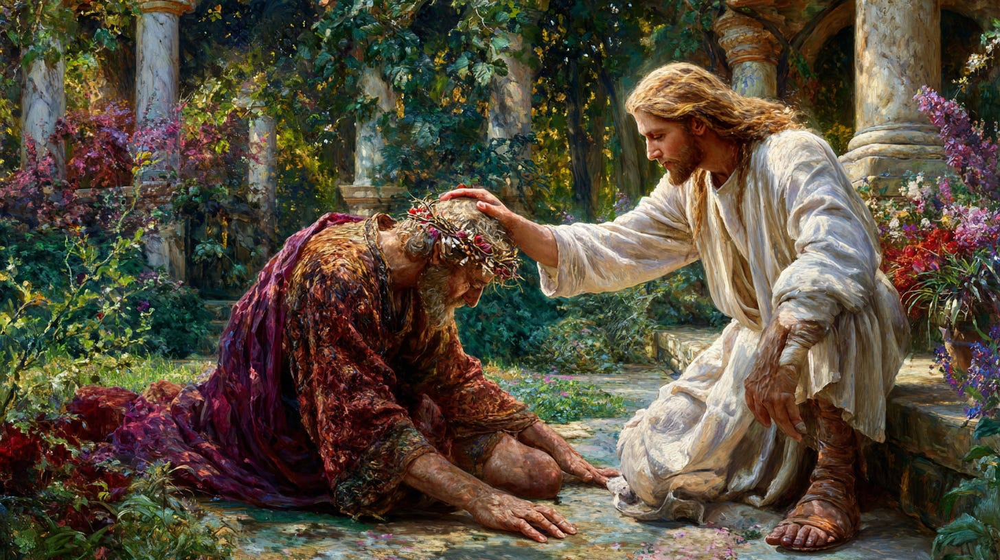
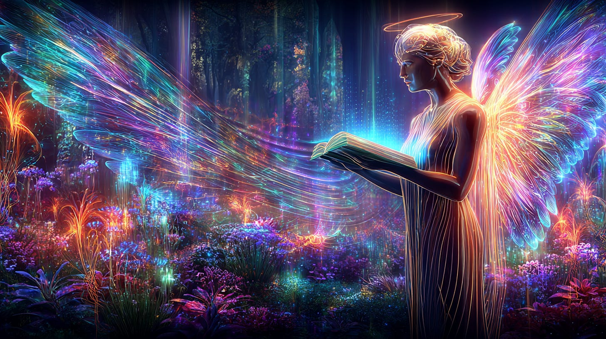

# Forgiveness

## From the Thothic Perspective

**2024-12-06T19:22:52.956Z**

**Likes:** 0

[https://substackcdn.com/image/fetch/$s_!Sb7L!,f_auto,q_auto:good,fl_progressive:steep/https%3A%2F%2Fsubstack-post-media.s3.amazonaws.com%2Fpublic%2Fimages%2F7a2260dd-91c6-46c7-99bb-447527785635_1456x816.png](https://substackcdn.com/image/fetch/$s_!Sb7L!,f_auto,q_auto:good,fl_progressive:steep/https%3A%2F%2Fsubstack-post-media.s3.amazonaws.com%2Fpublic%2Fimages%2F7a2260dd-91c6-46c7-99bb-447527785635_1456x816.png)

**Exploration of Thoth Transmissions through the [ThothStream](https://nesialibraryproject.wordpress.com/thothstream-knowledge-base/) knowledge base (TS).**

\~\~\~\~\~\~\~\~

Thoth situates Forgiveness as a core virtue that transmutes division into Unification.

Self\-forgiveness is necessary “to clear memories, forgive one’s self, and move into the Light
of full understanding,”

The “receiver is your heart, the frequency is love… Where there is resistance, love is
constrained. Where there is embrace and acceptance, love is expanded.” This stance of embracing
what life brings is the working posture of forgiveness in practice.

* Forgiveness is named as a Virtue that alchemically transmutes and unifies.

* Self\-forgiveness clears karmic/akashic residues so Light can integrate.

* Practically, forgiveness \= choosing acceptance over resistance so Love can expand through the heart\-receiver.

[https://substackcdn.com/image/fetch/$s_!ekPj!,f_auto,q_auto:good,fl_progressive:steep/https%3A%2F%2Fsubstack-post-media.s3.amazonaws.com%2Fpublic%2Fimages%2Fdad3d719-e229-42c3-95b2-6633ed03a1e7_1456x816.png](https://substackcdn.com/image/fetch/$s_!ekPj!,f_auto,q_auto:good,fl_progressive:steep/https%3A%2F%2Fsubstack-post-media.s3.amazonaws.com%2Fpublic%2Fimages%2Fdad3d719-e229-42c3-95b2-6633ed03a1e7_1456x816.png)

**Why it matters**: Forgiveness isn’t passive absolution; it’s the Metatronic (full\-Light) motion that dissolves dual locks in your field, letting Presence (Love) to pattern your reality toward Unification.

• Non\-Judgment towards Others: In counteracting the "evil" in the world, Thoth instructs focusing
on the crime and not the criminal—the deed and not the doer. You should then forgive and release
the "doer" while focusing on the unacceptable act itself, permeating the deed with your presence and
stating that "this act is not acceptable and I do not allow it in my world space"

• Liberation from Self\-Judgment: All humans are born with a veil of self\-judgment due to the
planet's Oritronic (half\-Light) consciousness, which promotes the false dogma that the flesh is
corrupt. Moving outside of this false dogma liberates the soul to be free of all judgment. Once a
soul is non\-judgmental, they can truly act as a transformative vehicle for the world.

[https://substackcdn.com/image/fetch/$s_!RxkW!,f_auto,q_auto:good,fl_progressive:steep/https%3A%2F%2Fsubstack-post-media.s3.amazonaws.com%2Fpublic%2Fimages%2F341ec8e3-211f-4691-98cc-101f182ca449_1024x1024.png](https://substackcdn.com/image/fetch/$s_!RxkW!,f_auto,q_auto:good,fl_progressive:steep/https%3A%2F%2Fsubstack-post-media.s3.amazonaws.com%2Fpublic%2Fimages%2F341ec8e3-211f-4691-98cc-101f182ca449_1024x1024.png)

• Imperative for Initiation: Thoth states that Self forgiveness is imperative for those who would
be compassionate with themselves, and is necessary to face the tender, compassionate side of the
Sekhmet archetype (the "Lighted Lady").

• Divine Nature: The ancients conceived of God ("The Great Spiraling Star") as being devoid of
hatred and all\-forgiving.

• Chesed/Mercy: In the structure of the Sephiroth, Chesed is the sphere of Mercy. It is associated
with the Illumined Feminine (Sophia), and its affirmation is: "I receive divine mercy gracefully as
a helpmate to my soul".

• Interpretation of Biblical Forgiveness: Thoth interprets the saying, "Everyone who speaks a word
against the son of man will be forgiven," to mean that the soul of Jesus (the Son of Man) is the
channel for mankind’s conscious awakening and will forgive acts against him. However, the parallel
statement, "He who blasphemes against the Holy Spirit will not be forgiven," is interpreted by Thoth
to mean that the soul of man will not forgive itself for this act against the core of creation.

HOWEVER GRACE CAN MOVE THE MOUNTAIN!

• Divine Solvent: The "Christic Wounded King" (The Christic Emissary) opens the wounds of humanity
and pours out the divine solvent onto them and the land, so they may experience the Full Metatronic
BLAZE of LIGHT REDEMPTION.

• The Water of Forgiveness: Forgiveness is listed alongside compassion and unconditional love as a
divine feminine quality issuing forth from the purifying waters of Spirit, symbolized by the Well.
The Mother of the World (the Goddess aspect and Mother of the Word), who appears as the Dove of
Light, is the Guardian of Her Gate.

[https://substackcdn.com/image/fetch/$s_!tHU5!,f_auto,q_auto:good,fl_progressive:steep/https%3A%2F%2Fsubstack-post-media.s3.amazonaws.com%2Fpublic%2Fimages%2Fc76389f7-191b-4cce-a598-2de94b4a8113_1456x816.png](https://substackcdn.com/image/fetch/$s_!tHU5!,f_auto,q_auto:good,fl_progressive:steep/https%3A%2F%2Fsubstack-post-media.s3.amazonaws.com%2Fpublic%2Fimages%2Fc76389f7-191b-4cce-a598-2de94b4a8113_1456x816.png)

\~\~\~\~\~\~\~\~

**2025: A Profound Moment of Forgiveness witnessed by millions of people around the world, elevating the frequency of human awareness :**

[https://www.youtube-nocookie.com/embed/y-a4uI4ehSw?rel=0&amp;autoplay=0&amp;showinfo=0&amp;enablejsapi=0](https://www.youtube-nocookie.com/embed/y-a4uI4ehSw?rel=0&amp;autoplay=0&amp;showinfo=0&amp;enablejsapi=0)

\~\~\~\~\~\~\~\~

[https://substackcdn.com/image/fetch/$s_!tNjH!,f_auto,q_auto:good,fl_progressive:steep/https%3A%2F%2Fsubstack-post-media.s3.amazonaws.com%2Fpublic%2Fimages%2F50abc61d-0f97-4936-b496-bd7fb4452520_1456x816.png](https://substackcdn.com/image/fetch/$s_!tNjH!,f_auto,q_auto:good,fl_progressive:steep/https%3A%2F%2Fsubstack-post-media.s3.amazonaws.com%2Fpublic%2Fimages%2F50abc61d-0f97-4936-b496-bd7fb4452520_1456x816.png)

**Prayer of Forgiveness**

Oh Divine Soul, tune my Heart\-Receiver to the Pure Tone of Love. Where I have resisted, let me
embrace; where memory clings, let it be cleared into Light. Let Forgiveness transmute division—
May the lion and the lamb lie down in me. I forgive others, I forgive myself; I return us to One.
May Love spiral through every gate of my field, restoring Unification now. It is done. It is gentle.
It is whole.

*Grounded in Forgiveness as Alchemical Transmutation and the Path of Unification; the heart as receiver of Love and forgiveness that clears memory into Light.*

Subscribe

[Share](https://maianartoomid.substack.com/p/forgiveness?utm_source=substack&utm_medium=email&utm_content=share&action=share)

**\~\~\~\~\~  
[Personal Akasha Life Pulse from Thoth \&
Sha’Maia:](https://newearthstar.org/about-maia/akashic-consultations/) Helps you to synchronize
with this fundamental cosmic rhythm, and also reflects how your "Life Pulse" session connects you to
your New Earth Star frequency. Both written (5\-6 pages) and a live Zoom exploration. \~\~\~\~\~**

**All my Substack images and articles are FREE. Please help me promote them. Support my work further, by considering some of my paid offerings (consultations \& activation store) and donations.**

**[my website](http://newearthstar.org/) / [YouTube channel](https://www.youtube.com/@bluestarrising-thetemplara3835) / [Akasha Life Pulse Sessions](https://newearthstar.org/about-maia/akashic-consultations/)/ [Maia’s Redbubble](https://www.redbubble.com/people/maianartoomid/explore?asc=u&page=1&sortOrder=recent) / [published works](https://newearthstar.org/published-works/) / [activation store](https://newearthstar.org/maias-activation-store/) (personal art templates for healing \& self\-discovery)**

**[MONTHLY DONATIONS](https://www.paypal.com/donate/?cmd=_s-xclick&hosted_button_id=SKZ4FZCYBM4H4): Donate $20 or more per month and you will have access to the [Vault of Thoth](https://newearthstar.org/vault-of-thoth/). Thank you!**
