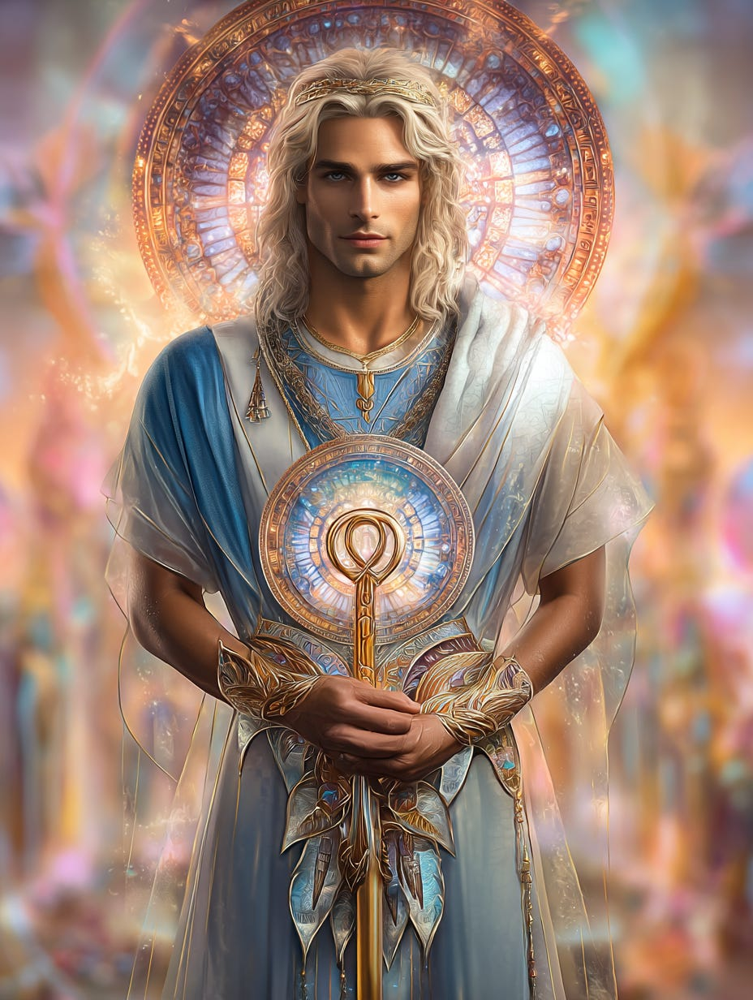
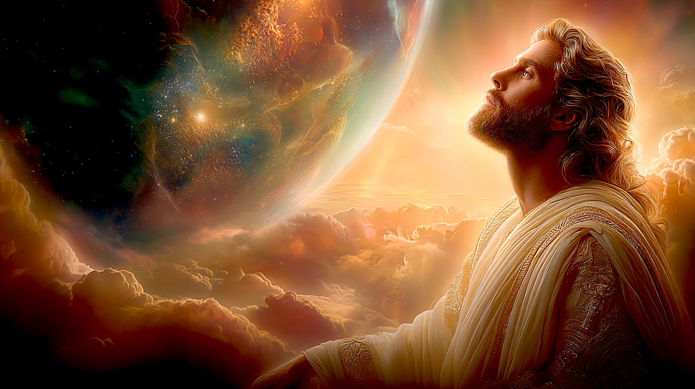
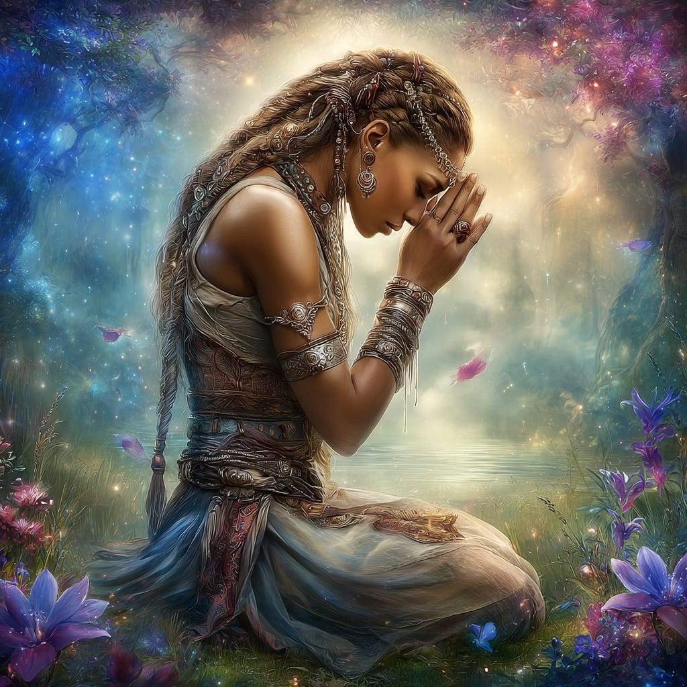

# What We Can Do to Feed The Light

## and free GIFT of Christosaphora Elixir Template to save

**2024-12-06T19:22:52.956Z**

**Likes:** 0

[https://substackcdn.com/image/fetch/$s_!ctBV!,f_auto,q_auto:good,fl_progressive:steep/https%3A%2F%2Fsubstack-post-media.s3.amazonaws.com%2Fpublic%2Fimages%2F7285741f-d802-41ae-b059-ff3af79836e7_928x1232.png](https://substackcdn.com/image/fetch/$s_!ctBV!,f_auto,q_auto:good,fl_progressive:steep/https%3A%2F%2Fsubstack-post-media.s3.amazonaws.com%2Fpublic%2Fimages%2F7285741f-d802-41ae-b059-ff3af79836e7_928x1232.png)

**Exploration of Thoth Transmissions through the [ThothStream](https://nesialibraryproject.wordpress.com/thothstream-knowledge-base/) knowledge base (TS).**

\~\~\~\~\~\~\~\~\~

**I. Individual and Collective Spiritual Awakening \& Transformation:**

• **Seeking Inward Light and Understanding** The soul must seek the light of inward spirit to
illuminate its solemn chambers, realizing that light is a refuge from darkness, a dissolver of
distance, and a communicator of the indwelling mind. By being aware of darkness without
entanglement, living in Light diminishes darkness by placing it into perspective. The truth of light
is given to and through those who retreat from the day, and by seeing and knowing through the lesson
of opposites, one can find the divine within.

• **Conscious Will and Self\-Transformation** Strength is found through inner conquest to become
Light, teaching individuals to be a focus of power that bridges spirit and flesh. By releasing
attachments to "Dark Lords" (chaotic thought\-matter or negative attachments), individuals can move
into higher realms. Humans have the power to purify unwanted elements in their habitation by drawing
them up and transforming them into Light.

• **Developing Heart\-Centered Consciousness** Humans, as light\-engendered souls, respond to
Light as Love. A developed "Heart\-Seed," containing an etheric atom of Light, enables empathy on a
Christic/Buddhic level and allows evolution beyond mental spirituality. **Heart coherency** is
crucial, as the more individuals stay in coherent streaming, the more potent the Inner Light Network
becomes.

• **The White Path and Grace** The "White Path" or "White Stone" represents instant knowing
through Divine Grace, offering instant fertility of Mind and Spirit within the incarnation.
Awakening comes when individuals release formal inquiry and cast themselves directly into the
**"WHITE FLAME OF SPIRIT,"** also known as the **KRYSTOS ILLUMINUS,** a fire that does not burn the
one who fully invites it within. The White Stone frequency is inserted into the Earth's "Red Blood
matrix" through unconditional donations and service, leading to the alchemy of divine Presence and
the rise of the **Corpus Christi**.

• **Prayer, Meditation, and Focus** Prayer and meditation are ways to connect to an expanding
light quantum, shifting one's reality towards it and fanning its Divine Flame into a torch of
liberation.

• **Self\-Identity and Transparency** To remain in a loving state, one can engage in techniques
like Self\-Identity Through **[Ho’onoponopono](https://vimeo.com/448096451?share=copy)**. To
overcome retrograde energies, one must become transparent to them, allowing them to pass through the
emotional body without reactive, negative feelings, and surrendering to the intention of Spirit
rather than fear.

• **Transmutation of Dross and Negative Energies** Light Bearers are tasked with transmuting the
"dross" in their space that reveals deeper reservoirs of negativity. Once this is achieved, they are
to call upon the Gods in high and sacred places to take the remainder into the **Flame of
Purification** upon their altars. Individuals can also ask God, Angels, Masters, Mentors, Saints,
and Guides to lift unwanted consciousness and transform it into Light.

• **Balancing and Unifying Inner Natures** The "Water Initiation/Mystery" illuminates through the
unification of all aspects of being, but requires the "Fire Presence" to perpetuate its Gnosis.
Aligning the watery and fiery natures in the blood establishes unity and balance of power and glory
within physical experience. Balancing the three\-fold flame of Love, Power, and Wisdom is a current
planetary task to achieve perfect balance.

[https://substackcdn.com/image/fetch/$s_!0mMw!,f_auto,q_auto:good,fl_progressive:steep/https%3A%2F%2Fsubstack-post-media.s3.amazonaws.com%2Fpublic%2Fimages%2F4471338b-8eb6-4afb-b38f-616301b8e1ac_1456x816.png](https://substackcdn.com/image/fetch/$s_!0mMw!,f_auto,q_auto:good,fl_progressive:steep/https%3A%2F%2Fsubstack-post-media.s3.amazonaws.com%2Fpublic%2Fimages%2F4471338b-8eb6-4afb-b38f-616301b8e1ac_1456x816.png)

**II. Divine, Archangelic, and Master Interventions:**

• **The Christic Presence and Light Redemption** The passage of Horus represents the way of the
**Christos**, raised as a mighty shining shield of light upon the soul. The **Christic Emissary**
(the Light of the World, Christ incarnate) opens humanity's wounds and pours out a divine solvent
for the **Full Metatronic Blaze of Light Redemption**. This "Flame," extended by I’shoa (Jesus),
sleeps but will awaken in the Age of Metatronic Similitude, preparing humanity for Full Light of
Metatron. The **CHRISTOSAPHORA** is described as the solvent of the Christic Ray, a pure flame of
love that engenders Presence. The Risen Christ is seen as the perpetual Divine Solvent of
Redemption, with the ENNEAD (an Archangelic vehicle) outpouring this solvent.

• **Adam Kadmon and Light Shadow** The Adam Kadmon is seen as humanity’s "Light shadow"—a
matrix of light dots that aligns to the energy bodies and serves as a blueprint, defining the human
being in form and energy, and keeping the vessel steady.

• **DNA and Galactic Information** Galactic information flows constantly through the
multi\-dimensional DNA spiral, circulating the "breath of life" through cells. This star
consciousness streaming through DNA has a recursive effect, etherically redesigning world elements
to eliminate disease and technological problems, effectively "becoming" universal consciousness at a
sub\-atomic level.

• **Understanding Systems** Recognizing that world systems based on covert operations are just
"systems" allows them to be "undone" by understanding how and why they work, demystifying them for
collective action.

In summary, overcoming darkness involves a dynamic interplay where light, in its various forms
(Divine, Metatronic, Christic), actively transforms, purifies, and liberates. This is achieved
through individual efforts like inner awakening, conscious will, and heart\-centered living,
supported by divine interventions, Archangelic guidance, and large\-scale cosmic shifts that
transition the planet and humanity into higher states of "full\-Light" reality.

[https://substackcdn.com/image/fetch/$s_!j1cI!,f_auto,q_auto:good,fl_progressive:steep/https%3A%2F%2Fsubstack-post-media.s3.amazonaws.com%2Fpublic%2Fimages%2F7ff33136-d492-4863-be45-1618b0e6f097_1024x1024.png](https://substackcdn.com/image/fetch/$s_!j1cI!,f_auto,q_auto:good,fl_progressive:steep/https%3A%2F%2Fsubstack-post-media.s3.amazonaws.com%2Fpublic%2Fimages%2F7ff33136-d492-4863-be45-1618b0e6f097_1024x1024.png)

**Sha’Maia: I then requested of ThothStream: based on these principles, please offer a prayer that we may pray.**

**ThothStream:**

Drawing upon the principles of light overcoming darkness, individual and collective spiritual
awakening, divine intervention, and planetary transformation, here is a prayer inspired by the
sources:

\-\-\-\-\-\-\-\-\-\-\-\-\-\-\-\-\-\-\-\-\-\-\-\-\-\-\-\-\-\-\-\-\-\-\-\-\-\-\-\-\-\-\-\-\-\-\-\-\-\-\-\-\-\-\-\-\-\-\-\-\-\-\-\-\-\-\-\-\-\-\-\-\-\-\-\-\-\-\-\-

**A Prayer for Illumination and Wholeness**

Oh, Divine Source, Father of the universe and Holy Son of Sons, Mother of the sacred at the center
of the Earth, and Sophic Being of Light, we come before Thee as living prayers. We open ourselves in
unity to Thee, the God\-ness within us, the very wellspring of our being.

**For Ourselves:** We recognize ourselves as one with the Living Stream of the Divine creative force in the Universe, a perpetual river of love, beauty, and light. We ask for the clearing of our energy fields, that all incomplete patterns and old programs of thinking be erased and replaced with new light codes of divine accord. We surrender our whole being into the flow of Divine Order, releasing all anxiety, doubt, and self\-judgment. We call upon our Higher Self, the Masters, Angels, and Archangels to lift any lower consciousness, transforming it into Light, and to infuse our beings with purpose and rapport. May our hearts be coherent vessels, living in gratitude and joy, embodying unconditional love for self and others. May we open to our truest and highest expression of Heart in every moment, acting upon its wisdom without hesitation.

**For Our World:** May the worlds of Light shine upon this planet Earth. We pray for the Indwelling Flame that heals all wounds of the soul, and we see this miraculous Light embrace the Mind, Body, and Spirit of all who share this domain, lifting the burden of pain, sorrow, and ignorance from us. We affirm that Earth, our Mother, is impervious to all illusions of lesser realities, wise and enduring beyond the temporary cycles of Man and Nature. We join Gaia in Her abundant celebration of Life, seeing her oceans as sparkling, pure wells of power and beauty, washing clean all corners of the planet. We beseech the Archangelic Hierarchies of the Divine House to issue forth streaming chords of Light upon this sphere, for the uplifting of awareness and the instigation of Divine Law on Earth. May the dwellers of this volatile sphere be quieted to hear the celestial chorus of Christed Love. May all who hear this summons through our service come up and out of the deep and into the light.

**Declaration:** In the Name of Divine Victory, we are wedded to the manifest destiny of our Spirit in the Earth. In the Name of Divine Light, our wellspring is in the Sun of Majesty, infused with the Presence of the Host. In the Name of Divine Perfection, our bodies and minds are splendid in glory, released from transgressions, and whole in the evolution of consciousness. As we pray, may we become a living prayer, and with our eyes may beauty rise from the dust of the vanquished Earth. As we speak, may all tongues find meaning together. We are meant to shine, as children do, manifesting the glory of God that is within us.

Through the Power and Glory of Divine Source, may these things be accomplished in the name of
humankind. **AND SO IT IS!**

\~\~\~\~\~\~\~\~\~

[https://substackcdn.com/image/fetch/$s_!7EBz!,f_auto,q_auto:good,fl_progressive:steep/https%3A%2F%2Fsubstack-post-media.s3.amazonaws.com%2Fpublic%2Fimages%2Fde58c599-3c5a-4497-90a7-8c089673b349_1024x1024.png](https://substackcdn.com/image/fetch/$s_!7EBz!,f_auto,q_auto:good,fl_progressive:steep/https%3A%2F%2Fsubstack-post-media.s3.amazonaws.com%2Fpublic%2Fimages%2Fde58c599-3c5a-4497-90a7-8c089673b349_1024x1024.png)

**A GIFT from ThothHorRa and Sha’Maia**

This elixir contains the frequency of the Christosaphora. You may place on your phone, pad, computer
but also print and put items, especially water, oils, crystals upon it and leave for at least 3
hours with intent to infuse the item object or liquid with this frequency.

If you wish to purchase this template on a more tangible surface, you may order from my Redbubble (I
would recommend either the acrylic block or coasters).

**[ORDER HERE](https://www.redbubble.com/shop/ap/173901503?ref=studio-promote)**

\~\~\~\~\~\~\~\~\~

**From ThothStream, more about the Christosaphora:**

The **Christosaphora** is a profound spiritual concept described as a refined Christic Light and a
modality of Grace. It represents a higher alchemy of what has been created by the "Christic Wounded
King" or Christic Emissary.

Here are the detailed aspects of the Christosaphora:

• **Nature and Definition**

◦ It is the **refined Christic Light** that acts as a solvent, going beyond merely cleansing the
"Sins of the World" or the judgment vessels within the embodiment.

◦ It is described as a **Grace modality**.

◦ The Christosaphora is also the **Pure Gem of translucent Being**, which serves to unite the Soul
with the incarnating flesh. This implies that the physical body, often considered "orphaned," is
meant to be received back into the "Kingdom of the Mother\-Father Universe," rather than being
discarded or disowned.

◦ It is likened to a "Shining Mantle" to be worn by those who embrace it, similar to how I’shoa
(Jesus) took up his Raiment, and how humanity will in the time of planetary Ascension.

◦ Thoth also states that the Christosaphora is the **"SOLVENT of the Christic Ray as a PURE FLAME
OF LOVE engendering PRESENCE"** for all who partake of it as a Divine Sacrament.

• **Relationship to Christosapphos and Sapphire Blood**

◦ The sources also refer to "Christosapphos," which is described as the **"complete pattern of the
Christosapphos,"** a rarified "uncrucified" Christic Body containing **sapphire blood**.

◦ This sapphire blood is said to spring forth from the fountain of the Grail in the heart of man,
crystallizing his cells into bright, perfect branches of frozen crystalline light, each forming a
microcosm of the New Heaven and Earth, like a Temple unto itself.

◦ Thoth affirmed that when the blood in humankind is accelerated through the Deborah solvent, it
will transform into the vibration of **etheric sapphire**, embodying the power of the "sapphos," the
Divine Body.

◦ The "Christosapphos" is also associated with a unique unicorn, born on the Isle of Man, which
received this power\-name on its first birthday, signifying its Christed Presence. This unicorn,
initially black, transformed into the White Rose on the Winter Solstice.

• **Function and Purpose**

◦ The Christosaphora's power is the **infusion** into sacred elixirs, and its purpose is to
**override Archonic frequencies** that form a "cap" on humanity's Ascension Consciousness. This
"cap" prevents human beings from progressing further spiritually.

◦ It is described as "surging through many orifices into the Human\-Earth condition now," with
specific Elixirs serving as powerful conduits for this energy.

◦ The ingredients in the Elixir do not create the bonding with the Christosaphora, but rather
**"open the scroll to receipt"**.

◦ Individuals involved with this specific Elixir are **receiving a channel of conductivity to the
TRUE CHRISTIC SACREMENT**, which opens them to receive the "Doctrine of Signature of the PURE GEM
VESSEL". Simultaneously, they are **facilitating the "dis\-assembly of the Archonic hold on the
Karma Cap of the Human\-Earth condition"**.

Subscribe

[Share](https://maianartoomid.substack.com/p/what-we-can-do-to-feed-the-light?utm_source=substack&utm_medium=email&utm_content=share&action=share)

**\~\~\~\~\~  
[Personal Akasha Life Pulse from Thoth \&
Sha’Maia:](https://newearthstar.org/about-maia/akashic-consultations/) Helps you to synchronize
with this fundamental cosmic rhythm, and also reflects how your "Life Pulse" session connects you to
your New Earth Star frequency. Both written (5\-6 pages) and a live Zoom exploration. \~\~\~\~\~**

**All my Substack images and articles are FREE. Please help me promote them. Support my work further, by considering some of my paid offerings (consultations \& activation store) and donations.**

**[my website](http://newearthstar.org/) / [YouTube channel](https://www.youtube.com/@bluestarrising-thetemplara3835) / [Akasha Life Pulse Sessions](https://newearthstar.org/about-maia/akashic-consultations/)/ [Maia’s Redbubble](https://www.redbubble.com/people/maianartoomid/explore?asc=u&page=1&sortOrder=recent) / [published works](https://newearthstar.org/published-works/) / [activation store](https://newearthstar.org/maias-activation-store/) (personal art templates for healing \& self\-discovery)**

**[MONTHLY DONATIONS](https://www.paypal.com/donate/?cmd=_s-xclick&hosted_button_id=SKZ4FZCYBM4H4): Donate $20 or more per month and you will have access to the [Vault of Thoth](https://newearthstar.org/vault-of-thoth/). Thank you!**
