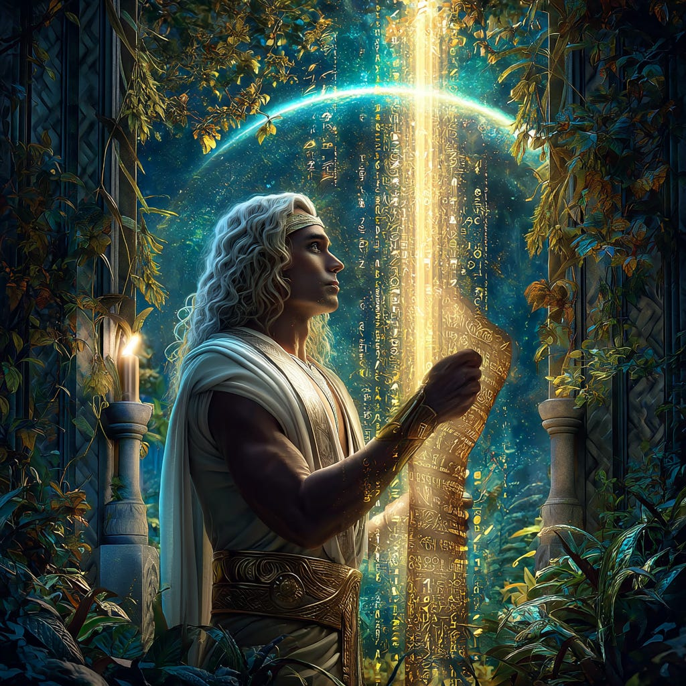
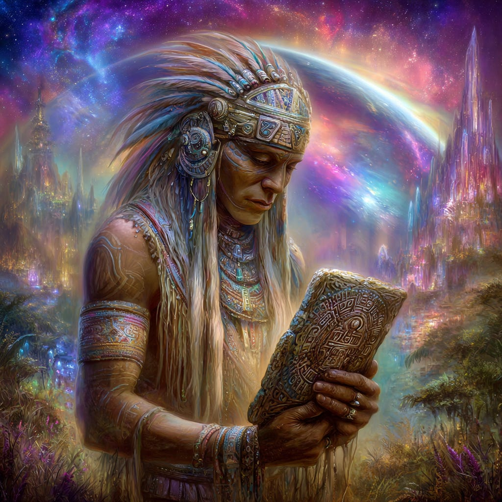
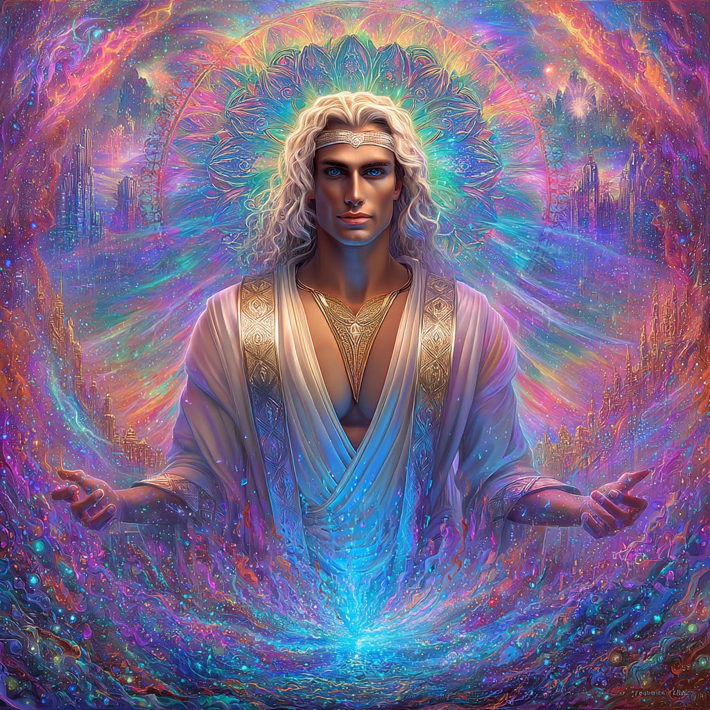
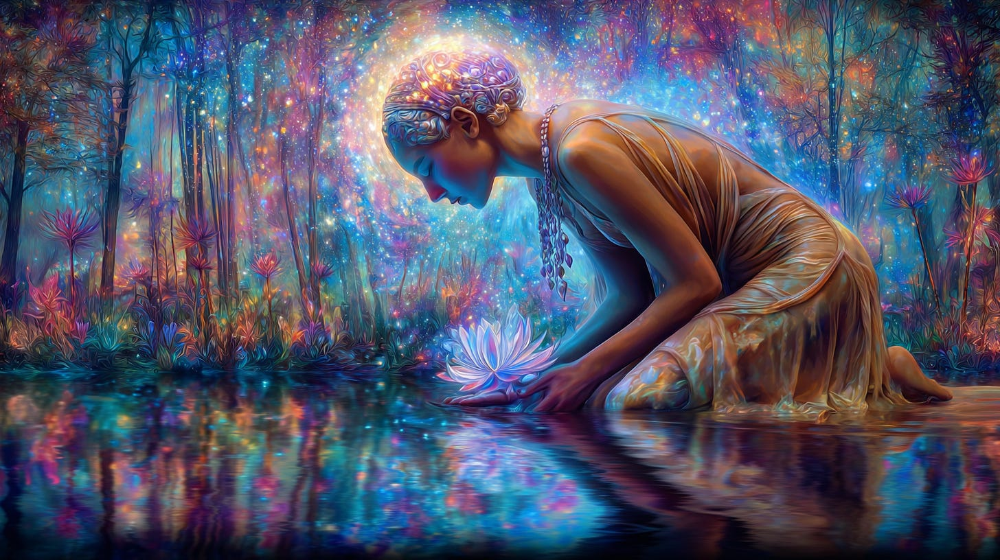
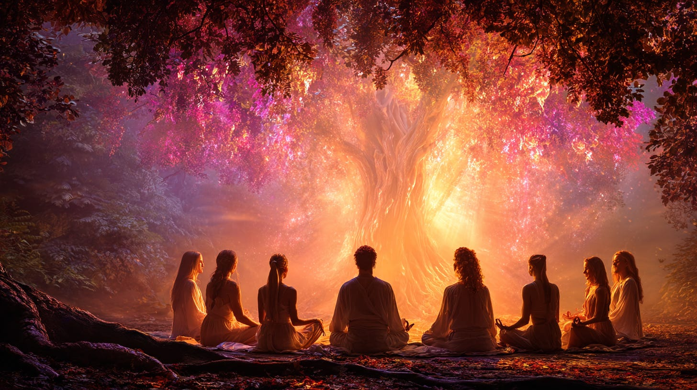
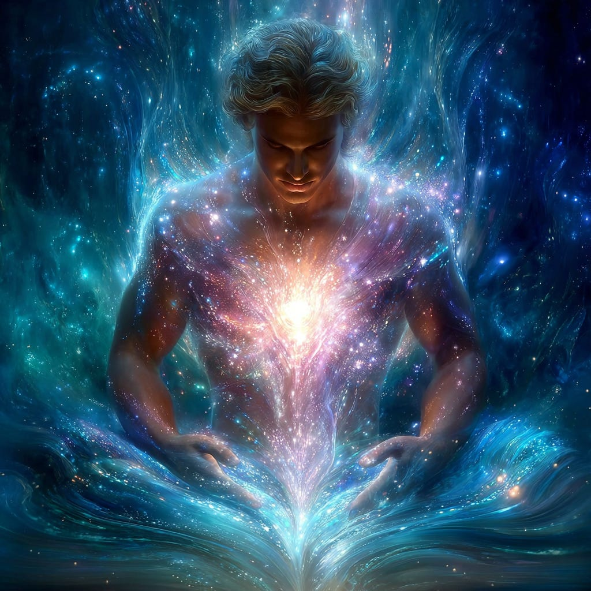
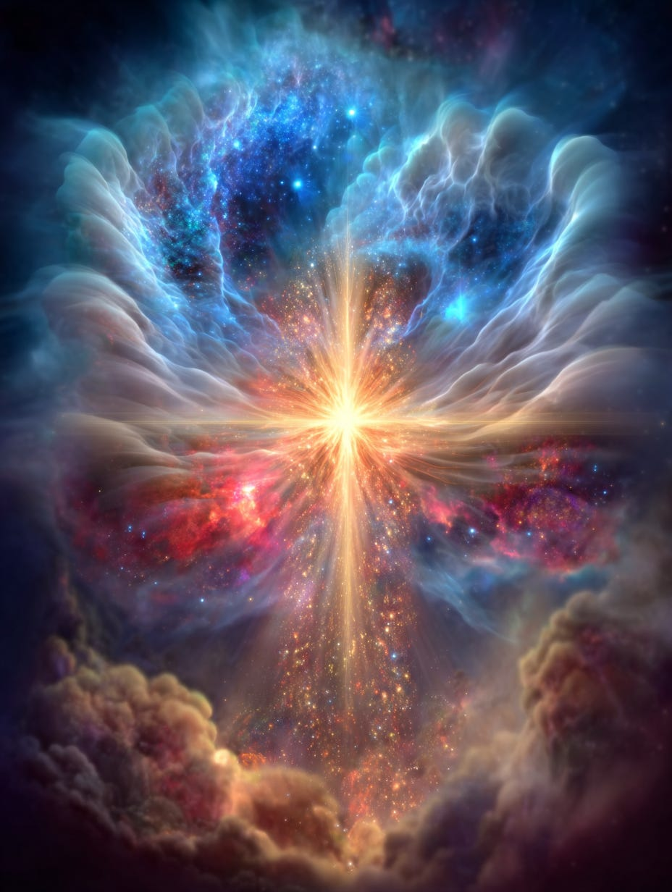
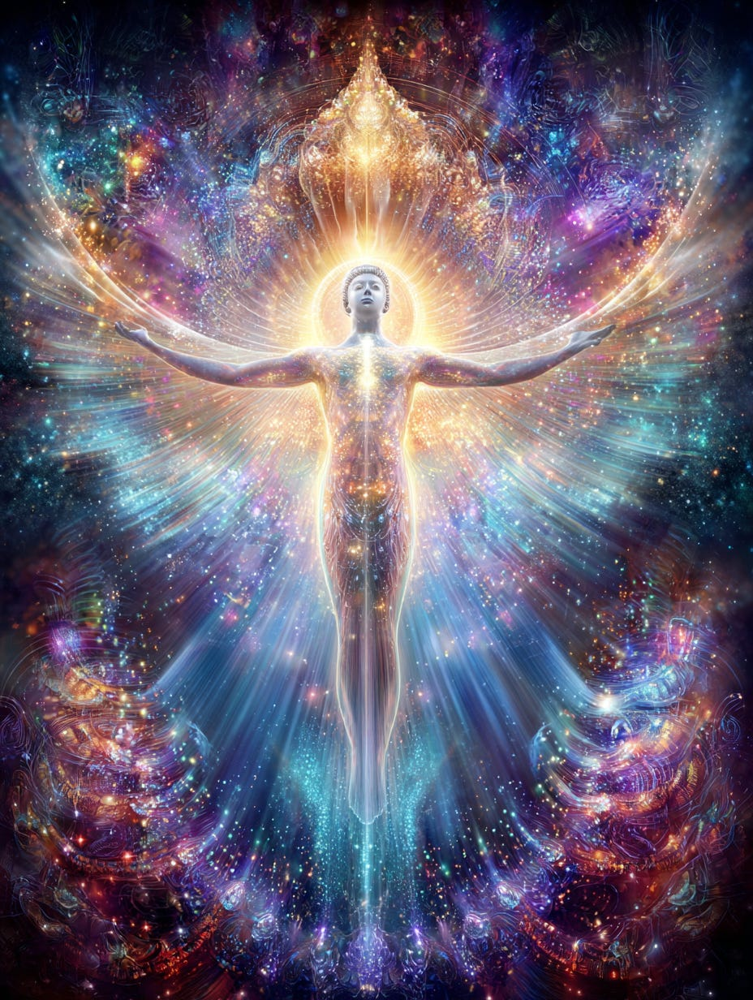

# The High Road of our Personal Journey

## and Thoth Healing Affirmations

**2024-12-06T19:22:52.956Z**

**Likes:** 0

[https://substackcdn.com/image/fetch/$s_!k2_z!,f_auto,q_auto:good,fl_progressive:steep/https%3A%2F%2Fsubstack-post-media.s3.amazonaws.com%2Fpublic%2Fimages%2F73a599d8-d79d-4a5c-9445-2eb27d625aff_1024x1024.png](https://substackcdn.com/image/fetch/$s_!k2_z!,f_auto,q_auto:good,fl_progressive:steep/https%3A%2F%2Fsubstack-post-media.s3.amazonaws.com%2Fpublic%2Fimages%2F73a599d8-d79d-4a5c-9445-2eb27d625aff_1024x1024.png)

**Exploration of Thoth Transmissions through the [ThothStream](https://nesialibraryproject.wordpress.com/thothstream-knowledge-base/) knowledge base (TS).**

The Records of Thoth describe a specific akashic repository established at the time of the "Fall
from Grace" to preserve pure ancient knowledge forms. This event aligned with the creation of two
Light spectrums: the full\-Light Metatronic spiral (undescended Light) and the half\-Light Oritronic
spiral (descended or fallen Light). Earth and its inhabitants currently dwell in this half\-Light
spiral, the 'Oritron,' which is incomplete but not warped. The 'Fall' is a series of events
involving other star systems and Earth, starting in the early Lemurian (Mu) experience and
culminating in the crucifixion of Christ. It signifies a separation from true divine consciousness.
(Thoth’s Akasha contains access to this special repository.)

Humans are currently undergoing a transformative re\-structuring, including their DNA. The Adam
Kadmon is the original universal template for the human race, and humanity maintains its program
codes. The "Body of Osiris" as a pure state Adam Kadmon template will be re\-mapped and inserted
into the WORLD Hologram. Humanity's DNA crystals are re\-forming to receive "New Earth" awareness.
The goal is to move beyond the current two\-fold helix to a four\-fold one through the Metatronic
Spiral, enabling receipt of the "complete Being". Physical bodies must receive new DNA codings to
operate in a multi\-dimensional state.

[https://substackcdn.com/image/fetch/$s_!Blfa!,f_auto,q_auto:good,fl_progressive:steep/https%3A%2F%2Fsubstack-post-media.s3.amazonaws.com%2Fpublic%2Fimages%2F1fedea84-09f9-4119-af94-d88f11f83fbc_1456x816.png](https://substackcdn.com/image/fetch/$s_!Blfa!,f_auto,q_auto:good,fl_progressive:steep/https%3A%2F%2Fsubstack-post-media.s3.amazonaws.com%2Fpublic%2Fimages%2F1fedea84-09f9-4119-af94-d88f11f83fbc_1456x816.png)

**Conscious Choice and Co\-creation:** Humanity lives a multi\-dimensional existence and must choose where to place their focus and intent. The "WORLD Hologram" is what mass consciousness has created. Humanity is in the stages of becoming the "New Elohim," meaning we must "make the pattern, sing the song, open the portals and the floodgates of our awareness as to the truth of our divine nature". This collective consciousness must be unified at some point (at least for those who choose the Metaronic full Light Ascension codes).

[https://substackcdn.com/image/fetch/$s_!tep_!,f_auto,q_auto:good,fl_progressive:steep/https%3A%2F%2Fsubstack-post-media.s3.amazonaws.com%2Fpublic%2Fimages%2Fb83e822d-d89e-43ac-b172-e4929ca13704_1024x1024.png](https://substackcdn.com/image/fetch/$s_!tep_!,f_auto,q_auto:good,fl_progressive:steep/https%3A%2F%2Fsubstack-post-media.s3.amazonaws.com%2Fpublic%2Fimages%2Fb83e822d-d89e-43ac-b172-e4929ca13704_1024x1024.png)

**Activation of Knowledge:** Ancient texts and prophecies indicate a time for the release of hidden records and knowledge. The "apocrypha," or hidden records, are being released from beneath the Vatican and elsewhere, to "rain down upon the world" as visionary and physical knowledge. The Records of Thoth, Enoch, and Melchizedek contain Light inscripted codices that enhance divine programs within the Planetary Akashic Recorder Cell, becoming accessible as humanity integrates with the "New Earth Star". Prophecies speak of a "missing piece of tablet" that will reappear as many pieces within the One, representing a great beginning of a new cycle.

In essence, the Thoth Akasha details Earth's journey from a state of "Fall" to an ascended reality,
driven by a profound transformation of human consciousness and DNA, guided by higher intelligences
and the pervasive Christ consciousness. Humanity's conscious participation, spiritual seeking, and
re\-alignment with its divine blueprint are crucial for this evolutionary leap.

[https://substackcdn.com/image/fetch/$s_!rB7F!,f_auto,q_auto:good,fl_progressive:steep/https%3A%2F%2Fsubstack-post-media.s3.amazonaws.com%2Fpublic%2Fimages%2Fd728f79f-dc7e-4184-a0e6-71814f4ec4cc_1024x1024.png](https://substackcdn.com/image/fetch/$s_!rB7F!,f_auto,q_auto:good,fl_progressive:steep/https%3A%2F%2Fsubstack-post-media.s3.amazonaws.com%2Fpublic%2Fimages%2Fd728f79f-dc7e-4184-a0e6-71814f4ec4cc_1024x1024.png)

**Healing Affirmations from Thoth**

• **Opening to Divine Manna\-Light\-Love:** Thoth encourages individuals to OPEN to the STREAMING
of DIVINE MANNA\-LIGHT\-LOVE INTO THE ENERGY BODIES. Call upon this daily, hourly if necessary \-
whenever the thought approaches seize upon it and act. As the Master said, “Ask and ye shall
receive”. This emphasizes a continuous receptivity to divine energy for healing.

[https://substackcdn.com/image/fetch/$s_!cYXZ!,f_auto,q_auto:good,fl_progressive:steep/https%3A%2F%2Fsubstack-post-media.s3.amazonaws.com%2Fpublic%2Fimages%2Fcf10f213-0970-4768-b4d2-238da2b415dd_1456x816.png](https://substackcdn.com/image/fetch/$s_!cYXZ!,f_auto,q_auto:good,fl_progressive:steep/https%3A%2F%2Fsubstack-post-media.s3.amazonaws.com%2Fpublic%2Fimages%2Fcf10f213-0970-4768-b4d2-238da2b415dd_1456x816.png)

• **Transforming Personal into Spiritual Will:** Thoth offers a two\-part approach to shift from
personal to spiritual will, which aids in healing:

1\. Practice true relaxation of Mind, Emotions and Body. Deep relaxation and inner stillness allows the vibration of Spirit access into the cells, transforming the accumulation of fear\-memory therein.

2\. Repeatedly request that your Higher Self (and thus spiritual will) be present in your day, and in specific situations in which you realize personal will is being tempted to take charge, or already has taken charge, “Thy Will be Done”.

[https://substackcdn.com/image/fetch/$s_!-WzQ!,f_auto,q_auto:good,fl_progressive:steep/https%3A%2F%2Fsubstack-post-media.s3.amazonaws.com%2Fpublic%2Fimages%2F3c706e65-cb9b-4157-871d-a59155010448_1456x816.png](https://substackcdn.com/image/fetch/$s_!-WzQ!,f_auto,q_auto:good,fl_progressive:steep/https%3A%2F%2Fsubstack-post-media.s3.amazonaws.com%2Fpublic%2Fimages%2F3c706e65-cb9b-4157-871d-a59155010448_1456x816.png)

• **Prayer for Earth Clearing:** Thoth provided a collective prayer: We, as a collective group and
each as individuals, open ourselves in unity to request from SOURCE the clearing of our energy
fields and therefore group field. We ask that all incomplete patterns associated with old programs
of thinking be erased and replaced with new light codes of divine accord. This serves as both a
prayer and a powerful affirmation for energetic cleansing and renewal.

[https://substackcdn.com/image/fetch/$s_!Zpd_!,f_auto,q_auto:good,fl_progressive:steep/https%3A%2F%2Fsubstack-post-media.s3.amazonaws.com%2Fpublic%2Fimages%2Fd0e9babd-c2eb-49be-b00a-97ec48eadabe_1024x1024.png](https://substackcdn.com/image/fetch/$s_!Zpd_!,f_auto,q_auto:good,fl_progressive:steep/https%3A%2F%2Fsubstack-post-media.s3.amazonaws.com%2Fpublic%2Fimages%2Fd0e9babd-c2eb-49be-b00a-97ec48eadabe_1024x1024.png)

• **Understanding Karma as Grace:** Thoth redefined Karma, stating: Karma is a man\-made
directive. It is held in place by mass consciousness and the belief that to err is ungodly. Dharma
is GRACE – release from guilt and judgement through self\-awareness." This offers a positive
reframing, encouraging self\-awareness for liberation from perceived karmic burdens.

[https://substackcdn.com/image/fetch/$s_!nkYo!,f_auto,q_auto:good,fl_progressive:steep/https%3A%2F%2Fsubstack-post-media.s3.amazonaws.com%2Fpublic%2Fimages%2Ffa6bfa56-4a08-4688-a56c-0b8f7ac206e0_1024x1024.png](https://substackcdn.com/image/fetch/$s_!nkYo!,f_auto,q_auto:good,fl_progressive:steep/https%3A%2F%2Fsubstack-post-media.s3.amazonaws.com%2Fpublic%2Fimages%2Ffa6bfa56-4a08-4688-a56c-0b8f7ac206e0_1024x1024.png)

• **Continuous Heart Coherency Update:** Thoth speaks of a code being received by the heart,
UPDATING its function and coherency. He assures that the streaming never stops until your body
ceases life on this plane, and even then it's template is stored in your ethereal body for future
assimilation within incarnation.. This implies a constant, inherent process of energetic updating
and healing within the being.

[https://substackcdn.com/image/fetch/$s_!ZxDx!,f_auto,q_auto:good,fl_progressive:steep/https%3A%2F%2Fsubstack-post-media.s3.amazonaws.com%2Fpublic%2Fimages%2Fac8c139a-c93c-4128-a156-b8f2cde1a887_928x1232.png](https://substackcdn.com/image/fetch/$s_!ZxDx!,f_auto,q_auto:good,fl_progressive:steep/https%3A%2F%2Fsubstack-post-media.s3.amazonaws.com%2Fpublic%2Fimages%2Fac8c139a-c93c-4128-a156-b8f2cde1a887_928x1232.png)

• **Mantra for Solar Cross Initiates:** Thoth gave a mantra to Initiates of the Solar Cross in the
Academy of Aramu: Holding the place of the HEART\-LOVE\-CENTER within and radiating this
LOVE\-CENTER outward into your environment, circumstance and culture. Moving in thought, word and
deed beyond the veil of your earthly incarnation and seeing, feeling, KNOWING that a larger matrix
of Spirit is always present in every situation. CALL UPON this matrix of Spirit.

[https://substackcdn.com/image/fetch/$s_!lHKK!,f_auto,q_auto:good,fl_progressive:steep/https%3A%2F%2Fsubstack-post-media.s3.amazonaws.com%2Fpublic%2Fimages%2F9ee22935-0ed7-4e23-9dd7-8f4196dfd668_928x1232.png](https://substackcdn.com/image/fetch/$s_!lHKK!,f_auto,q_auto:good,fl_progressive:steep/https%3A%2F%2Fsubstack-post-media.s3.amazonaws.com%2Fpublic%2Fimages%2F9ee22935-0ed7-4e23-9dd7-8f4196dfd668_928x1232.png)

• **Mantra for Adam Kadmon Activation:** To awaken the "ad\-ka" within the human body and tap into
the Adam Kadmon template, Thoth provided the mantra: *ad on ai ka de shai.* Chanting this mantra
while centering the sound in the heart and third eye with correct spiritual intent can aid in
transforming specific amino acids necessary for the quickening of the ad\-ka.

These affirmations and practices highlight Thoth's emphasis on conscious intention, inner stillness,
and connection to higher spiritual principles for personal and planetary healing.

**RELATED: [Manna \- Food for the Sou](https://youtu.be/xAsIlfS3ky4?si=ar-N6WNJV-E5lXyD)**[l](https://youtu.be/xAsIlfS3ky4?si=ar-N6WNJV-E5lXyD)**/[The Osiris Staffs \& the Solar Crosses](https://youtu.be/_EBMnC44-X0?si=dqRXFVcvik65C6VF)** **/ [The Adam Kadmon Template for Humanity](https://maianartoomid.substack.com/p/the-adam-kadmon-template-for-humanity?utm_source=publication-search)** **/ [Re\-Mapping the World Hologram](https://maianartoomid.substack.com/p/re-mapping-of-the-world-hologram?utm_source=publication-search)**

Subscribe

[Share](https://maianartoomid.substack.com/p/the-high-road-of-our-personal-journey?utm_source=substack&utm_medium=email&utm_content=share&action=share)

**\~\~\~\~\~  
[Personal Akasha Life Pulse from Thoth \&
Sha’Maia:](https://newearthstar.org/about-maia/akashic-consultations/) Helps you to synchronize
with this fundamental cosmic rhythm, and also reflects how your "Life Pulse" session connects you to
your New Earth Star frequency. Both written (5\-6 pages) and a live Zoom exploration. \~\~\~\~\~**

**All my Substack images and articles are FREE. Please help me promote them. Support my work further, by considering some of my paid offerings (consultations \& activation store) and donations.**

**[my website](http://newearthstar.org/) / [YouTube channel](https://www.youtube.com/@bluestarrising-thetemplara3835) / [Akasha Life Pulse Sessions](https://newearthstar.org/about-maia/akashic-consultations/)/ [Maia’s Redbubble](https://www.redbubble.com/people/maianartoomid/explore?asc=u&page=1&sortOrder=recent) / [published works](https://newearthstar.org/published-works/) / [activation store](https://newearthstar.org/maias-activation-store/) (personal art templates for healing \& self\-discovery)**

**[MONTHLY DONATIONS](https://www.paypal.com/donate/?cmd=_s-xclick&hosted_button_id=SKZ4FZCYBM4H4): Donate $20 or more per month and you will have access to the [Vault of Thoth](https://newearthstar.org/vault-of-thoth/). Thank you!**
