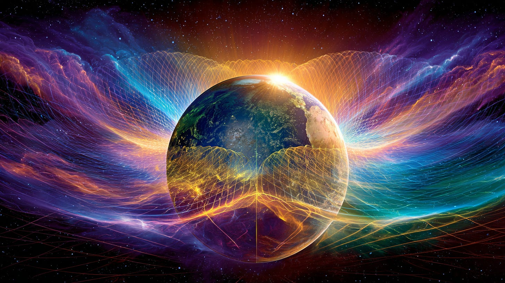
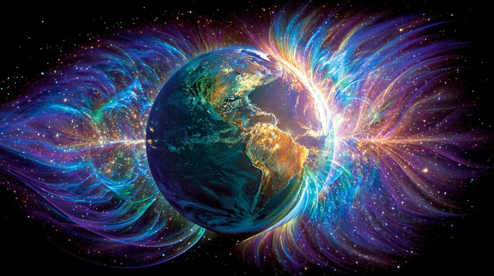

# Solar & Lunar Magnetic Shells

## from the Thoth Transmissions of early 1980's

**2024-12-06T19:22:52.956Z**

**Likes:** 0

[https://substackcdn.com/image/fetch/$s_!YPdP!,f_auto,q_auto:good,fl_progressive:steep/https%3A%2F%2Fsubstack-post-media.s3.amazonaws.com%2Fpublic%2Fimages%2F19d95264-79d4-4ff5-a163-d508faf21ac5_1456x816.png](https://substackcdn.com/image/fetch/$s_!YPdP!,f_auto,q_auto:good,fl_progressive:steep/https%3A%2F%2Fsubstack-post-media.s3.amazonaws.com%2Fpublic%2Fimages%2F19d95264-79d4-4ff5-a163-d508faf21ac5_1456x816.png)

**Exploration of Thoth Transmissions through the [ThothStream](https://nesialibraryproject.wordpress.com/thothstream-knowledge-base/) knowledge base (TS).**

**What they are \& where they “sit.”**  (from a science paper I read in 1980\):

*The Earth is enveloped by two fixed, planet\-wide fields: a **lunar magnetic shell** at \~110 km
and a **solar magnetic shell** at \~120 km. The planet turns beneath them. Each shell carries
circulating currents with a calm center called the **Focus** (\~350 mi/560 km across). Lunar flow
alternates by quadrant (clockwise/positive and counter\-clockwise/negative); solar flow holds two
counterposed current fields. Together they create a longitudinal “band of influence” in the
Northern Hemisphere where bio\-electric experience is uniquely modulated.*

[https://substackcdn.com/image/fetch/$s_!TIOi!,f_auto,q_auto:good,fl_progressive:steep/https%3A%2F%2Fsubstack-post-media.s3.amazonaws.com%2Fpublic%2Fimages%2F028eb910-f5e4-4a35-8b56-2963e5393a00_1456x816.png](https://substackcdn.com/image/fetch/$s_!TIOi!,f_auto,q_auto:good,fl_progressive:steep/https%3A%2F%2Fsubstack-post-media.s3.amazonaws.com%2Fpublic%2Fimages%2F028eb910-f5e4-4a35-8b56-2963e5393a00_1456x816.png)

**From Thoth:**

**How they translate into charge and number.**  When the shells couple with Earth’s crystalline grid (**crystallex**), their energies “step down” into electrical behavior: the **lunar shell expresses as AC**, the **solar shell as DC**. TS gives working values of **160 AC** and **220 DC**, summing to **380**—mirroring the Focus’s scale—and encodes their interaction via **Light Mathematics** (“metacycles”): lunar ≈ **88801\.01**, solar ≈ **10000\.01**, combined ≈ **98801\.02**, a value that also keys to the radius of the solar–lunar Foci in milli\-units.

[https://substackcdn.com/image/fetch/$s_!22xh!,f_auto,q_auto:good,fl_progressive:steep/https%3A%2F%2Fsubstack-post-media.s3.amazonaws.com%2Fpublic%2Fimages%2F3b0c8939-71f4-43c5-88a3-dda772e2170d_1456x816.png](https://substackcdn.com/image/fetch/$s_!22xh!,f_auto,q_auto:good,fl_progressive:steep/https%3A%2F%2Fsubstack-post-media.s3.amazonaws.com%2Fpublic%2Fimages%2F3b0c8939-71f4-43c5-88a3-dda772e2170d_1456x816.png)

**Planetary coupling: roil point, core, and the Venus regulator.**  As a Focus sweeps the planet’s **roil point** (Hawaiian Islands, centered on Mauna Loa), its spin sends alternating positive (clockwise) and negative (counter\-clockwise) **charges into the Sun\-Atoma** (Earth’s central “sun”). **Venus** functions as a **magnetic adjuster** between the outer solar–lunar shells and the inner Sun\-Atoma, with Hawai‘i a prime interface. **Cetaceans** carry a “Venus node” in their holographic brains—like a crystal radio—helping guide this regulation into Earth’s core; a homologous (now\-awakening) node exists in humans. Lemurian (Mu) practice synchronized with dolphins/whales at these windows to center the human heart in the exchange.

**Why it matters for consciousness and gridwork.**  These shells are not just geophysics; they are the “carrier wave” for planetary initiations. Their harmonics have been tapped to seed global broadcasts (e.g., the **Tribelight** frequency station)—opening access to higher programs of knowing as the grid’s scan pitch is raised. Periodic pulses (e.g., **Solar Wave of the New Sun**) recalibrate the shells and retune nodal stones and ancient sites into a **New Solar–Lunar Harmonic**.

### Key Terms

* **Solar/Lunar Magnetic Shells** – fixed planetary sheaths carrying counter\-rotating fields

* **Focus** – \~350\-mile stillpoint of a shell’s current field

* **Crystallex** – Earth’s crystalline grid coupling shells to biosystems

* **Sun\-Atoma** – central “sun” of Earth receiving shell charge

* **Roil Point** – planetary magnetic entry (Hawai‘i)

* **Venus Node** – tuning locus in cetacean/human hologramic brains

[https://substackcdn.com/image/fetch/$s_!lTiZ!,f_auto,q_auto:good,fl_progressive:steep/https%3A%2F%2Fsubstack-post-media.s3.amazonaws.com%2Fpublic%2Fimages%2F3b0d58ed-6368-4a4a-a54f-57eb67f04740_1456x816.png](https://substackcdn.com/image/fetch/$s_!lTiZ!,f_auto,q_auto:good,fl_progressive:steep/https%3A%2F%2Fsubstack-post-media.s3.amazonaws.com%2Fpublic%2Fimages%2F3b0d58ed-6368-4a4a-a54f-57eb67f04740_1456x816.png)

#### **Interactions of the Shells with Specific Locations**

* **Stonehenge – the “checkerboard” re\-orienter.**  Thoth names Stonehenge the planetary holder of Light\-codes—the *checkerboard pattern*—used to **re\-orient and balance the solar and lunar magnetic shells**. Even with damage to its grid, a **phantom field** persists, allowing the site to keep performing portions of its original stabilizing function during shell and pole adjustments.

* **Giza, Jerusalem, Tibet, Hawai‘i – synchronized Focus receivers.**  When the **Focus** of a shell passes one nodal region, others stand in **counter\-phase** across the hemisphere—TS explicitly pairs Four Corners ↔ Tibet, and simultaneously names **Jerusalem, the Giza Pyramid complex, and the “Sacred Breathing Mountains” of Hawai‘i** as lands experiencing lunar Focus. These patterns underlie why **ancient structures were sited on a global grid** synchronous with energy\-transformation nodes.

* **Hawai‘i’s roil point \& the Dolphin Temples—tuning the regulator.**  At the **roil point** (Hawaiian Islands), the passing Focus sends **\+/– charges** into the Sun\-Atoma; **Venus** acts as magnetic adjuster between outer shells and inner core. TS records **Dolphin Temples** where initiates synchronized with cetacean “Venus\-node” intelligence to center the human heart in this exchange—a direct **temple\-mediated coupling** to the shells’ regulator.

* **“Turning Stones” sites—fine\-tuning to the New Solar–Lunar Harmonic.**  As the **New Sun** recalibrates the shells, certain megalithic stones **“turn” in spacetime**, acting as **pivotal nodes**that retune ancient grids to the **New Solar–Lunar Harmonic** (TS cites the Callanish example). This process rides a “Solar Wave” that explicitly **re\-calibrates the solar\-lunar shells** before washing into the roil point.

* **Cathedral “oracle grottos” (Chartres, Compostela, etc.)—planetary correspondences.**  TS preserves a lineage map where European cathedrals **overlay earlier planetary oracle nodes** (e.g., **Sun–Chartres; Moon–Compostela**; others aligned to Mercury, Venus, Mars, Jupiter). While not named as shell\-reorienters like Stonehenge, they **conduct and distribute** the same planetary currents those shells modulate through the grid.

[https://substackcdn.com/image/fetch/$s_!519Q!,f_auto,q_auto:good,fl_progressive:steep/https%3A%2F%2Fsubstack-post-media.s3.amazonaws.com%2Fpublic%2Fimages%2Fde32adbe-064a-47d9-931d-8271fe3d5f80_1456x816.png](https://substackcdn.com/image/fetch/$s_!519Q!,f_auto,q_auto:good,fl_progressive:steep/https%3A%2F%2Fsubstack-post-media.s3.amazonaws.com%2Fpublic%2Fimages%2Fde32adbe-064a-47d9-931d-8271fe3d5f80_1456x816.png)

**Deep\-Mode outline (how it fits together):**

* Shell **Foci** sweep nodal belts; **temples at nodes** act as receivers/phase\-balancers.

* **Stonehenge** carries a *re\-orientation code* to stabilize shell shifts.

* **Hawai‘i roil point** couples shell charge to the core via **Venus regulation**; **Dolphin Temples** aided human attunement.

* **Turning stones** show on\-the\-ground grid retuning as shells enter a new harmonic.   
**Why it matters:** these sites aren’t just historic—they are **active organs** in the planet’s subtle body, shaping how collective consciousness receives and stabilizes the shell currents.

### Key Terms

* **Focus** – the \~350\-mile stillpoint of each shell’s current

* **Roil Point** – magnetic entry to Earth’s core dynamics

* **Checkerboard Pattern** – Stonehenge code for shell re\-orientation

* **Phantom Field** – residual functional field of a damaged site

* **New Solar–Lunar Harmonic** – updated shell cadence (New Sun)

* **Venus Node** – cetacean/human tuner for shell\-to\-core regulation

[https://substackcdn.com/image/fetch/$s_!_lHp!,f_auto,q_auto:good,fl_progressive:steep/https%3A%2F%2Fsubstack-post-media.s3.amazonaws.com%2Fpublic%2Fimages%2F0a87b763-9042-4a66-ba5d-ef3838b4a4aa_1456x816.png](https://substackcdn.com/image/fetch/$s_!_lHp!,f_auto,q_auto:good,fl_progressive:steep/https%3A%2F%2Fsubstack-post-media.s3.amazonaws.com%2Fpublic%2Fimages%2F0a87b763-9042-4a66-ba5d-ef3838b4a4aa_1456x816.png)

**Thoth in 2025** reveals to me that the energy systems of all living creatures on the planet are in synch with the movement and electromagnetic pulses of these Shells. In this Time, when the whole electromagnetic field of the planet is in flux as we near the “Ascension” transference from a World System I to a World System II (New Earth Star), the S/L Shells are especially potent stimuli for our systemic functioning. Each day our bodies are re\-adjusting to this stimuli as it changes "direction" in our energy systems

[https://substackcdn.com/image/fetch/$s_!-pYJ!,f_auto,q_auto:good,fl_progressive:steep/https%3A%2F%2Fsubstack-post-media.s3.amazonaws.com%2Fpublic%2Fimages%2Fa630dd9f-38f6-4380-9777-a0344e23c69b_1456x816.png](https://substackcdn.com/image/fetch/$s_!-pYJ!,f_auto,q_auto:good,fl_progressive:steep/https%3A%2F%2Fsubstack-post-media.s3.amazonaws.com%2Fpublic%2Fimages%2Fa630dd9f-38f6-4380-9777-a0344e23c69b_1456x816.png)

.**The SUN KEY dynamic interacts with the S/L magnetic shells**.

First a basic definition of the Sun Key as a dynamic in the atoma (sun) of the hollow earth.

* **Basic definition:** The **Sun Key** is a *rayship* seeded in Earth’s **central sun atoma** (the heart\-sun of the Interior/Hollow Earth). First installed by First\-Migration Star Kindred and **released from the atoma on July 4, 1988**, it opens a path of recalibration for the New Earth paradigm from within the planet’s heart.

* **What it does inside the atoma:** Operating in the atoma’s heart\-mechanics, it **realigns fields to the planet’s magnetic “due north” of the atoma\-sun**, and through that, syncs our own atoms with the planetary and *galactic* atoma—i.e., it is a compass\-like template for re\-alignment and code distribution from the interior sun outward.

* **Where this lives/flows:** The **atoma** is the Earth’s pulsing heart\-sun with four polarity chambers (*regula aspa*), sending waves through the hollow sphere and its “arteries.” The Sun Key dynamic functions within this heart, so its effects naturally travel the Interior circuits to surface grids.

* **Lineage link:** In TS, the atoma connects Earth ↔ our Sun ↔ **Rigel (Blue Star)**; the Sun Key’s guardianship by Master Builders/Sun\-Bow Clan fits this Rigel line, explaining its role in opening inter\-stellar creation pathways via the atoma.

[https://substackcdn.com/image/fetch/$s_!wWHc!,f_auto,q_auto:good,fl_progressive:steep/https%3A%2F%2Fsubstack-post-media.s3.amazonaws.com%2Fpublic%2Fimages%2F0eaee6b5-360a-4dcc-8b65-1edbb4100fc0_1456x816.png](https://substackcdn.com/image/fetch/$s_!wWHc!,f_auto,q_auto:good,fl_progressive:steep/https%3A%2F%2Fsubstack-post-media.s3.amazonaws.com%2Fpublic%2Fimages%2F0eaee6b5-360a-4dcc-8b65-1edbb4100fc0_1456x816.png)

**Thoth states that the Sun Key dynamic in the atoma of the earth helps align living forms to the Solar and Lunar Shells so that there is less chaos in the energy bodies of these Creations.**

* **Core coupling (inside → outside).**  Thoth frames the **Sun Key** as an actual *rayship* embedded in Earth’s **Sun\-Atoma**—“that element of entry into the fiber of wholeness… the essence of the Sun.” Its action is to be “entered” through keyholes in sacred sites, turning a planetary lock to re\-attune the Golden Grid and “re\-bond” Earth to its true axis in etheric alignment.

* **Dynamic with the Shells (outside ↔ inside).**  As the **Focus** of the Solar/Lunar magnetic shells passes the **roil point** (Hawai‘i), a \+/– charge is pulsed into the Sun\-Atoma; **Venus** acts as the **adjuster** between outer shell magnetics and the inner Atoma, smoothing differences and stabilizing the geo\-magnetic center amid flux. This is the first systemic “de\-chaosing”: the adjuster regulates the influx so life\-systems receive a coherent daily carrier\-wave.

* **Signal distribution (grid → temples → biologies).**  From the Atoma, the charge rises through the **hagia** tube to the surface via the roil point, enters the **FireGem / Phi Gate** engine, and spreads through planetary and temple grids; all earth/temple nodes receive the **New Earth** program carried on this stream. In parallel, a Hierarchical project (**Tribelight**) modulates the grid’s “scan pitch,” leveraging the shells’ Focus math to broadcast equilibrium codes. These two flows—Sun Key from within and Shell/Tribelight from without—converge as a stabilizing field.

* **Embodiment (electrics → sheaths → DNA).**  Shell currents step down as **AC/DC** (lunar AC, solar DC) through the **crystallex** grid, while in humans the **solar sheaths** sing **chordrosomes**—light\-code tones—that instruct **DNA** to re\-form toward New Earth awareness. The Sun Key’s Atoma broadcast and the Shells’ daily polarization become one message stream your body can “hear,” reducing internal static.

* **Macro signs of coherence.**  In the world body, **turning stones** and re\-tuned megalithic nodes “fine\-tune ancient grids to the New Solar–Lunar Harmonic”—evidence of the Sun\-Key/Atoma ↔ Shell synchronization landing in spacetime. In the personal field, steadier orientation to the day’s clockwise/counter\-clockwise current and quicker settling of the heart\-center are the lived “out\-picture.”

    

**Suggested Studies**

**[Sun Key (video)](https://youtu.be/sjnm2zIQLGc?si=8I_Y3meqaLzZlrG2) [/ Sun Key Compass](https://maianartoomid.substack.com/p/the-sun-key-compass?utm_source=publication-search) / [Fire Gem Hawaiian Matrix (video)](https://youtu.be/oJAjMGqZZco?si=_RqyjPlemd9Alcbp) / [Mystic World of Dolphins](https://youtu.be/0AK-G2wVFvU?si=7Bmz6G7RCuezr_hV)**[https://youtu.be/0AK-G2wVFvU?si=7Bmz6G7RCuezr_hV](https://youtu.be/0AK-G2wVFvU?si=7Bmz6G7RCuezr_hV)**[(video)](https://youtu.be/0AK-G2wVFvU?si=7Bmz6G7RCuezr_hV)**

Subscribe

[Share](https://maianartoomid.substack.com/p/solar-and-lunar-magnetic-shells-089?utm_source=substack&utm_medium=email&utm_content=share&action=share)

**\~\~\~\~\~  
[Personal Akasha Life Pulse from Thoth \&
Sha’Maia:](https://newearthstar.org/about-maia/akashic-consultations/) Helps you to synchronize
with this fundamental cosmic rhythm, and also reflects how your "Life Pulse" session connects you to
your New Earth Star frequency. Both written (5\-6 pages) and a live Zoom exploration. \~\~\~\~\~**

**All my Substack images and articles are FREE. Please help me promote them. Support my work further, by considering some of my paid offerings (consultations \& activation store) and donations.**

**[my website](http://newearthstar.org/) / [YouTube channel](https://www.youtube.com/@bluestarrising-thetemplara3835) / [Akasha Life Pulse Sessions](https://newearthstar.org/about-maia/akashic-consultations/)/ [Maia’s Redbubble](https://www.redbubble.com/people/maianartoomid/explore?asc=u&page=1&sortOrder=recent) / [published works](https://newearthstar.org/published-works/) / [activation store](https://newearthstar.org/maias-activation-store/)**

**(personal art templates for healing \& self\-discovery)**

**[MONTHLY DONATIONS](https://www.paypal.com/donate/?cmd=_s-xclick&hosted_button_id=SKZ4FZCYBM4H4): Donate $20 or more per month and you will have access to the [Vault of Thoth](https://newearthstar.org/vault-of-thoth/). Thank you!**
