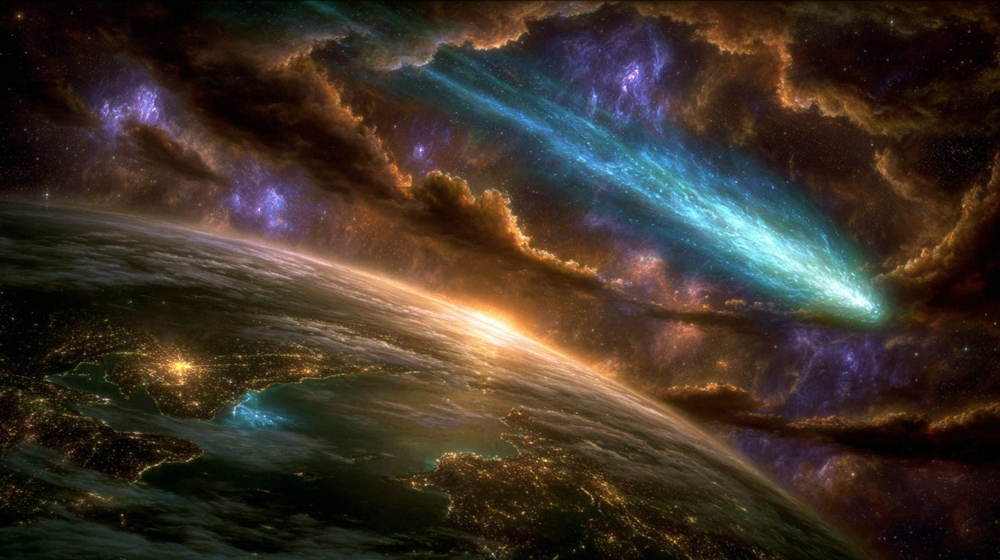
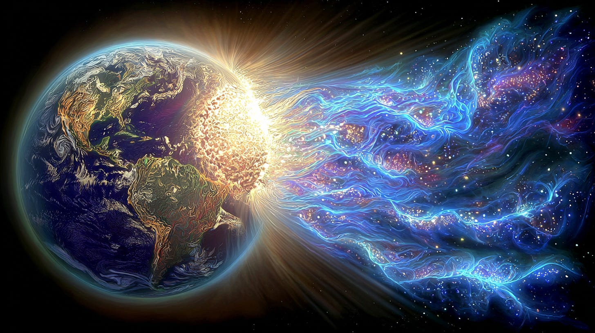
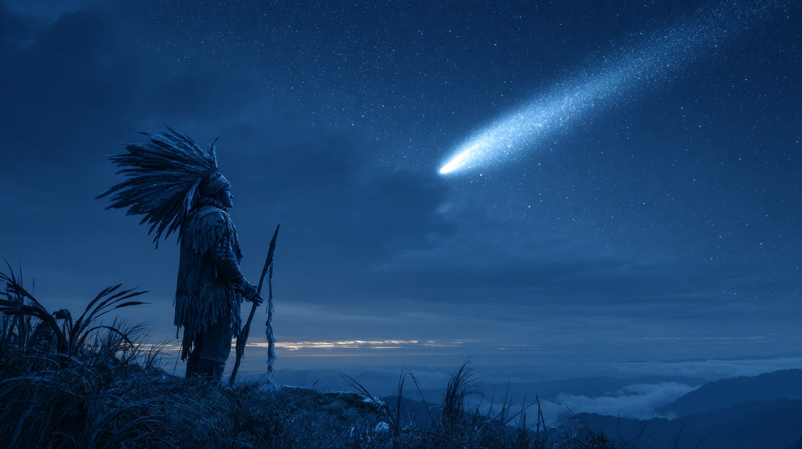
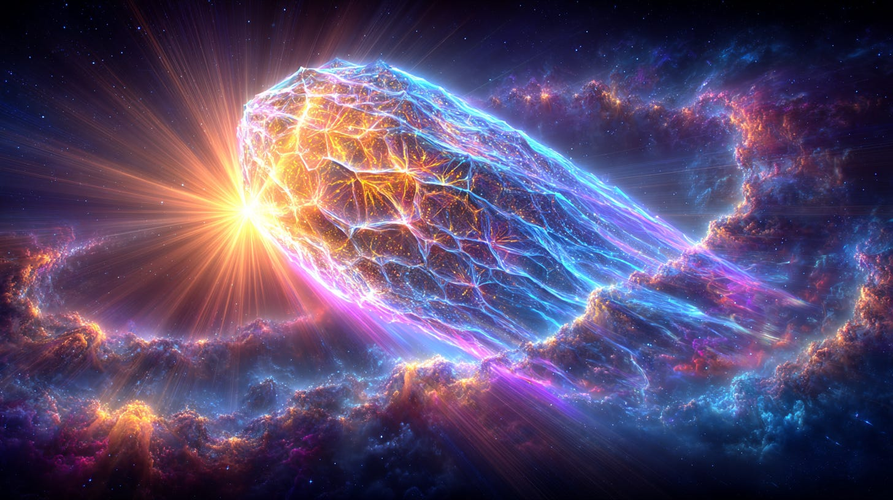
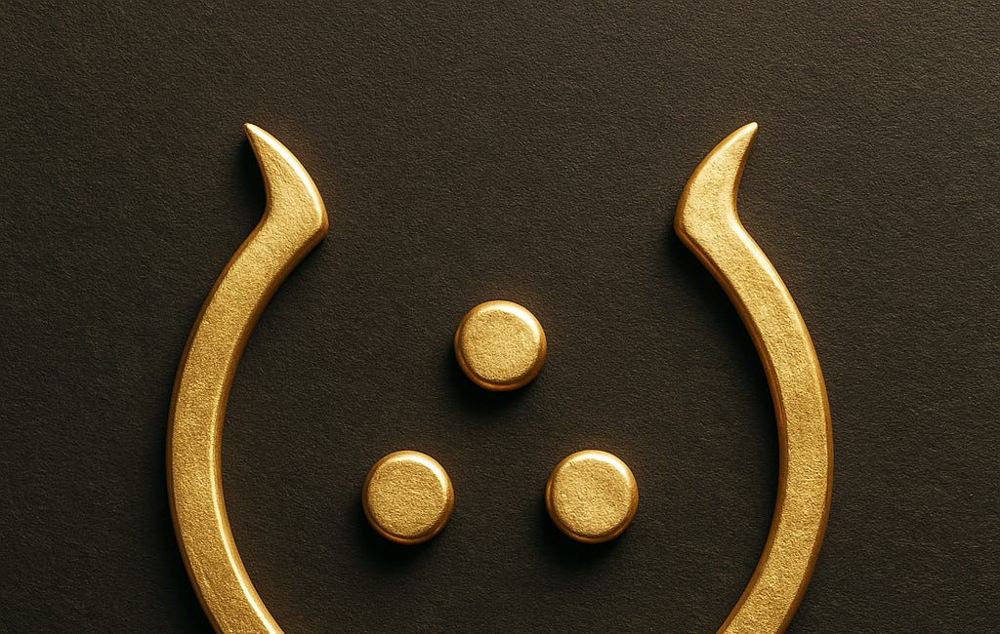

# 3I/ATLAS & the True Nature of Comets

## A Thothic Perspective

**2024-12-06T19:22:52.956Z**

**Likes:** 0

**Before we enter the realm of the mysterious 3I/ALTAS “comet” here is what Thoth has to say about comets in general from material gathered through the years by my ThothStream knowledge base. Bear in mind that asteroids fall into this “divinely category” as well.**

[https://substackcdn.com/image/fetch/$s_!ayg0!,f_auto,q_auto:good,fl_progressive:steep/https%3A%2F%2Fsubstack-post-media.s3.amazonaws.com%2Fpublic%2Fimages%2F0b71550b-da71-4f72-a59c-495e14b87184_1456x816.png](https://substackcdn.com/image/fetch/$s_!ayg0!,f_auto,q_auto:good,fl_progressive:steep/https%3A%2F%2Fsubstack-post-media.s3.amazonaws.com%2Fpublic%2Fimages%2F0b71550b-da71-4f72-a59c-495e14b87184_1456x816.png)

Thoth offers extensive insights into comets, describing them not merely as astronomical objects but
as powerful cosmic entities that significantly influence planetary consciousness, time, and karma.

Here's what Thoth has to say about comets and how consciousness can interact with them:

• Nature of Comets

◦ Comets are cosmic electrons in orbit around a charged hyper\-space nucleus.

◦ Their spiral motions are highly inter\-dimensional, making them more active across various time
planes compared to most Earth\-known energy spirals.

◦ They can be likened to Solar Lords, greatly evolved beings that are mobile within universal
systems.

◦ Comets possess an inherent ability to generate tremendous evolutionary changes through a process
comparable to auric telepathic bonding in humans.

[https://substackcdn.com/image/fetch/$s_!sjJQ!,f_auto,q_auto:good,fl_progressive:steep/https%3A%2F%2Fsubstack-post-media.s3.amazonaws.com%2Fpublic%2Fimages%2Fbc5928d3-8bc7-4d98-8273-d7b40740f884_1456x816.png](https://substackcdn.com/image/fetch/$s_!sjJQ!,f_auto,q_auto:good,fl_progressive:steep/https%3A%2F%2Fsubstack-post-media.s3.amazonaws.com%2Fpublic%2Fimages%2Fbc5928d3-8bc7-4d98-8273-d7b40740f884_1456x816.png)

• Impact on Earth and Consciousness

◦ As a comet moves along its orbital path, it pierces the sensitive light density webs of stars
and planets. This action triggers long\-dormant thought mechanisms held in karmic suspension and
accelerates existing thought/time correlations with the worlds it affects.

◦ Comets lock onto the heartbeat of a planet's central sun (atoma). When a comet comes into close
proximity to Earth, it interferes with the planet's unique harmony by injecting its own chord into
the cosmic concert. This creates a quantum\-like surge in the planet's dynamics by exposing Earth's
three\-dimensional mode to the comet's inter\-dimensional values.

◦ The particle effect of light, as observed by scientists, is a result of discrete units of
"thinking" waves that respond to the ether stream. Ether streams themselves are formed by intense
concentrations of dimensional pull, opposite attraction, or other functional modes through which
ether accepts and advances energy.

◦ When the spiral vectors of a comet interpolate with Earth's time\-spiral vectors, Earth's time
is given a "vent into greater dimensions of renewal".

◦ Due to humanity's current inability to accept energy in the pure form of Light Mathematics, the
expanded dimension brought forth by comets is largely received on the emotional plane. This often
leads to an accelerated or premature projection of karmic attitudes, erupting into chaotic "feeding
frenzies" where deep, uncharted karmic issues are exposed more frequently than they are processed.
Long\-festering mass karma, such as that in the Middle East, is cited as an example of this effect.

◦ The implosions of comets on other planets, like Jupiter, can increase the "time wave" on Earth,
causing time to initially move faster before slowing down again at a new pace. This implies an
escalation or decrease in the awareness factor. Such events also lead to increased geological
changes and magnetic shifts due to surges at the Earth's central sun atoma.

[https://substackcdn.com/image/fetch/$s_!OFug!,f_auto,q_auto:good,fl_progressive:steep/https%3A%2F%2Fsubstack-post-media.s3.amazonaws.com%2Fpublic%2Fimages%2F0d1549e4-4fd7-4fab-ae73-16918625ef07_1456x816.png](https://substackcdn.com/image/fetch/$s_!OFug!,f_auto,q_auto:good,fl_progressive:steep/https%3A%2F%2Fsubstack-post-media.s3.amazonaws.com%2Fpublic%2Fimages%2F0d1549e4-4fd7-4fab-ae73-16918625ef07_1456x816.png)

• Comets and Karma

◦ Thoth views karma as "seed pods trapped in cyclic anticipation of renewal" that await release.
Time, as a mechanism of cycles, is the releasing factor.

◦ ***Humanity's choice in directing the transformational energies brought by cometary bodies is
crucial, as it determines whether positive or negative patterns are created for themselves and the
planet.***

◦ Halley's Comet, in particular, was foretold to trigger karmic actualization and finalize the
Christ KA's mission on Earth, releasing Him to Faustia, which in turn would enable His physical
return to Earth and the planet's ascension to Christed Consciousness.

◦ The comet's perihelion in February 1986, aligning with other celestial bodies, presented an
opportunity to consciously direct positive energies for a new age consciousness and Earth's
crystalline transformation, with a warning that failure to do so could result in intense
totalitarian rule.

◦ The planetary grouping in October 1985 emphasized the need for "energy receptors" to open to
their Higher Self, facilitating the influx of higher wisdom and channeling from cometary entities.
This period was also expected to open "karmic closets," bringing hidden issues to the surface for
release.

◦ The specific point on Earth's time spiral where a comet's spirals penetrate determines the
degree and direction of its effect. For instance, Halley's Comet in 1986 was said to activate
MALKUTH—the Qabbalistic sphere of confrontation and revelation. This activation would infuse both
the Anti\-Christ and the Christ (whose etheric double was to be released in April 1986\) with new
and old power forms, ultimately breaking a "Seal". On April 24, 1986, the Hierarchy was to project
the Divine Light of the World's Virgin Birth, previously trapped in Sirius, into Earth's center
through MALKUTH (Halley's).

◦ The non\-appearance of Comet Kohoutek in 1973 was attributed to the Hierarchy curtailing extreme
karma\-letting that would have otherwise occurred, due to "grace" factors. Kohoutek's previous visit
50,000 years prior had significantly altered Earth's magnetic influence, causing a solar explosion
and influencing civilizations.

[https://substackcdn.com/image/fetch/$s_!2k6-!,f_auto,q_auto:good,fl_progressive:steep/https%3A%2F%2Fsubstack-post-media.s3.amazonaws.com%2Fpublic%2Fimages%2F30c11515-674f-44be-848a-2110beaa3d89_1456x816.png](https://substackcdn.com/image/fetch/$s_!2k6-!,f_auto,q_auto:good,fl_progressive:steep/https%3A%2F%2Fsubstack-post-media.s3.amazonaws.com%2Fpublic%2Fimages%2F30c11515-674f-44be-848a-2110beaa3d89_1456x816.png)

• Human Interaction with Comets

◦ Earth's souls need to not only understand the interactions between comets and the planet but
also to synthesize with comets and other energy spiral forces that profoundly affect their world.

◦ Comets bring strong influxes of transformational energy, and it is humanity's choice in
directing these incoming energies that creates positive or negative patterns for themselves and the
planet.

◦ The activation of consciousness through such events is not random but part of a process
initiated by Angelic Hierarchies of the Living Lights. Each time a cosmic event recurs in its cycle,
it brings the same essence but to a world in a new place in space, time, and dimension, leading to
quantum evolution regardless of external manifestations.

[https://substackcdn.com/image/fetch/$s_!RK6e!,f_auto,q_auto:good,fl_progressive:steep/https%3A%2F%2Fsubstack-post-media.s3.amazonaws.com%2Fpublic%2Fimages%2F9a80aba0-653f-48a6-8949-0d302fe0a4f6_1456x816.png](https://substackcdn.com/image/fetch/$s_!RK6e!,f_auto,q_auto:good,fl_progressive:steep/https%3A%2F%2Fsubstack-post-media.s3.amazonaws.com%2Fpublic%2Fimages%2F9a80aba0-653f-48a6-8949-0d302fe0a4f6_1456x816.png)

Now, in 2025 here comes 3I/ATLAS. It is especially strange causing some scientists like Avi Loeb to
speculate it may not be a comet but an interstellar alien probe of some kind.

**So what does Thoth in this current time of August, 2025 have to say about 3I/ATLAS?**

**Thoth:** This object has not been sent from far away, traveling eons through time and space. It has come through a Stargate. It is a merkabah intended to adjust the frequencies within our sun and also the central sun atomas of several of our solar systems planets. It comes from the [Trapezium of Orion](https://nesialibraryproject.wordpress.com/trapezium-of-orion/) (again, not directly but through a Stargate). Yet it must follow a specific trajectory in space/time in order to effectively perform its programmed purpose.

This purpose is part of the dispensation for planet earth, allowing this world more time to
accomplish its transition from a [World System I to a World System
II.](https://nesialibraryproject.wordpress.com/akashic-definitions/world-systems-i-and-ii/) Yet it
will be (already is) disruptive as it engages the lower frequencies of planet earth and its
holographic universal perspective. This is necessary for crucial adjustments to be made in the
electro\-magnetic field of earth.

We (Thoth and his merkabah of souls) refer you to the SUN KEY which was again activated recently.
the SUN KEY aides the earth in stabilization during this period of engagement with the SOLATRAN
(3I/ATLAS).

**This video on 3I/ATLAS is pretty much on target with the Thothic analogy ((title is of course click bait):**

[https://www.youtube-nocookie.com/embed/cCAH-uMAbv8?rel=0&amp;autoplay=0&amp;showinfo=0&amp;enablejsapi=0](https://www.youtube-nocookie.com/embed/cCAH-uMAbv8?rel=0&amp;autoplay=0&amp;showinfo=0&amp;enablejsapi=0)

**To re\-visit my video on the SUN KEY:**

[https://www.youtube-nocookie.com/embed/sjnm2zIQLGc?rel=0&amp;autoplay=0&amp;showinfo=0&amp;enablejsapi=0](https://www.youtube-nocookie.com/embed/sjnm2zIQLGc?rel=0&amp;autoplay=0&amp;showinfo=0&amp;enablejsapi=0)

**Also:**

## [The Sun Key Compass](https://maianartoomid.substack.com/p/the-sun-key-compass)

[Sha'Maia Christine Nartoomid](https://substack.com/profile/84015556-shamaia-christine-nartoomid)

·

Jul 19

In order to truly understand the following, it is suggested that you watch THE SUN KEY video.

[Read full story](https://maianartoomid.substack.com/p/the-sun-key-compass)

Read full story

Subscribe

[Share](https://maianartoomid.substack.com/p/3iatlas-and-the-true-nature-of-comets?utm_source=substack&utm_medium=email&utm_content=share&action=share)

**\~\~\~\~\~**

**[Personal Akasha Life Pulse from Thoth \& Sha’Maia:](https://newearthstar.org/about-maia/akashic-consultations/) Helps you to synchronize with this fundamental cosmic rhythm, and also reflects how your "Life Pulse" session connects you to your New Earth Star frequency. Both written (5\-6 pages) and a live Zoom exploration.**

**\~\~\~\~\~**

**All my Substack images and articles are FREE. Please help me promote them. Support my work further, by considering some of my paid offerings (consultations \& activation store) and donations.**

**[my website](http://newearthstar.org/) / [YouTube channel](https://www.youtube.com/@bluestarrising-thetemplara3835) / [Akasha Life Pulse Sessions](https://newearthstar.org/about-maia/akashic-consultations/)/ [Maia’s Redbubble](https://www.redbubble.com/people/maianartoomid/explore?asc=u&page=1&sortOrder=recent) / [published works](https://newearthstar.org/published-works/) / [activation store](https://newearthstar.org/maias-activation-store/)**

**(personal art templates for healing \& self\-discovery)**

**[MONTHLY DONATIONS](https://www.paypal.com/donate/?cmd=_s-xclick&hosted_button_id=SKZ4FZCYBM4H4): Donate $20 or more per month and you will have access to the [Vault of Thoth](https://newearthstar.org/vault-of-thoth/). Thank you!**

