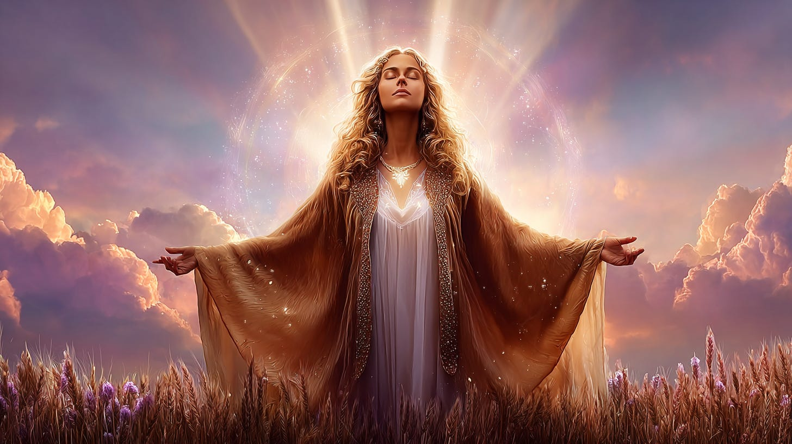
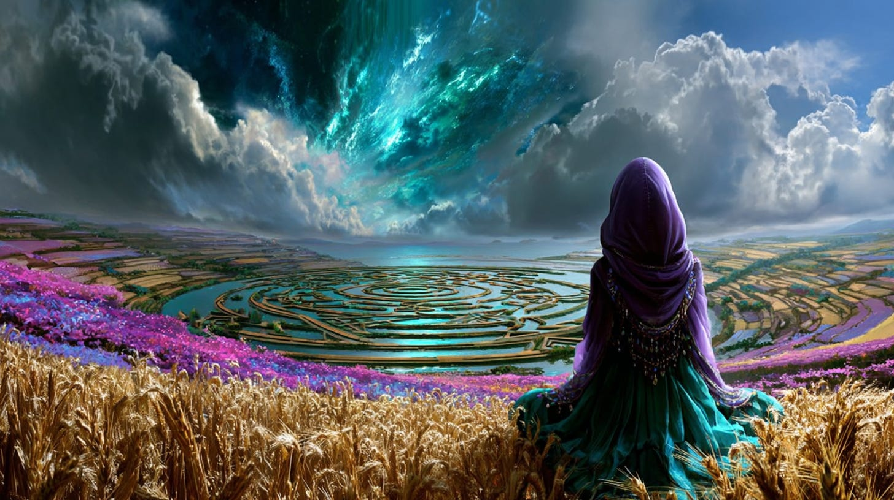
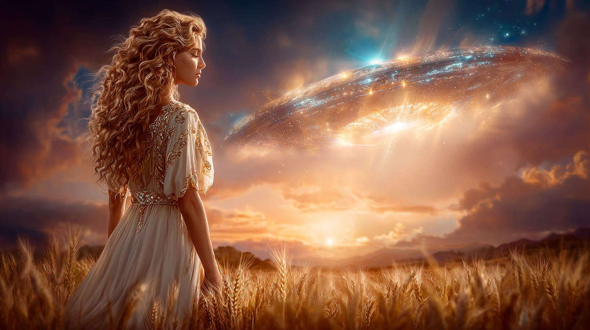
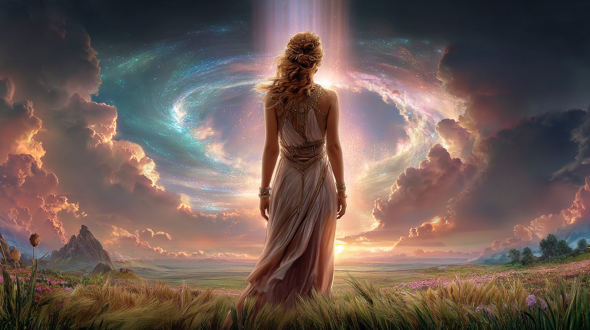
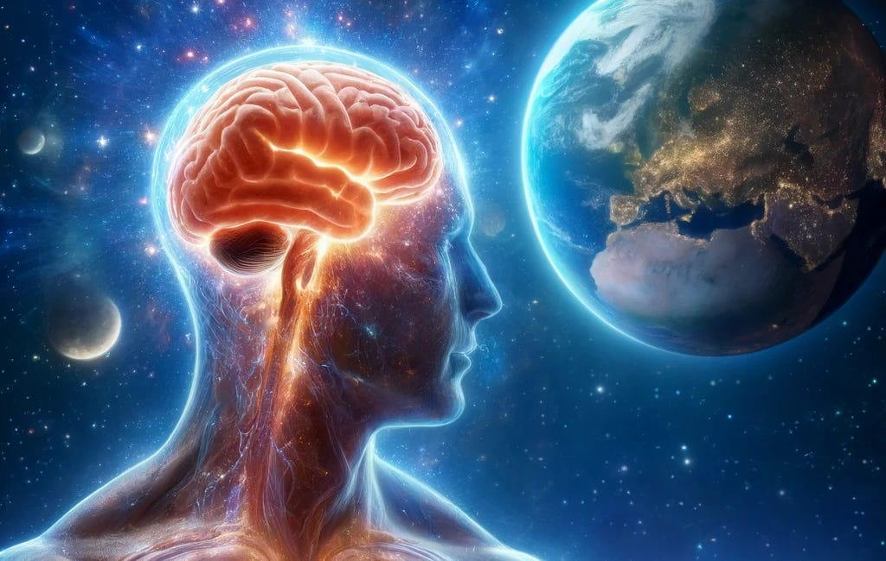
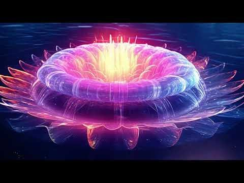

# Crop Circles as Living Ideations

## Creating the triggering of Inter-dimensional Thought

**2024-12-06T19:22:52.956Z**

**Likes:** 0

***Exploration of Thoth Transmissions through the [ThothStream](https://nesialibraryproject.wordpress.com/thothstream-knowledge-base/) knowledge base.***

[https://substackcdn.com/image/fetch/$s_!uqhl!,f_auto,q_auto:good,fl_progressive:steep/https%3A%2F%2Fsubstack-post-media.s3.amazonaws.com%2Fpublic%2Fimages%2F0f7ebaa8-1cb8-465d-a6f4-d640afa36f8e_1456x816.png](https://substackcdn.com/image/fetch/$s_!uqhl!,f_auto,q_auto:good,fl_progressive:steep/https%3A%2F%2Fsubstack-post-media.s3.amazonaws.com%2Fpublic%2Fimages%2F0f7ebaa8-1cb8-465d-a6f4-d640afa36f8e_1456x816.png)

**Nature and Definition of Crop Circles**

◦ Crop circles are described as modules of spiritual programming.

◦ They are sacred patterns that act as thresholds between Mazzaroth (lower heavens) and Mazaloth
(mid\-heavens), symbolically providing passage between these realms.

◦ They are considered living symbols.

◦ The energy matrix of crop circles moves through space and time, functioning as portals of
various kinds.

◦ They are also referred to as "Living Ideations," implying that interaction with them (viewing,
walking within, photographing, drawing) leads to the development of "dimensional thought" between
humans and the pictographs, which then brings forth new "ideal" realms.

◦ The ancient name for crop circles is 'OLHMAHNS'.

[https://substackcdn.com/image/fetch/$s_!7xMJ!,f_auto,q_auto:good,fl_progressive:steep/https%3A%2F%2Fsubstack-post-media.s3.amazonaws.com%2Fpublic%2Fimages%2F390b15cb-c9cc-4b11-9e17-69015d3760bb_1456x816.png](https://substackcdn.com/image/fetch/$s_!7xMJ!,f_auto,q_auto:good,fl_progressive:steep/https%3A%2F%2Fsubstack-post-media.s3.amazonaws.com%2Fpublic%2Fimages%2F390b15cb-c9cc-4b11-9e17-69015d3760bb_1456x816.png)

**Purpose and Function**

◦ According to Thoth, crop circles are designed to help humanity return to the original divine
imaging of Earth as a vehicle for the Adam Kadmon template. This "programming" is imprinted into the
cellular firing of human matter\-forms through interaction with divine biochemistry.

◦ They trigger full spectrum awareness at different levels in people.

◦ They align nature elementation to their dynamics, which in turn shifts Earth consciousness
towards the Critical Rotational Position (CRP) of the Universal Central Sun (or Universal Mind). The
CRP is a critical angle of alignment for the brain, allowing it to center its frequency patterns in
divine mind.

[https://substackcdn.com/image/fetch/$s_!N7Io!,f_auto,q_auto:good,fl_progressive:steep/https%3A%2F%2Fsubstack-post-media.s3.amazonaws.com%2Fpublic%2Fimages%2F5e6ff334-6937-4d22-a0e4-e89f56eee5b4_1456x816.png](https://substackcdn.com/image/fetch/$s_!N7Io!,f_auto,q_auto:good,fl_progressive:steep/https%3A%2F%2Fsubstack-post-media.s3.amazonaws.com%2Fpublic%2Fimages%2F5e6ff334-6937-4d22-a0e4-e89f56eee5b4_1456x816.png)

◦ Crop circles represent "labyrinths of mastery," enabling humanity to emerge from the "web and
weave of life" and attain a new level of awareness regarding their path's pattern and design.

◦ Circles, as a geometry, are considered the most healing, capable of leading to infinity and
opening biochemical channels for physical, mental, and emotional well\-being, due to their natural
circuit of balance in nature's biochemical components.

◦ They are an integral part of a greater Light Program for the Earth.

◦ They contribute to the healing of a significant portion of the Kali Time Rift by allowing
different time zones to alchemically blend.

[https://substackcdn.com/image/fetch/$s_!kgMK!,f_auto,q_auto:good,fl_progressive:steep/https%3A%2F%2Fsubstack-post-media.s3.amazonaws.com%2Fpublic%2Fimages%2F01058af6-9c47-4381-8b45-786b83dc264c_1456x816.png](https://substackcdn.com/image/fetch/$s_!kgMK!,f_auto,q_auto:good,fl_progressive:steep/https%3A%2F%2Fsubstack-post-media.s3.amazonaws.com%2Fpublic%2Fimages%2F01058af6-9c47-4381-8b45-786b83dc264c_1456x816.png)

**Creation and Evolution**

◦ Initially, crop circles were created by off\-planet entities, referred to as "Star Ones" (Star
Kindred)..

◦ Over time, there has been an "upgrading" of crop circles to more intricate designs. A growing
number of the Circles are now being crafted by groups of people on Earth *who are guided and
assisted by the original off\-planet creators.* This transition is part of an intended plan to
integrate these living symbols into mass consciousness, serving as a gift for humanity to re\-create
spiritual portals into Self and beyond.

◦ Certain star races utilize their Mark\-Korhas Merkabah craft to facilitate this imprinting, with
the command and institution of this transfer originating from the Elohim, or Creational Beings.

◦ The coding within crop circles is achieved by the ENNEAD with the assistance of the Pleiadeans,
and this process is described as originating from the 3rd Millennium.

◦ The "Hau'Ra'Mahn" is a template for these sacred geometries, and it reveals "gears" that control
the evolution of star systems, influencing the DNA of beings within that vibrational plane.

[https://substackcdn.com/image/fetch/$s_!-Wm_!,f_auto,q_auto:good,fl_progressive:steep/https%3A%2F%2Fsubstack-post-media.s3.amazonaws.com%2Fpublic%2Fimages%2Fb0247eca-4fc9-4d9a-ad3e-78bee0182c43_1456x816.png](https://substackcdn.com/image/fetch/$s_!-Wm_!,f_auto,q_auto:good,fl_progressive:steep/https%3A%2F%2Fsubstack-post-media.s3.amazonaws.com%2Fpublic%2Fimages%2Fb0247eca-4fc9-4d9a-ad3e-78bee0182c43_1456x816.png)

◦ As of 2012, crop circles entered a new, powerful phase where individuals are beginning to create
their own "Crop Circles" within their energy fields, thereby becoming "living Circles". Some express
this outwardly through their art, while others simply "BE" it.

◦ The placement of images like the Sk'alia (a form of Lotus Loci) in crop formations, which are
"supra\-charged" for mass consciousness conductivity, facilitates "contact" at humanity's cellular
level as a form of preparation.

◦ Crop circles feed Numis'OM, the first stage of the New Earth Star, with new creation
information. The Hau'Ra'Mahn template helps Earth ascend into the "New Earth Star" modality.

◦ The concept of crop circles is also associated with Venusians, indicating their role in this
greater Light Program for Earth.

◦ The overall "New Epoch" for humanity, called ISHOA'BA (Bringer of the Dawn or Christic Dawning),
involves the dance of sacred sites, crop circles, DNA, and Light Ships with Gaia and her creatures.

[https://substackcdn.com/image/fetch/$s_!L7Nl!,f_auto,q_auto:good,fl_progressive:steep/https%3A%2F%2Fsubstack-post-media.s3.amazonaws.com%2Fpublic%2Fimages%2F308d0f2f-4e09-4ece-86c1-754379b023f0_1456x816.png](https://substackcdn.com/image/fetch/$s_!L7Nl!,f_auto,q_auto:good,fl_progressive:steep/https%3A%2F%2Fsubstack-post-media.s3.amazonaws.com%2Fpublic%2Fimages%2F308d0f2f-4e09-4ece-86c1-754379b023f0_1456x816.png)

**Groups Working with Crop Circles in Dreamtime**

• EXCALIBUR Endeavor: An endeavor called EXCALIBUR, orchestrated by Star Kindred guides groups of
incarnated souls to enter certain crop circles in their astral bodies in Dreamtime. The purpose is
to demonstrate how to activate these energy fields at a DNA level for humanity. This involvement is
by full consent of the individual's Inner self.

• Timewalkers' Role: The work of the Timewalkers, which accelerated in the master year 2012,
involves interfacing with Ultra\-Terrestrials and "ordinary" humans in their astral bodies as they
interact with Crop Circles as "Living Ideations." This process aims to open this awareness into the
DNA of humanity at large.

[https://substackcdn.com/image/fetch/$s_!fSmk!,f_auto,q_auto:good,fl_progressive:steep/https%3A%2F%2Fsubstack-post-media.s3.amazonaws.com%2Fpublic%2Fimages%2Feeb87c62-eb16-4700-9522-b13644fbd8d8_1456x816.png](https://substackcdn.com/image/fetch/$s_!fSmk!,f_auto,q_auto:good,fl_progressive:steep/https%3A%2F%2Fsubstack-post-media.s3.amazonaws.com%2Fpublic%2Fimages%2Feeb87c62-eb16-4700-9522-b13644fbd8d8_1456x816.png)

• "Ideation" Process: When crop circles are viewed, walked within, photographed, or drawn, a
"dimensional thought" develops between the human and the pictograph. This thought\-experience brings
forth "new 'ideal' realms". Thoth has shown that more people can hold "Ideation templates"
(pictographs/mandalas) in their consciousness, which will become the new phase of Crop Circles for
creating new imaging levels or realms of being, like a stairway into the New Earth Star. The
Timewalkers will significantly aid in this process. \[2025: in this way we will move beyond organic
Crop Circles into new forms of Ideation creation.\]

• Thoth emphasizes the importance of individual thoughts, feelings, and actions in filling the New
Earth seeds.

• Thoth also states that humanity's original time\-flow calendar was inherent in their genetics
but has been negatively reprogrammed, leaving only a faint ticking. Crop circles are part of the
process to bring humanity back to this divine imaging.

[https://substackcdn.com/image/fetch/$s_!h7Wt!,f_auto,q_auto:good,fl_progressive:steep/https%3A%2F%2Fsubstack-post-media.s3.amazonaws.com%2Fpublic%2Fimages%2Fbf9eb540-9fb2-4905-aee3-e701a06bc01a_1456x816.png](https://substackcdn.com/image/fetch/$s_!h7Wt!,f_auto,q_auto:good,fl_progressive:steep/https%3A%2F%2Fsubstack-post-media.s3.amazonaws.com%2Fpublic%2Fimages%2Fbf9eb540-9fb2-4905-aee3-e701a06bc01a_1456x816.png)

\~\~\~\~\~\~\~

**Crop Circle Forming**

[https://www.youtube-nocookie.com/embed/isPDgTSSVB0?rel=0&amp;autoplay=0&amp;showinfo=0&amp;enablejsapi=0](https://www.youtube-nocookie.com/embed/isPDgTSSVB0?rel=0&amp;autoplay=0&amp;showinfo=0&amp;enablejsapi=0)

\~\~\~\~\~\~\~

**Related Topics:**

## [The CRPs of Mammals \& Plants](https://maianartoomid.substack.com/p/the-crps-of-mammals-and-plants)

[Sha'Maia Christine Nartoomid](https://substack.com/profile/84015556-shamaia-christine-nartoomid)

·

April 5, 2024

1980 Transmission

[Read full story](https://maianartoomid.substack.com/p/the-crps-of-mammals-and-plants)

Read full story

## [Lotus Loci of the New Earth](https://maianartoomid.substack.com/p/lotus-loci-of-the-new-earth)

[Sha'Maia Christine Nartoomid](https://substack.com/profile/84015556-shamaia-christine-nartoomid)

·

June 4, 2023

This is a unique reveal on the enigmatic quantum creator beings of the New Earth Star, who also
inhabit the crystalline DNA quantum field of our current earth genetics...and are now entering our
living blood.

[Read full story](https://maianartoomid.substack.com/p/lotus-loci-of-the-new-earth)

Read full story

Subscribe

[Share](https://maianartoomid.substack.com/p/crop-circles-as-living-ideations?utm_source=substack&utm_medium=email&utm_content=share&action=share)

**\~\~\~\~\~**

**[Personal Akasha Life Pulse from Thoth \& Sha’Maia:](https://newearthstar.org/about-maia/akashic-consultations/) Helps you to synchronize with this fundamental cosmic rhythm, and also reflects how your "Life Pulse" session connects you to your New Earth Star frequency. Both written (5\-6 pages) and a live Zoom attunement.** **Now at reduced price.**

**\~\~\~\~\~**

**All my Substack images and articles are FREE. Please help me promote them. Support my work further, by considering some of my paid offerings (consultations \& activation store) and donations.**

**[my website](http://newearthstar.org/) / [YouTube channel](https://www.youtube.com/@bluestarrising-thetemplara3835) / [Akasha Life Pulse Sessions](https://newearthstar.org/about-maia/akashic-consultations/)/ [Maia’s Redbubble](https://www.redbubble.com/people/maianartoomid/explore?asc=u&page=1&sortOrder=recent) / [published works](https://newearthstar.org/published-works/) / [activation store](https://newearthstar.org/maias-activation-store/) (personal art templates for healing \& self\-discovery)**

**[MONTHLY DONATIONS](https://www.paypal.com/donate/?cmd=_s-xclick&hosted_button_id=SKZ4FZCYBM4H4): Donate $20 or more per month and you will have access to the [Vault of Thoth](https://newearthstar.org/vault-of-thoth/). Thank you!**
