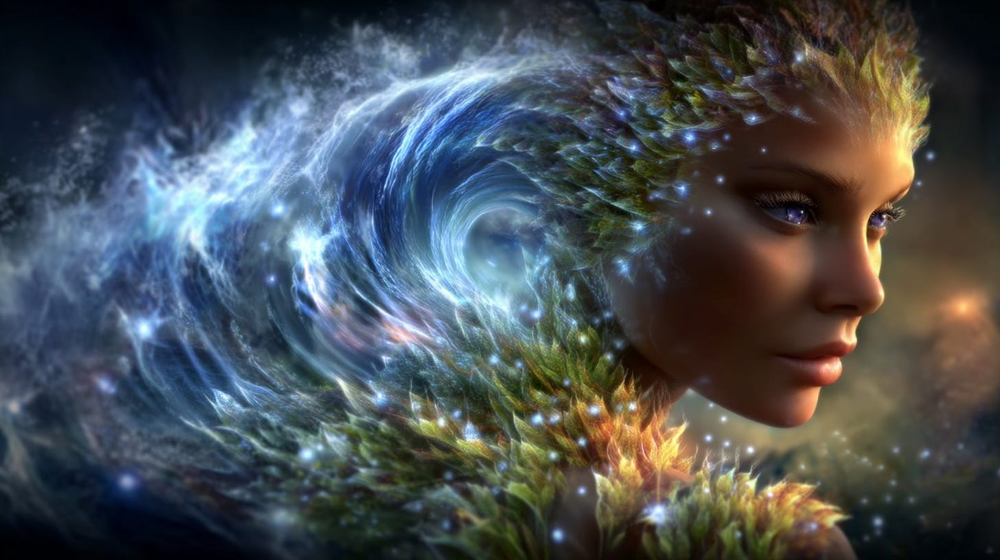
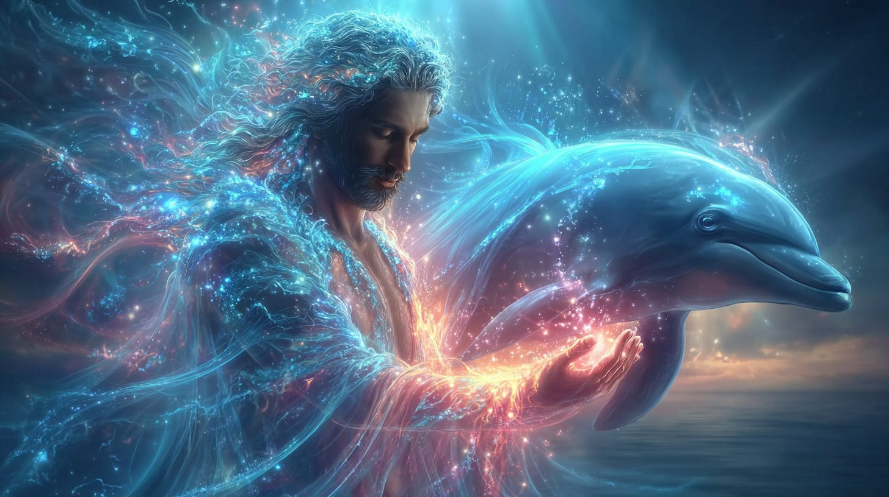
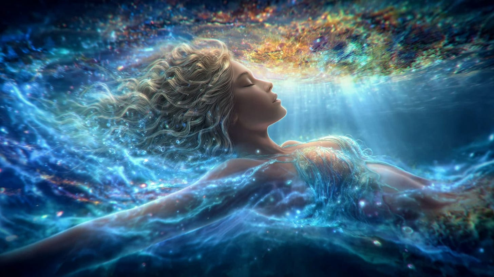

# Salt, the Divine Solvent

## The First Element to fire the chemicals of Life

**2024-12-06T19:22:52.956Z**

**Likes:** 0

[https://substackcdn.com/image/fetch/$s_!FVVV!,f_auto,q_auto:good,fl_progressive:steep/https%3A%2F%2Fsubstack-post-media.s3.amazonaws.com%2Fpublic%2Fimages%2Ff5a33102-2313-4a9d-983d-75e6142cd6eb_1456x816.png](https://substackcdn.com/image/fetch/$s_!FVVV!,f_auto,q_auto:good,fl_progressive:steep/https%3A%2F%2Fsubstack-post-media.s3.amazonaws.com%2Fpublic%2Fimages%2Ff5a33102-2313-4a9d-983d-75e6142cd6eb_1456x816.png)

In 1974 it was requested to me by the Star Kindred that my mother and I re\-locate from San Antonio,
Texas to Salt Lake City, Utah. we had never been there, nor did we know what it even looked like,
except maybe for a few magazine pictures (no internet). I won’t detail the reasons for our
re\-locatiion here, as it is not the subject of this article, but I mention it as this was when the
“Kindred” related to me about the nature of salt and its prominent transformative powers. This
original information is not in my [ThothStream knowledge
base](https://nesialibraryproject.wordpress.com/thothstream-knowledge-base/). It is probably in one
of my old files in a drawer. So I will attempt to share it with you by memory. They told me that
“in the future” (later I would know this to be the World System II of the New Earth Star) *human
bodies would have an organ that maintained the salt of the body in a special way.* That is really
all I can say about this, as it was so long ago.

[https://substackcdn.com/image/fetch/$s_!4iiK!,f_auto,q_auto:good,fl_progressive:steep/https%3A%2F%2Fsubstack-post-media.s3.amazonaws.com%2Fpublic%2Fimages%2Fbdd66524-c21d-4177-a992-d24e27148f2a_1456x816.png](https://substackcdn.com/image/fetch/$s_!4iiK!,f_auto,q_auto:good,fl_progressive:steep/https%3A%2F%2Fsubstack-post-media.s3.amazonaws.com%2Fpublic%2Fimages%2Fbdd66524-c21d-4177-a992-d24e27148f2a_1456x816.png)

**I now share here what I** ***did*** **find in ThothStream concerning salt:**

• First Element of Life and Sacred Substance: In ancient Mu, salt was considered the first element
of life. Muruvians (Mu / Lemuria) regarded salt and water as the most sacred physical substances.

• Recycling Energies: Salt's properties are linked to recycling basic energies and redirecting
them into new energetic cycles. This concept extends to the planetary level, where salt (sodium) is
seen as important in recycling planetary energies.

• Sea of Birth/Re\-birth: When combined with water, salt forms the "sea of birth" or "re\-birth,"
symbolizing the acceptance of earthly sin as a "skin to be cast off," revealing the true beauty of
the soul.

• Alchemical Transmutation: In alchemy, salt is one of the three primary substances (along with
sulfur and mercury) that can be quickened by the "mysterious Fourth Substance" (Azoth) to produce a
rarefied, transmuted form, central to the "Molten Sea" initiation for controlling emotions and
desires.

• Sacraments and Wisdom: The union of flesh and soul is described as a "sacrament of the earth"
found in the uniting of salt and water. The recycling of energies within the sea (salt water) is a
means of reclaiming the wisdom of the soul and cleansing one's mind to reveal a closer image of the
true soul.

• Alchemical Process: Ancient alchemical texts (Mu \& Atlantis) detail how to prepare the "purest
and cleanest salt, sea salt," by drying and grinding it to be dissolved by "Dew\-water". This
"Dew\-water," formed from crystallized solar and lunar rays, creates "virgin earth" and, when
ingested, is said to strengthen understanding, memory, and open profound spiritual knowledge (the
actual details of this process was not given)

[https://substackcdn.com/image/fetch/$s_!ys5t!,f_auto,q_auto:good,fl_progressive:steep/https%3A%2F%2Fsubstack-post-media.s3.amazonaws.com%2Fpublic%2Fimages%2F29cf5597-cc92-4cf2-823a-26422078bc31_1456x816.png](https://substackcdn.com/image/fetch/$s_!ys5t!,f_auto,q_auto:good,fl_progressive:steep/https%3A%2F%2Fsubstack-post-media.s3.amazonaws.com%2Fpublic%2Fimages%2F29cf5597-cc92-4cf2-823a-26422078bc31_1456x816.png)

**Implications for the Future Human Being and New Earth:**

• Planetary Transformation: The New Earth Star hologram is "catalyzed into starlight" from the
Earth's seas, and human "salt\-water bodies" are said to register this transformative process.

* Call to the Sea: Humanity is urged to "return to the sea" to bathe in its healing essence and carry that essence into the mountains, signifying a deep re\-alignment with Earth's natural elements as part of donning "new robes of Light" for the New Earth.

**Sha’Maia 2025:** Thoth wished me to add here about our relationship with cetaceans —especially dolphins, to give a deeper understanding of the “salt” connection. While all animals have salt in their bodies, the human being is especially aligned with the supra\-electrical properties of this substance, as are the cetaceans.

*Humans and cetacean\-dolphins are presented as a paired, co\-evolutionary stewardship on Earth: two self\-aware lineages carrying complementary aspects of a single planetary template—humans tending solar/merkabic (light\-mind) codes primarily through the air/earth element; cetaceans tending sonic/akashic (memory\-water) codes through the water element. Together they braid the planet’s “song” and stabilize evolutionary thresholds.*

There are also the Mer People of the Hollow Earth. This is another salt\-ocean part of the human
element.

While biologists would say that our most ancient ancestors crawled out of the sea, the higher
cosmology portrays it much differently. Humanity was integrated into the biology of “earth” from
another higher state of evolution. However, we are still intrinsically water\-born beings within
that higher evolution. Thus salt remains an especially intimate substance to our transformation and
“Return.”

[https://substackcdn.com/image/fetch/$s_!jnHq!,f_auto,q_auto:good,fl_progressive:steep/https%3A%2F%2Fsubstack-post-media.s3.amazonaws.com%2Fpublic%2Fimages%2Fe784c2a0-9345-4e90-96af-560aff363d3e_1456x816.png](https://substackcdn.com/image/fetch/$s_!jnHq!,f_auto,q_auto:good,fl_progressive:steep/https%3A%2F%2Fsubstack-post-media.s3.amazonaws.com%2Fpublic%2Fimages%2Fe784c2a0-9345-4e90-96af-560aff363d3e_1456x816.png)

**ThothStream:** In the New Earth Star, water will evolve to contain "heavy microns," becoming closer to liquidified minerals. This future "water" will be an all\-purpose revitalizing substance, providing all necessary nutrients simply by bathing in it, and will not adhere to the body, appearing as exquisite liquid crystalline\-fire pools. This suggests a fundamental shift in the very nature of the water element, implying a transformed relationship with substances like salt.

\~\~\~\~\~\~\~\~

I brought the topic of salt forward from my knowledge base to share with you now, as I saw the
following video the other day. I was not at all knowledgable about what Edgar Cayce had to say on
the topic of salt until I listed to this. A very enlightening discourse. Pay no attention to the
“Terrifying Truth” in the title. It is click bait.

[https://www.youtube-nocookie.com/embed/k_tXN3KJwsc?rel=0&amp;autoplay=0&amp;showinfo=0&amp;enablejsapi=0](https://www.youtube-nocookie.com/embed/k_tXN3KJwsc?rel=0&amp;autoplay=0&amp;showinfo=0&amp;enablejsapi=0)

\~\~\~\~\~\~\~\~

**RELATED VIDEOS:[Mystic World of the Dolphins](https://youtu.be/0AK-G2wVFvU?si=bViZDuz5rOFU_ocB) / [The Mer People](https://youtu.be/uEL6iCbX8mE?si=gEdIJYCybIuNmpY-)**

Subscribe

[Share](https://maianartoomid.substack.com/p/salt-the-divine-solvent?utm_source=substack&utm_medium=email&utm_content=share&action=share)

**\~\~\~\~\~**

**[Personal Akasha Life Pulse from Thoth \& Sha’Maia:](https://newearthstar.org/about-maia/akashic-consultations/)** Helps you to synchronize with this fundamental cosmic rhythm, and also reflects how your "Life Pulse" session connects you to your New Earth Star frequency. Both written (5\-6 pages) and a live Zoom attunement. **Now at reduced price.**

**\~\~\~\~\~**

**All my Substack images and articles are FREE. Please help me promote them. Support my work further, by considering some of my paid offerings (consultations \& activation store) and donations.**

**[my website](http://newearthstar.org/) / [YouTube channel](https://www.youtube.com/@bluestarrising-thetemplara3835) / [Akasha Life Pulse Sessions](https://newearthstar.org/about-maia/akashic-consultations/)/ [Maia’s Redbubble](https://www.redbubble.com/people/maianartoomid/explore?asc=u&page=1&sortOrder=recent) / [published works](https://newearthstar.org/published-works/) / [activation store](https://newearthstar.org/maias-activation-store/)**

**[MONTHLY DONATIONS](https://www.paypal.com/donate/?cmd=_s-xclick&hosted_button_id=SKZ4FZCYBM4H4): Donate $20 or more per month and you will have access to the [Vault of Thoth](https://newearthstar.org/vault-of-thoth/). Thank you!**
