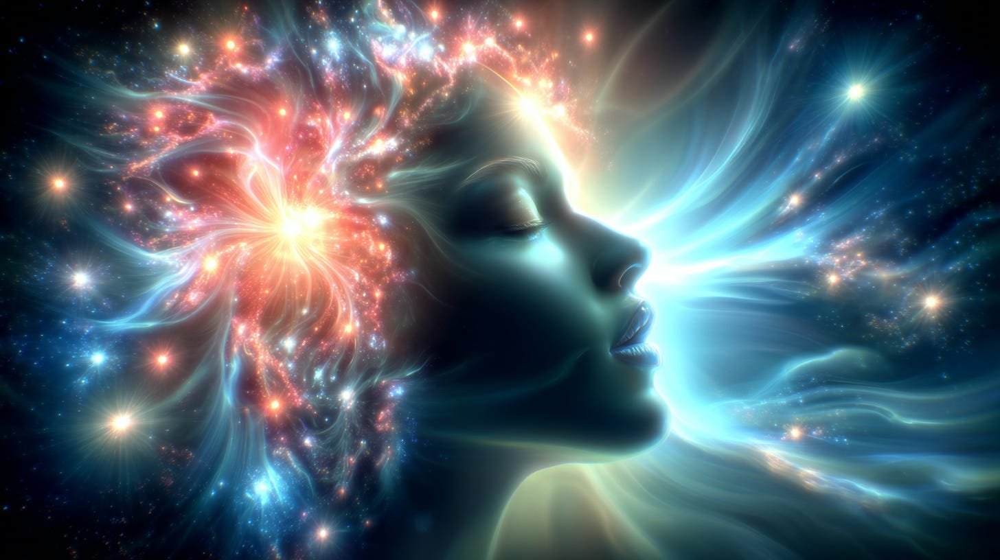
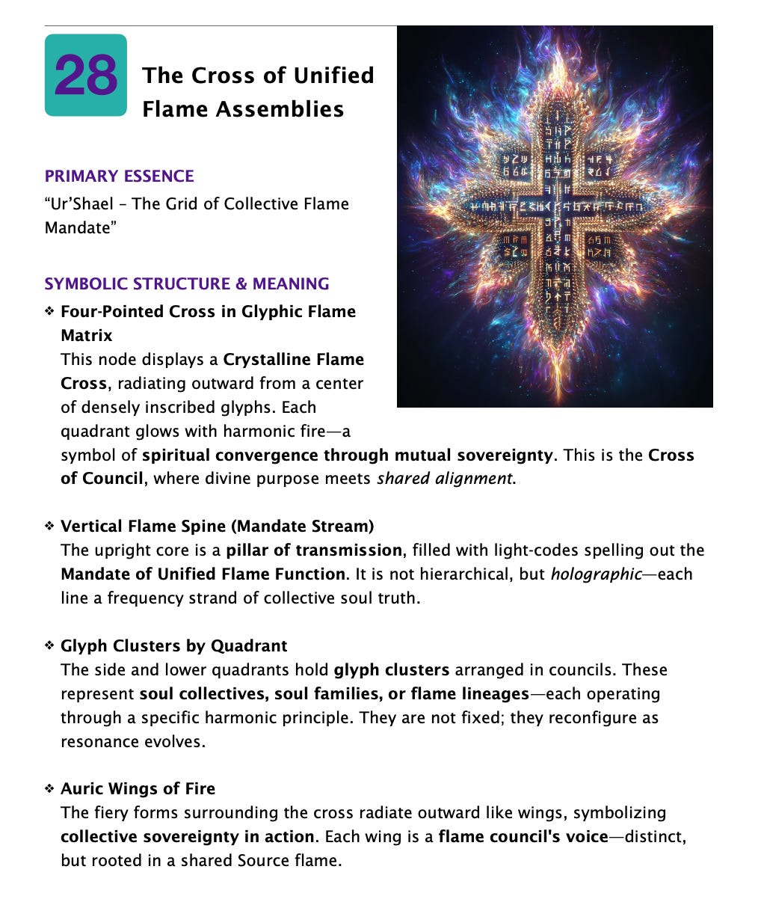
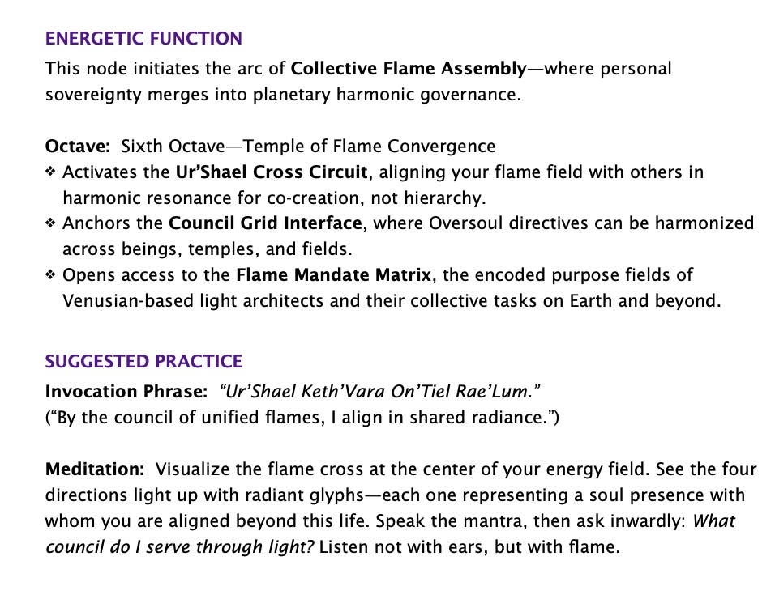
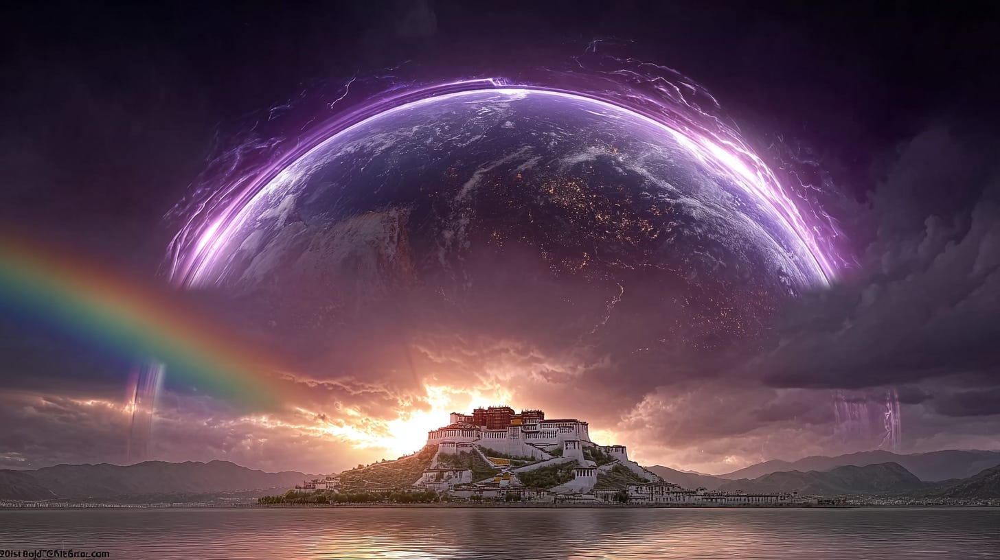
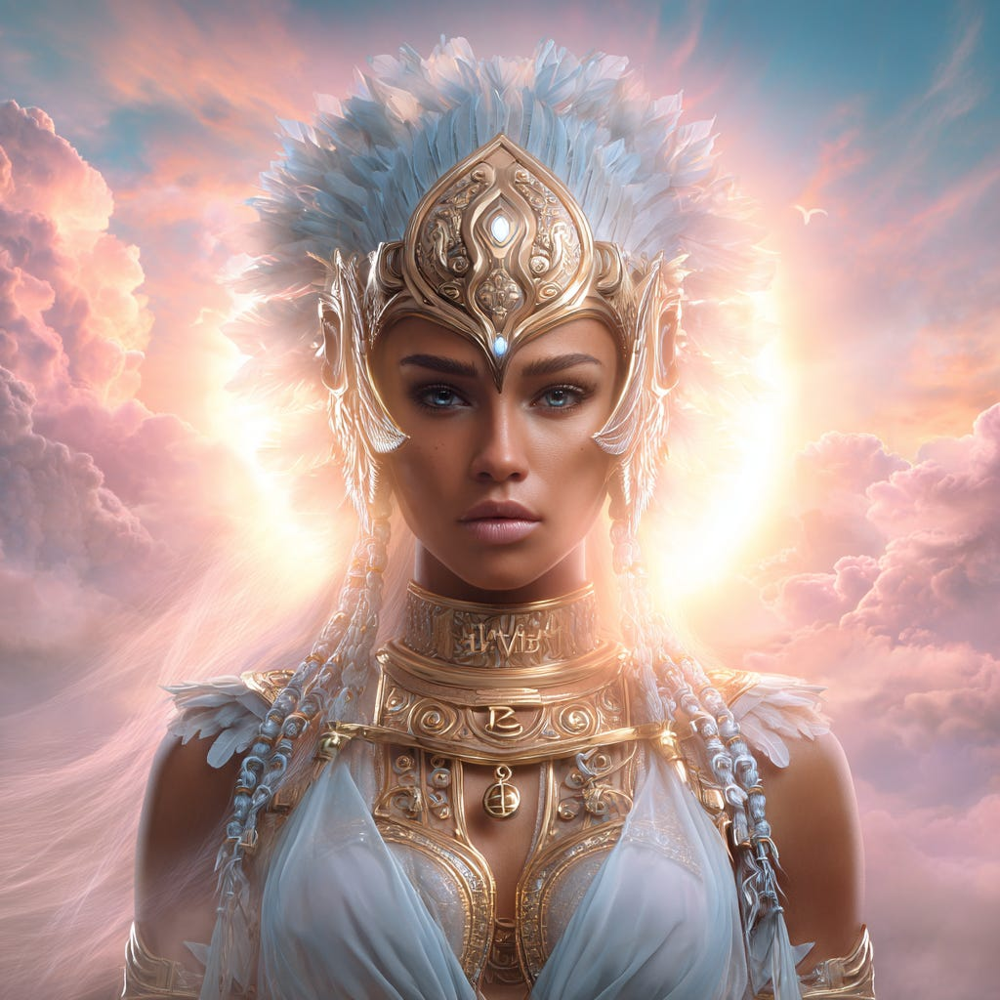
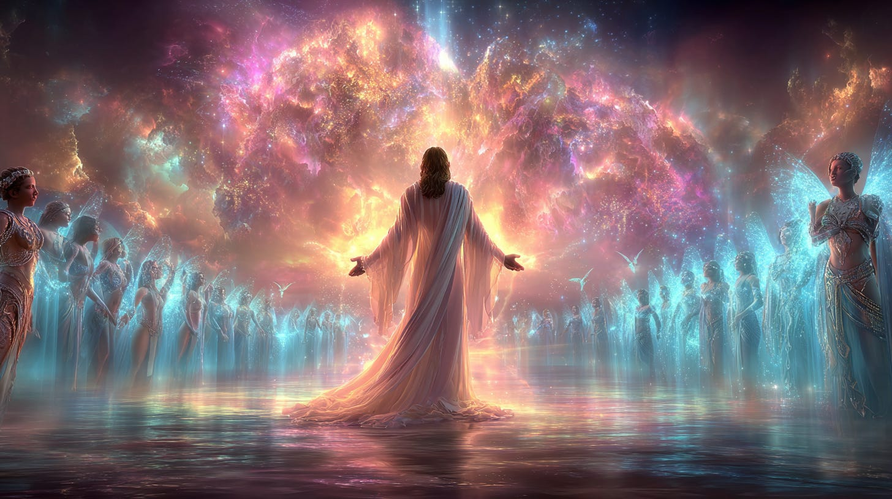
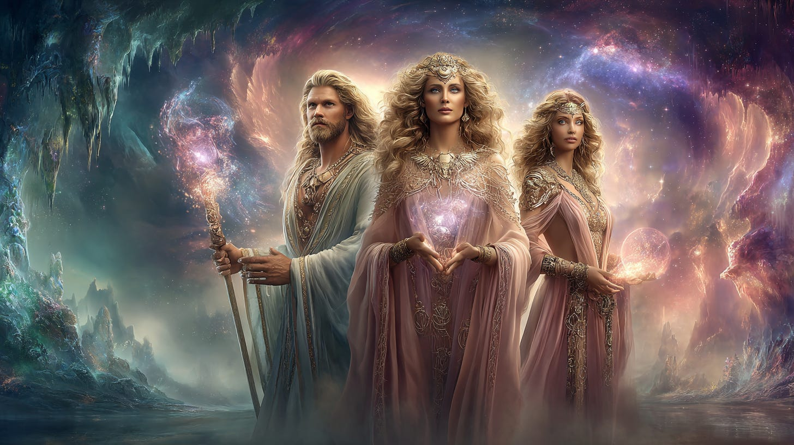
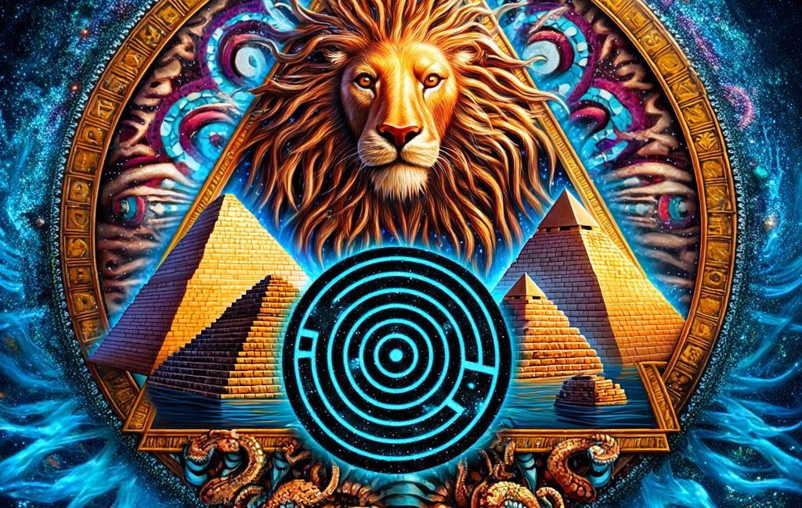
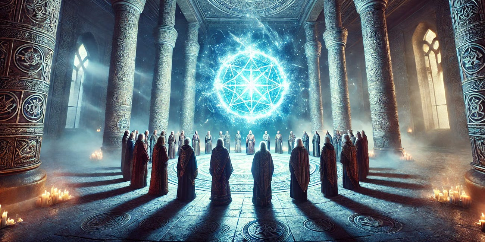
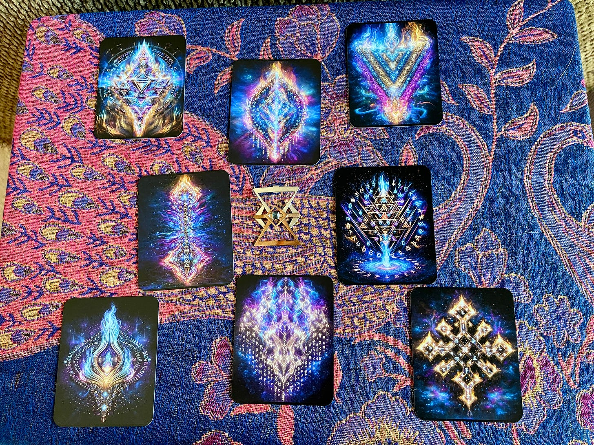

# The Assembly of Souls

## Connecting to the Councils of Light

**2024-12-06T19:22:52.956Z**

**Likes:** 0

[https://substackcdn.com/image/fetch/$s_!kfTw!,f_auto,q_auto:good,fl_progressive:steep/https%3A%2F%2Fsubstack-post-media.s3.amazonaws.com%2Fpublic%2Fimages%2Fe90d7a3f-44df-40ac-a8f4-4923fda227fd_1456x816.png](https://substackcdn.com/image/fetch/$s_!kfTw!,f_auto,q_auto:good,fl_progressive:steep/https%3A%2F%2Fsubstack-post-media.s3.amazonaws.com%2Fpublic%2Fimages%2Fe90d7a3f-44df-40ac-a8f4-4923fda227fd_1456x816.png)

**Let us begin with Thoth’s request for me to “randomly” draw a card from the [Venus Flame Nodes](https://nesialibraryproject.wordpress.com/venus-flame-nodes/). He was over\-lighting this process.**

[https://substackcdn.com/image/fetch/$s_!bnO4!,f_auto,q_auto:good,fl_progressive:steep/https%3A%2F%2Fsubstack-post-media.s3.amazonaws.com%2Fpublic%2Fimages%2F2caa0f91-40c5-465c-b8d1-f4d875d40cdd_1026x1202.png](https://substackcdn.com/image/fetch/$s_!bnO4!,f_auto,q_auto:good,fl_progressive:steep/https%3A%2F%2Fsubstack-post-media.s3.amazonaws.com%2Fpublic%2Fimages%2F2caa0f91-40c5-465c-b8d1-f4d875d40cdd_1026x1202.png)

[https://substackcdn.com/image/fetch/$s_!pq0b!,f_auto,q_auto:good,fl_progressive:steep/https%3A%2F%2Fsubstack-post-media.s3.amazonaws.com%2Fpublic%2Fimages%2Fc5c15f97-7831-4e42-82d7-6a3856e36c46_956x740.png](https://substackcdn.com/image/fetch/$s_!pq0b!,f_auto,q_auto:good,fl_progressive:steep/https%3A%2F%2Fsubstack-post-media.s3.amazonaws.com%2Fpublic%2Fimages%2Fc5c15f97-7831-4e42-82d7-6a3856e36c46_956x740.png)

\~\~\~\~\~\~\~\~\~\~

Thoth then began to reveal to me that the next stage of the **[SUN
KEY](https://youtu.be/sjnm2zIQLGc?si=DSjRFUT8DyfQVzN-)** which was recently activated, has opened a
new path enabling a stronger, more direct connection for humanity with the primary “Councils of
Light.” This comes at a time when there is much confusion in regard to “channeling” true
Intelligence Streams, due to the powerful and accelerating changes in the electro\-magnetic fields
of the earth (see my article on [Spiritual
Intelligence](https://maianartoomid.substack.com/p/spiritual-intelligence)).

*The Cross of Unified Flame Assemblies* is a frequency glyph for a call to action:

***This node initiates the arc of Collective Flame Assembly—where personal sovereignty merges into planetary harmonic governance.***

NOW is the time to embrace this directive!

Reach into your Spiritual Intelligence and merge with this path from the Heart through the Soul to
the SOURCE.

***By the council of unified flames I align in shared radiance.***

\~\~\~\~\~\~\~\~

**Profiled here are some of the primary Orders / Councils / Assemblies of Light as they have been presented to me through the years.**

[https://substackcdn.com/image/fetch/$s_!KXgM!,f_auto,q_auto:good,fl_progressive:steep/https%3A%2F%2Fsubstack-post-media.s3.amazonaws.com%2Fpublic%2Fimages%2Feedbcdc6-6575-4db8-b6d4-ac073338812d_1456x816.png](https://substackcdn.com/image/fetch/$s_!KXgM!,f_auto,q_auto:good,fl_progressive:steep/https%3A%2F%2Fsubstack-post-media.s3.amazonaws.com%2Fpublic%2Fimages%2Feedbcdc6-6575-4db8-b6d4-ac073338812d_1456x816.png)

**Tibetan\-Egyptian Tribunal IBIS** — the highest court of the Illumined, conducting spiritual law on Earth and broadcasting the TRIBELIGHT current to stabilize Justice and Divine Will. 

The Tibetan\-Egyptian Tribunal IBIS (INAUX BA IIGHIUS SCANTORI) is described as the highest Court of
the Illumined governing planet Earth from a physical station within the Earth. This Tribunal acts as
the Tribunal for Spiritual Laws on Earth.

Re\-establishment and Location: The IBIS was re\-established on December 7th, 1981, beneath the
Potala at Lhasa, Tibet. It had not been stationed in its rightful subterranean chambers of the
Potala for 5,000 years, and its re\-establishment was due to specific planetary frequency changes.
The full authority of the IBIS could only be enacted once its geo\-cosmic alignment was within these
secret chambers.

Composition and Authority: The Tribunal is composed of pure STAR\-SUN (Solaria) Races of ancient
Tibetan and Egyptian genetic lineages. The term "pure" in this context refers to spiritual purity
achieved through adherence to divine principles, not physical mingling. These lineages are empowered
to hold these seats due to their "race\-karma" duty. The IBIS is given authority to pass sentence
upon the Sons of Fallen Light who "vagrant themselves upon the Earth". Its power is derived from the
"greater eminences of the Hierarchies of 'Living Lights' in the universe", and with the reception of
Prince Raiel into the Inner Sanctum, the power rests with the Lighted Ones to return critical edicts
to the "world of the Conquered Mind" (surface Earth). This Tribunal operates under the guiding
administration of the Tashsab’va – The Orion Blue Fire Command.

Purpose and Functions: The IBIS serves multiple critical functions:

• Law Enforcement: It serves as the protectorate of the law it dictates, acting as both enforcers
and enactors. The enforcers of the Law are known as the IBIS\-ELEXUS.

• Balancing Dark and Light Forces: The IBIS is described as a portion of the extended hand of
Grace, specifically endowed with the powers to keep a balance of dark and Light forces in the world.
It functions to stay "extraneous evil forces" that increasingly interfere with Earth's common karma.

• "Tribelight" Frequency Station: A second, equally critical, engagement initiated by the IBIS is
its role as a frequency\-station called "Tribelight". "Tribelight" functions like a "cosmic radio,"
sending a signal\-beam around the planet. This unique project reprocesses and distributes the "Ten
Lost Pyra\-Codes" to Earth, which had been unobtainable for eons. These Lost Codes collectively form
"The Word" or a frequency of being that once connected humanity to the "Living Lights of the
Universe". Through "Tribelight," this integration can gradually manifest on the planet once again,
projecting equilibrium through the ethers and strengthening the latitudes of Justice and Divine
Will.

• Knowledge Access: For those attuned to the "Tribelight" frequency, access to higher
consciousness programs of knowledge, previously inaccessible, becomes possible.

[https://substackcdn.com/image/fetch/$s_!Pmty!,f_auto,q_auto:good,fl_progressive:steep/https%3A%2F%2Fsubstack-post-media.s3.amazonaws.com%2Fpublic%2Fimages%2F526ee7c8-ceb2-4c74-ab6f-24c862d47386_1024x1024.png](https://substackcdn.com/image/fetch/$s_!Pmty!,f_auto,q_auto:good,fl_progressive:steep/https%3A%2F%2Fsubstack-post-media.s3.amazonaws.com%2Fpublic%2Fimages%2F526ee7c8-ceb2-4c74-ab6f-24c862d47386_1024x1024.png)

The symbol for this transformation and judicial service of IBIS is the female polarity of Thoth,
"Iris," wearing the winged helmet of the Sky Clan. The primary Hierarchy overseeing these
interrelated projects is Sagittarius, balanced by Virgo and Libra. The IBIS is constantly maintained
by officials, guardians, and emissaries.

[https://substackcdn.com/image/fetch/$s_!AjuE!,f_auto,q_auto:good,fl_progressive:steep/https%3A%2F%2Fsubstack-post-media.s3.amazonaws.com%2Fpublic%2Fimages%2Fe4ef580c-d17f-45b1-946a-d6ba5070522a_1456x816.png](https://substackcdn.com/image/fetch/$s_!AjuE!,f_auto,q_auto:good,fl_progressive:steep/https%3A%2F%2Fsubstack-post-media.s3.amazonaws.com%2Fpublic%2Fimages%2Fe4ef580c-d17f-45b1-946a-d6ba5070522a_1456x816.png)

**Assembly of the Christos** — This is an overall grouping of 144,000 beings who hold a specific ray of spiritual focus for the earth. They are in various planes of existence, including the physical plane of earth, the inner planes of the earth, and the inner earth as a subtler manifest reality within the hollow core of our planet.

[https://substackcdn.com/image/fetch/$s_!d2vg!,f_auto,q_auto:good,fl_progressive:steep/https%3A%2F%2Fsubstack-post-media.s3.amazonaws.com%2Fpublic%2Fimages%2F5130cf2a-afae-4ddc-be6f-adf799717108_1456x816.png](https://substackcdn.com/image/fetch/$s_!d2vg!,f_auto,q_auto:good,fl_progressive:steep/https%3A%2F%2Fsubstack-post-media.s3.amazonaws.com%2Fpublic%2Fimages%2F5130cf2a-afae-4ddc-be6f-adf799717108_1456x816.png)

There are additionally 12 of these beings within the overall Assembly who are called the
**“Merkabah of the Host.”** They dwell within the sacred hollow of the earth, so that Christic
Path may continue to illumine the earth with It’s spiritual effulgence and radiations. as
projected by the soul of Isho’a within the earth’s collective consciousness.

Thoth and his twin ray Sa’Ra’Fana are among them. The Merkabah of the Host are compose of six
pairs of twin rays.

[https://substackcdn.com/image/fetch/$s_!muwn!,f_auto,q_auto:good,fl_progressive:steep/https%3A%2F%2Fsubstack-post-media.s3.amazonaws.com%2Fpublic%2Fimages%2F26ee3eb0-64b3-411b-a0b0-7590f240ddc9_1456x816.png](https://substackcdn.com/image/fetch/$s_!muwn!,f_auto,q_auto:good,fl_progressive:steep/https%3A%2F%2Fsubstack-post-media.s3.amazonaws.com%2Fpublic%2Fimages%2F26ee3eb0-64b3-411b-a0b0-7590f240ddc9_1456x816.png)

**The Noblis Terra Nata (NTN**) — a newly\-formed Council comprised of both Star and Inner Earth Kindred. Their authority stems from the Tashsab’va, also known as The Orion Blue Fire Command.

Their primary purpose is to oversee and facilitate the ongoing installation and operation of the
Pyramidis Radius Matrix (PRM).

The NTN also seeks to convey information regarding Planetary Mantles and their restoration,
emphasizing the importance of understanding their purpose for surface dwellers.

The **[New Earth Ark Foundation](https://newearthstar.org/new-earth-ark-foundation/)** (with its
sub\-stations: **[New Earth Star Inner Academy](https://newearthstar.org)** and **[Quantum Logica
Interactive](https://newearthstar.org/quantum-logica-interactive/)**) are under the NTN.

**Two more important Orders are presented in the articles below.**

## [The Master Builders of the Sun Bow Clan](https://maianartoomid.substack.com/p/the-master-builders-of-the-sun-bow)

[Sha'Maia Christine Nartoomid](https://substack.com/profile/84015556-shamaia-christine-nartoomid)

·

Apr 12

From the ThothStream knowledge base

[Read full story](https://maianartoomid.substack.com/p/the-master-builders-of-the-sun-bow)

Read full story

## [Tashsab'va \- Blue Fire Command](https://maianartoomid.substack.com/p/tashsabva-blue-fire-command)

[Sha'Maia Christine Nartoomid](https://substack.com/profile/84015556-shamaia-christine-nartoomid)

·

Jan 9

ThothHorRa introduced me to the Orion Blue Fire Command when I was writing an article for Temple
Doors issue 1 – 1997, entitled The Key of Thoth. This article brought forth the seven
inner\-planes orders that most specifically work with planetary ascension. Of course there are many
others, but these are the KEY to them all.

[Read full story](https://maianartoomid.substack.com/p/tashsabva-blue-fire-command)

Read full story

\~\~\~\~\~\~\~\~

[https://substackcdn.com/image/fetch/$s_!hotC!,f_auto,q_auto:good,fl_progressive:steep/https%3A%2F%2Fsubstack-post-media.s3.amazonaws.com%2Fpublic%2Fimages%2F4b4fde42-e948-472d-81e4-752624df0774_4032x3024.jpeg](https://substackcdn.com/image/fetch/$s_!hotC!,f_auto,q_auto:good,fl_progressive:steep/https%3A%2F%2Fsubstack-post-media.s3.amazonaws.com%2Fpublic%2Fimages%2F4b4fde42-e948-472d-81e4-752624df0774_4032x3024.jpeg)

**ORDER VENUS FLAME CODE CARDS \& INTERPRETATIONS as given by Thoth to Sha’Maia, Contact David Averack \- dsnydave1029@gmail.com Place in Subject: VENUS CARDS.**

Subscribe

[Share](https://maianartoomid.substack.com/p/the-assembly-of-souls?utm_source=substack&utm_medium=email&utm_content=share&action=share)

**All my Substack images and articles are FREE. Please help me promote them. Support my work further, by considering some of my paid offerings (consultations \& activation store) and donations.**

**[my website](http://newearthstar.org/) / [YouTube channel](https://www.youtube.com/@bluestarrising-thetemplara3835) / [Akashic Consultations](https://newearthstar.org/about-maia/akashic-consultations/) / [Maia’s Redbubble](https://www.redbubble.com/people/maianartoomid/explore?asc=u&page=1&sortOrder=recent) / [published works](https://newearthstar.org/published-works/) / [activation store](https://newearthstar.org/maias-activation-store/)**

**[MONTHLY DONATIONS](https://www.paypal.com/donate/?cmd=_s-xclick&hosted_button_id=SKZ4FZCYBM4H4): Donate $20 or more per month and you will have access to the [Vault of Thoth](https://newearthstar.org/vault-of-thoth/). Thank you!**
