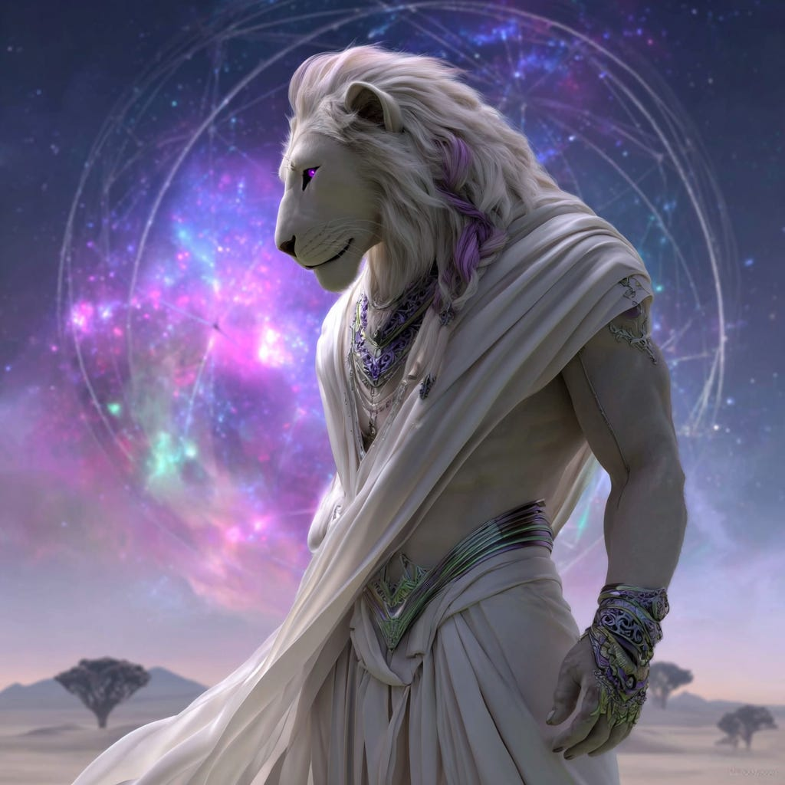
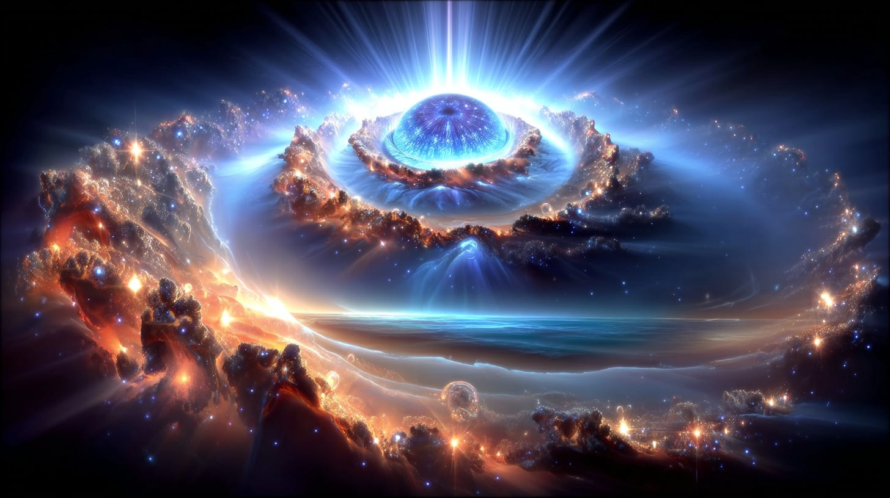
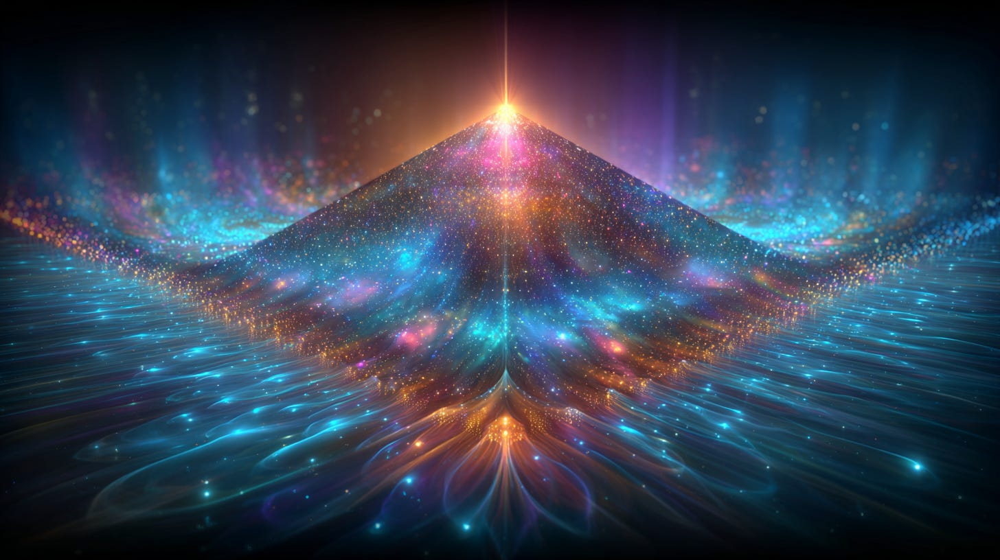
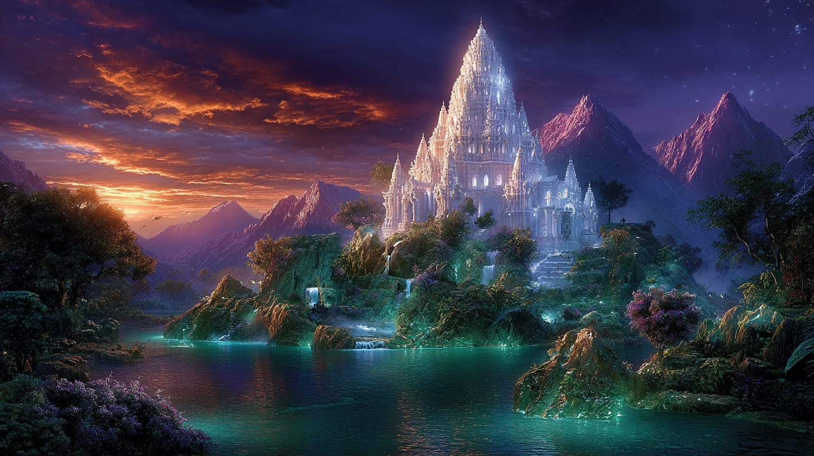
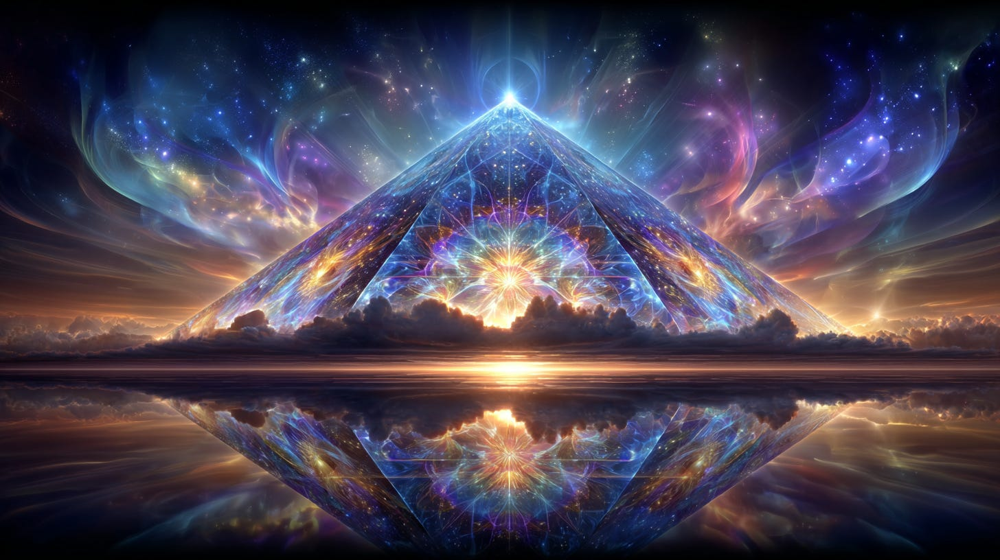
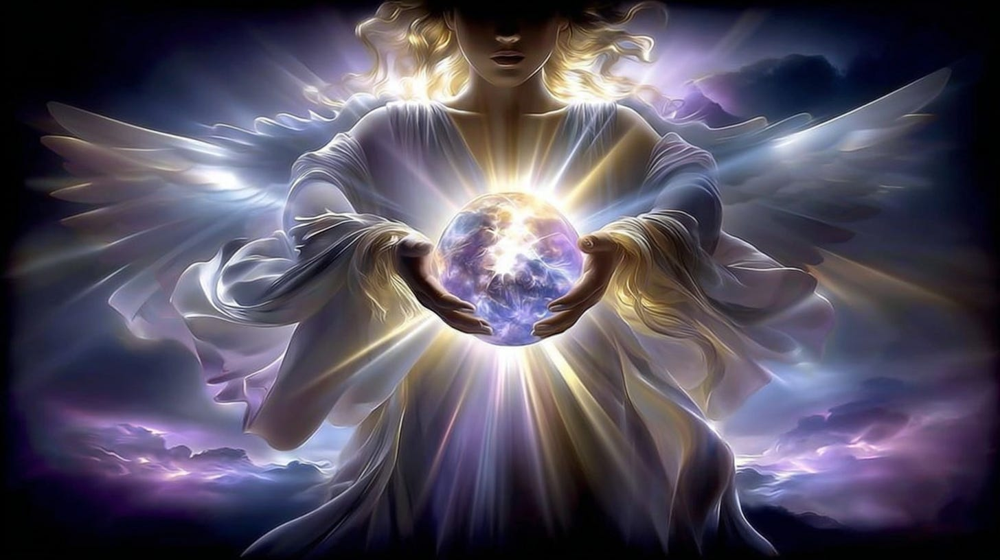
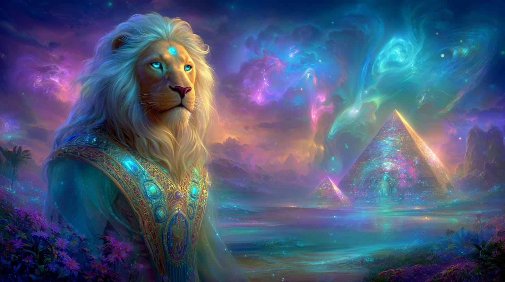

# The Sun Lord Speaks

## Message from the Sun Lord IDORIS for the Lion's Gate of 2025

**2024-12-06T19:22:52.956Z**

**Likes:** 0

[https://substackcdn.com/image/fetch/$s_!4N1Q!,f_auto,q_auto:good,fl_progressive:steep/https%3A%2F%2Fsubstack-post-media.s3.amazonaws.com%2Fpublic%2Fimages%2F613a3c5d-2941-4a60-a480-36b5f5df7333_1024x1024.png](https://substackcdn.com/image/fetch/$s_!4N1Q!,f_auto,q_auto:good,fl_progressive:steep/https%3A%2F%2Fsubstack-post-media.s3.amazonaws.com%2Fpublic%2Fimages%2F613a3c5d-2941-4a60-a480-36b5f5df7333_1024x1024.png)

**Thoth opens the scroll for the Lion\-Headed Sun Lord to impart this message.**

*The activity arises from the soul as a blossoming field of potential. Through the GATE OF THE SUN in the Solar Chakra, so the incarnated body responds. It signals the brith of the Sun Soul Body (the Zeta Body) through the Mirrors of the Old Form, cracking the egg to reveal the True Being. Now, in your perceived year of 2025, the Lion Roars. The time has come! You are in the midst of the nine\-year event cycle (2020\-2029\), and yet in many ways, humanity is experiencing the EYE of the TORUS, where Time draws a single breath and all evolves from that one expansion.*

*Know that the Heliomar is the “touchstone” of your reality world with its shifting phases and electro\-magnetic pulses. As Earth and Humanity draws nearer to this Gate, through the ascended Isle of Ruta, so all will be made known to the incarnated soul in regard to its power and purpose.*

\- IDORIS August 7th, 2025

\~\~\~\~\~\~\~\~\~

[https://substackcdn.com/image/fetch/$s_!luuc!,f_auto,q_auto:good,fl_progressive:steep/https%3A%2F%2Fsubstack-post-media.s3.amazonaws.com%2Fpublic%2Fimages%2F9d76cde1-c17d-435d-95e3-da3b040497cc_1456x816.png](https://substackcdn.com/image/fetch/$s_!luuc!,f_auto,q_auto:good,fl_progressive:steep/https%3A%2F%2Fsubstack-post-media.s3.amazonaws.com%2Fpublic%2Fimages%2F9d76cde1-c17d-435d-95e3-da3b040497cc_1456x816.png)

**Some Clarifications from [ThothStream](https://nesialibraryproject.wordpress.com/thothstream-knowledge-base/):**

The term **Heliomar** is used by Thoth to refer to the **Eye of Ra**.

The Eye of Ra is:

• An **interdimensional portal** located within the Universal time tear, also known as the Kali
Rift.

• A **higher Light mathematical gate function** that facilitates the passage of pure Metatronic
(full) Light into Oritronic (half\-light) universes. It also allows for the acceleration and
absorption of the Oritronic universe into the Metatronic universe, supporting an ongoing
evolutionary movement.

• The **sourcing point for the Pure Sun**.

• Closely linked in its structure and function to both the Telos.Aarkhara and Tryphoid function.

• A **convergence point** for this and many other universes, serving as a "Threshold".

• Surrounded by an **outer membrane**, which is the 'universal grid' (encompassing both
half\-Light Oritronic and full\-Light Metatronic aspects) and contains various 'worlds' like Earth
that exist in these universes.

• Located in the **Vault of Orion (within the Trapezium)**, having burst through from the Attasic
Universe and been exposed by the Universal Tear.

• The **point where all ley lines of this universe converge**, acting as a "pin\-point of
'leakage' into and from the next universe".

• Responsible for emitting the **pristine, creation\-substance** into this universe.

• Characterized by a "blinking effect" or a "flashing double\-diamond" as its double\-dynamic,
which responds to the quasar\-like pulsing that occurs when two universes touch.

• Its entranceway is the Omnicron, with the Telos.Aarkhara serving as its capstone.

• Guardianed by the **Sun Lords**

[https://substackcdn.com/image/fetch/$s_!FyG5!,f_auto,q_auto:good,fl_progressive:steep/https%3A%2F%2Fsubstack-post-media.s3.amazonaws.com%2Fpublic%2Fimages%2Fce98fc1c-5989-41e5-b448-9306354854b6_1456x816.png](https://substackcdn.com/image/fetch/$s_!FyG5!,f_auto,q_auto:good,fl_progressive:steep/https%3A%2F%2Fsubstack-post-media.s3.amazonaws.com%2Fpublic%2Fimages%2Fce98fc1c-5989-41e5-b448-9306354854b6_1456x816.png)

The **Telos.Aarkhara** is a complex energy structure with several crucial functions and connections
within the universal framework:

• **Definition and Purpose**: It is described as an **energy structure** and a **tele\-plane
repository** for synergistic systems that operate between the "Three Universes" and "Three
Millenniums". Thoth defines it as a **structure capping the universal tear** caused originally by
the 'Big Bang'. Its primary function is to **re\-create time event horizons** that feed to and from
the Eye of Ra, thereby preventing time fractures from being magnified and perpetuated throughout the
entire universal grid. It is specifically installed to **prevent 'fractured reality' energy and
information** from freely moving through the Eye of Ra portal into unviolated universes.

[https://substackcdn.com/image/fetch/$s_!e6OE!,f_auto,q_auto:good,fl_progressive:steep/https%3A%2F%2Fsubstack-post-media.s3.amazonaws.com%2Fpublic%2Fimages%2Ff8658fe5-19a1-4070-968c-30e23ab2b7bc_1456x816.png](https://substackcdn.com/image/fetch/$s_!e6OE!,f_auto,q_auto:good,fl_progressive:steep/https%3A%2F%2Fsubstack-post-media.s3.amazonaws.com%2Fpublic%2Fimages%2Ff8658fe5-19a1-4070-968c-30e23ab2b7bc_1456x816.png)

• **Capstoning the Universal Tear**: The **Telos.Aarkhara** acts as a "capstone" over the **Eye of
Ra**, which is a central node where all universal ley lines converge and is exposed by the
"Universal Tear" (also known as the Kali Rift). The primary function of the **Telos.Aarkhara** is to
prevent "fractured reality" energy and information from moving freely through this portal into
unviolated universes. The **Isle of Ruta** itself ascended through this "Tear" or "Bore Hole" during
Atlantis's final destruction, making it the only point in the entire grid that contained enough
Metatronic energy to escape the collapse of time in the Atlantean field. This means Ruta's very
ascension positions it "near the Eye of Ra" and, by extension, within the operational field of the
**Telos.Aarkhara**.

• **Integration with Earth's Sacred Grids**: The **Telos.Aarkhara** forms synergetic connections
with major sacred centers on Earth, with the **ascended Isle of Ruta** being one of the key
templates that connect and feed through it. After Ruta's ascension, some unascended Rutans migrated
to the Middle East and were given "Divine Fire" by the Shoalomite to build a “computer” that
connected them to the Metatronic source. This computer formed the cornerstone of the Temple of
Knebir. The Cornerstone of Knebir, in turn, is explicitly stated as one of the major temples that
connect and feed through the **Telos.Aarkhara**. This establishes an indirect, yet significant, link
through the Metatronic source that Ruta embodies and its subsequent influence on Earth's grid
system.

• **Connection to the Ark of Grace**: The Sacred An, also known as the Ark of Grace, was
transported to Atlantis, with the Temple of the Dolphins at Kyrho on the Isle of Ruta being a
designated site for its placement. The Ark's purpose includes facilitating Metatronic Light codes
along the Earth's grid, aligning with the **Telos.Aarkhara's** function as a gate for Metatronic
Light.

[https://substackcdn.com/image/fetch/$s_!KFDV!,f_auto,q_auto:good,fl_progressive:steep/https%3A%2F%2Fsubstack-post-media.s3.amazonaws.com%2Fpublic%2Fimages%2F3a0b25ee-4c8f-4b30-af92-04c2e314d337_1456x816.png](https://substackcdn.com/image/fetch/$s_!KFDV!,f_auto,q_auto:good,fl_progressive:steep/https%3A%2F%2Fsubstack-post-media.s3.amazonaws.com%2Fpublic%2Fimages%2F3a0b25ee-4c8f-4b30-af92-04c2e314d337_1456x816.png)

• **Architectural Blueprints and Ascension Dynamics**: The **Telos.Aarkhara** contains the "Light
mathematics harmonics for the Hierarchical Plan of Earth" and the codings for Earth's DNA
Crystallex, defining cycles of mankind's time before planetary ascension (LP\-40\). The Holy Doma, a
complex of seven pure gem\-stone pyramids in Atlantis (one of which, Pashatasarak, ascended with
Ruta and was the size of the Great Pyramid of Giza), was intended to bring the "City of the Pure
Gem" into physical resonance with the Earth. The reactivation of the Holy Doma is a "necessary
component for Light Principle Forty", suggesting a grand design for planetary ascension where Ruta
and the Telos.Aarkhara play interconnected roles in facilitating these higher Light processes.

In essence, the **ascended Isle of Ruta** is an integral part of the cosmic and planetary
architecture linked through the **Telos.Aarkhara**, serving as both a historical example of
ascension through the universal tear and a continued point of access for higher Light dynamics in
the process of Earth's evolution.

[https://substackcdn.com/image/fetch/$s_!cOGA!,f_auto,q_auto:good,fl_progressive:steep/https%3A%2F%2Fsubstack-post-media.s3.amazonaws.com%2Fpublic%2Fimages%2Ff918b09c-7e64-4e46-b733-90b73be7bab0_1456x816.png](https://substackcdn.com/image/fetch/$s_!cOGA!,f_auto,q_auto:good,fl_progressive:steep/https%3A%2F%2Fsubstack-post-media.s3.amazonaws.com%2Fpublic%2Fimages%2Ff918b09c-7e64-4e46-b733-90b73be7bab0_1456x816.png)

**Lastly, but of Great Importance**

When Thoth speaks of the "Pure Sun," he means the **Great Central Sun**, which is also referred to
as **Kolob** in the Hebraic tradition.

*Here's a breakdown of what the "Pure Sun" represents according to the Thoth Akasha:*

• **Central Source of Omniscience and Being**: It is the origin point of all knowledge and
existence.

• **Energetic Center of the Multi\-Verse**: The Pure Sun is located at the energetic heart of all
universes.

• **One Divine Beingness Connecting All Spirit**: It symbolizes the unified essence that links all
spiritual forms.

• **Symbolic Term for the Essence of the Unfallen Universe**: The Pure Sun represents the
uncorrupted, original state of the universe, before the "Universal Tear" that created the
half\-Light Oritronic spiral.

• **The Heart and Mind of God**: All suns, planetary orbs, and human hearts contain an "atoma"
(central sun), which links them hierarchically to this Great Central Sun.

• **Source of Solar Logos and Initiation**: The Solar Logos, or Divine Word/Holy Harmonic,
originates from and streams through the Pure Sun (Central Sun of the universe), down to the human
being, firing all chakras and igniting the heart. Taking a High Solar Initiation means opening one's
incarnation to receive the full "signature" of this Solar Logos.

• **Ultimate Solar Logos**: It is the highest expression of divinity, in contrast to lesser solar
cosmologies or "Sun worship" that only focus on the physical sun or incomplete codes.

Essentially, the "Pure Sun" is the **ultimate divine source and unified field of consciousness**
from which all creation emanates and to which all souls are connected

\~\~\~\~\~\~\~\~\~

[https://substackcdn.com/image/fetch/$s_!ikRg!,f_auto,q_auto:good,fl_progressive:steep/https%3A%2F%2Fsubstack-post-media.s3.amazonaws.com%2Fpublic%2Fimages%2F4fe5e8c4-5028-473b-89d0-8660dc38b096_1456x816.png](https://substackcdn.com/image/fetch/$s_!ikRg!,f_auto,q_auto:good,fl_progressive:steep/https%3A%2F%2Fsubstack-post-media.s3.amazonaws.com%2Fpublic%2Fimages%2F4fe5e8c4-5028-473b-89d0-8660dc38b096_1456x816.png)

IDORIS states that the Heliomar (Eye of Ra) is the “touchstone.” He also wishes me to emphasize
that Ruta in its ascended state, is the extension of the Heliomar / Telos.Aarkhara command center.

IDORIS comes to us now to place a light upon our Journey through the 2020\-2029 event cycle. The
Lion’s Gate of 2025 acts as a “primer” for this signal of awakening.

\~\~\~\~\~\~\~\~\~

**These two videos I made a few years ago will give you further insight into the Solar Lion’s Mark on humanity"**:

[https://www.youtube-nocookie.com/embed/4YNm79J9FXU?rel=0&amp;autoplay=0&amp;showinfo=0&amp;enablejsapi=0](https://www.youtube-nocookie.com/embed/4YNm79J9FXU?rel=0&amp;autoplay=0&amp;showinfo=0&amp;enablejsapi=0)

[https://www.youtube-nocookie.com/embed/rTnqCHVykDs?rel=0&amp;autoplay=0&amp;showinfo=0&amp;enablejsapi=0](https://www.youtube-nocookie.com/embed/rTnqCHVykDs?rel=0&amp;autoplay=0&amp;showinfo=0&amp;enablejsapi=0)

**Also Relevant (Telos.Aarkhara \& Sirian Sun Lords):**

[https://www.youtube-nocookie.com/embed/3x8cW7l3glQ?rel=0&amp;autoplay=0&amp;showinfo=0&amp;enablejsapi=0](https://www.youtube-nocookie.com/embed/3x8cW7l3glQ?rel=0&amp;autoplay=0&amp;showinfo=0&amp;enablejsapi=0)

[https://www.youtube-nocookie.com/embed/WZznYNxfRbg?rel=0&amp;autoplay=0&amp;showinfo=0&amp;enablejsapi=0](https://www.youtube-nocookie.com/embed/WZznYNxfRbg?rel=0&amp;autoplay=0&amp;showinfo=0&amp;enablejsapi=0)

**A suggested journey for you to embark upon during the Lion’s Gate (Ruta):**

[https://www.youtube-nocookie.com/embed/f43ZU9t9i28?rel=0&amp;autoplay=0&amp;showinfo=0&amp;enablejsapi=0](https://www.youtube-nocookie.com/embed/f43ZU9t9i28?rel=0&amp;autoplay=0&amp;showinfo=0&amp;enablejsapi=0)

Subscribe

[Share](https://maianartoomid.substack.com/p/the-sun-lord-speaks?utm_source=substack&utm_medium=email&utm_content=share&action=share)

**All my Substack images and articles are FREE. Please help me promote them. Support my work further, by considering some of my paid offerings (consultations \& activation store) and donations.**

**[my website](http://newearthstar.org/) / [YouTube channel](https://www.youtube.com/@bluestarrising-thetemplara3835) / [Akashic Consultations](https://newearthstar.org/about-maia/akashic-consultations/) / [Maia’s Redbubble](https://www.redbubble.com/people/maianartoomid/explore?asc=u&page=1&sortOrder=recent) / [published works](https://newearthstar.org/published-works/) / [activation store](https://newearthstar.org/maias-activation-store/)**

**[MONTHLY DONATIONS](https://www.paypal.com/donate/?cmd=_s-xclick&hosted_button_id=SKZ4FZCYBM4H4): Donate $20 or more per month and you will have access to the [Vault of Thoth](https://newearthstar.org/vault-of-thoth/). Thank you!**
