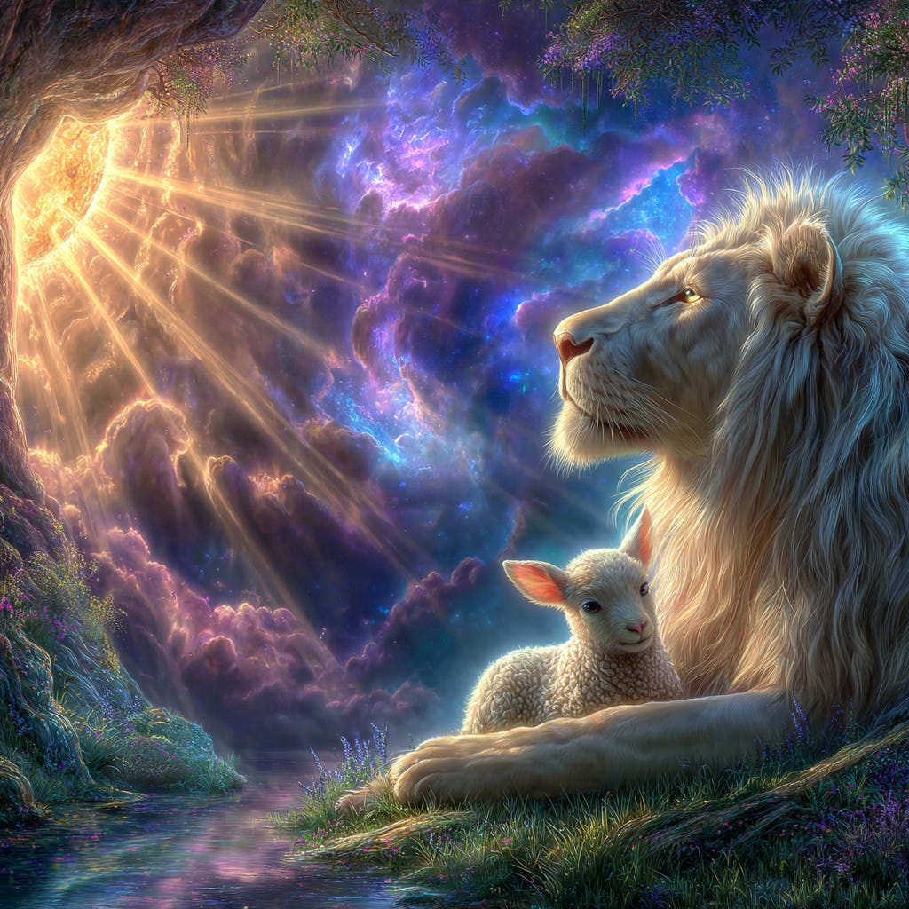
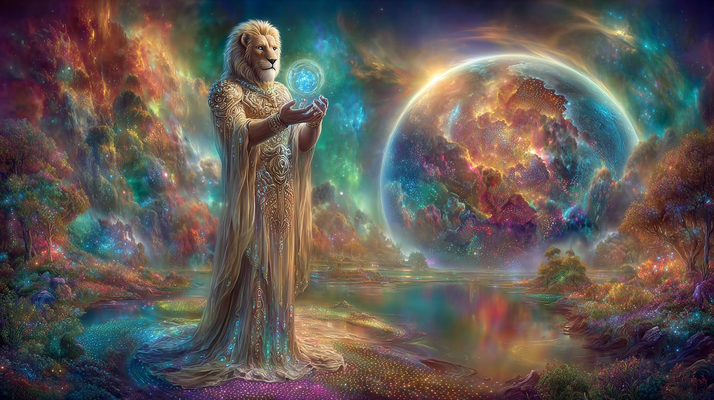
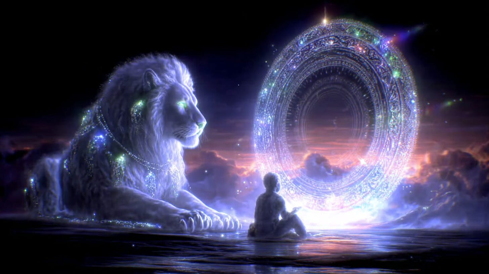
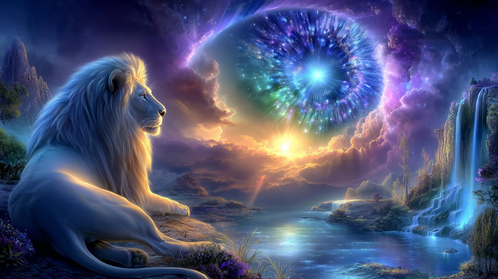
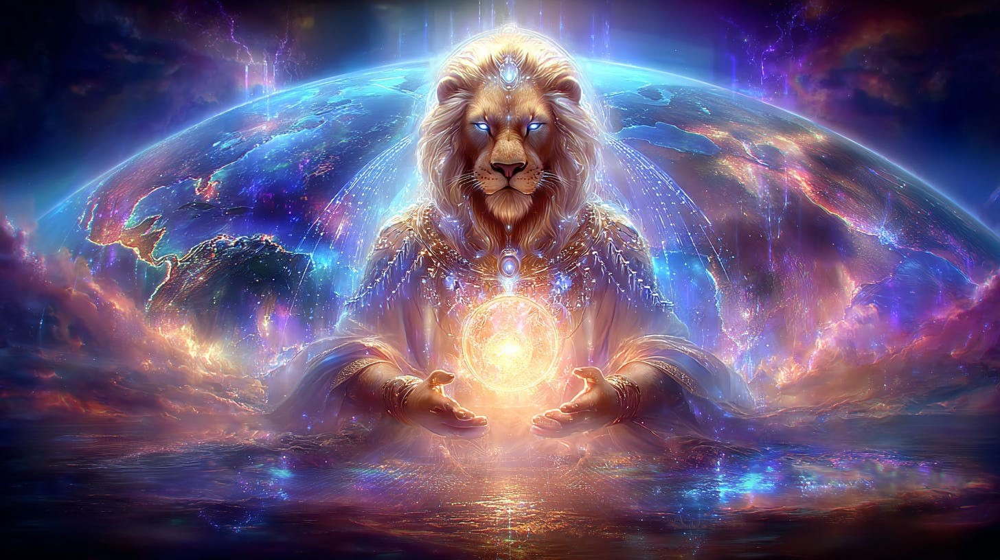

# Gate of the Sun, the Lion & the Lamb

## From the Vault of Thoth (1980s & 1990s)

**2024-12-06T19:22:52.956Z**

**Likes:** 0

[https://substackcdn.com/image/fetch/$s_!dTaK!,f_auto,q_auto:good,fl_progressive:steep/https%3A%2F%2Fsubstack-post-media.s3.amazonaws.com%2Fpublic%2Fimages%2F8c70fdb4-c5f1-44b2-aca3-d529687ca97b_1024x1024.png](https://substackcdn.com/image/fetch/$s_!dTaK!,f_auto,q_auto:good,fl_progressive:steep/https%3A%2F%2Fsubstack-post-media.s3.amazonaws.com%2Fpublic%2Fimages%2F8c70fdb4-c5f1-44b2-aca3-d529687ca97b_1024x1024.png)

***Thoth:** Archetypically, the Gate of the Sun refers to the passage of the human soul into Solar initiation. In other words, the soul receives an initiation of Divine Fire through their solar plexus chakra directly from the Great Central Sun: the Kolob. Historically however, the Gate of the Sun refers to specific formats and / or planetary acu\-points upon which solar initiations take place. Sometimes such sacred Solar passages are held for entire cultures as they seek renewal of their Race Spirit within the greater tide of the universal solar sea.*

[https://substackcdn.com/image/fetch/$s_!wZAk!,f_auto,q_auto:good,fl_progressive:steep/https%3A%2F%2Fsubstack-post-media.s3.amazonaws.com%2Fpublic%2Fimages%2F00ade2ab-8fd4-432a-94db-7fbb19a2341f_1456x816.png](https://substackcdn.com/image/fetch/$s_!wZAk!,f_auto,q_auto:good,fl_progressive:steep/https%3A%2F%2Fsubstack-post-media.s3.amazonaws.com%2Fpublic%2Fimages%2F00ade2ab-8fd4-432a-94db-7fbb19a2341f_1456x816.png)

***Thoth:** In pure symbolic imprint, the Lion is guardian of the Solar Law, which is the parameter of the Solar logos, the ‘Word of God.’ It is the formalizing of that Word into human and planetary design. It is God’s Law bridged to Man’s law. It is the interface, the portal of integration. The Lion is a pure symbol guardian of Solar Law, and thus the Solar Logos as it is embedded into Solar Law. The Lion\-Ones of Sirius are the true ultra\-physical guardians of Solar Law as it affects the Earth and its universal stations of Light. The Lion\-Ones who are known as the Sun Lords and who guardian the Telos.Aarkhara* \[over the universal tear\]*, are the ultimate guardians of Solar Law in this Universe, for they hold the grid in place between the Eye of Ra, its outer membrane, and the worlds of that membrane, such as Earth.* *This grid, the[Ptah Threshold](https://nesialibraryproject.wordpress.com/akashic-definitions/ptah-threshold/), is encoded with what has been referred to as the ‘Number of the Beast,’ the great Lion\-Solar Being which the Sun Lords and Sekhmet personify. This is the 666 which is at the ‘Heart of the Lion;’ that is, at its center most mystery.*

[https://substackcdn.com/image/fetch/$s_!YLRv!,f_auto,q_auto:good,fl_progressive:steep/https%3A%2F%2Fsubstack-post-media.s3.amazonaws.com%2Fpublic%2Fimages%2Feba2ea7a-c525-4926-a97f-3018312208a5_1456x816.png](https://substackcdn.com/image/fetch/$s_!YLRv!,f_auto,q_auto:good,fl_progressive:steep/https%3A%2F%2Fsubstack-post-media.s3.amazonaws.com%2Fpublic%2Fimages%2Feba2ea7a-c525-4926-a97f-3018312208a5_1456x816.png)

Thoth Intelligence defines the difference between Solar Law, and the Solar Logos is that “the
‘Solar Logos’ is the ‘Word’ or the ‘Seal,’ the divine imprint of Godly authority given
unto the soul. Solar Law is the workings, or the dictates of that authority.”

**Thoth:** *. . . the ‘beast’ (666\), in its undefiled state, is represented by the Lion, which is the power within the Lamb or Christ made flesh. Six is an inverted nine, a number of Christed unity amongst the elements. Inverted and tripled, it is a triune of spiritual replication or continuation through atomic bonding viability of spirit through elemental engendering of consciousness. Only the most righteous of humanity will be able to sustain the traumatic completion of such a configuration when the inversion of cosmic law actually changes our dimensional reality to reveal spirit in matter. The unseen will have become the seen, and human evaluation of reality will be dramatically altered. In this revelatory age to come, those who are not prepared for the alternate realities will become as ‘beasts,’ possessed of their own finiteness. So there is revealed a distinct separation (differentiation) between the ‘beast’ of the resolute consciousness in man, which through the power of the spirit shall overcome the lesser world, and the beast of the disintegration of matter, the decay of moral aptitude which becomes violent in its death throes. In Corinne Heline’s ‘New Age Bible Interpretations, Old Testament, Volume II,’ she states: “The Master Jesus at the age of thirty\-three had recapitulated all of the 3x3\=9 degrees of Mystic Masonry and had followed the Path of Enoch which leads to the center of the Earth and reveals the secret powers of the Ineffable Name (the Divine Word). Both the Grand Masters Hiram Abiff* \[Thoth incarnation\] *and King Solomon, having traversed this same path, were reborn to receive from Christ through the strong grip of the Lion’s paw, the first degree of the new Christian mysteries.”*

*Through the arising of the spiritual Lion in man, the power of energy will no longer subscribe to become the tool of the War of Worlds, but will be emancipated from gross manipulation and ascend unto the regencies of Glory. . .the ultimate transmutation of the profane to the sacred.*

[https://substackcdn.com/image/fetch/$s_!MP40!,f_auto,q_auto:good,fl_progressive:steep/https%3A%2F%2Fsubstack-post-media.s3.amazonaws.com%2Fpublic%2Fimages%2F1609ca06-51ff-4ebc-b96d-4314ffb11fde_1456x816.png](https://substackcdn.com/image/fetch/$s_!MP40!,f_auto,q_auto:good,fl_progressive:steep/https%3A%2F%2Fsubstack-post-media.s3.amazonaws.com%2Fpublic%2Fimages%2F1609ca06-51ff-4ebc-b96d-4314ffb11fde_1456x816.png)

The Lion, a symbol of Solar consciousness, is the symbol of the constellation of Leo which is a Sun
sign, and important for a number of reasons. There is some complex symbology inherent in the Lion
due to its dualistic nature as a symbol (i.e. the 666 \& 999\), which is also true of the Solar
Logos of this planet. Thoth tells us that there are two primary Solar Logos for the planet Earth: a
lesser and a greater, which themselves act as portals to the third, the ultimate Christic Solar
Logos, and beyond that lies many evolutionary cycles which ultimately lead to the Great Central Sun,
or Kolob.

[https://substackcdn.com/image/fetch/$s_!31af!,f_auto,q_auto:good,fl_progressive:steep/https%3A%2F%2Fsubstack-post-media.s3.amazonaws.com%2Fpublic%2Fimages%2F48900a60-55c8-40d0-a2c1-fc4ef7f09aeb_1456x816.png](https://substackcdn.com/image/fetch/$s_!31af!,f_auto,q_auto:good,fl_progressive:steep/https%3A%2F%2Fsubstack-post-media.s3.amazonaws.com%2Fpublic%2Fimages%2F48900a60-55c8-40d0-a2c1-fc4ef7f09aeb_1456x816.png)

The ‘Gate of the Sun’ is actually comprised of specific acu\-points on the Earth, which are part
of the greater Solaris Tabla (Solar Table) on Earth, which is comprised of ALL the points where the
pure Solar Tribal insertions have been made upon the Earth. The specific acu\-points which comprise
the ‘Gate of the Sun’ form the main ‘meridian’ of the Solaris Tabla. There are certain
determining factors as to why some of these points were chosen to be on the ‘main meridian,’ and
others were not. This was primarily dependant upon the knowledge forms these tribes carried in their
para\-genetic and genetic coding. Each of the many grid lines in the Solaris Tabla is an insertion
meridian for specific knowledge forms which direct and calibrate the spiritual evolutionary path of
the Earth and its souls through time and space. The specific knowledge forms these tribes carry, are
themselves not anything which can be defined clearly to the human perspective. However, they come
together to create the ideologies and religions which have represented them to the world experience
throughout the ages.

**RELATED:**

**[The Lion’s Gate of Mazuriel](https://maianartoomid.substack.com/p/the-lions-gate-of-mazuriel?utm_source=publication-search) / [Water \& Fire Mysteries](https://maianartoomid.substack.com/p/water-and-fire-mysteries?utm_source=publication-search) / [Solar Pathways Playlist](https://www.youtube.com/playlist?list=PLrUVPTQKQFdSTeQOgnwn5dimiHYvGzxp3)**

Subscribe

[Share](https://maianartoomid.substack.com/p/gate-of-the-sun-the-lion-and-the?utm_source=substack&utm_medium=email&utm_content=share&action=share)

**All my Substack images and articles are FREE. Please help me promote them. Support my work further, by considering some of my paid offerings (consultations \& activation store) and donations.**

**[my website](http://newearthstar.org/) / [YouTube channel](https://www.youtube.com/@bluestarrising-thetemplara3835) / [Akashic Consultations](https://newearthstar.org/about-maia/akashic-consultations/) / [Maia’s Redbubble](https://www.redbubble.com/people/maianartoomid/explore?asc=u&page=1&sortOrder=recent) / [published works](https://newearthstar.org/published-works/) / [activation store](https://newearthstar.org/maias-activation-store/)**

**[MONTHLY DONATIONS](https://www.paypal.com/donate/?cmd=_s-xclick&hosted_button_id=SKZ4FZCYBM4H4): Donate $20 or more per month and you will have access to the [Vault of Thoth](https://newearthstar.org/vault-of-thoth/). Thank you!**

**All my Substack images and articles are FREE. Please help me promote them. Support my work further, by considering some of my paid offerings (consultations \& activation store) and donations.**

**[my website](http://newearthstar.org/) / [YouTube channel](https://www.youtube.com/@bluestarrising-thetemplara3835) / [Akashic Consultations](https://newearthstar.org/about-maia/akashic-consultations/) / [Maia’s Redbubble](https://www.redbubble.com/people/maianartoomid/explore?asc=u&page=1&sortOrder=recent) / [published works](https://newearthstar.org/published-works/) / [activation store](https://newearthstar.org/maias-activation-store/)**

**[MONTHLY DONATIONS](https://www.paypal.com/donate/?cmd=_s-xclick&hosted_button_id=SKZ4FZCYBM4H4): Donate $20 or more per month and you will have access to the [Vault of Thoth](https://newearthstar.org/vault-of-thoth/). Thank you!**
